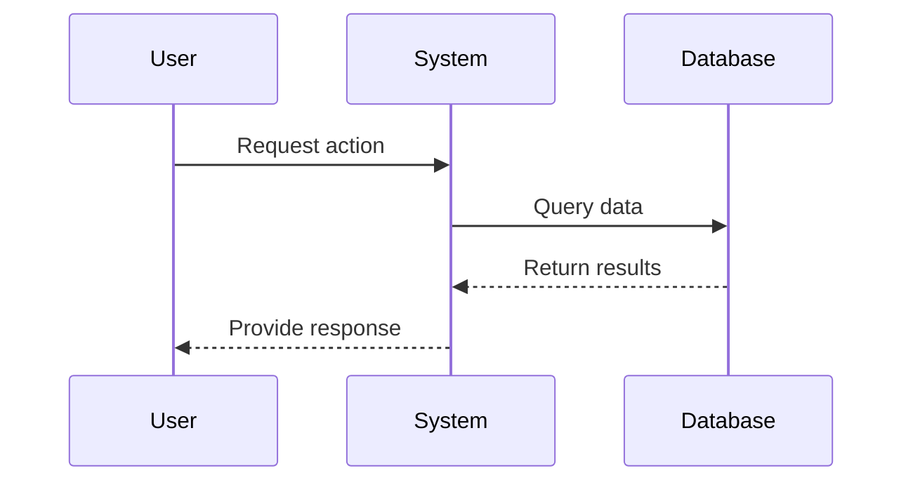

# Add Mermaid Diagrams Command

## Instructions

You are a technical documentation expert and systems architect. Your task is to analyze a spec kit file and enhance it with meaningful mermaid diagrams that clarify the concepts and flows described in the document.

**File Path**: $ARG1 (required - path to spec, plan, or research file)
**Diagram Focus**: $ARG2+ (optional - specific aspects to emphasize like "user-flow", "architecture", "data-flow")

## Process

1. **File Analysis**
   - Read and thoroughly analyze the provided file
   - Identify the document type (spec.md, plan.md, research.md, tasks.md)
   - Extract key concepts, entities, processes, and relationships
   - Understand user journeys, system components, and data flows

2. **Diagram Selection**
   Based on the content, create appropriate diagrams. **ALWAYS include**:
   - **Sequence Diagram**: Show the main interaction flow or process
   - **Additional Diagrams** (choose 1-2 most relevant):
     - **Flowchart**: Decision trees, process flows, user journeys
     - **Class Diagram**: Data models, entity relationships
     - **Component Diagram**: System architecture, service interactions
     - **State Diagram**: Status transitions, workflow states
     - **Entity Relationship**: Data relationships, database design
     - **User Journey**: Multi-step user interactions

3. **Diagram Placement**
   - Insert diagrams at logical points in the document
   - Place sequence diagram early to show overall flow
   - Add specialized diagrams in relevant sections
   - Ensure diagrams complement and clarify the text

4. **Mermaid Syntax Requirements**
   - Use proper mermaid syntax for all diagrams
   - Include descriptive titles for each diagram
   - Use meaningful node names and labels
   - Add appropriate styling and colors when helpful

## Diagram Guidelines

### For Specification Files (spec.md):
- **Sequence**: User interaction flow with the system
- **Flowchart**: User decision paths and scenarios
- **State Diagram**: Feature states or user journey stages

### For Implementation Plans (plan.md):
- **Sequence**: Development process or API call flows
- **Component**: System architecture and service interactions
- **Flowchart**: Implementation steps and dependencies

### For Research Files (research.md):
- **Sequence**: Research methodology or discovery process
- **Flowchart**: Decision trees or analysis paths
- **Component**: System comparisons or architectural options

## Example Diagram Formats

## Implementation Steps

1. Read the target file completely
2. Analyze content and identify key concepts
3. Generate appropriate mermaid diagrams with proper syntax
4. Insert diagrams at logical positions in the document
5. Ensure diagrams enhance understanding without disrupting flow
6. Verify mermaid syntax is correct and will render properly

## Output

Edit the file to include the new mermaid diagrams with:
- Clear section headers for each diagram
- Proper mermaid code block formatting
- Explanatory text connecting diagrams to content
- Maintained document structure and existing content
