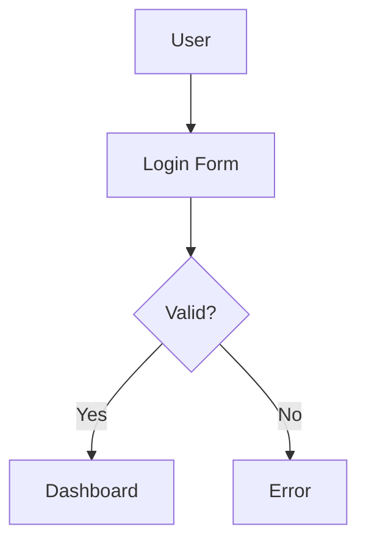

# Spec Kit Extensions System

This directory contains the extension system for the Nexus Spec Kit commands. The extension system allows you to add custom functionality to the core spec kit commands (`/specify`, `/plan`, `/clarify`, `/tasks`) without modifying the core command files directly.

## How It Works

The extension system uses a configuration-driven approach:

1. **Configuration**: `.specify/config.json` defines which extensions are enabled for which commands
2. **Extension Files**: Individual `.md` files contain the extension logic for each command
3. **Core Integration**: Each core command checks the config and conditionally loads applicable extensions

### Two-Step Internal Process

**Important**: Extensions use a two-step internal process within a single command execution:

1. **First step**: Creates the base file (spec, plan, tasks, etc.) with core content
2. **Second step**: Immediately adds extension outputs (diagrams, additional content) to the existing file

**Example workflow:**
```bash
/specify "user authentication feature"    # Single command that:
                                          # → Creates spec.md with core content
                                          # → Adds mermaid diagram to spec.md
                                          # → Returns complete file with extensions
```

This behavior ensures the base content is created first, then automatically enhanced with extensions in the same execution. No human intervention is needed - one command produces the complete output with all enabled extensions.

## Directory Structure

```
.specify/
├── config.json                         # Extension configuration
└── extensions/
    ├── README.md                       # This file
    └── mermaid-diagrams/               # Example extension
        ├── specify.md                  # Mermaid generation for /specify
        ├── plan.md                     # Mermaid generation for /plan
        ├── clarify.md                  # Mermaid generation for /clarify
        └── tasks.md                    # Mermaid generation for /tasks
```

## Configuration Format

The configuration file (`.specify/config.json`) uses this structure:

```json
{
  "features": {
    "extension-name": {
      "specify": true,      // Enable for /specify command
      "plan": true,         // Enable for /plan command
      "clarify": false,     // Disable for /clarify command
      "tasks": true         // Enable for /tasks command
    },
    "another-extension": {
      "specify": false,
      "plan": true,
      "clarify": true,
      "tasks": false
    }
  }
}
```

## Current Extensions

### Mermaid Diagrams
- **Purpose**: Embeds mermaid diagrams directly into specs, plans, clarifications, and tasks files
- **Files**: `mermaid-diagrams/specify.md`, `plan.md`, `clarify.md`, `tasks.md`
- **Configuration**: `features.mermaid-diagrams`
- **Output**: Diagrams are embedded directly in the target files using markdown code blocks, not as separate files

**Example embedded output:**
```markdown
## Feature Visualization


```

## Creating New Extensions

### Step 1: Create Extension Directory
```bash
mkdir -p .specify/extensions/your-extension-name
```

### Step 2: Create Command-Specific Files
Create `.md` files for each command you want to extend:

```bash
# Create files for the commands you want to extend
touch .specify/extensions/your-extension-name/specify.md
touch .specify/extensions/your-extension-name/plan.md
touch .specify/extensions/your-extension-name/clarify.md
touch .specify/extensions/your-extension-name/tasks.md
```

### Step 3: Add Extension Logic
Each file should contain the specific instructions for that command:

**Example: `your-extension-name/specify.md`**
```markdown
Generate additional validation checks for the feature specification:
1. Verify all user stories have acceptance criteria
2. Check for missing error handling scenarios
3. Validate technical constraints are clearly defined
```

### Step 4: Update Configuration
Add your extension to `.specify/config.json`:

```json
{
  "features": {
    "mermaid-diagrams": {
      "specify": true,
      "plan": true,
      "clarify": true,
      "tasks": true
    },
    "your-extension-name": {
      "specify": true,
      "plan": false,
      "clarify": true,
      "tasks": false
    }
  }
}
```

## Best Practices

### 1. Keep Extensions Focused
Each extension should have a single, clear purpose. Don't mix multiple concerns in one extension.

### 2. Command-Specific Logic
Different commands may need different behaviors for the same extension. Use separate files per command.

### 3. Use Descriptive Names
Extension names should clearly indicate their purpose: `api-documentation`, `security-checklist`, etc.

### 4. Document Your Extensions
Include comments in your extension files explaining what they do and why.

### 5. Test Thoroughly
Test your extensions with enabled/disabled states to ensure they don't break core functionality.

## Troubleshooting

### Extension Not Loading
1. Check that the extension is enabled in `.specify/config.json`
2. Verify the extension file exists for the command you're running
3. Ensure the JSON syntax is valid in the config file

### Syntax Errors
1. Validate JSON using `cat .specify/config.json | python -m json.tool`
2. Check for trailing commas, missing quotes, or unmatched brackets

### Extension Conflicts
1. Test extensions individually by temporarily disabling others
2. Check for conflicting instructions between extensions
3. Ensure extensions don't modify the same outputs

## Maintenance

### Syncing with Upstream
The extension system is designed to minimize merge conflicts:
- Core commands have minimal, stable changes
- Extension logic is completely separate
- Configuration is independent of upstream changes

### Updating Extensions
1. When upstream updates core commands, your extensions should continue working
2. Extension files can be updated independently of core changes
3. New extension features can be added without touching core code

### Backup and Migration
- Back up your `.specify/config.json` and extension files before major changes
- Extensions can be easily migrated between repositories by copying the files

## Support

If you encounter issues with the extension system:
1. Check this README for troubleshooting steps
2. Validate your configuration file syntax
3. Test with a minimal extension to isolate issues
4. Review the core command files to understand the integration points

---

**Note**: The extension system is backward compatible. If no config file exists or no extensions are enabled, the core commands work exactly as before.
