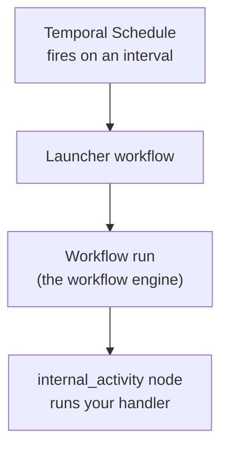

# Recurring Background Execution: Choosing Between PeriodicWorker and Temporal Built-in Workflows

Some work in the application runs on a timer rather than in response to a user request — validating
integrations, refreshing discovered resources, and similar housekeeping. There are two mechanisms
for that kind of recurring work. This document is guidance for **choosing between them** and for
**building one**.

- **In-process `PeriodicWorker`** — an asyncio loop that lives inside the API server process and runs
  a callback on a fixed interval, coordinated across replicas with a Postgres advisory lock. See
  [Services Standards — Periodic Workers](standards/services.md#periodic-workers).
- **Scheduled Temporal built-in workflow** — a Temporal Schedule that fires a built-in workflow on a
  fixed interval, executed on the Temporal worker fleet (off the API process). "Built-in" is the
  in-repo term for a system workflow seeded into the database; unlike a user's scheduled workflow, a
  built-in's schedule is registered at seed time as a deployment artifact, not created through the
  publish flow. See [Resilient Background Execution](resilient-background-execution.md).

## Choosing between them

Use a **scheduled Temporal built-in workflow** when the recurring work:

- does something you'd want to **survive a restart** and be able to **audit** afterwards — it mutates
  real state, calls external systems, or must not silently drop;
- benefits from **declarative retry and overlap policy** instead of hand-rolled loop logic;
- shouldn't compete with request handling — it runs on a Temporal worker, not inside the API server.

Use an in-process **`PeriodicWorker`** when the work is:

- **process-local** (flush an in-memory buffer, per-process cleanup) or must run in *every* replica —
  a schedule fires once globally and can't express "run in each process";
- **cheap, frequent, and best-effort**, where a missed cycle on restart is harmless.

Rule of thumb: if losing or double-running a cycle is a non-event, `PeriodicWorker` is fine. If the
cycle does meaningful work and you'd want it auditable and restart-safe, use a scheduled Temporal
built-in workflow.

### How the two compare on performance

This is about the mechanisms, not any one job. A `PeriodicWorker` shares the API server's event loop
and database pool, so making it do more per cycle competes directly with request latency, and it has
no built-in visibility — you'd add your own metrics. A scheduled Temporal built-in workflow runs on
the Temporal worker fleet, off the API process, and is covered by the standard `temporal_worker`
KPIs (queue depth, activity success rate, activity-duration p95). Actual throughput for any given job
depends on what that job does — measure the specific case.

## How a scheduled Temporal built-in workflow runs

A schedule fires on its interval, a launcher starts the workflow, and the workflow runs one internal
activity that does the work:

Two things to know when reading a scheduled workflow's history in Temporal:

- **Each fire appears as two executions** — the launcher plus the workflow it starts. That's normal
  for scheduled triggers, not a duplicate run.
- **An interval written `PT5M` is ISO-8601 for "5 minutes"** and displays as `300s`.

### What's configurable, and where

Cadence and execution behaviour are per-workflow settings in the built-in's seed definition
(`seed_builtin.py`), not global constants — different recurring jobs will want different values:

- **Schedule interval and overlap behaviour** — the `scheduled_trigger` node's `parameters`
  (`interval`, `missed_schedule_policy`). For example, `missed_schedule_policy: "skip"` skips a fire
  while the previous run is still in progress, so a slow run never overlaps the next tick.
- **Per-attempt timeout and retries** — the activity node's `settings` (`timeout`, `retry_policy`).

## How to add a recurring built-in

Adding one is two edits (the full walkthrough is in
[Resilient Background Execution](resilient-background-execution.md#adding-a-new-built-in-workflow)):

1. **Register a handler** in the `_DISPATCH` map in
   `workflow_engine/activities/internal_activity.py`, keyed by an activity name. `execute_internal_activity`
   looks the name up in `_DISPATCH` and calls your handler — that's the single extension point.
2. **Add the workflow definition** to `_BUILTIN_DEFINITIONS` in `seed_builtin.py` — a
   `scheduled_trigger` (interval + overlap policy) feeding one `internal_activity` node whose
   `activity` parameter is your `_DISPATCH` key. The seeder is idempotent, so no migration is needed.

Heads-up: registering the Temporal Schedule happens during seeding and requires the
service-to-service TLS environment — a plaintext seed silently fails to register the schedule. See
[S2S Certificate Authentication](s2s-cert-authentication.md).

## Worked example: the integration health check

This is *one* application of the pattern, not the universal shape — but it's a good one to copy. The
"Integration Health Check" built-in fires on a schedule; its `internal_activity` node
(`integration_health_check` in `_DISPATCH`) runs `run_health_checks()` in `health_check.py`, which
selects integrations whose last check is stale, validates each, and records the result. It uses
`missed_schedule_policy: "skip"` and runs as a service principal derived from the backend's mTLS
certificate (not a user). The periodic resource-discovery built-in follows the same shape for an
integration's tools and models.

## Related documentation

- [Resilient Background Execution](resilient-background-execution.md) — the background worker and the step-by-step guide to adding a built-in workflow
- [Scheduled Trigger](workflow-engine/triggers/scheduled-trigger.md) — Temporal Schedules, deterministic IDs, and the full overlap/skip policy table
- [Services Standards — Periodic Workers](standards/services.md#periodic-workers) — the in-process `PeriodicWorker` pattern and advisory-lock coordination
- [Service Accounts](service-accounts.md) · [S2S Certificate Authentication](s2s-cert-authentication.md) — the service identity a built-in runs as
