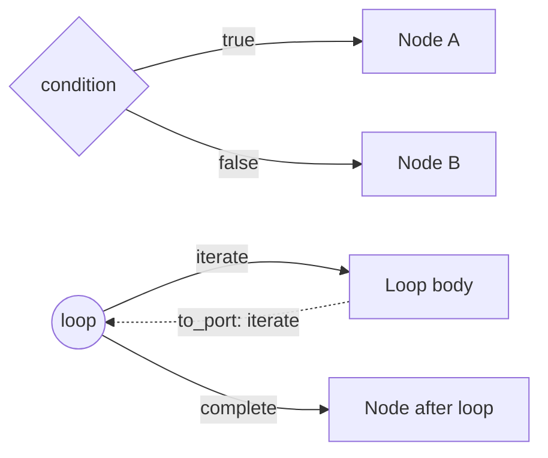

# Workflow Structure

A workflow definition is a graph, not a flat config object: three parallel top-level arrays — `triggers`, `nodes`, `edges` — plus `schema_version`, `name`, and `description`. This doc explains how those three arrays relate to each other structurally. For how the graph actually executes, see [Workflow Engine Architecture](workflow-engine/workflow-engine-overview.md); for YAML authoring examples, see [Workflow Definition Guide](workflow-engine/workflow-definition-guide.md).

## Nodes and Triggers

Triggers and nodes share the same base shape — `id`, `type`, `parameters`, plus optional `name`, `description`, `outputs`, `settings` — but they live in separate arrays, not one combined list. A trigger can never be an edge's `to` target: triggers are graph entry points only, and a workflow can define more than one (a manual trigger and a webhook trigger on the same definition, for example), with exactly one selected at execution time.

Different node types support different subsets of settings (e.g., only some node types have `timeout` or `retry_policy`) — see [Node Settings](workflow-engine/node-settings.md) for which settings apply to which types and how defaults are resolved.

## Edges and Ports

An edge is `{from, to, from_port?, to_port?}`. `from_port` selects which output port on the source node the edge listens to.

**Most node types don't have ports at all.** If a plain node (script, HTTP request, an AAP job) has multiple outgoing edges, all of them fire — that's the fan-out behavior described in the engine overview's "parallel branches are implicit" — because a node with no routing result simply has every outgoing edge treated as eligible. Ports only exist for control-flow node types, which attach a routing decision to their result and require edges to declare a matching `from_port`:

- `condition` → `true` / `false`
- `loop` → `iterate` / `complete`
- `switch` → one port per case, plus a catch-all default port
- `approval` → `approved` / `rejected`

`to_port` has exactly one meaningful value: `iterate`, marking the loop body's feedback edge back into its own loop node. That edge is excluded before the graph is traversed, so a loop body is structurally acyclic — iteration is reintroduced procedurally by the engine, not by an actual cycle in the graph.

## Validation

Validation runs on save (`PUT /workflows/{id}`), on explicit request (`POST /workflows/validate`), and partially at runtime (template resolution and type checking happen inside activities). The full `_collect_findings()` pipeline includes several layers:

**Schema validation** — runs first, catches structural issues before the graph is even examined:

- Schema version (must be 2.0.0)
- Required top-level fields (`triggers`, `nodes`, `edges`)
- JSON Schema validation (field types, discriminators, required fields per node type)
- JSON Schema security hardening (ReDoS pattern detection, `$ref` blocking)

**Graph-coherence checks** — enforce the DAG rules described above:

- **Invalid reference** — an edge's `from` or `to` doesn't match any node/trigger id.
- **Cycle detected** — a real cycle exists once loop feedback edges (`to_port: iterate`) are excluded. Because those are excluded first, a normal loop is never flagged — only a genuine unintended cycle is.
- **Orphaned node** — a node isn't reachable by following edges forward from any trigger. This is reachability, not just "has no incoming edge" — a node downstream of an unreachable node is also orphaned.
- **Converge configuration** — a `converge` node needs at least two predecessors to make sense, and if it uses an `"any"` strategy with `n_required` set, that number can't exceed how many predecessors it actually has.

**Expression and credential checks**:

- Template expression validation (`_validate_template_expressions`) — checks that `${...}` references resolve to known namespaces
- Credential project scope (save path only — `_validate_credential_project_scope`)

Note: there is currently no validation warning when a non-converge node has multiple incoming edges — the engine silently uses first-wins behavior (see [Workflow Engine Architecture](workflow-engine/workflow-engine-overview.md#parallel-branches-are-implicit)).

## Related Documentation

- [Workflow Engine Architecture](workflow-engine/workflow-engine-overview.md) — how this graph is executed
- [Workflow Definition Guide](workflow-engine/workflow-definition-guide.md) — YAML authoring examples
- [Expression System](workflow-engine/expression-system.md) — `${...}` expression syntax and resolution
- [Execution Runtime](execution-runtime.md) — running and monitoring workflow executions
