# UI Architecture (nexus-ui)

> **Reading time**: ~30 minutes  
> **Diagrams**: 18 Mermaid diagrams for visual learners  
> **Audience**: New team members joining the Nexus UI project

This document explains **how the Nexus UI is organized**, **how it fetches data from the backend**, and **how backend workflow nodes become React Flow nodes** on the canvas.

---

## Table of Contents

1. [Prerequisites](#prerequisites)
2. [Key Terms (Glossary)](#key-terms-glossary)
3. [At a Glance (Mental Model)](#at-a-glance-mental-model)
4. [Core Architecture Principles](#core-architecture-principles)
5. [Technology Stack](#technology-stack)
6. [Diagrams](#diagrams)
7. [Your First Day](#your-first-day)
8. [Repository Layout](#repository-layout-monorepo)
9. [App Startup](#app-startup-where-everything-begins)
10. [Routing](#routing-wouter)
11. [State Management](#state-management)
12. [Backend Requests + Data Flow](#backend-requests--data-flow-tanstack-query--openapi-clients)
13. [Workflow Builder](#workflow-builder-backend-workflow--ui-graph-react-flow)
14. [React Flow Integration](#react-flow-integration-nodes-edges-and-layout)
15. [Where to Look for Common Changes](#where-to-look-for-common-changes)
16. [Related Docs](#related-docs)

---

## Prerequisites

Before diving in, you should be comfortable with:

- **React 19** (or strong React fundamentals) — functional components, hooks, context
- **TypeScript** — generics, type inference
- **Basic state management concepts** — you don't need to know Zustand specifically yet

Nice to have (but we'll explain the basics):

- TanStack Query (React Query)
- React Flow

---

## Key Terms (Glossary)

| Term                  | What it is                                                                                                                  | Learn more                                                 |
| --------------------- | --------------------------------------------------------------------------------------------------------------------------- | ---------------------------------------------------------- |
| **Zustand**           | Lightweight state management library (like Redux but simpler). We use it for workflow editing state.                        | [Zustand docs](https://zustand-demo.pmnd.rs/)              |
| **TanStack Query**    | Server-state library that handles fetching, caching, and synchronizing backend data. Replaces manual `useEffect` + `fetch`. | [TanStack Query docs](https://tanstack.com/query/latest)   |
| **React Flow**        | Library for building node-based editors (like our workflow canvas). Nodes + edges = graph.                                  | [React Flow docs](https://reactflow.dev/)                  |
| **Wouter**            | Tiny router (~1KB). Like React Router but minimal.                                                                          | [Wouter docs](https://github.com/molefrog/wouter)          |
| **OpenAPI**           | Specification for REST APIs. We generate TypeScript types from the backend's OpenAPI spec.                                  | [OpenAPI spec](https://swagger.io/specification/)          |
| **Dagre**             | Graph layout algorithm. Automatically positions nodes so the workflow looks organized.                                      | [Dagre wiki](https://github.com/dagrejs/dagre/wiki)        |
| **useWebSocketStore** | Zustand store that manages WebSocket connections, reconnection, and message routing.                                        | [`websocket-architecture.md`](./websocket-architecture.md) |
| **Activity**          | A single step in a workflow (e.g., a task, condition, loop). Backend term.                                                  |                                                            |
| **Node**              | React Flow term for a visual box on the canvas. Activities become nodes.                                                    |                                                            |
| **Edge**              | React Flow term for a connection line between nodes.                                                                        |                                                            |

---

## At a Glance (Mental Model)

**Three things to remember:**

1. **Routing**: Wouter + a `navigationItems` tree → `AppRouter` maps it into routes.
2. **Backend data**: Typed OpenAPI clients (`openapi-react-query`) → TanStack Query cache.
3. **Workflow builder**:
   - API uses **nested** activities (conditions contain their branches)
   - Builder edits a **flat** list + edges (easier to manipulate)
   - `BuilderFlow` renders React Flow nodes/edges from the store

---

## Core Architecture Principles

- **Modular Monorepo**: Separated packages with distinct responsibilities
- **Type-Driven Development**: Strict TypeScript and generated OpenAPI types
- **Reactive Design**: Modern React patterns with compiler-driven optimizations

---

## Technology Stack

| Layer               | Technology                              | Notes                                      |
| ------------------- | --------------------------------------- | ------------------------------------------ |
| **UI Components**   | PatternFly 6                            | Enterprise UI component framework          |
| **Styling**         | PatternFly 6                            | Enterprise UI component framework          |
| **Forms**           | react-hook-form                         | Performant form handling                   |
| **Icons**           | PatternFly Icons (prefer RhUi-prefixed) | PatternFly icon library, prefer RhUi icons |
| **Workflow Canvas** | React Flow (`@xyflow/react`)            | Node-based editor for workflows            |
| **State (Server)**  | TanStack Query                          | Caching, fetching, synchronizing API data  |
| **State (Client)**  | Zustand                                 | Lightweight store for workflow editing     |
| **WebSocket**       | Pure Zustand store                      | Real-time communication with backend       |
| **Routing**         | Wouter                                  | Minimal router (~1KB)                      |
| **Build**           | Vite                                    | Fast dev server and bundler                |
| **Testing**         | Vitest + Testing Library                | Unit and component testing                 |

---

## Diagrams

### App startup + routing

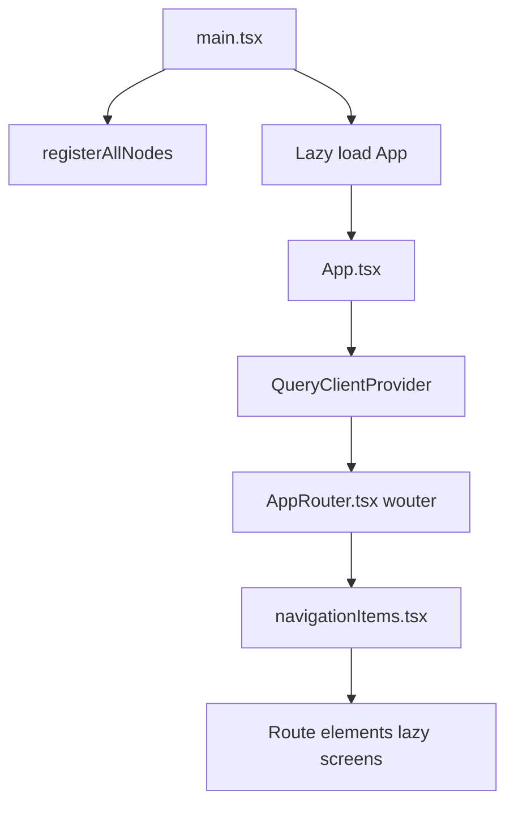

### Backend request flow (typical screen)

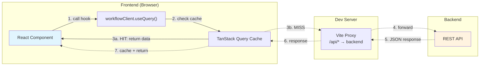

> **Solid lines** = cache hit (fast path) | **Dashed lines** = cache miss (network request)

### Workflow builder: backend workflow → UI graph

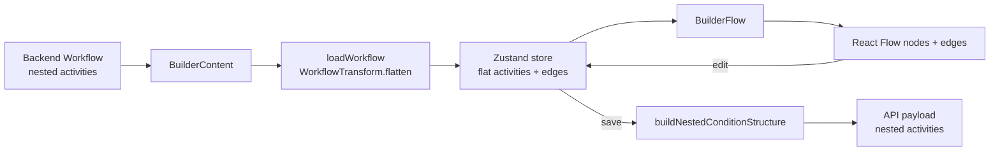

---

## Your First Day

Here's a suggested path to get oriented:

### 1. Run the app locally (5 min)

```bash
# From repo root
npm ci
npm start
```

Open http://localhost:5173 — you'll see the UI with mock data.

Notes:

- `npm start` (repo root) starts the UI and the mock API together.
- To point the UI at a real backend, set `VITE_API_URL` (see “Backend Requests + Data Flow” below).

### 2. Explore these 3 files (15 min)

| File                                 | Why                                                    |
| ------------------------------------ | ------------------------------------------------------ |
| `src/app/App.tsx`                    | Entry point — see how routing and providers are set up |
| `src/client.tsx`                     | How we make API calls — pattern you'll use everywhere  |
| `src/routes/builder/BuilderFlow.tsx` | The "big" file — workflow canvas rendering             |

### 3. Make a small change (10 min)

Try one of these:

- Add a `console.log` in `BuilderFlow.tsx` when nodes are rendered
- Change a button label in `BuilderContent.tsx`
- Add a new route path in `AppRoute.tsx` and see the router pick it up

### 4. Read the workflow builder section below

The workflow builder is the most complex part. Understanding the flat ↔ nested transformation is key.

---

## Repository Layout (monorepo)

```
packages/
├── nexus-ui/           ← The actual web app (React + Vite)
├── nexus-contracts/    ← Generated TypeScript types from OpenAPI
└── nexus-mock-api/     ← Local mock server for development
```

### Package Dependency Graph

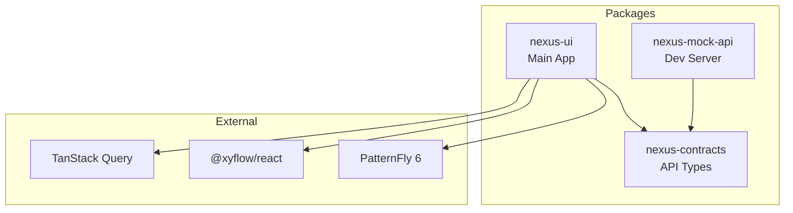

Within `packages/nexus-ui/src/`:

| Directory                       | Purpose                                                        |
| ------------------------------- | -------------------------------------------------------------- |
| `app/`                          | App shell, layout, routing                                     |
| `client.tsx`                    | Typed API clients (OpenAPI → TanStack Query hooks)             |
| `routes/`                       | Feature areas: builder, automations, executions, configuration |
| `stores/`                       | Client state (Zustand) — workflow store                        |
| `lib/websocket/`                | WebSocket infrastructure (store, hooks, types, utils)          |
| `components/`                   | App-specific components                                        |
| `constants/`, `hooks/`, `test/` | Shared utilities                                               |

---

## App Startup (where everything begins)

**Entry**: `packages/nexus-ui/src/main.tsx`

```tsx
// Simplified view of main.tsx
registerAllNodes() // Auto-discovers and registers workflow node types
const App = lazy(() => import('./app/App'))
createRoot(document.getElementById('root')!).render(<App />)
```

### How `registerAllNodes()` auto-discovers nodes

`registerAllNodes()` is implemented in `packages/nexus-ui/src/routes/builder/registry/nodes/index.ts`.
It uses Vite's `import.meta.glob` to synchronously import all registration modules at startup:

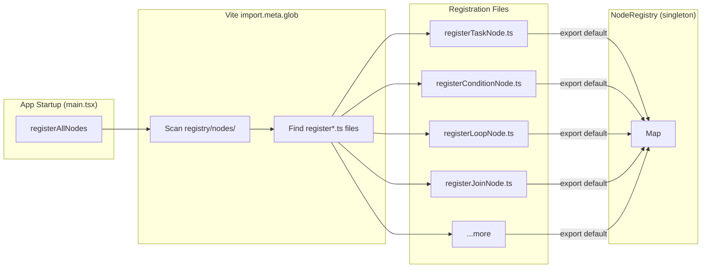

- **Directory**: `packages/nexus-ui/src/routes/builder/registry/nodes/`
- **Filename pattern**: `register*.ts`
- **Export contract**: each `register*.ts` file must `export default function registerXxx() { ... }`
- **When it runs**: `packages/nexus-ui/src/main.tsx` calls `registerAllNodes()` before rendering the app

This is why adding a new node type is usually just "create a new `registerMyNode.ts` file with a default export"
—no central list to edit.

**App root**: `packages/nexus-ui/src/app/App.tsx`

- Creates a single `QueryClient` for server state
- Renders the global layout and mounts `AppRouter`

---

## Routing (Wouter)

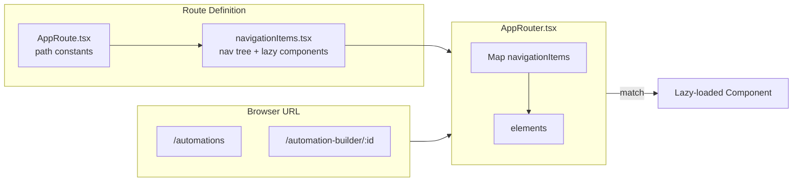

| File                      | Role                                                                           |
| ------------------------- | ------------------------------------------------------------------------------ |
| `app/AppRoute.tsx`        | Route path constants (e.g., `/automations`, `/automation-builder/:workflowId`) |
| `app/navigationItems.tsx` | Defines nav tree + lazy-loaded route components                                |
| `app/AppRouter.tsx`       | Maps `navigationItems` into `<Route>` elements                                 |

**Common patterns:**

```tsx
// Navigate programmatically
const [, navigate] = useLocation()
navigate('/automations')

// Read URL params
const { workflowId } = useParams()
```

**Routing strategy details:**

- Path params for entity selection and mode switching
- Query params for filtering and optional selections

---

## State Management

| Type                | Technology                    | Purpose                                              |
| ------------------- | ----------------------------- | ---------------------------------------------------- |
| **Server State**    | TanStack Query                | All API data — fetching, caching, background updates |
| **Client State**    | React useState/useContext     | Local UI state (modals, forms, selections)           |
| **Workflow State**  | Zustand (`useWorkflowStore`)  | Builder workflow editing state                       |
| **WebSocket State** | Zustand (`useWebSocketStore`) | Real-time connection state and messages              |

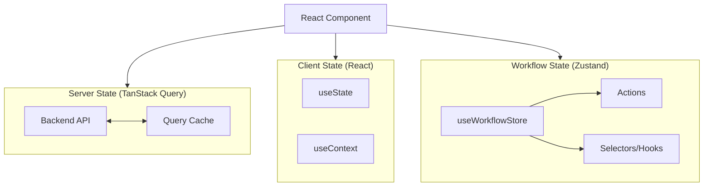

**Key characteristics:**

- Type-safe API interactions via `openapi-react-query`
- Automatic memoization through React Compiler

### WebSocket State

For real-time features, we use a pure Zustand architecture (no Context/Provider needed):

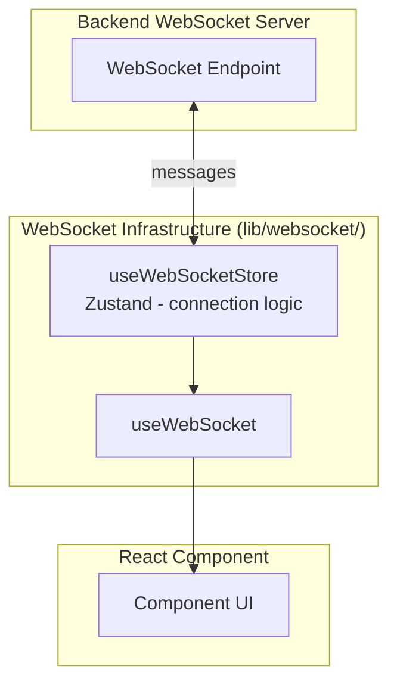

**Quick usage:**

```tsx
import { useWebSocket } from '../../lib/websocket'

function ChatComponent() {
  // Single hook for connect, send, and receive
  const { sendRaw, isConnected } = useWebSocket(
    { id: 'chat', path: '/ws/example/v1/chat' },
    { onMessage: (msg) => console.log('Received:', msg) }
  )

  return (
    <button onClick={() => sendRaw({ message: 'Hello' })} disabled={!isConnected}>
      Send
    </button>
  )
}
```

> 📚 **See [`docs/websocket-architecture.md`](./websocket-architecture.md) for comprehensive WebSocket documentation.**

### Zustand Quick Reference

> 📚 **See [docs/zustand-architecture.md](./zustand-architecture.md) for comprehensive documentation** on the Zustand store architecture, best practices, and usage patterns.

**Quick reference:**

- **Store location**: `packages/nexus-ui/src/stores/useWorkflowStore.ts`
- **Factory functions**: `packages/nexus-ui/src/stores/workflowFactories.ts`
- Use custom hooks (`useWorkflowVersion()`, `useActivities()`, etc.) for reading state
- Use `useWorkflowStoreActions()` for dispatching actions without re-renders
- Use atomic batch operations for coupled state changes

---

## Backend Requests + Data Flow (TanStack Query + OpenAPI clients)

### Making API calls

All backend calls go through typed clients in `src/client.tsx`:

```tsx
// Reading data
const { data, isLoading, error } = workflowClient.useQuery('get', '/workflows/{workflow_id}', {
  params: { path: { workflow_id: id } },
})

// Writing data
const mutation = workflowClient.useMutation('post', '/workflows')
mutation.mutate({ body: workflowPayload })
```

### Available clients

| Client                | Used for                                     |
| --------------------- | -------------------------------------------- |
| `workflowClient`      | Workflows, executions                        |
| `toolManagerClient`   | Tool manager (tools & providers unified API) |
| `toolsClient`         | Legacy alias for `toolManagerClient`         |
| `toolProvidersClient` | Legacy alias for `toolManagerClient`         |
| `filesClient`         | File uploads and management                  |

**Note:** `toolsClient` and `toolProvidersClient` are backward compatibility aliases that both point to `toolManagerClient`, which uses the unified `/api/v1/tool_manager/` API endpoints.

### Where does the backend URL come from?

- UI uses relative paths (`/api/v1/...`)
- Vite proxies `/api/*` to `VITE_API_URL` (or `localhost:3000` by default)
- See `packages/nexus-ui/vite.config.ts`

### Local ports (defaults)

- **UI (Vite dev server)**: `http://localhost:5173`
- **Mock API**: `http://localhost:3000`

---

## Workflow Builder: backend workflow → UI graph (React Flow)

> This is the most complex part of the codebase. Take your time here.

### The key insight: flat vs. nested

| Format     | Where used  | Example                                                                     |
| ---------- | ----------- | --------------------------------------------------------------------------- |
| **Nested** | Backend API | `condition: { then: [task1, task2], else: [task3] }`                        |
| **Flat**   | Builder UI  | `activities: [condition, task1, task2, task3]` + edges encode relationships |

**Why flat?** Easier to add/remove/reorder nodes in a visual editor.

### Builder entry points

| Route                             | File              | Purpose                |
| --------------------------------- | ----------------- | ---------------------- |
| `/automation-builder/new`         | `BuilderNew.tsx`  | Create new workflow    |
| `/automation-builder/:workflowId` | `BuilderEdit.tsx` | Edit existing workflow |

### Load path: API → store → canvas

```
1. Fetch workflow from API (nested format)
       ↓
2. WorkflowTransform.flatten() extracts activities + generates edges
       ↓
3. Store in Zustand (flat activities + edges)
       ↓
4. BuilderFlow converts to React Flow nodes + edges
       ↓
5. React Flow renders the canvas
```

### Save path: canvas → store → API

```
1. User clicks Save
       ↓
2. Read flat activities + edges from Zustand
       ↓
3. Validate the graph
       ↓
4. buildNestedConditionStructure() converts back to nested
       ↓
5. Submit to API via mutation
```

### Key files

| File                            | Responsibility                                          |
| ------------------------------- | ------------------------------------------------------- |
| `BuilderContent.tsx`            | Orchestrates load/save, wraps canvas                    |
| `BuilderFlow.tsx`               | Converts store → React Flow nodes/edges, handles layout |
| `utils/workflowTransform.ts`    | Flatten/nest transformations                            |
| `utils/loadWorkflow.ts`         | Load + flatten workflow                                 |
| `utils/buildNestedStructure.ts` | Build nested structure for save                         |
| `utils/validation/`             | Validation rules                                        |

### Builder internals (advanced): registry, edges, and graph semantics

This section is the “how it really works” view of the builder. It’s here so newcomers can debug issues without spelunking `BuilderFlow.tsx` immediately.

#### Node registry (the "Add node" panel)

- **Goal**: decouple the "available node types + forms" list from the UI so new nodes can be added without editing a central switch statement.
- **Core types**: `routes/builder/registry/NodeRegistry.ts` + helpers in `routes/builder/registry/helpers/`.
- **Registration flow**:
  - Registration modules live in `routes/builder/registry/nodes/`.
  - Any file matching **`register*.ts`** is loaded at startup (see "How `registerAllNodes()` auto-discovers nodes" above).
  - Each registration module must export a **default** function that calls `NodeRegistry.register(...)`.
- **Templates**:
  - `createBasicNode(...)`: good for placeholder nodes (minimal behavior; usually just "close the form" on submit).
  - `createCustomNode(...)`: use when you need custom submit logic (e.g., writing into the workflow store).
- **Categories**:
  - Categories are type-safe and provide UI metadata (ordering/grouping/search). See `routes/builder/registry/categories.ts`.

**Node Registration System (code examples):**

```typescript
// Each node type has its own registration file (e.g., registerTriggerNode.ts)
// Files matching register*.ts are automatically discovered and registered
// MUST export the registration function as default

// Basic nodes (placeholder implementations):
import { createBasicNode } from '../helpers/nodeTemplates'
import { NodeRegistry } from '../NodeRegistry'

export default function registerApprovalNode() {
  NodeRegistry.register(
    createBasicNode({
      id: 'approval',
      label: 'Approval',
      icon: UserCheckIcon,
      category: 'logic', // Type-safe - must be a valid NodeCategory
      description: 'Require human approval before continuing workflow',
      keywords: ['approve', 'approval', 'review', 'manual'],
      order: 50,
      formComponent: ApprovalNodeForm,
    })
  )
}

// Complex nodes (with workflow store integration):
import { createCustomNode } from '../helpers/nodeTemplates'

export default function registerTriggerNode() {
  NodeRegistry.register(
    createCustomNode<TriggerFormData>(
      {
        id: 'trigger',
        label: 'Triggers',
        icon: PlayIcon,
        category: 'trigger', // Type-safe category
        description: 'Start workflow execution',
        keywords: ['start', 'begin', 'manual', 'schedule'],
        order: 10,
        formComponent: TriggerNodeForm,
      },
      (data, onSuccess, onError) => {
        // Custom submission logic
        const trigger = createManualTrigger(data.requiresApproval)
        useWorkflowStore.getState().addTrigger(trigger)
        onSuccess()
      }
    )
  )
}

// AUTO-REGISTRATION: registerAllNodes() automatically discovers and calls
// all registration functions - no manual imports needed!
```

**Adding New Nodes:**

1. Create a file matching `register*.ts` in `registry/nodes/`
2. Export your registration function as **default**
3. That's it! Auto-discovery handles the rest

**Available Templates:**

- `createBasicNode(config, errorMessage?)` - For placeholder nodes that just call onSuccess
- `createCustomNode(config, onSubmit)` - For nodes with custom submission logic

**Node Categories (Type-Safe):**

Categories are defined in `registry/categories.ts` with full metadata:

| Category      | Description                            | Order |
| ------------- | -------------------------------------- | ----- |
| `trigger`     | Start workflow execution               | 1     |
| `action`      | Execute tasks or API calls             | 2     |
| `logic`       | Conditional branching and control flow | 3     |
| `integration` | External service integrations          | 4     |
| `approval`    | Human approval gates                   | 5     |
| `other`       | Miscellaneous nodes                    | 99    |

Access category metadata: `getCategoryMetadata('trigger')` or `CATEGORY_METADATA.trigger`

**Registry API:**

```typescript
NodeRegistry.register(definition) // Register a node type
NodeRegistry.get(id) // Get node by ID
NodeRegistry.getAll() // Get all enabled nodes
NodeRegistry.search(query) // Search nodes by label/keywords
NodeRegistry.getByCategory(cat) // Get nodes by category
```

#### "Flat activities + edges" is the builder's canonical editing model

ALL workflows use a consistent flatten-on-load, nest-on-save pattern:

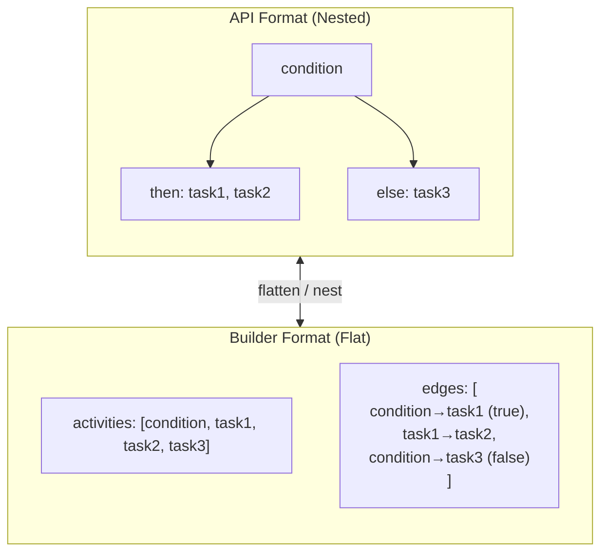

**API Format (Nested):**

- Activities can be nested within `sequence`, `loop`, `parallel`, or `condition` containers.
- Workflow structure defines execution flow via nesting.

**Builder Format (Flat):**

- ALL activities stored in flat `activities` array during editing.
- Edges define ALL flow relationships (stored separately).
- Join nodes use auto-generated `parallel_for_${joinId}` containers.
- Condition nodes have empty `then`/`else` arrays — edges encode branches.

**Why this matters**: most "my workflow saved weird" bugs are really "the edge graph didn't encode what you thought it did."

#### Transform pipeline (API ↔ builder)

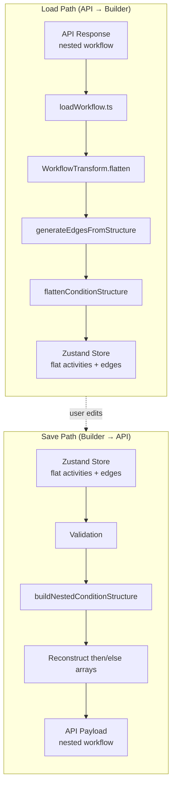

- **Load (API → builder)**:
  - `utils/loadWorkflow.ts` orchestrates loading.
  - `utils/workflowTransform.ts` flattens nested structures into flat activities and derives the initial edge set.
- **Save (builder → API)**:
  - The builder validates the graph first (`utils/validation/`).
  - `utils/buildNestedStructure.ts` is responsible for building the nested payload for save.
  - Important nuance: today, the "nesting back" behavior is intentionally **not fully symmetric** for every container type; the UI preserves semantics primarily through edges.

**WorkflowTransform Utility:**

Central class for bidirectional workflow conversion:

- Located in `packages/nexus-ui/src/routes/builder/utils/workflowTransform.ts`
- `WorkflowTransform.flatten(nested)` - Converts API format → Builder format
  - Traverses nested structures (condition.then/else, parallel.branches)
  - Extracts all activities into flat array
  - Generates edge connections representing structure
- `WorkflowTransform.nest(flat)` - Converts Builder format → API format (partial)
  - Currently only handles condition nodes via `buildNestedConditionStructure()`
  - Other structures remain flat with edges (sequence/loop/parallel)
- Symmetric design for easier debugging and validation
- Handles special cases like parallel wrappers and loop handles

**Serialization workflow (Save → API):**

1. `buildNestedConditionStructure(activities, edges)` - Converts flat to nested
2. Finds edges from condition's true/false handles
3. Recursively collects all downstream activities for each branch
4. Moves them into then/else arrays
5. Handles `parallel_for_*` wrappers (includes wrapper, not individual branches)
6. Located in `packages/nexus-ui/src/routes/builder/utils/buildNestedStructure.ts`

**Deserialization workflow (API → Edit):**

1. `generateEdgesFromStructure(activities)` - Extracts edges from nested structure
2. Creates edges from condition nodes to then/else activities
3. Handles `parallel_for_*` wrappers (creates edges to branches, not wrapper)
4. `flattenConditionStructure(activities)` - Flattens nested structure
5. Recursively extracts nested activities to top level
6. Leaves condition nodes with empty then/else arrays
7. Located in `packages/nexus-ui/src/routes/builder/utils/flattenConditionStructure.ts` and `packages/nexus-ui/src/routes/builder/utils/generateEdgesFromStructure.ts`

**Note:** sequence/loop/parallel containers are lossy — after flatten→nest, they become flat tasks with edges. This is acceptable as the semantic meaning (execution order) is preserved.

#### Edge synchronization (keeping store + React Flow consistent)

The builder maintains two representations of connections:

- **React Flow edges** (what you see + manipulate on the canvas)
- **Store edges** (what the builder saves/validates and uses for derived behavior)

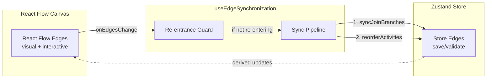

The synchronization logic lives in `routes/builder/hooks/useEdgeSynchronization.ts` and is designed to:

- avoid feedback loops (store updates triggering edge updates triggering store updates)
- keep derived structures up to date (like join branches and activity ordering)

**Synchronization pipeline on edge changes:**

1. `syncJoinBranches()` - Wraps parallel branches in parallel containers
2. `reorderActivitiesFromEdges()` - Topologically sorts activities based on edges

The hook uses a re-entrance guard to prevent infinite loops from workflow → edge updates.

#### Button edges (interactive "+" edges)

Builder edges aren't purely visual. `ButtonEdge` is the "add a node here" affordance:

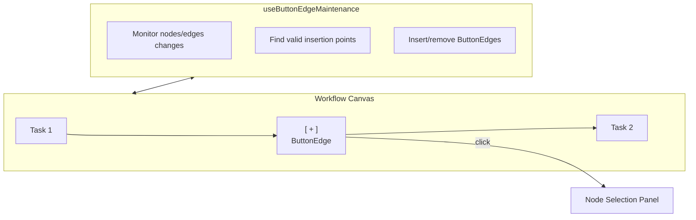

- **Edge type**: `routes/builder/edges/ButtonEdge.tsx`
- **Maintenance**: `routes/builder/hooks/useButtonEdgeMaintenance.ts`
- **Behavior**: as nodes/edges change, the builder inserts/removes these button edges at valid insertion points so users always have a place to add the next step.

#### Join nodes (fan-in) and parallel wrappers

Join nodes are "merge points" with special semantics:

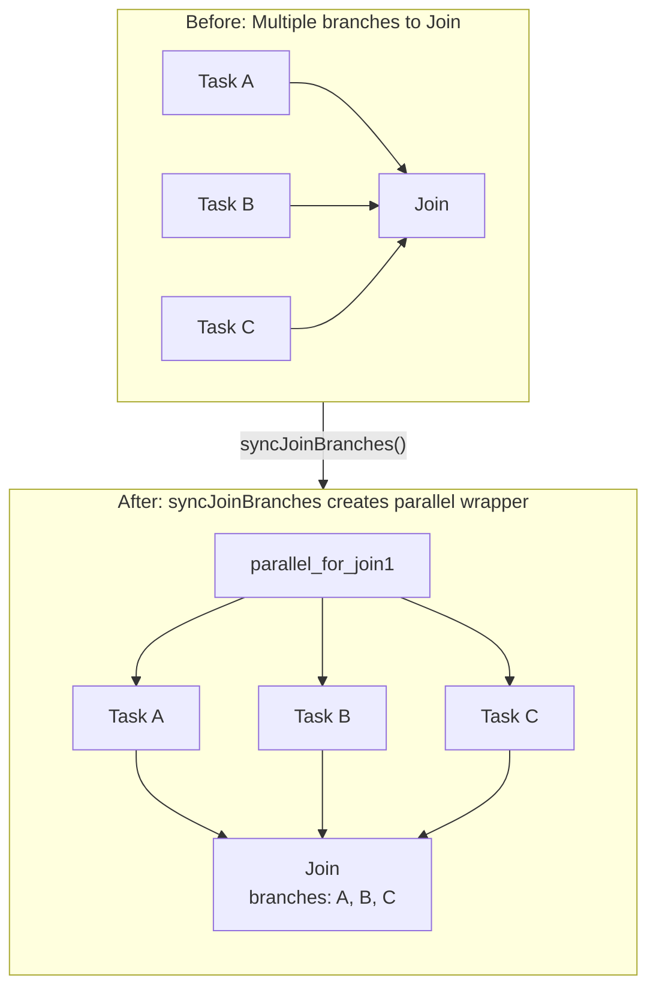

- **Representation**: a join can refer to multiple upstream activities by ID in `join.branches: string[]`.
- **Derived structure**: when 2+ activities connect to a join, the builder auto-generates a parallel container.
- **Parallel container ID**: `parallel_for_${joinId}`
- `syncJoinBranches()` manages parallel creation/cleanup automatically.
- Orphaned activities (edges removed) are restored to the main activities array.
- **Sync**: the join/parallel relationship is kept consistent during editing by the edge synchronization pipeline.

#### Condition nodes (branching) and source handles

Condition nodes stay flat while editing; their branch structure is expressed by edges:

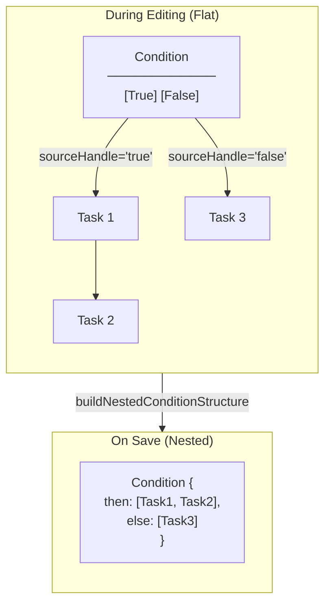

- Condition nodes remain **flat during editing**, nested only on save.
- During editing: All activities in flat array, edges encode branch relationships.
- Edges with `sourceHandle='true'` connect to true branch, `sourceHandle='false'` to false branch.
- Two handles on node: "True" and "False" for branching connections.
- Condition node structure: `{ type: 'condition', then: Activity[], else: Activity[], condition: string }`
- On save, the builder walks downstream edges from those handles and constructs `then` and `else` arrays for the API payload.
- This is why "wrong handle" connections often show up as "my steps landed in the wrong branch on save."

#### Key implementation details

- Don't follow sequential edges from activities inside parallel wrappers (prevents including join nodes in branches).
- When activity is inside `parallel_for_*` wrapper, include wrapper in then/else arrays.

**Example transformation flow:**

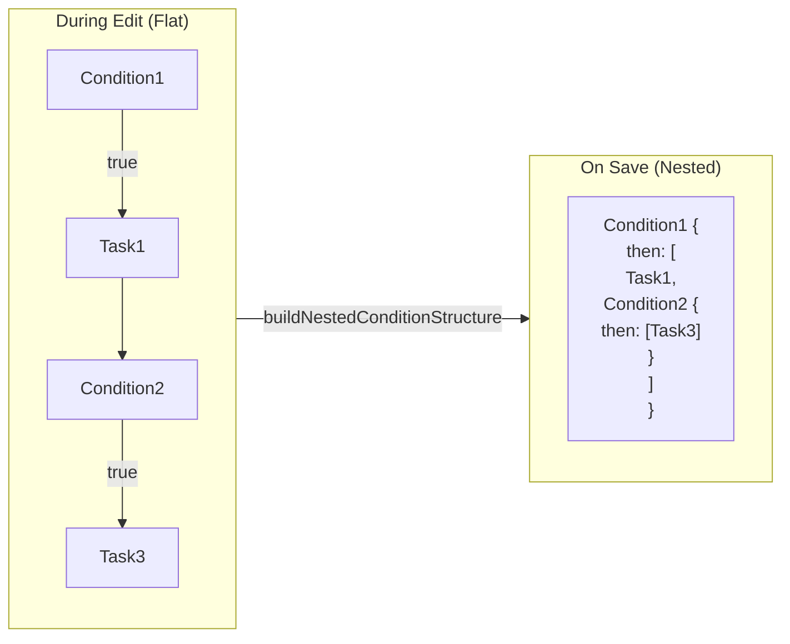

- Example flow: `Condition1 -> Task1 -> Condition2 -> Task3`
  - During edit: All four nodes in flat activities array, edges define relationships
  - On save: Task1, Condition2, and Task3 moved into Condition1's then array

#### Where to look when debugging "graph weirdness"

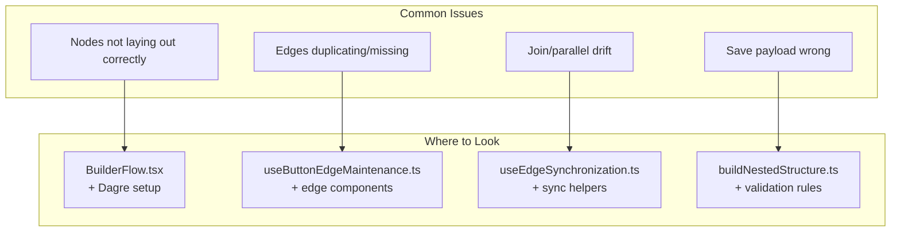

- **Nodes not laying out correctly**: `BuilderFlow.tsx` layout + Dagre setup
- **Edges duplicating / missing button edges**: `useButtonEdgeMaintenance.ts` + edge type components
- **Join/parallel drift**: `useEdgeSynchronization.ts` (and any join/branch sync helpers it calls)
- **Save payload looks wrong**: `utils/buildNestedStructure.ts` and the validation rules

---

## React Flow Integration (nodes, edges, and layout)

### Node types

Defined in `routes/automations/canvas/nodes/NodeType.tsx`:

```tsx
const nodeTypes = {
  task: TaskNode,
  condition: ConditionNode,
  loop: LoopNode,
  converge: ConvergeNode,
  // ... etc
}
```

Builder adds extra types like `placeholder` for drop targets.

### Edge types

| Registry              | Location                                       |
| --------------------- | ---------------------------------------------- |
| Canvas (read-only)    | `routes/automations/canvas/edges/EdgeType.tsx` |
| Builder (interactive) | `routes/builder/edges/*.tsx`                   |

Builder edges include: `ButtonEdge`, `DefaultEdge`, `LoopBackEdge`, `LoopDoneEdge`, `LoopOutgoingEdge`.

### Layout (Dagre)

`BuilderFlow` uses Dagre to auto-position nodes. See `getLayoutedElements()` in `BuilderFlow.tsx`.

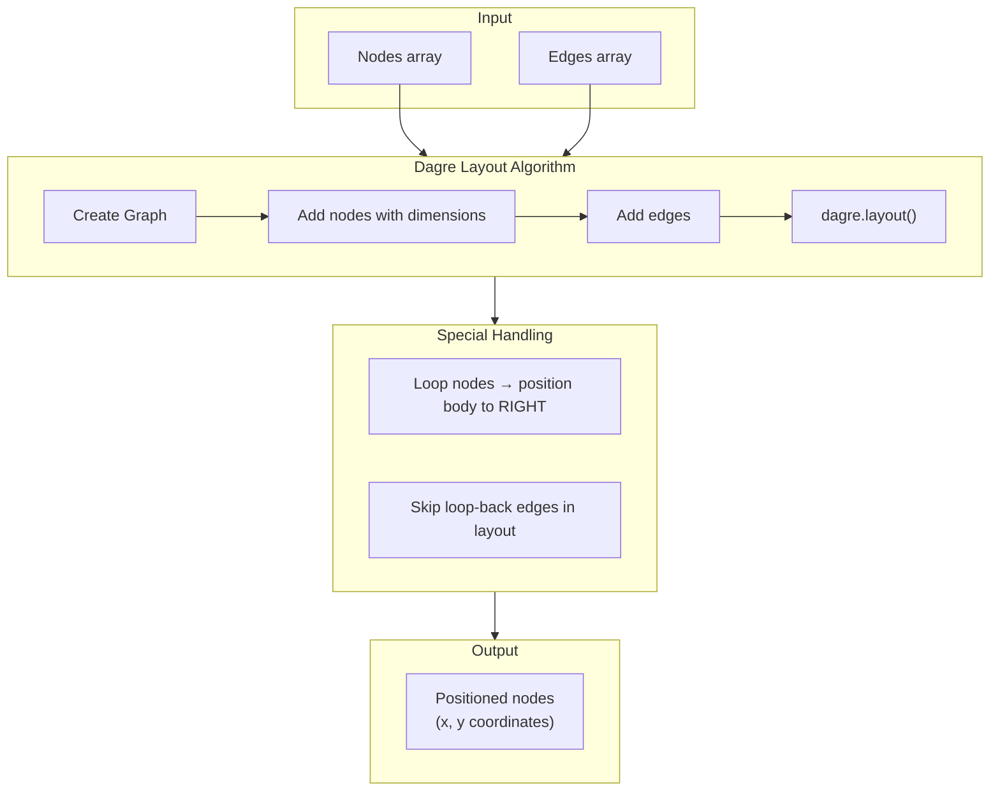

Special handling for loops: loop body nodes are positioned to the right (not below) to avoid circular layout issues.

**ReactFlow initialization details:**

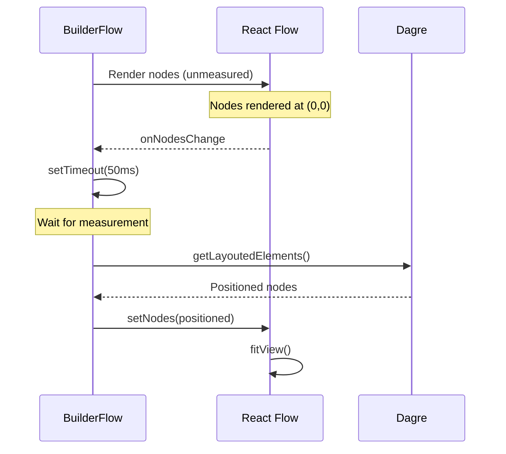

- Layout initialization uses dagre for automatic positioning.
- Separate initialization state from layout execution.
- Use `setTimeout(50ms)` to ensure nodes are measured before layout.
- `ReactFlowProvider` wraps the entire builder UI.

### Builder Component Pattern

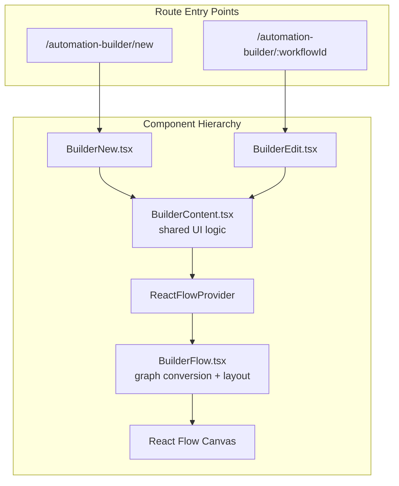

- Separate components for new (`BuilderNew.tsx`) and edit (`BuilderEdit.tsx`) workflows.
- `BuilderContent` component encapsulates all shared UI logic.
- `BuilderFlow.tsx` handles workflow → graph conversion and legacy detection.
- Routes: `/automation-builder/new` (new) and `/automation-builder/:workflowId` (edit).

---

## Where to Look for Common Changes

### Add a new screen/route

1. Add path constant in `app/AppRoute.tsx`
2. Add lazy route entry in `app/navigationItems.tsx`
3. `AppRouter.tsx` picks it up automatically

### Add a new API call

```tsx
// In your component
const { data } = workflowClient.useQuery('get', '/your-endpoint', { ... })

// After mutation, invalidate related queries
queryClient.invalidateQueries({ queryKey: ['get', '/workflows'] })
```

### Add a new workflow node type

1. Create `register*.ts` in `routes/builder/registry/nodes/`
2. Node registry auto-discovers it at startup
3. Add/extend React Flow node component in `routes/automations/canvas/nodes/`

---

## Related Docs

| Doc                                                             | Content                                                      |
| --------------------------------------------------------------- | ------------------------------------------------------------ |
| [`docs/zustand-architecture.md`](./zustand-architecture.md)     | Deep dive into workflow store, actions, and state management |
| [`docs/websocket-architecture.md`](./websocket-architecture.md) | WebSocket infrastructure, hooks, and real-time patterns      |
| [`CLAUDE.md`](../CLAUDE.md)                                     | Quick reference for AI assistants and developers             |
