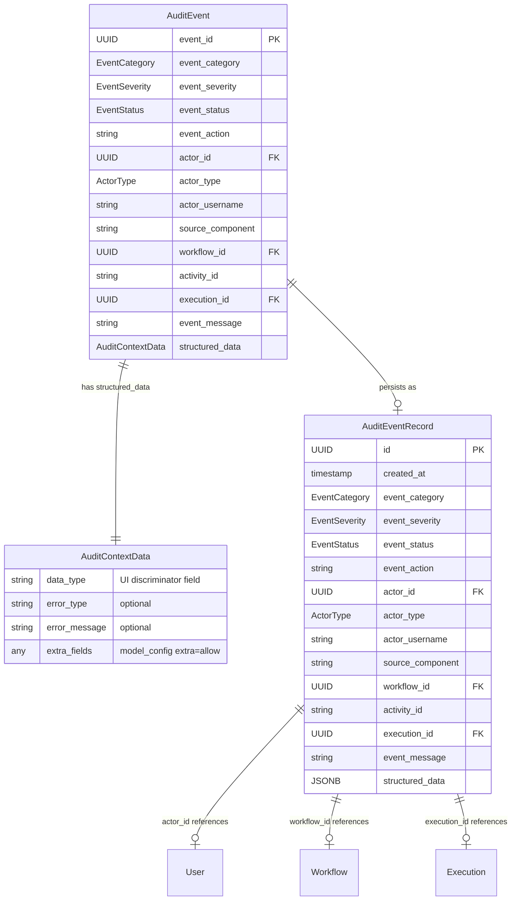
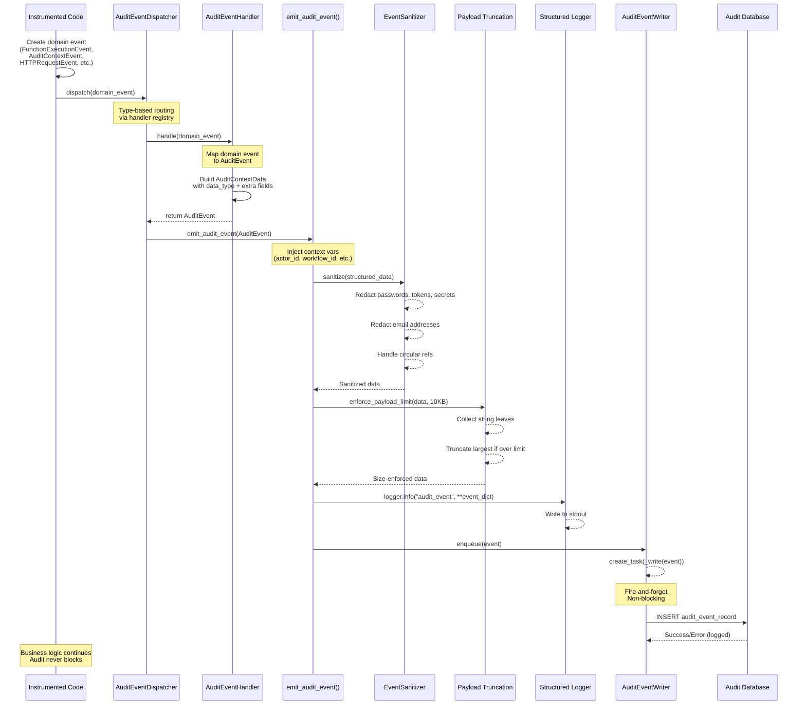
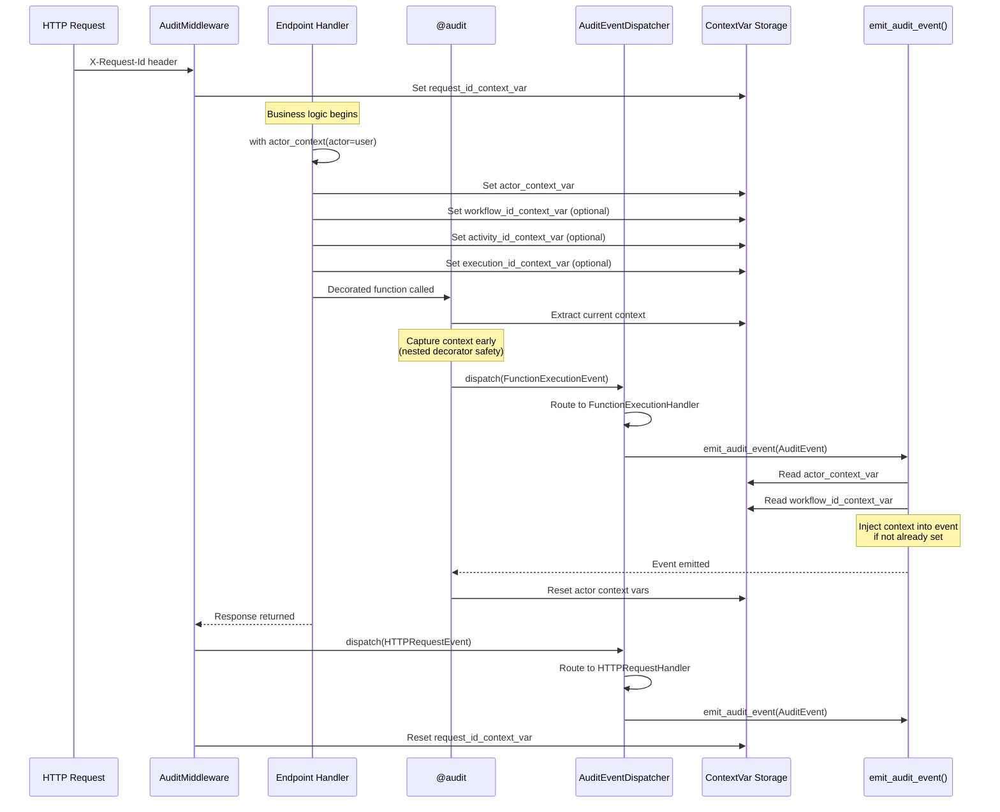
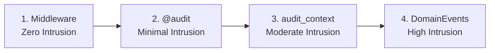
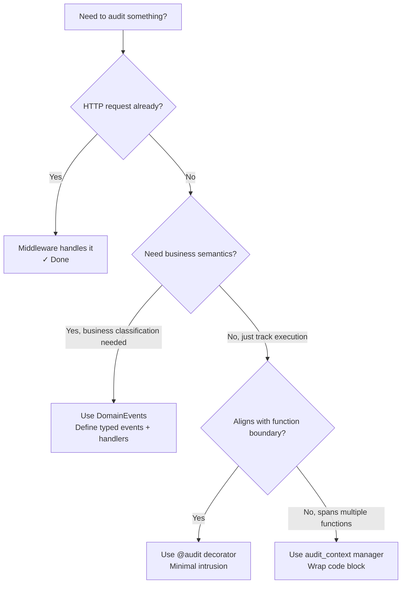

# Audit Framework

> **Developer Guide** — Understanding and using the Nexus audit system

## Table of Contents

1. [The Audit Framework](#1-the-audit-framework)
   - [Overview](#overview)
   - [Core Components](#core-components)
   - [Data Models](#data-models)
   - [Event Flow](#event-flow)
   - [Instrumentation Tools](#instrumentation-tools)
   - [Data Protection](#data-protection)
2. [Domain Integration Guide](#2-domain-integration-guide)
   - [Integration Pattern](#integration-pattern)
   - [Step-by-Step Integration](#step-by-step-integration)
   - [Domain Event Flow](#domain-event-flow)
3. [Example: Auth Domain Implementation](#3-example-auth-domain-implementation)
   - [Domain Events](#domain-events)
   - [Event Handlers](#event-handlers)
   - [Usage in Code](#usage-in-code)

---

## 1. The Audit Framework

### Overview

The audit framework provides **comprehensive, type-safe event tracking** for capturing system activities, user actions, and operational events across the Nexus platform. It follows an event-driven architecture with:

- **Automatic persistence** to dedicated audit database
- **PII sanitization** and payload size enforcement
- **Flexible actor detection** with 6-level priority cascade
- **Multiple instrumentation methods** (decorators, context managers, middleware, domain events)
- **Fail-safe execution** that never breaks business operations

### Core Components

```mermaid
graph TB
    subgraph "Event Sources"
        A1[Domain Events]
        A2[@audit Decorator]
        A3[audit_context Manager]
        A4[AuditMiddleware]
    end

    subgraph "Event Processing"
        B1[AuditEventDispatcher]
        B2[AuditEventHandler]
        B3[emit_audit_event]
    end

    subgraph "Data Protection"
        C1[EventSanitizer<br/>PII Redaction]
        C2[Payload Truncation<br/>10KB Limit]
    end

    subgraph "Persistence"
        D1[Structured Logs<br/>stdout]
        D2[AuditEventWriter<br/>Fire-and-forget DB]
    end

    A1 --> B1
    A2 --> B1
    A3 --> B1
    A4 --> B1
    B1 --> B2
    B2 --> B3
    B3 --> C1
    C1 --> C2
    C2 --> D1
    C2 --> D2
```

#### Component Descriptions

| Component | Purpose | Location |
|-----------|---------|----------|
| **AuditEvent** | In-memory event envelope | `audit/models/audit_event.py` |
| **AuditEventRecord** | PostgreSQL table model | `audit/models/audit_event_record.py` |
| **AuditContextData** | Universal structured data (extra=allow) | `audit/models/structured_data.py` |
| **AuditEventDispatcher** | Type-based event router | `audit/dispatcher.py` |
| **AuditEventHandler** | Domain event → AuditEvent mapper | `audit/handler.py` |
| **emit_audit_event** | Central emission point | `audit/emitter.py` |
| **@audit** | Function decorator | `audit/decorators.py` |
| **FunctionExecutionEvent** | Domain event for @audit | `audit/events/function_execution.py` |
| **FunctionExecutionHandler** | Maps FunctionExecutionEvent → AuditEvent | `audit/events/function_execution.py` |
| **audit_context** | Context manager | `audit/context_managers.py` |
| **AuditContextEvent** | Domain event for audit_context | `audit/events/audit_context.py` |
| **AuditContextHandler** | Maps AuditContextEvent → AuditEvent | `audit/events/audit_context.py` |
| **AuditMiddleware** | HTTP request tracking | `audit/middleware.py` |
| **HTTPRequestEvent** | Domain event for HTTP requests | `audit/events/http_request.py` |
| **HTTPRequestHandler** | Maps HTTPRequestEvent → AuditEvent | `audit/events/http_request.py` |
| **EventSanitizer** | PII redaction | `audit/sanitization.py` |
| **AuditEventWriter** | Async DB persistence | `audit/services/writer.py` |
| **AuditEventService** | Read-only query service | `audit/services/audit_event_service.py` |

### Data Models

#### Entity Relationship Diagram



**Note on `AuditContextData`:**  
All audit events use the same structured data type (`AuditContextData`) with `model_config = {"extra": "allow"}`. This allows handlers to include domain-specific fields alongside the base fields (`data_type`, `error_type`, `error_message`).

The `data_type` field is a string that identifies the event source for UI/frontend purposes:
- `"function"` - from `@audit` decorator (includes `function_args`, `function_result`)
- `"context"` - from `audit_context` manager (includes arbitrary `**context_data`)
- `"request_completed"` - from `AuditMiddleware` (includes `method`, `path`, `status_code`, `query_params`, `user_role`)
- Domain events set custom `data_type` values based on their needs

**Actor Identity Integrity:**  
The `actor_username` field is stored alongside `actor_id` and `actor_type` to provide complete actor identity. To ensure these fields remain synchronized and prevent potential security issues from id/username mismatches:

- `AuditContextEvent` accepts `actor_context: AuditActorContext` instead of discrete actor fields
- The handler extracts `actor_id`, `actor_type`, and `actor_username` atomically from the User object
- This guarantees the three fields always come from the same source record
- Domain events populate username from User objects or JWT payloads to maintain integrity
- `actor_username` is queryable via the `/api/v1/audit` endpoint for filtering and analysis

#### Key Enums

```python
class EventCategory(StrEnum):
    USER_ACTION = "user_action"
    WORKFLOW_EVENT = "workflow_event"
    AGENT_INTERACTION = "agent_interaction"
    LLM_INTERACTION = "llm_interaction"
    LLM_TOOL_CALL = "llm_tool_call"
    LLM_REASONING = "llm_reasoning"
    API_EXECUTION = "api_execution"
    SYSTEM_OPERATION = "system_operation"
    SECURITY_EVENT = "security_event"

class EventSeverity(StrEnum):
    INFO = "info"
    WARNING = "warning"
    ERROR = "error"
    CRITICAL = "critical"

class EventStatus(StrEnum):
    SUCCESS = "success"
    ERROR = "error"

class ActorType(StrEnum):
    USER = "user"
    SYSTEM = "system"
    SERVICE = "service"
```

#### Database Indexes

`AuditEventRecord` uses composite indexes for efficient filtering + sorting + pagination:

```sql
-- Common query pattern: filter by field + sort by created_at DESC + cursor pagination
CREATE INDEX ix_audit_events_actor_id_created_at_id
    ON audit_events (actor_id, created_at, id);

CREATE INDEX ix_audit_events_event_category_created_at_id
    ON audit_events (event_category, created_at, id);

CREATE INDEX ix_audit_events_workflow_id_created_at_id
    ON audit_events (workflow_id, created_at, id);

CREATE INDEX ix_audit_events_execution_id_created_at_id
    ON audit_events (execution_id, created_at, id);

-- etc.
```

### Event Flow

#### Complete Event Processing Pipeline



#### Actor Context Propagation



### Instrumentation Tools

#### 1. @audit Decorator

**Purpose:** Automatic function instrumentation with flexible actor detection.

**Features:**
- Emits 1 event via `FunctionExecutionEvent` → `FunctionExecutionHandler` → `AuditEventDispatcher`
- Event action is the function name (or custom `event_action`)
- Event status is SUCCESS or ERROR based on function outcome
- 6-level actor detection priority cascade
- Selective argument/result capture
- Auto-escalates severity on exceptions (handled by `FunctionExecutionHandler`)
- Nested decorator safe (captures actor context early)

**Usage:**

```python
from nexus.audit.decorators import audit
from nexus.audit.models.audit_event import EventCategory, EventSeverity

@audit(
    EventCategory.USER_ACTION,
    event_action="create_workflow",
    source_component="nexus.workflows",
    event_severity=EventSeverity.INFO,
    capture_args={"user_id", "workflow_name"},
    capture_result={"id", "status"},
    actor_param="current_user",
)
async def create_workflow(
    current_user: User,
    workflow_name: str,
    description: str,
) -> Workflow:
    workflow = Workflow(...)
    return workflow
```

**Actor Detection Priority:**

1. **Current context variable** (from `actor_context` manager)
2. **FastAPI dependency injection** (`current_user`, `user_context` kwargs)
3. **Explicit `actor_param`** specification
4. **Auto-detect** common parameter names
5. **Fallback** `ActorContext`
6. **System actor** (default)

#### 2. audit_context Context Manager

**Purpose:** Manual audit event emission with custom context data.

**Features:**
- Emits 1 event via `AuditContextEvent` → `AuditContextHandler` → `AuditEventDispatcher`
- Supports arbitrary `**context_data` via `extra="allow"`
- Sets actor context for nested operations
- Auto-escalates severity on exceptions
- Event action is success (`{action}`) or error (`{action}_error`)
- Atomic actor extraction: Accepts `actor: User | None` parameter to ensure `actor_id`, `actor_type`, and `actor_username` are extracted from a single source, preventing potential id/username mismatches

**Usage:**

```python
from nexus.audit.context_managers import audit_context
from nexus.audit.models.audit_event import EventCategory, EventSeverity

# With User actor (extracts actor_id, actor_type, actor_username atomically)
with audit_context(
    event_category=EventCategory.USER_ACTION,
    event_action="export_data",
    source_component="nexus.exports",
    actor=current_user,  # User object - ensures id/username integrity
    event_severity=EventSeverity.INFO,
    export_format="csv",
    record_count=5000,
):
    # Perform operation
    export_data()

# Or with SYSTEM actor (actor=None)
with audit_context(
    event_category=EventCategory.SYSTEM_OPERATION,
    event_action="backup_database",
    source_component="nexus.maintenance",
    actor=None,  # SYSTEM actor
    event_severity=EventSeverity.INFO,
    database_name="production",
    backup_size_mb=1024,
):
    # Perform operation
    backup_database()
# Event emitted in finally block with all context_data
```

#### 3. AuditMiddleware

**Purpose:** Automatic HTTP request/response audit trail.

**Features:**
- Emits 1 event per HTTP request via `HTTPRequestEvent` → `HTTPRequestHandler` → `AuditEventDispatcher`
- Captures method, path, status code, query params, user context
- Sets event severity based on status code (5xx=ERROR, 4xx=WARNING, 2xx/3xx=INFO)
- Excludes health/metrics endpoints (see `EXCLUDED_PATHS`)
- Propagates `X-Request-Id` header via context var

**No manual usage required** - automatically registered in FastAPI app middleware stack.

### Implementation Patterns

#### Atomic Actor Extraction

**Critical for audit integrity:** Actor identity fields (`actor_id`, `actor_username`, `actor_type`) must always be extracted atomically from a single source to prevent mismatched id/username pairs that could compromise audit trail trustworthiness.

**Pattern:**
```python
from nexus.audit.emitter import AuditActorContext
from nexus.audit.models.audit_event import ActorType
from nexus.core.models.user import User

# ✅ CORRECT: Atomic extraction from User object
def extract_actor_from_user(user: User | None) -> AuditActorContext:
    """Extract actor context atomically from User object.

    All three fields (id, username, type) are extracted together
    in the same scope, preventing potential race conditions or
    partial updates that could cause mismatches.
    """
    if user is None:
        return AuditActorContext()  # Empty context for SYSTEM actor

    return AuditActorContext(
        actor_id=user.id,
        actor_username=user.username,
        actor_type=ActorType.USER,
    )

# ❌ WRONG: Separate field extraction creates race condition risk
def extract_actor_wrong(user: User | None) -> tuple:
    actor_id = user.id if user else None
    # ... other code could modify user here ...
    actor_username = user.username if user else None
    return (actor_id, actor_username)  # Could be mismatched!
```

**Where this pattern is enforced:**
- `audit_context` manager: Accepts `actor: User | None` parameter
- `actor_extractor.py`: All extraction strategies return `AuditActorContext`
- `middleware.py`: JWT claims extracted together
- Domain event handlers: Extract username atomically when mapping to AuditEvent

**Why it matters:** Without atomic extraction, concurrent modifications or context variable race conditions could lead to `actor_id` belonging to one user while `actor_username` belongs to another, rendering audit logs untrustworthy for forensic analysis and non-repudiation.

#### Async-Safe Context Variable Management

**Critical for async safety:** Context variables must use token-based reset in try/finally blocks to prevent context leakage between concurrent requests.

**Pattern:**
```python
from contextvars import ContextVar
from nexus.audit.emitter import actor_context_var, AuditActorContext

# ✅ CORRECT: Token-based reset with try/finally
async def process_request(user: User) -> Response:
    # Capture token BEFORE try block
    actor_context = AuditActorContext(
        actor_id=user.id,
        actor_username=user.username,
        actor_type=ActorType.USER,
    )
    actor_token = actor_context_var.set(actor_context)

    try:
        # Business logic - context is set
        result = await handle_request()
        return result
    finally:
        # Always reset, even on exception
        actor_context_var.reset(actor_token)

# ❌ WRONG: No token capture - cannot reset properly
async def process_request_wrong(user: User) -> Response:
    actor_context_var.set(AuditActorContext(...))
    # Missing finally block - context leaks to next request!
    return await handle_request()
```

**Token-based reset protocol:**
1. **Capture token immediately** after `set()` call
2. **Set context variables BEFORE try block** (not inside)
3. **Reset in finally block** using captured token
4. **Always use try/finally** - never rely on normal return paths

**Where this pattern is enforced:**
- `middleware.py`: actor, workflow, execution, activity, request_id contexts
- `decorators.py`: actor context in @audit decorator
- `context_managers.py`: all context managers

**Why it matters:** Python's `contextvars` are designed for async isolation, but without proper token-based reset, context variables can leak across concurrent requests in asyncio event loops. This could cause audit events to show incorrect actor attribution or context IDs from previous requests.

**Nested decorator safety:** The `@audit` decorator explicitly captures actor context early (line 100-101 comment: "This is critical for nested @audit decorators...") to avoid reading stale values from ContextVars after inner decorators reset them.

### Data Protection

**PII Sanitization:** Automatic redaction of passwords, secrets, tokens, emails  
**Payload Truncation:** 10KB limit per event, truncates largest string leaves

---

## 2. Domain Integration Guide

### Choosing Your Instrumentation Strategy

The audit framework provides **four cascading layers** of instrumentation, each trading less code intrusion for less semantic richness. Understanding this gradient helps you choose the right tool for each auditing need.

#### The Intrusion & Burden Gradient



Each layer can coexist — a single HTTP request may generate events from **all four layers** (see [Auth Domain Example](#3-example-auth-domain-implementation) where login generates 4 audit events).

#### Layer Comparison

| Layer | Code Changes | Developer Burden | Semantic Richness | When to Use |
|-------|-------------|------------------|-------------------|-------------|
| **1. Middleware** | None | None (automatic) | HTTP metadata only | Always active - no choice needed |
| **2. @audit** | One line decorator | Configure parameters | Function-level execution | Track important function calls without business context |
| **3. audit_context** | Wrap blocks with `with` | Provide context data | Operation-level with custom fields | Track complex operations spanning multiple functions |
| **4. DomainEvents** | Define events, handlers, dispatch calls | Architectural decisions | Business semantics | Capture business-meaningful events (login failures, state transitions) |

#### Layer Details

##### 1. Middleware (Zero Intrusion)

**What it captures:**
- HTTP method, path, status code
- Query parameters
- Request duration
- User context from authentication

**Pros:**
- ✅ Zero code changes
- ✅ Automatic coverage of all endpoints
- ✅ Consistent HTTP-level observability

**Cons:**
- ❌ Generic HTTP data only
- ❌ No business semantics
- ❌ Cannot capture mid-request state

**Example use-case:**
```
All HTTP requests automatically tracked - no action needed
```

##### 2. @audit Decorator (Minimal Intrusion)

**What it captures:**
- Function execution success/failure
- Selected arguments and return values
- Actor context (6-level priority cascade)
- Exception details

**Pros:**
- ✅ Minimal code changes (one line)
- ✅ Automatic actor detection
- ✅ Captures function inputs/outputs
- ✅ Auto-escalates severity on exceptions

**Cons:**
- ❌ Limited to function boundaries
- ❌ Generic success/failure only (no business error classification)
- ❌ Requires wrapping entire functions

**Example use-case:**
```python
# Track important operations without writing custom events
@audit(
    EventCategory.SYSTEM_OPERATION,
    event_action="database_backup",
    source_component="nexus.maintenance",
    capture_args={"database_name"},
    capture_result={"backup_size_mb", "duration_seconds"},
)
async def backup_database(database_name: str) -> BackupResult:
    # Business logic unchanged
    ...
```

**When to use:**
- Track important function calls (mutations, integrations, operations)
- Don't need business error classification (BAD_PASSWORD vs UNKNOWN_USER)
- Want automatic actor detection
- Function already has clean boundaries

##### 3. audit_context ContextManager (Moderate Intrusion)

**What it captures:**
- Arbitrary structured data via `**context_data`
- Operation-level success/failure
- Actor context for nested operations
- Exception details

**Pros:**
- ✅ Custom structured data (any fields)
- ✅ Wraps code blocks (not limited to function boundaries)
- ✅ Sets actor context for nested calls
- ✅ Auto-escalates severity on exceptions

**Cons:**
- ❌ Alters code structure (indentation, `with` blocks)
- ❌ Requires manual context data collection
- ❌ Generic success/failure only

**Example use-case:**
```python
# Track complex operations spanning multiple steps
async def provision_infrastructure(user: User, config: InfraConfig):
    with audit_context(
        event_category=EventCategory.SYSTEM_OPERATION,
        event_action="provision_infrastructure",
        source_component="nexus.infra",
        actor=user,  # User object - ensures atomic actor field extraction
        region=config.region,
        instance_count=config.instance_count,
        estimated_cost_usd=config.estimated_cost,
    ):
        # Multi-step operation
        network = await create_network(config.network_spec)
        instances = await create_instances(config.instance_spec)
        await configure_loadbalancer(network, instances)
        # Event emitted in finally block with all context
```

**When to use:**
- Track operations that span multiple functions
- Need custom structured data beyond function args/results
- Operation doesn't align with function boundaries
- Want to set actor context for nested operations

##### 4. DomainEvents (High Intrusion)

**What it captures:**
- Business-semantic events (LoginAttemptEvent, PaymentProcessedEvent)
- Domain-specific error classification (LoginErrorReason.BAD_PASSWORD)
- Rich business context (payment method, failure reason, state transitions)
- Typed event contracts enforced by dataclasses

**Pros:**
- ✅ Rich business semantics
- ✅ Type-safe event contracts
- ✅ Classified errors (business vs technical)
- ✅ Domain-driven event modeling
- ✅ Enables business analytics (e.g., "show me all BAD_PASSWORD failures")

**Cons:**
- ❌ High code intrusion (dispatch calls throughout business logic)
- ❌ Requires architectural decisions (what events exist?)
- ❌ Must define events, handlers, registration
- ❌ Most developer burden

**Example use-case:**
```python
# Define domain event
@dataclass
class LoginAttemptEvent:
    username: str
    method: LoginMethod
    user_id: UUID | None = None
    error_type: LoginErrorReason | str | None = None  # Business vs technical errors

# Define handler
class LoginAttemptHandler(AuditEventHandler[LoginAttemptEvent]):
    def handle(self, event: LoginAttemptEvent) -> AuditEvent:
        if isinstance(event.error_type, LoginErrorReason):
            # Business error - classify as WARNING
            category = EventCategory.SECURITY_EVENT
            severity = EventSeverity.WARNING
        elif event.error_type:
            # Technical error - classify as ERROR
            category = EventCategory.SECURITY_EVENT
            severity = EventSeverity.ERROR
        else:
            # Success
            category = EventCategory.USER_ACTION
            severity = EventSeverity.INFO

        return AuditEvent(
            event_category=category,
            event_severity=severity,
            # ... structured_data with domain fields
        )
```
```
# In main.py startup:
registry = discover_handlers(nexus.yourmodule.audit)
AuditEventDispatcher.register(registry)

# In business logic:
AuditEventDispatcher.dispatch(YourDomainEvent(...))
```
```
# Dispatch throughout business logic
@router.post("/login")
async def login(body: LoginRequest) -> AccessTokenResponse:
    user = await find_user(body.username)

    if not user:
        # Dispatch business event - UNKNOWN_USER
        AuditEventDispatcher.dispatch(
            LoginAttemptEvent(
                username=body.username,
                method=LoginMethod.PASSWORD,
                error_type=LoginErrorReason.UNKNOWN_USER,
            )
        )
        raise AuthenticationRequiredError

    if not verify_password(body.password, user.password_hash):
        # Dispatch business event - BAD_PASSWORD
        AuditEventDispatcher.dispatch(
            LoginAttemptEvent(
                username=body.username,
                method=LoginMethod.PASSWORD,
                user_id=user.id,
                error_type=LoginErrorReason.BAD_PASSWORD,
            )
        )
        raise AuthenticationRequiredError

    # Success
    AuditEventDispatcher.dispatch(
        LoginAttemptEvent(
            username=body.username,
            method=LoginMethod.PASSWORD,
            user_id=user.id,
        )
    )
    return AccessTokenResponse(...)
```

**When to use:**
- Need business-meaningful event classification (error reasons, state transitions)
- Building analytics/dashboards on audit data ("show failed logins by reason")
- Domain has rich state machine (workflow states, payment statuses)
- Compliance requires semantic audit trails (financial transactions, PII access)

#### Decision Tree



#### Layering Example: Login Request

For a single login request, you may see **all four layers** fire:

```python
# Layer 4: DomainEvent - Business semantics
AuditEventDispatcher.dispatch(
    LoginAttemptEvent(user_id=user.id, error_type=LoginErrorReason.BAD_PASSWORD)
)
# → event_action="login", event_category=SECURITY_EVENT, severity=WARNING

# Layer 2: Decorator - Function execution
@audit(EventCategory.SECURITY_EVENT, event_action="authenticate_user")
async def login(body: LoginRequest): ...
# → event_action="authenticate_user", event_status=ERROR, captures exception

# Layer 1: Middleware - HTTP request
# → event_action="request_completed", method=POST, path=/api/v1/auth/login, status=401
```

**Result:** 3 audit events for one failed login, each providing different semantic layers.


---

## 3. Example: Auth Domain Implementation

### Domain Events

**LoginAttemptEvent:** Tracks authentication attempts
- Fields: `username`, `method`, `user_id`, `error_type`
- `error_type` can be: `None` (success), `LoginErrorReason` enum (business error), or `str` (technical error)
- The `username` field is mapped to `actor_username` in the resulting AuditEvent

**OIDCFlowEvent:** Tracks OIDC authorize/callback stages
- Fields: `provider_id`, `stage`, `user_id`, `username`, `error_type`
- Dynamic action based on stage: `oidc_authorize`, `oidc_callback`
- The `username` field is populated during successful callback and mapped to `actor_username`

**SessionLifecycleEvent:** Tracks session create/revoke/refresh
- Fields: `action`, `user_id`, `username`, `jti`, `idp`, `error_type`
- Dynamic action based on lifecycle: `session_created`, `session_revoked`, `session_refreshed`
- The `username` field is populated from User object or JWT payload and mapped to `actor_username`  

### Login Flow Example

```python
@router.post("/login")
async def login(body: LoginRequest, ...) -> AccessTokenResponse:
    user = await db.exec(select(User).filter(...))

    if not user:
        AuditEventDispatcher.dispatch(
            LoginAttemptEvent(
                username=username,
                method=LoginMethod.PASSWORD,
                error_type=LoginErrorReason.UNKNOWN_USER,
            )
        )
        raise AuthenticationRequiredError

    if not verify_password(body.password, user.password_hash):
        AuditEventDispatcher.dispatch(
            LoginAttemptEvent(
                username=username,
                method=LoginMethod.PASSWORD,
                error_type=LoginErrorReason.BAD_PASSWORD,
                user_id=user.id,
            )
        )
        raise AuthenticationRequiredError

    # Create session
    store = create_session_store(db)
    await store.create(jti=jti, user_id=user.id, ...)

    AuditEventDispatcher.dispatch(
        SessionLifecycleEvent(
            action=SessionAction.CREATE,
            user_id=user.id,
            jti=jti,
            idp="local",
        )
    )

    # Success - error_type=None (implicit), username populated
    AuditEventDispatcher.dispatch(
        LoginAttemptEvent(
            username=user.username,
            method=LoginMethod.PASSWORD,
            user_id=user.id,
        )
    )

    return AccessTokenResponse(access_token=access_token)
```

### Event Handlers

```python
class LoginAttemptHandler(AuditEventHandler[LoginAttemptEvent]):
    """Maps a LoginAttemptEvent to a normalized AuditEvent."""

    def handle(self, event: LoginAttemptEvent) -> AuditEvent:
        """Map a LoginAttemptEvent to a normalized AuditEvent.

        The error_type field can be:
        - None: Success (no error)
        - LoginErrorReason: Business error (e.g., BAD_PASSWORD, UNKNOWN_USER)
        - str: Technical exception class name (e.g., "RedisConnectionError")
        """
        action = "login"
        actor_type = ActorType.USER if event.user_id else ActorType.SYSTEM
        is_error = event.error_type is not None

        if is_error:
            if isinstance(event.error_type, LoginErrorReason):
                # Business/classified error
                category = EventCategory.SECURITY_EVENT
                severity = EventSeverity.WARNING
                status = EventStatus.ERROR
                message = f"Login attempt failed ({event.error_type.value})"
                error_message = message
                error_type_str = None
            else:
                # Technical exception
                category = EventCategory.SECURITY_EVENT
                severity = EventSeverity.ERROR
                status = EventStatus.ERROR
                message = "Login failed due to system error"
                error_message = "Look at the Operational Logs for full diagnosis"
                error_type_str = event.error_type
        else:
            # Success
            category = EventCategory.USER_ACTION
            severity = EventSeverity.INFO
            status = EventStatus.SUCCESS
            message = f"User logged in via {event.method}"
            error_message = None
            error_type_str = None

        return AuditEvent(
            event_category=category,
            event_severity=severity,
            event_status=status,
            event_action=action,
            event_message=message,
            source_component="nexus.auth.login",
            structured_data=AuditContextData(
                data_type="login-context",
                error_type=error_type_str,
                error_message=error_message,
                method=event.method.value,
            ),
            actor_id=event.user_id,
            actor_type=actor_type,
            actor_username=event.username,  # Top-level field for actor identity
        )
```

### Complete Audit Trail

For a successful login:
1. `session_created` — SessionLifecycleEvent (event_status=SUCCESS)
2. `login` — LoginAttemptEvent (event_status=SUCCESS, error_type=None)
3. `login` — @audit decorator via FunctionExecutionEvent (event_status=SUCCESS, event_category=SECURITY_EVENT)
4. `request_completed` — AuditMiddleware

For a failed login (bad password):
1. `login` — LoginAttemptEvent (event_status=ERROR, error_type=LoginErrorReason.BAD_PASSWORD)
2. `login` — @audit decorator via FunctionExecutionEvent (event_status=ERROR, event_category=SECURITY_EVENT)
3. `request_completed` — AuditMiddleware (401)

**Note:** The `@audit` decorator now emits a single event per function call. The `FunctionExecutionHandler` determines the event_status (SUCCESS or ERROR) and escalates severity on exceptions. Domain events (LoginAttemptEvent, SessionLifecycleEvent) provide semantic context, while @audit provides function-level execution tracking.

---

## Summary

The Nexus audit framework provides:

✅ **Unified event architecture** - All instrumentation methods (@audit, audit_context, AuditMiddleware) use AuditEventDispatcher pattern  
✅ **Universal structured data** - Single `AuditContextData` type with `extra="allow"` for all audit events  
✅ **Type-safe domain events** - Strongly typed domain events mapped to normalized AuditEvent via handlers  
✅ **Multiple instrumentation methods** - Decorators, context managers, middleware, and custom domain events  
✅ **Automatic PII sanitization** and payload size enforcement (10KB limit)  
✅ **Fail-safe execution** that never blocks business operations  
✅ **Multi-layer coverage** - Domain semantics, function execution, and HTTP request tracking  
✅ **Auto-discovery** of handlers with zero-configuration  

**For new domains:** Follow the step-by-step integration guide to add domain-specific audit events.

**For questions:** Review existing implementations in `src/nexus/auth/audit/` or consult `/docs/standards/`.
