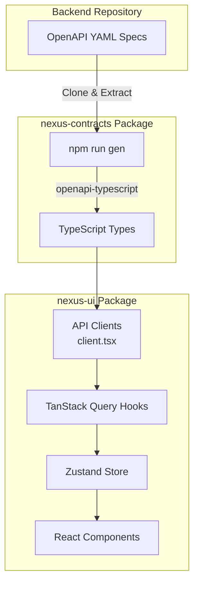
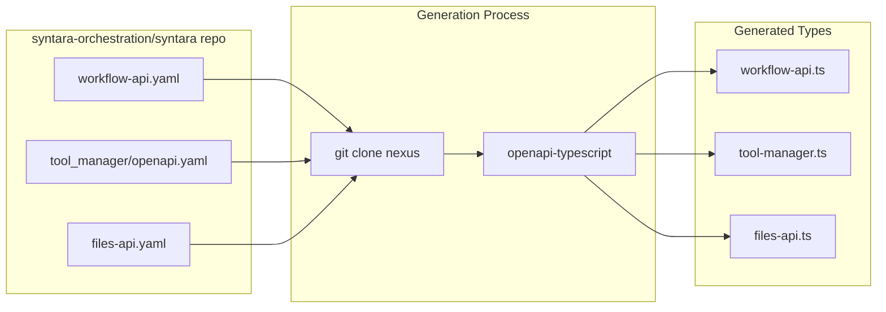
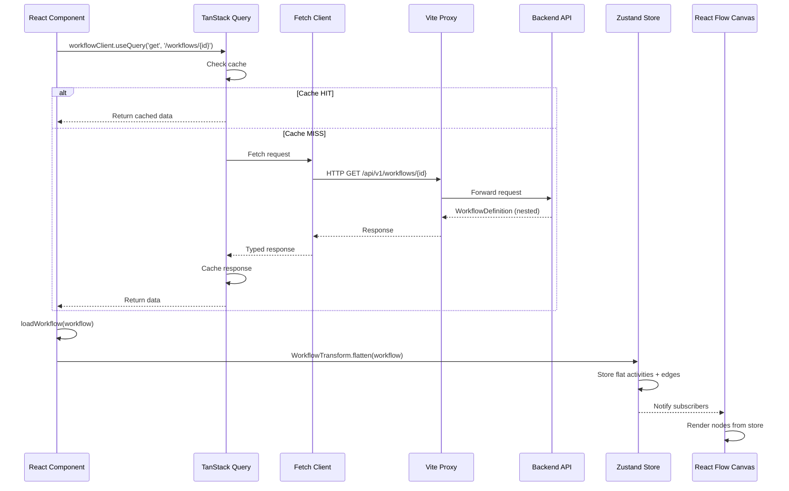
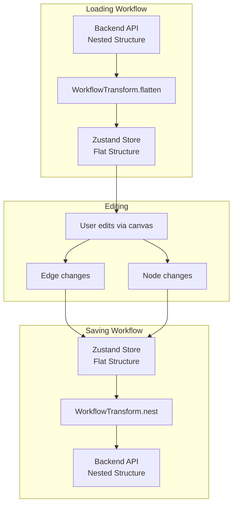
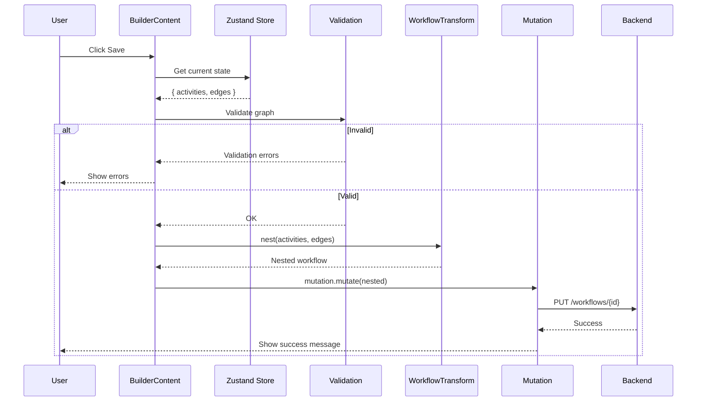

# Data Flow: From OpenAPI to Canvas Nodes

> **Reading time**: ~15 minutes
> **Audience**: Developers working on the workflow builder or API integration

This document explains **how data flows from the backend API to the UI**, focusing on OpenAPI contract generation, type-safe API calls, and the transformation of backend workflow structures into canvas nodes.

---

## Table of Contents

1. [Overview](#overview)
2. [OpenAPI Contract Generation](#openapi-contract-generation)
3. [Type-Safe API Clients](#type-safe-api-clients)
4. [Data Flow: Backend to UI](#data-flow-backend-to-ui)
5. [Workflow Transformation: Nested to Flat](#workflow-transformation-nested-to-flat)
6. [Canvas Rendering](#canvas-rendering)
7. [Saving: Flat to Nested](#saving-flat-to-nested)

---

## Overview

The Nexus UI follows a **type-driven architecture** where TypeScript types are automatically generated from the backend's OpenAPI specification. This ensures type safety from the API all the way to the UI components.



---

## OpenAPI Contract Generation

### The Generation Process

Types are generated from OpenAPI specs in the backend repository:



### How to Regenerate Types

When the backend API changes:

```bash
# From the repository root
npm run gen
```

**What happens:**

1. **Clone backend repo** - Downloads latest OpenAPI specs from `syntara-orchestration/syntara`
2. **Generate types** - Runs `openapi-typescript` on each YAML spec
3. **Create TypeScript files** - Outputs type definitions to `packages/nexus-contracts/src/`
4. **Copy examples** - Copies workflow examples for the mock API
5. **Clean up** - Removes cloned repository
6. **Format** - Runs prettier on generated files

### Location of Files

```text
packages/nexus-contracts/
├── package.json           # Generation scripts
└── src/
    ├── workflow-api.ts    # Generated workflow types
    ├── tool-manager.ts    # Generated tool manager types (unified tools & providers)
    ├── files-api.ts       # Generated files API types
    └── index.ts           # Exports all types
```

---

## Type-Safe API Clients

### Client Creation

The UI creates API clients using the generated types:

```typescript
// packages/nexus-ui/src/client.tsx

import type { FilesAPI, ToolManagerAPI, WorkflowAPI } from '@ansible/nexus-contracts'
import createFetchClient from 'openapi-fetch'
import createClient from 'openapi-react-query'

// Workflow API client
const workflowFetchClient = createFetchClient<WorkflowAPI.paths>({
  baseUrl: '/api/v1/',
})
export const workflowClient = createClient(workflowFetchClient)

// Tool Manager API client (unified tools & providers)
const toolManagerFetchClient = createFetchClient<ToolManagerAPI.paths>({
  baseUrl: '/api/v1/tool_manager/',
})
export const toolManagerClient = createClient(toolManagerFetchClient)

// Legacy clients for backward compatibility - both use the unified tool manager API
export const toolsClient = toolManagerClient
export const toolProvidersClient = toolManagerClient

// Files API client
const filesFetchClient = createFetchClient<FilesAPI.paths>({
  baseUrl: '/api/v1/',
})
export const filesClient = createClient(filesFetchClient)
```

### Type Safety Benefits


**TypeScript will catch errors if:**

- Wrong HTTP method used
- Incorrect endpoint path
- Missing required parameters
- Wrong request body structure
- Invalid response handling

---

## Data Flow: Backend to UI

### Complete Flow Diagram



### Request Example

```typescript
// In a React component
function BuilderEdit() {
  const { workflowId } = useParams()

  // Type-safe query with auto-complete
  const {
    data: workflow,
    isLoading,
    error,
  } = workflowClient.useQuery('get', '/workflows/{workflow_id}', {
    params: {
      path: { workflow_id: workflowId },
    },
  })

  // workflow is fully typed as WorkflowDefinition
  if (workflow) {
    // Load into store with transformation
    loadWorkflow(workflow)
  }
}
```

### Mutation Example

```typescript
// Saving a workflow
function handleSave() {
  const mutation = workflowClient.useMutation('put', '/workflows/{workflow_id}')

  const workflow = useWorkflowStore.getState().currentWorkflow
  const payload = WorkflowTransform.nest(workflow) // Convert flat → nested

  mutation.mutate({
    params: {
      path: { workflow_id: workflow.id },
    },
    body: payload,
  })
}
```

---

## Workflow Transformation: Nested to Flat

### Why Transform?

**Backend format (nested):**

```typescript
{
  activities: [
    {
      id: 'condition1',
      type: 'condition',
      condition: {
        then: [
          { id: 'task1', type: 'task' },
          { id: 'task2', type: 'task' },
        ],
        else: [{ id: 'task3', type: 'task' }],
      },
    },
  ]
}
```

**Builder format (flat):**

```typescript
{
  activities: [
    { id: "condition1", type: "condition", condition: { then: [], else: [] } },
    { id: "task1", type: "task" },
    { id: "task2", type: "task" },
    { id: "task3", type: "task" }
  ],
  edges: [
    { source: "condition1", target: "task1", sourceHandle: "true" },
    { source: "task1", target: "task2" },
    { source: "condition1", target: "task3", sourceHandle: "false" }
  ]
}
```

**Why flat?** Visual editors work better with a flat node list + explicit edges.

### Transformation Flow



### Flatten Operation

Located in `packages/nexus-ui/src/routes/builder/utils/workflowTransform.ts`:

```typescript
/**
 * Converts nested workflow structure to flat representation.
 *
 * This operation:
 * 1. Extracts all activities from nested structures (condition.then/else, parallel.branches)
 * 2. Generates edges representing the nesting relationships
 * 3. Returns completely flat structure suitable for editing
 */
static flatten(nestedActivities: Activity[]): FlatWorkflow {
  const activities: Activity[] = []
  const edges: EdgeConnection[] = []

  // Process each activity
  for (const activity of nestedActivities) {
    if (activity.type === 'condition') {
      // Add condition with empty then/else
      activities.push({
        ...activity,
        condition: { ...activity.condition, then: [], else: [] }
      })

      // Create edges for true branch
      activity.condition.then.forEach((child, index) => {
        if (index === 0) {
          edges.push({
            source: activity.id,
            target: child.id,
            sourceHandle: 'true'
          })
        }
        // Recursively flatten children
        const childFlat = flatten([child])
        activities.push(...childFlat.activities)
        edges.push(...childFlat.edges)
      })

      // Create edges for false branch
      // ... similar logic
    }
    // Handle parallel, loop, etc.
  }

  return { activities, edges }
}
```

### Key Transformations

```mermaid
flowchart TB
    subgraph Nested["Nested: Condition"]
        NC[Condition<br/>then: [A, B]<br/>else: [C]]
    end

    subgraph Flat["Flat: Condition"]
        FC[Condition<br/>then: []<br/>else: []]
        FA[Task A]
        FB[Task B]
        FCC[Task C]

        FC -->|"sourceHandle='true'"| FA
        FA --> FB
        FC -->|"sourceHandle='false'"| FCC
    end

    Nested -->|"flatten()"| Flat
```

```mermaid
flowchart TB
    subgraph Nested2["Nested: Parallel"]
        NP[Parallel<br/>branches: [[A], [B], [C]]]
    end

    subgraph Flat2["Flat: Parallel"]
        FD[Diverge Node]
        FP1[Task A]
        FP2[Task B]
        FP3[Task C]
        FJ[Converge/Join Node<br/>branches: [A, B, C]]

        FD --> FP1 & FP2 & FP3
        FP1 & FP2 & FP3 --> FJ
    end

    Nested2 -->|"flatten()"| Flat2
```

---

## Canvas Rendering

### From Store to React Flow

Once the workflow is in the Zustand store, `BuilderFlow` converts it to React Flow format:

```mermaid
flowchart LR
    subgraph Store["Zustand Store"]
        A[activities: Activity[]]
        E[edges: EdgeConnection[]]
    end

    subgraph BuilderFlow["BuilderFlow Component"]
        T[Transform to React Flow format]
        L[Apply Dagre layout]
    end

    subgraph ReactFlow["React Flow Canvas"]
        N[nodes: Node[]]
        RE[edges: Edge[]]
    end

    A --> T
    E --> T
    T --> L
    L --> N
    L --> RE
```

### Node Type Mapping

```typescript
// Each activity type maps to a React Flow node type
const nodeTypes = {
  task: TaskNode,
  condition: ConditionNode,
  loop: LoopNode,
  converge: ConvergeNode,
  parallel: ParallelNode,
  // ... etc
}

// BuilderFlow creates React Flow nodes
const nodes = activities.map((activity) => ({
  id: activity.id,
  type: activity.type,
  data: activity,
  position: { x: 0, y: 0 }, // Set by Dagre layout
}))
```

### Layout with Dagre

```mermaid
flowchart TB
    subgraph Input["Input"]
        N[Nodes<br/>(unmeasured)]
        E[Edges]
    end

    subgraph Dagre["Dagre Algorithm"]
        G[Create directed graph]
        M[Add nodes with measurements]
        AE[Add edges]
        L[Calculate layout]
    end

    subgraph Output["Output"]
        P[Positioned nodes<br/>(x, y coordinates)]
    end

    N --> G
    E --> G
    G --> M
    M --> AE
    AE --> L
    L --> P
```

Special handling:

- **Loop nodes**: Body positioned to the right (not below) to avoid circular layout
- **Button edges**: Inserted between nodes as "add node here" affordances

---

## Saving: Flat to Nested

### Nest Operation

When saving, the flat structure is converted back to nested:

```typescript
/**
 * Converts flat workflow structure to nested representation.
 *
 * This operation:
 * 1. Reads edges to determine which activities belong in which branches
 * 2. Reconstructs condition.then/else arrays
 * 3. Creates parallel containers for converge nodes
 * 4. Returns nested structure suitable for API
 */
static nest(flatActivities: Activity[], edges: EdgeConnection[]): Activity[] {
  const nested: Activity[] = []

  for (const activity of flatActivities) {
    if (activity.type === 'condition') {
      // Find edges from true/false handles
      const trueEdges = edges.filter(e =>
        e.source === activity.id && e.sourceHandle === 'true'
      )
      const falseEdges = edges.filter(e =>
        e.source === activity.id && e.sourceHandle === 'false'
      )

      // Collect all activities in each branch
      const thenActivities = collectDownstream(trueEdges, edges, flatActivities)
      const elseActivities = collectDownstream(falseEdges, edges, flatActivities)

      // Reconstruct nested condition
      nested.push({
        ...activity,
        condition: {
          ...activity.condition,
          then: thenActivities,
          else: elseActivities
        }
      })
    }
    // Handle other types...
  }

  return nested
}
```

### Save Flow



---

## Summary

### Key Concepts

1. **OpenAPI Contracts** - Types generated from backend YAML specs
2. **Type-Safe Clients** - Full TypeScript support from API to UI
3. **Flat vs Nested** - Builder uses flat + edges, API uses nested structures
4. **WorkflowTransform** - Handles bidirectional conversion
5. **TanStack Query** - Manages server state, caching, mutations
6. **Zustand Store** - Holds workflow during editing
7. **React Flow** - Renders visual canvas

### Critical Files

| File                                                                                                                                    | Purpose                      |
| --------------------------------------------------------------------------------------------------------------------------------------- | ---------------------------- |
| [`packages/nexus-contracts/package.json`](../packages/nexus-contracts/package.json)                                                     | Type generation scripts      |
| [`packages/nexus-ui/src/client.tsx`](../packages/nexus-ui/src/client.tsx)                                                               | API client creation          |
| [`packages/nexus-ui/src/routes/builder/utils/workflowTransform.ts`](../packages/nexus-ui/src/routes/builder/utils/workflowTransform.ts) | Flatten/nest transformations |
| [`packages/nexus-ui/src/routes/builder/BuilderFlow.tsx`](../packages/nexus-ui/src/routes/builder/BuilderFlow.tsx)                       | Canvas rendering             |
| [`packages/nexus-ui/src/stores/useWorkflowStore.ts`](../packages/nexus-ui/src/stores/useWorkflowStore.ts)                               | Workflow state management    |

### Data Flow Summary

```
Backend YAML Specs
    ↓ [npm run gen]
TypeScript Types
    ↓ [createClient]
API Clients
    ↓ [useQuery/useMutation]
TanStack Query
    ↓ [WorkflowTransform.flatten]
Zustand Store (flat)
    ↓ [BuilderFlow]
React Flow Canvas
    ↓ [User edits]
Zustand Store (updated)
    ↓ [WorkflowTransform.nest]
API Payload
    ↓ [mutation]
Backend API
```
