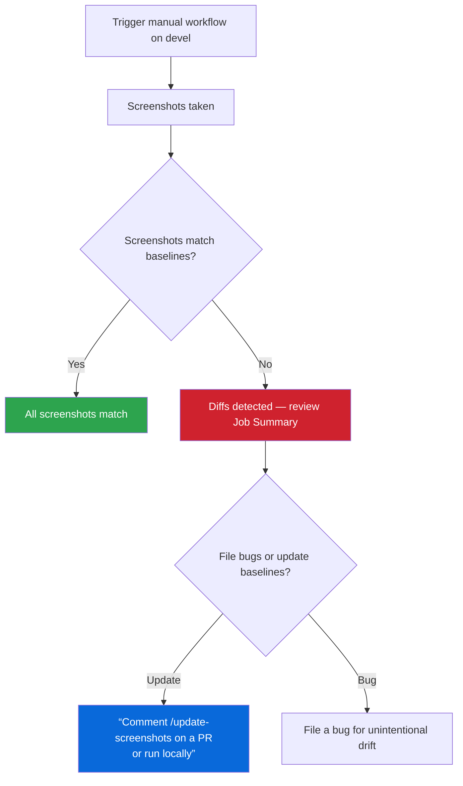

# Visual Regression Testing

Automated screenshot testing for every page in the application.

## How It Works

- **Baselines** are Linux-generated PNGs committed in the repo under `e2e/visual-regression/page-screenshots.spec.ts-snapshots/`.
- **Manual workflow** — visual regression runs on-demand via the **Visual Regression (Manual)** workflow in GitHub Actions (`workflow_dispatch` on `devel`). It does **not** run automatically on PRs or block merges.
- **`/update-screenshots`** is a PR comment command that regenerates baselines on Ubuntu and commits them to your branch. Use it when you know your PR changes the UI and you want to update baselines proactively. It uses a two-workflow architecture: a lightweight listener (`update-screenshots-listener.yml`) validates the comment and dispatches the heavy baseline workflow (`update-visual-baselines.yml`) via `workflow_dispatch`. This prevents bot report comments (which contain `/update-screenshots` as instructional text) from creating ghost workflow runs.
- **Concurrency:** Only one `/update-screenshots` run is active per PR at a time (`cancel-in-progress: true`). Posting the command again before the current run finishes cancels it and restarts from scratch. The workflow takes ~5-6 minutes -- post it once and wait.
- **Troubleshooting `/update-screenshots`:** The workflow only commits when Playwright actually writes new/changed PNGs.
  - If the PR comment says **”already up to date”**, the failure is often a **setup/locator error** (test never reached `toHaveScreenshot`), not a pixel diff — no PNGs change, so the bot has nothing to commit. Download the `frontend-update-baselines-results` artifact or check the **Update Visual Baselines** workflow log; look for `expect(locator).toBeVisible` failures in `page-registry.ts` `setup`/`waitFor`, not `toHaveScreenshot` mismatches.
  - If you deleted baselines and expected a regen, confirm **page-screenshots** tests ran (not skipped). Repository or organization Actions variables must **not** set `NEXUS_E2E_SKIP_WEB_SERVER` to a random non-empty value — only `1` / `true` / `yes` skip mock webServer + snapshot tests. The baseline workflow forces this var off at the job level as a safeguard.
  - After fixing registry locators, comment `/update-screenshots` again (or run locally — see [Commands](#commands)).
- **macOS snapshots** are gitignored. Only Linux baselines are used in CI.
- **Explicit viewport** (1280x720) is set in `playwright.config.ts` so every screenshot uses identical dimensions regardless of the runner's display.
- **`fullPage: true`** captures the entire scrollable page, including content below the fold.
- **Pinned runner** -- the manual workflow uses `ubuntu-24.04` (not `ubuntu-latest`) to guarantee consistent font rendering and system libraries across runs.

## Workflow Overview



**Key points:**

- Visual regression does **not** run on PRs and does **not** block merges
- Run the **Visual Regression (Manual)** workflow from the Actions tab to check for drift on `devel`
- If drift is found, either file a bug or update baselines via `/update-screenshots` on a PR
- Use `/update-screenshots` proactively on PRs when you know you changed the UI

## Three Flows

### Flow 1: Adding a New Page

1. Add your route to `AppRoute.tsx`
2. Add an entry to `e2e/visual-regression/page-registry.ts`:
   ```typescript
   {
     section: 'my-section',
     name: 'my-page',
     path: '/my-section/my-page',
     waitFor: async (page) => {
       await expect(page.getByRole('heading', { name: 'My Page' })).toBeVisible()
     },
   },
   ```
3. Comment `/update-screenshots` on the PR to generate Linux baselines
4. The workflow generates baselines and commits them to your branch

If the route is intentionally unimplemented, add it to `excludedUnimplemented` in `page-registry.ts` instead.

### Flow 2: Modifying an Existing Page

1. Make your UI changes
2. Comment `/update-screenshots` on the PR to regenerate baselines
3. Review the updated baseline PNGs in the PR's Files Changed tab

**If you remove committed `*-linux.png` files** (for example to force a full regen when diffs stay under `maxDiffPixelRatio`), **run `/update-screenshots` or commit fresh Linux baselines before merge**. Otherwise baselines will be stale and other branches will lack up-to-date references.

### Flow 3: Removing a Page

1. Remove the route from `AppRoute.tsx`
2. Remove the entry from `page-registry.ts`
3. Delete the baseline PNG files from `e2e/visual-regression/page-screenshots.spec.ts-snapshots/`

The enforcement script warns about orphan baselines (PNG files with no matching registry entry), so step 3 is required.

## Multiple States Per Page

A single page can have multiple registry entries for different visual states:

- **Empty/filtered state** -- use `setup` to type a non-matching filter term
- **Modals/dialogs** -- use `setup` to click the button that opens the modal
- **Kebab menu actions** -- use `setup` to open a row's kebab and trigger a dialog
- **Detail pages** -- use mock API IDs for `:id` parameters in the path
- **Form pages** -- navigate directly to the create/edit route
- **Dropdown states** -- use `setup` to open a dropdown and capture its expanded state

See existing entries in `page-registry.ts` for examples.

## CI vs Local

|                   | CI (GitHub Actions)                                              | Local development                  |
| ----------------- | ---------------------------------------------------------------- | ---------------------------------- |
| **App server**    | `vite build` + `vite preview`                                    | `vite` (dev server)                |
| **Why**           | Production build reads source files fresh — no transform caching | Dev server is faster for iteration |
| **Controlled by** | `process.env.CI` in `playwright.config.ts`                       | Absence of `CI` env var            |

The `playwright.config.ts` webServer command switches automatically: when `CI` is set (all GitHub Actions runners), it runs a full production build then serves the static output. Locally, it uses the Vite dev server. The mock API server is the same in both cases.

## Running Locally

From the **repo root** (uses `packages/nexus-ui` so `playwright.config.ts` and `webServer` start mock API + UI on **4173** / **3300**):

```bash
# Compare baselines
npm run e2e:visual-regression

# Update baselines locally (macOS — for local dev only; Linux PNGs are what CI uses)
npm run e2e:visual-regression:update
```

```bash
# Run page screenshot tests
npm run e2e:visual-regression

# Update baselines locally (macOS -- for local dev only)
npm run e2e:visual-regression:update

# Run the baseline enforcement check
npm run check:visual-baselines
```

## Running in a Container (CI-Matching Screenshots)

macOS and Linux render fonts differently, so screenshots taken on macOS will not match the Linux baselines used in CI. To generate or compare screenshots that match CI exactly, run the tests inside a Linux container.

**Prerequisites:**

- [Podman](https://podman.io/getting-started/installation) installed and running
- On macOS:
  ```bash
  brew install podman
  podman machine init --memory 4096
  podman machine start
  ```
- Podman machine needs at least **4 GB RAM** (the script checks this automatically)

**Compare baselines** (fail if screenshots differ from committed baselines):

```bash
npm run e2e:visual-regression:container
```

**Update baselines** (regenerate Linux PNGs):

```bash
npm run e2e:visual-regression:container:update
```

**What happens under the hood:**

1. The script checks that Podman is available (and has enough memory)
2. Extracts the Playwright version from `package-lock.json`
3. Pulls `mcr.microsoft.com/playwright:v<version>-noble` (Ubuntu 24.04, x86_64)
4. Copies source files into the container (excluding `node_modules` and `.git`)
5. Runs `npm ci` + `vite build` inside the container
6. Starts the mock API and preview server, then runs the visual regression tests
7. Updated snapshots are copied back to your working tree

**First run** takes 8-10 minutes (pulling image + `npm ci` + build). Subsequent runs skip the image pull.

**Troubleshooting:**

| Problem                         | Solution                                                                          |
| ------------------------------- | --------------------------------------------------------------------------------- |
| "Podman machine is not running" | Run `podman machine start`                                                        |
| "At least 4096MB is required"   | `podman machine stop && podman machine set --memory 4096 && podman machine start` |
| Disk space                      | The Playwright image is ~2 GB. Use `podman system prune` to reclaim space         |

## Reviewing Screenshot Diffs

When the manual workflow detects drift, results are available in two places:

1. **Job Summary** — the workflow run page shows a diff table with changed screenshots
2. **Artifacts** — download the `visual-regression-html-report` artifact and open `index.html` for an interactive side-by-side Playwright report, or download `visual-regression-diffs` for raw diff PNGs

After updating baselines via `/update-screenshots`, review image diffs in the PR’s **Files Changed** tab using GitHub’s 2-up, swipe, or onion skin modes.
