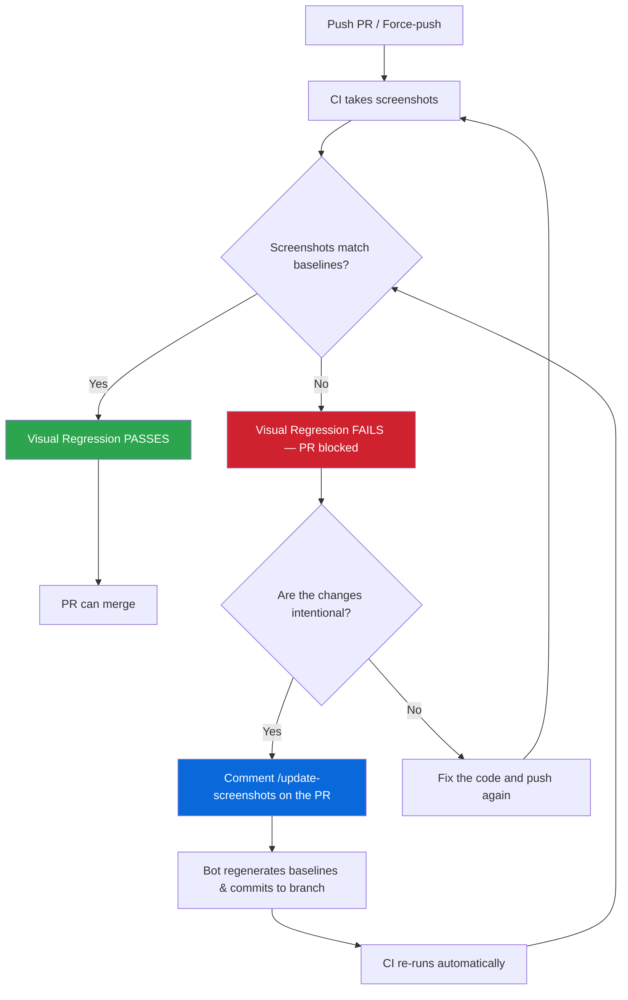

# Visual Regression Testing

Automated screenshot testing for every page in the application.

## How It Works

- **Baselines** are Linux-generated PNGs committed in the repo under `e2e/visual-regression/page-screenshots.spec.ts-snapshots/`.
- **CI uses a production build** (`vite build` + `vite preview`) to take screenshots. This ensures every screenshot reflects the latest source code from disk, with no dev-server caching or HMR artifacts. Local development uses the Vite dev server for fast iteration — see [CI vs Local](#ci-vs-local) for details.
- **`/update-screenshots`** is a PR comment command that regenerates baselines on Ubuntu and commits them to your branch. It uses a two-workflow architecture: a lightweight listener (`update-screenshots-listener.yml`) validates the comment and dispatches the heavy baseline workflow (`update-visual-baselines.yml`) via `workflow_dispatch`. This prevents bot report comments (which contain `/update-screenshots` as instructional text) from creating ghost workflow runs.
- **Concurrency:** Only one `/update-screenshots` run is active per PR at a time (`cancel-in-progress: true`). Posting the command again before the current run finishes cancels it and restarts from scratch. The workflow takes ~5-6 minutes -- post it once and wait.
- **Troubleshooting `/update-screenshots`:** The workflow only commits when Playwright actually writes new/changed PNGs.
  - If the PR comment says **”already up to date”** while **Visual Regression** still fails, the failure is often a **setup/locator error** (test never reached `toHaveScreenshot`), not a pixel diff — no PNGs change, so the bot has nothing to commit. Open the `visual-regression-diffs` artifact or the **Update Visual Baselines** workflow log; look for `expect(locator).toBeVisible` failures in `page-registry.ts` `setup`/`waitFor`, not `toHaveScreenshot` mismatches.
  - If you deleted baselines and expected a regen, confirm **page-screenshots** tests ran (not skipped). Repository or organization Actions variables must **not** set `NEXUS_E2E_SKIP_WEB_SERVER` to a random non-empty value — only `1` / `true` / `yes` skip mock webServer + snapshot tests. The baseline workflow forces this var off at the job level as a safeguard.
  - After fixing registry locators, comment `/update-screenshots` again (or run locally — see [Commands](#commands)).
- **macOS snapshots** are gitignored. Only Linux baselines are used in CI.
- **Explicit viewport** (1280x720) is set in `playwright.config.ts` so every screenshot uses identical dimensions regardless of the runner's display.
- **`fullPage: true`** captures the entire scrollable page, including content below the fold.
- **Pinned runner** -- CI uses `ubuntu-24.04` (not `ubuntu-latest`) to guarantee consistent font rendering and system libraries across runs.

## Workflow Overview



**Key points:**

- Every PR gets screenshots compared to committed baselines
- If they differ, CI **blocks merge** until you either fix the code or update baselines
- Comment `/update-screenshots` to accept intentional visual changes — the bot commits new baselines and CI re-runs
- After a force-push, always run `/update-screenshots` again (force-push drops bot commits)

## Merge-Blocking Check

Visual regression is a **required merge gate**. The CI job must pass for the PR to merge.

- **On every PR**: CI takes screenshots and compares them to committed baselines. If any screenshot differs or the baseline coverage check fails, the job fails and blocks merge. For same-repo PRs, results are posted as a PR comment with diff artifacts. Forked PRs do not receive the automated comment but still get the blocking check and downloadable artifacts.
- **If screenshots changed intentionally**: Comment `/update-screenshots` on the PR to regenerate baselines. CI re-runs and passes once baselines match.
- **If screenshots changed unintentionally**: Fix the code and push again.
- **Force-push warning**: If you rebase and force-push after `/update-screenshots` has committed baseline updates, those bot commits will be lost. Always run `/update-screenshots` again after any force-push to ensure baselines are current.

## Three Flows

### Flow 1: Adding a New Page

1. Add your route to `AppRoute.tsx`
2. Add an entry to `e2e/visual-regression/page-registry.ts`:
   ```typescript
   {
     section: 'my-section',
     name: 'my-page',
     path: '/my-section/my-page',
     waitFor: async (page) => {
       await expect(page.getByRole('heading', { name: 'My Page' })).toBeVisible()
     },
   },
   ```
3. Push your PR
4. CI fails with missing baselines -- the PR comment shows which pages need screenshots
5. Comment `/update-screenshots` on the PR
6. The workflow generates Linux baselines and commits them to your branch
7. CI re-runs, baselines match, and the job passes

If the route is intentionally unimplemented, add it to `excludedUnimplemented` in `page-registry.ts` instead.

### Flow 2: Modifying an Existing Page

1. Make your UI changes
2. Push your PR
3. CI fails because screenshots differ from baselines -- the PR comment shows diffs
4. Review the diff artifacts to confirm changes are intentional
5. Comment `/update-screenshots` on the PR
6. Baselines are regenerated and committed
7. CI re-runs, baselines match, and the job passes

**If you remove committed `*-linux.png` files** (for example to force a full regen when diffs stay under `maxDiffPixelRatio`), **run `/update-screenshots` or commit fresh Linux baselines before merge**. Otherwise CI diffs are misleading and other branches lack up-to-date references.

### Flow 3: Removing a Page

1. Remove the route from `AppRoute.tsx`
2. Remove the entry from `page-registry.ts`
3. Delete the baseline PNG files from `e2e/visual-regression/page-screenshots.spec.ts-snapshots/`
4. Push your PR
5. CI passes (route excluded, no stale baselines)

The enforcement script warns about orphan baselines (PNG files with no matching registry entry), so step 3 is required.

## Multiple States Per Page

A single page can have multiple registry entries for different visual states:

- **Empty/filtered state** -- use `setup` to type a non-matching filter term
- **Modals/dialogs** -- use `setup` to click the button that opens the modal
- **Kebab menu actions** -- use `setup` to open a row's kebab and trigger a dialog
- **Detail pages** -- use mock API IDs for `:id` parameters in the path
- **Form pages** -- navigate directly to the create/edit route
- **Dropdown states** -- use `setup` to open a dropdown and capture its expanded state

See existing entries in `page-registry.ts` for examples.

## CI vs Local

|                   | CI (GitHub Actions)                                              | Local development                  |
| ----------------- | ---------------------------------------------------------------- | ---------------------------------- |
| **App server**    | `vite build` + `vite preview`                                    | `vite` (dev server)                |
| **Why**           | Production build reads source files fresh — no transform caching | Dev server is faster for iteration |
| **Controlled by** | `process.env.CI` in `playwright.config.ts`                       | Absence of `CI` env var            |

The `playwright.config.ts` webServer command switches automatically: when `CI` is set (all GitHub Actions runners), it runs a full production build then serves the static output. Locally, it uses the Vite dev server. The mock API server is the same in both cases.

## Running Locally

From the **repo root** (uses `packages/nexus-ui` so `playwright.config.ts` and `webServer` start mock API + UI on **4173** / **3300**):

```bash
# Compare baselines
npm run e2e:visual-regression

# Update baselines locally (macOS — for local dev only; Linux PNGs are what CI uses)
npm run e2e:visual-regression:update
```

From **`packages/nexus-ui`**:

```bash
cd packages/nexus-ui

# Run page screenshot tests
npx playwright test e2e/visual-regression/page-screenshots

# Update baselines locally (macOS -- for local dev only)
npx playwright test e2e/visual-regression/page-screenshots --update-snapshots

# Run the baseline enforcement check
npm exec tsx -- scripts/check-visual-baselines.ts
```

## Running in a Container (CI-Matching Screenshots)

macOS and Linux render fonts differently, so screenshots taken on macOS will not match the Linux baselines used in CI. To generate or compare screenshots that match CI exactly, run the tests inside a Linux container.

**Prerequisites:**

- [Podman](https://podman.io/getting-started/installation) installed and running
- On macOS:
  ```bash
  brew install podman
  podman machine init --memory 4096
  podman machine start
  ```
- Podman machine needs at least **4 GB RAM** (the script checks this automatically)

**Compare baselines** (fail if screenshots differ from committed baselines):

```bash
npm run e2e:visual-regression:container
```

**Update baselines** (regenerate Linux PNGs):

```bash
npm run e2e:visual-regression:container:update
```

**What happens under the hood:**

1. The script checks that Podman is available (and has enough memory)
2. Extracts the Playwright version from `package-lock.json`
3. Pulls `mcr.microsoft.com/playwright:v<version>-noble` (Ubuntu 24.04, x86_64)
4. Copies source files into the container (excluding `node_modules` and `.git`)
5. Runs `npm ci` + `vite build` inside the container
6. Starts the mock API and preview server, then runs the visual regression tests
7. Updated snapshots are copied back to your working tree

**First run** takes 8-10 minutes (pulling image + `npm ci` + build). Subsequent runs skip the image pull.

**Troubleshooting:**

| Problem                         | Solution                                                                          |
| ------------------------------- | --------------------------------------------------------------------------------- |
| "Podman machine is not running" | Run `podman machine start`                                                        |
| "At least 4096MB is required"   | `podman machine stop && podman machine set --memory 4096 && podman machine start` |
| Disk space                      | The Playwright image is ~2 GB. Use `podman system prune` to reclaim space         |

## Reviewing Screenshot Diffs in PRs

The PR comment is built by [`actions/github-script`](https://github.com/actions/github-script) inline in `.github/workflows/pull-request.yml`. When screenshots differ, `generate-visual-diff-report.js` writes `visual-diff-summary.json`, then the workflow pushes each diff/actual/expected PNG to a temporary orphan branch (`visual-diffs/pr-<number>`) and posts a table with links to each image in the PR comment. Click any link to view the image in GitHub's file viewer.

The temporary branch is automatically deleted when the PR closes (see `.github/workflows/cleanup-visual-diffs.yml`). A "Browse all diff images" link in the comment opens the branch's `diffs/` directory so you can review all screenshots in one place.

`inlineImages` in the JSON summary (total on-disk size of those PNGs vs. a Step Summary byte budget) controls whether the **Job Summary** tab renders image markdown or a text-only list.

1. Read the PR comment for a pass/fail summary and inline diff images (when available, up to 10 screenshots per the report script’s `MAX_FILES`)
2. For more than 10 diffs, or for an interactive side-by-side comparison, download the `visual-regression-html-report` artifact and open `index.html`
3. For raw diff PNGs, download the `visual-regression-diffs` artifact
4. If the changes are intentional, comment `/update-screenshots`

After baselines are updated, review image diffs in the PR's **Files Changed** tab using GitHub's 2-up, swipe, or onion skin modes.
