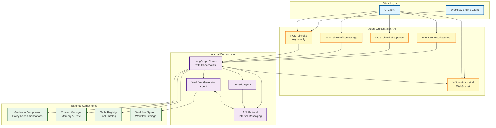

# Implementation Plan: Agent Orchestrator

**Branch**: `002-core-agent-acp-fixed` | **Date**: 2025-10-09 | **Spec**: [spec.md](./spec.md)
**Input**: Feature specification from `/specs/002-agent-orchestrator/spec.md`

## Execution Flow (/plan command scope)

```
1. Load feature spec from Input path
   → If not found: ERROR "No feature spec at {path}"
2. Fill Technical Context (scan for NEEDS CLARIFICATION)
   → Detect Project Type from context (web=frontend+backend, mobile=app+api)
   → Set Structure Decision based on project type
3. Fill the Constitution Check section based on the content of the constitution document.
4. Evaluate Constitution Check section below
   → If violations exist: Document in Complexity Tracking
   → If no justification possible: ERROR "Simplify approach first"
   → Update Progress Tracking: Initial Constitution Check
5. Execute Phase 0 → research.md
   → If NEEDS CLARIFICATION remain: ERROR "Resolve unknowns"
6. Execute Phase 1 → contracts, data-model.md, quickstart.md, agent-specific template file (e.g., `CLAUDE.md` for Claude Code, `.github/copilot-instructions.md` for GitHub Copilot, `GEMINI.md` for Gemini CLI, `QWEN.md` for Qwen Code or `AGENTS.md` for opencode).
7. Re-evaluate Constitution Check section
   → If new violations: Refactor design, return to Phase 1
   → Update Progress Tracking: Post-Design Constitution Check
8. Plan Phase 2 → Describe task generation approach (DO NOT create tasks.md)
9. STOP - Ready for /tasks command
```

**IMPORTANT**: The /plan command STOPS at step 8. Phases 2-4 are executed by other commands:

- Phase 2: /tasks command creates tasks.md
- Phase 3-4: Implementation execution (manual or via tools)

## Summary

The Agent Orchestrator is the central agentic intelligence layer of the Automation Nexus System. It interprets natural language requests and performs agentic activities by leveraging the Guidance component for policy recommendations, the Context Manager for decision context, and the Tools Registry for tool discovery. The implementation exposes a **REST API with async-only invocation** that returns an invocation ID immediately and streams progress via WebSocket. The orchestrator leverages LangChain's Agent Protocol and LangGraph for internal routing, integrates with external components (Guidance, Context Manager, Tools Registry, Workflow System), and supports interactive multi-turn conversations with pause/cancel control signals.

**User Requirement**: Remove sync mode from the API - only async API calls are needed.

## Architecture Overview



## Technical Context

**Language/Version**: Python 3.12+
**Primary Dependencies**: FastAPI, Pydantic, LangChain, LangGraph, Redis
**Storage**: Context Manager (external service - working/short-term/long-term memory), Workflow System (external - stores workflow definitions), Tools Registry (external - tool catalog)
**Testing**: pytest with async support
**Target Platform**: Linux server (containerized deployment)
**Project Type**: single (backend API service)
**Performance Goals**:

- Async mode: <200ms p95 for invocation acceptance
- Streaming: <100ms p95 latency from agent event to UI delivery
- Control signals: <500ms p95 for pause/cancel acknowledgment
- Message injection: <500ms p95 for message routing
  **Constraints**:
- Read-only operations (FR-016) - no workflow or tool storage
- All write operations via Workflow System (FR-017)
- External component authentication required
- Horizontal scaling support (stateless design)
  **Scale/Scope**:
- Support 100+ concurrent agent invocations
- Integration with 4 external components (Guidance, Context Manager, Tools Registry, Workflow System)
- 2 specialized agents (workflow_generator, generic_agent)

## Constitution Check

_GATE: Must pass before Phase 0 research. Re-check after Phase 1 design._

### I. Modular Architecture

✅ **PASS** - Agent Orchestrator designed as independent module with clear boundaries:

- REST API provides well-defined public interface
- Internal orchestration via LangChain Agent Protocol and A2A messages
- External component integrations through dedicated clients
- No hidden dependencies or side effects

### II. Test-Driven Development

✅ **PASS** - TDD approach planned:

- Contract tests for REST API endpoints (Phase 1)
- Unit tests for Pydantic models and validation
- Integration tests for end-to-end flows
- Tests written before implementation

### III. Explicit Configuration

✅ **PASS** - Configuration externalized:

- External component URLs/credentials via environment variables
- Redis connection configuration
- Timeout values and performance thresholds configurable
- No magic values or hardcoded environment assumptions

### IV. Observability First

✅ **PASS** - Observability integrated:

- Structured logging with correlation IDs throughout
- Progress events emitted via WebSocket for real-time visibility
- Metrics for API latency, agent performance, external component calls
- All critical paths instrumented (invocation, routing, control signals)

### V. API Stability

✅ **PASS** - API versioning and stability:

- REST API versioned (/v1/invoke)
- OpenAPI schema for contract documentation
- Semantic versioning for breaking changes
- LangChain Agent Protocol internal (not exposed externally for flexibility)

### Code Quality Requirements

✅ **PASS** - Quality standards planned:

- Linting: ruff for Python
- Type checking: mypy with strict mode
- Code coverage: 80% minimum (unit tests)

### Code Style Standards

✅ **PASS** - Style standards defined:

- Self-descriptive naming (no single-letter variables except loop counters)
- Constants in UPPER_CASE_WITH_UNDERSCORES
- Named constants for all numeric literals
- 100 character line limit (120 for docs)
- snake_case for Python (PEP 8)

### Documentation Standards

✅ **PASS** - Documentation planned:

- Docstrings for all classes and public methods
- OpenAPI auto-generated from Pydantic models
- README for Agent Orchestrator service
- API documentation for external consumers
- Design artifacts (research.md, data-model.md, quickstart.md)

## Project Structure

### Documentation (this feature)

```
specs/002-agent-orchestrator/
├── plan.md              # This file (/plan command output)
├── research.md          # Phase 0 output (/plan command)
├── data-model.md        # Phase 1 output (/plan command)
├── quickstart.md        # Phase 1 output (/plan command)
├── contracts/           # Phase 1 output (/plan command)
│   └── agent-orchestrator-api.yaml
└── tasks.md             # Phase 2 output (/tasks command - NOT created by /plan)
```

### Source Code (repository root)

```
# Option 1: Single project (DEFAULT)
src/
├── models/              # Pydantic models (InvokeRequest, InvokeResponse, etc.)
├── services/            # Business logic (orchestrator, routing, external clients)
├── api/                 # FastAPI routes and endpoints
└── lib/                 # Shared utilities (logging, config, etc.)

tests/
├── contract/            # Contract tests for REST API and external components
├── integration/         # End-to-end integration tests
└── unit/                # Unit tests for models and services
```

**Structure Decision**: Option 1 (single project) - Backend API service

## Phase 0: Outline & Research

1. **Extract unknowns from Technical Context** above:

   - ✅ All NEEDS CLARIFICATION resolved
   - Technology choices finalized: FastAPI, LangChain, LangGraph, Redis

2. **Research areas completed**:

   - ✅ Async-only API design with unified POST /invoke endpoint
   - ✅ WebSocket for progress streaming
   - ✅ Interactive messaging architecture (message injection)
   - ✅ Pause/cancel control signal mechanism
   - ✅ LangChain Agent Protocol for internal orchestration
   - ✅ A2A Protocol for inter-agent communication
   - ✅ LangGraph for routing with control signal support

3. **Consolidated findings** in `research.md`:
   - All technical decisions documented with rationale
   - Alternatives considered and rejected
   - Best practices identified

**Output**: ✅ research.md complete (all NEEDS CLARIFICATION resolved)

## Phase 1: Design & Contracts

_Prerequisites: research.md complete_

1. **Extract entities from feature spec** → `data-model.md`:

   - ✅ Core entities: Invocation (async-only), ConversationMessage, ProgressEvent, RoutingDecision, WorkflowResult
   - ✅ Supporting entities: GuidanceRecommendation, ContextEntry, ToolInfo
   - ✅ Internal protocol: A2AMessage
   - ✅ Relationships, validation rules, state transitions documented
   - ✅ External component boundaries clear

2. **Generate API contracts** from functional requirements:

   - ✅ REST API contract: agent-orchestrator-api.yaml (OpenAPI 3.0.3)
   - ✅ Async-only mode: POST /invoke returns invocation_id immediately
   - ✅ WebSocket streaming: WS /ws/invoke/{id} for progress
   - ✅ Interactive messaging: POST /invoke/{id}/message
   - ✅ Control signals: POST /invoke/{id}/pause, POST /invoke/{id}/cancel

3. **Generate contract tests** from contracts:

   - [ ] Contract tests to be created in /tasks phase
   - Tests will validate request/response schemas
   - Tests will fail initially (no implementation yet)

4. **Extract test scenarios** from user stories:

   - [ ] Integration test scenarios to be created in /tasks phase
   - Each acceptance scenario → integration test
   - Quickstart test = story validation steps

5. **Update agent file incrementally** (O(1) operation):
   - [ ] Run `.specify/scripts/bash/update-agent-context.sh claude`
   - Add new tech from current plan
   - Keep under 150 lines for token efficiency

**Output**: ✅ data-model.md, ✅ contracts/agent-orchestrator-api.yaml, [ ] failing tests (Phase 2), [ ] quickstart.md (Phase 2), [ ] CLAUDE.md (Phase 2)

## Phase 2: Task Planning Approach

_This section describes what the /tasks command will do - DO NOT execute during /plan_

**Task Generation Strategy**:

- Load `.specify/templates/tasks-template.md` as base
- Generate tasks from Phase 1 design docs (contracts, data model, quickstart)
- Each contract endpoint → contract test task [P]
- Each entity → Pydantic model creation task [P]
- Each user story → integration test task
- Implementation tasks to make tests pass

**Ordering Strategy**:

- TDD order: Tests before implementation
- Dependency order: Models before services before API routes
- Mark [P] for parallel execution (independent files)

**Key Task Categories**:

1. **Contract Tests** (Phase 1 - tests that fail initially):

   - Test POST /invoke with async mode
   - Test WS /ws/invoke/{id} (WebSocket)
   - Test POST /invoke/{id}/message
   - Test POST /invoke/{id}/pause
   - Test POST /invoke/{id}/cancel

2. **Data Models** (Pydantic models):

   - InvokeRequest, InvokeResponse
   - MessageRequest, MessageResponse
   - ProgressEvent, ControlResponse
   - Internal models: A2AMessage, RoutingDecision

3. **External Component Clients**:

   - GuidanceClient (fetch recommendations)
   - ContextManagerClient (read/write context, invocation state)
   - ToolsRegistryClient (query tools)
   - WorkflowSystemClient (send workflow definitions)

4. **Core Services**:

   - OrchestratorService (routing logic via LangGraph)
   - WorkflowGeneratorAgent (specialized agent)
   - GenericAgent (specialized agent)
   - WebSocket streaming service

5. **API Routes**:

   - POST /invoke endpoint
   - WS /ws/invoke/{id} endpoint
   - POST /invoke/{id}/message endpoint
   - POST /invoke/{id}/pause endpoint
   - POST /invoke/{id}/cancel endpoint

6. **Integration Tests**:
   - End-to-end async invocation flow
   - Interactive messaging flow
   - Pause/resume flow
   - Cancel flow
   - Error handling scenarios

**Estimated Output**: 30-35 numbered, ordered tasks in tasks.md

**IMPORTANT**: This phase is executed by the /tasks command, NOT by /plan

## Phase 3+: Future Implementation

_These phases are beyond the scope of the /plan command_

**Phase 3**: Task execution (/tasks command creates tasks.md)
**Phase 4**: Implementation (execute tasks.md following constitutional principles)
**Phase 5**: Validation (run tests, execute quickstart.md, performance validation)

## Complexity Tracking

_Fill ONLY if Constitution Check has violations that must be justified_

No violations - all constitutional principles satisfied.

## Progress Tracking

_This checklist is updated during execution flow_

**Phase Status**:

- [x] Phase 0: Research complete (/plan command)
- [x] Phase 1: Design complete (/plan command)
- [x] Phase 2: Task planning complete (/plan command - describe approach only)
- [ ] Phase 3: Tasks generated (/tasks command)
- [ ] Phase 4: Implementation complete
- [ ] Phase 5: Validation passed

**Gate Status**:

- [x] Initial Constitution Check: PASS
- [x] Post-Design Constitution Check: PASS
- [x] All NEEDS CLARIFICATION resolved
- [x] Complexity deviations documented (N/A - no deviations)

---

_Based on Constitution v1.0.0 - See `.specify/memory/constitution.md`_
