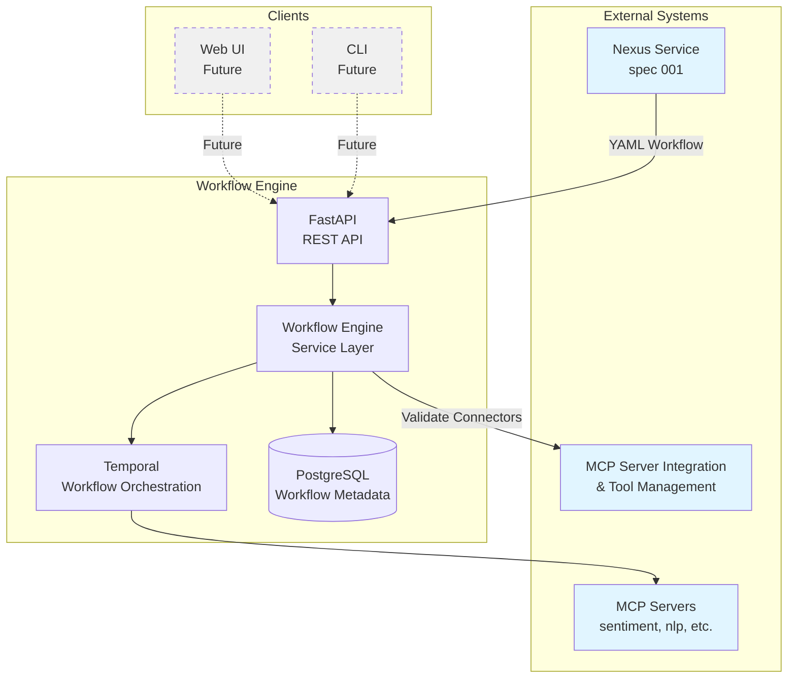
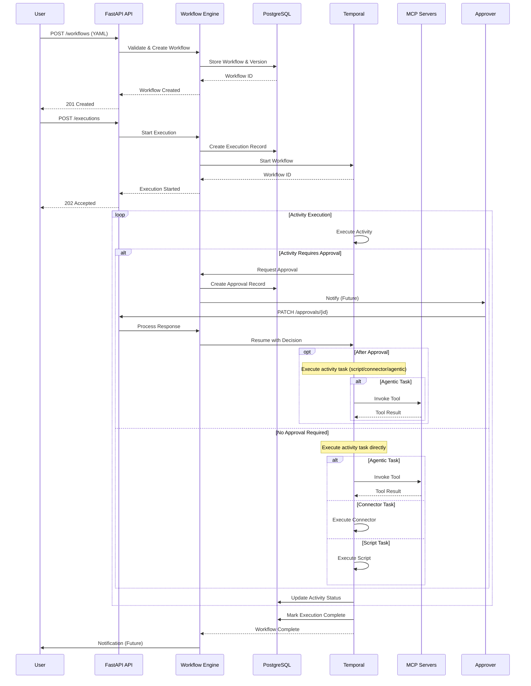
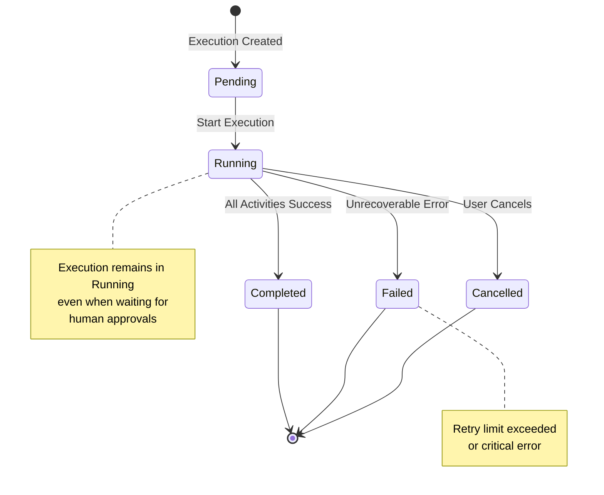

# Implementation Plan: Workflow Engine Application

**Branch**: `plan/workflowengine` | **Date**: 2025-09-29 | **Spec**: [spec.md](./spec.md)
**Input**: Feature specification from `/specs/002-build-the-workflow-engine/spec.md`

## Execution Flow (/plan command scope)
```
1. Load feature spec from Input path
   → If not found: ERROR "No feature spec at {path}"
2. Fill Technical Context (scan for NEEDS CLARIFICATION)
   → Detect Project Type from context (web=frontend+backend, mobile=app+api)
   → Set Structure Decision based on project type
3. Fill the Constitution Check section based on the content of the constitution document.
4. Evaluate Constitution Check section below
   → If violations exist: Document in Complexity Tracking
   → If no justification possible: ERROR "Simplify approach first"
   → Update Progress Tracking: Initial Constitution Check
5. Execute Phase 0 → research.md
   → If NEEDS CLARIFICATION remain: ERROR "Resolve unknowns"
6. Execute Phase 1 → contracts, data-model.md, quickstart.md, agent-specific template file (e.g., `CLAUDE.md` for Claude Code, `.github/copilot-instructions.md` for GitHub Copilot, `GEMINI.md` for Gemini CLI, `QWEN.md` for Qwen Code or `AGENTS.md` for opencode).
7. Re-evaluate Constitution Check section
   → If new violations: Refactor design, return to Phase 1
   → Update Progress Tracking: Post-Design Constitution Check
8. Plan Phase 2 → Describe task generation approach (DO NOT create tasks.md)
9. STOP - Ready for /tasks command
```

**IMPORTANT**: The /plan command STOPS at step 7. Phases 2-4 are executed by other commands:
- Phase 2: /tasks command creates tasks.md
- Phase 3-4: Implementation execution (manual or via tools)

## Summary
Build a Python-based workflow engine application that enables execution and management of dynamic workflows comprised of agentic and non-agentic tasks. The system integrates with the Nexus service (spec 001) to receive YAML workflow definitions and provides a complete orchestration platform with human-in-the-loop capabilities, real-time monitoring, and external agentic tool server connectors. The implementation uses Temporal as the backend workflow orchestration engine.

## Architecture Diagrams

### System Architecture


### Workflow Execution Flow


### Data Model Relationships

```mermaid
erDiagram
    User ||--o{ Workflow : creates
    User ||--o{ Execution : starts
    User ||--o{ Approval : approves

    Workflow ||--o{ WorkflowVersion : has
    Workflow ||--o{ Execution : executes

    WorkflowVersion ||--o{ Execution : "executed as"

    Execution ||--o{ ActivityExecution : contains
    Execution ||--o{ AuditLog : generates

    ActivityExecution ||--o{ Approval : "may require"

    User {
        uuid id PK
        string username
        string email
        string full_name
        enum role
        boolean is_active
        timestamp created_at
        timestamp last_login
        json preferences
        timestamp deleted_at
        uuid deleted_by FK
    }

    Workflow {
        uuid id PK
        string name
        text description
        jsonb labels
        integer current_version
        uuid created_by FK
        timestamp created_at
        timestamp updated_at
        boolean is_enabled
        timestamp deleted_at
        uuid deleted_by FK
    }

    WorkflowVersion {
        uuid id PK
        uuid workflow_id FK
        integer version
        string schema_version
        jsonb workflow_definition
        uuid created_by FK
        timestamp created_at
        text change_description
        timestamp deleted_at
        uuid deleted_by FK
    }

    Execution {
        uuid id PK
        jsonb labels
        uuid workflow_id FK
        uuid workflow_version_id FK
        string temporal_workflow_id
        enum status
        uuid started_by FK
        timestamp created_at
        timestamp started_at
        timestamp completed_at
        timestamp updated_at
        json input_data
        text error_details
    }

    ActivityExecution {
        uuid id PK
        jsonb labels
        uuid execution_id FK
        string activity_name
        json activity_definition
        string temporal_activity_id
        enum status
        timestamp created_at
        timestamp started_at
        timestamp completed_at
        timestamp updated_at
        json input_data
        json output_data
        text error_details
        integer retry_count
        integer iteration
    }

    Approval {
        uuid id PK
        jsonb labels
        uuid activity_execution_id FK
        uuid approver_id FK
        enum status
        json request_data
        json response_data
        timestamp requested_at
        timestamp responded_at
        timestamp expires_at
        boolean notification_sent
        timestamp created_at
        timestamp updated_at
    }

    AuditLog {
        uuid id PK
        uuid execution_id FK
        uuid user_id FK
        enum event_type
        json event_data
        timestamp timestamp
        string correlation_id
        string session_id
    }
```


### Workflow State Machine


## Technical Context

- **Language/Version**: Python 3.12+
- **Primary Dependencies**: Temporal Python SDK, FastAPI, SQLAlchemy, Pydantic, PyYAML, (Redis/Valkey)
- **Storage**: PostgreSQL 17 for workflow metadata (REQUIRED - no SQLite), Temporal server for workflow execution state
- **Testing**: pytest, pytest-asyncio, PostgreSQL test database (no SQLite - tests must use real PostgreSQL)
- **Target Platform**: Linux server (containerized deployment with Temporal cluster)
- **Project Type**: web (API backend with potential future frontend)
- **Performance Goals**: Support 1000 concurrent automation jobs, <5 minute report generation
- **Constraints**: <200ms API response time, maintain execution state for recovery via Temporal
- **Scale/Scope**: Multi-tenant platform supporting thousands of workflows with comprehensive audit trails
- **External Dependencies**: MCP Server Integration and Tool Management feature for connector definitions and external tool server management

## Existing Infrastructure
*Tracking what is already configured in the project*

### Python Namespace
- **Package name**: `nexus` (defined in `pyproject.toml`)
- **Source packages**: `src/nexus/api` (configured in hatchling build targets)
- **Python version**: 3.12+ (specified in `pyproject.toml`)

### Tooling Configuration
The following development tools are already configured and integrated:

- **Linting & Formatting**:
  - Ruff (format + lint) - configured in `pyproject.toml` [tool.ruff], accessible via `make format` and `make lint`
  - YAMLlint & yamlfmt - configured in `pyproject.toml` dev dependencies, integrated in `make format` and `make lint`

- **Type Checking**:
  - MyPy with strict mode - configured in `pyproject.toml` [tool.mypy], accessible via `make typecheck`

- **Testing**:
  - pytest with coverage, asyncio, and xdist - configured in `pyproject.toml` [tool.pytest.ini_options]
  - Multiple test targets available: `make test`, `make test-unit`, `make test-integration`, `make test-coverage`, `make test-all-parallel`

- **Pre-commit Hooks**:
  - Configured in `.pre-commit-config.yaml` with local hooks for ruff format, mypy, and path sequence checking
  - Includes conventional commit message validation
  - Installed via `make install` (runs `uv run pre-commit install --hook-type commit-msg`)

### Build System
- **Build backend**: hatchling
- **Package manager**: uv (for dependency management and virtual environments)
- **Development setup**: Makefile targets for install, format, lint, typecheck, test, clean

**Note**: New code for this feature should follow the established patterns and leverage these existing configurations.

## Constitution Check
*GATE: Must pass before Phase 0 research. Re-check after Phase 1 design.*

- **Modular Architecture**: ✅ PASS - Temporal workflows, FastAPI services, and data models will be independent modules with clear interfaces
- **Test-Driven Development**: ✅ PASS - Contract tests, unit tests, and integration tests will be written before implementation
- **Explicit Configuration**: ✅ PASS - Environment-specific values injected at runtime, no hardcoded assumptions
- **Observability First**: ✅ PASS - Structured logging, metrics, and tracing required for workflow monitoring
- **API Stability**: ✅ PASS - REST API versioning and OpenAPI contracts will follow semantic versioning
- **Code Quality**: ✅ PASS - pytest, linting, type checking with mypy, 80% coverage minimum
- **Documentation**: ✅ PASS - Docstrings, API docs, README files, and workflow examples required
- **Development Workflow**: ✅ PASS - Feature branches, PR reviews, CI/CD pipeline validation

## Project Structure

### Documentation (this feature)
```
specs/[###-feature]/
├── plan.md              # This file (/plan command output)
├── research.md          # Phase 0 output (/plan command)
├── data-model.md        # Phase 1 output (/plan command)
├── quickstart.md        # Phase 1 output (/plan command)
├── contracts/           # Phase 1 output (/plan command)
└── tasks.md             # Phase 2 output (/tasks command - NOT created by /plan)
```

### Source Code (repository root)
```
src/
└── nexus/
    ├── api/             # FastAPI REST service (Temporal workflows, DB access)
    │   ├── models/          # Data models and entities
    │   ├── services/        # Business logic and orchestration
    │   ├── api/             # API routers and dependencies
    │   ├── workflows/       # Temporal workflow definitions
    │   └── alembic/         # Database migrations (part of nexus.api package)
    ├── agents/          # Agent implementations (generic, research, etc.)
    └── tool_manager/    # Tool provider interfaces and adapters

tests/
├── contract/        # Contract tests for API and workflows
├── integration/     # Integration tests
└── unit/            # Unit tests
```

**Structure Decision**: Backend API service (frontend and mobile apps will be separate features)

## Phase 0: Outline & Research
1. **Extract unknowns from Technical Context** above:
   - For each NEEDS CLARIFICATION → research task
   - For each dependency → best practices task
   - For each integration → patterns task

2. **Generate and dispatch research agents**:
   ```
   For each unknown in Technical Context:
     Task: "Research {unknown} for {feature context}"
   For each technology choice:
     Task: "Find best practices for {tech} in {domain}"
   ```

3. **Consolidate findings** in `research.md` using format:
   - Decision: [what was chosen]
   - Rationale: [why chosen]
   - Alternatives considered: [what else evaluated]

**Output**: research.md with all NEEDS CLARIFICATION resolved

## Phase 1: Design & Contracts
*Prerequisites: research.md complete*

1. **Extract entities from feature spec** → `data-model.md`:
   - Entity name, fields, relationships
   - Validation rules from requirements
   - State transitions if applicable
   - **Soft delete fields**: Add `deleted_at` and `deleted_by` to User, Workflow, WorkflowVersion, and Activity entities

2. **Generate API contracts** from functional requirements:
   - For each user action → endpoint
   - Use standard REST/GraphQL patterns
   - Output OpenAPI/GraphQL schema to `/contracts/`
   - Generate JSON Schema for workflow YAML definitions
   - Include validation rules for workflow structure, task types, and dependencies
   - **Soft delete implementation**: DELETE endpoints set `deleted_at`/`deleted_by` instead of hard deletes
   - **Query filtering**: All GET endpoints filter `WHERE deleted_at IS NULL` by default

3. **Generate contract tests** from contracts:
   - One test file per endpoint
   - Assert request/response schemas
   - Tests must fail (no implementation yet)

4. **Extract test scenarios** from user stories:
   - Each story → integration test scenario
   - Quickstart test = story validation steps

5. **Update agent file incrementally** (O(1) operation):
   - Run `.specify/scripts/bash/update-agent-context.sh claude`
     **IMPORTANT**: Execute it exactly as specified above. Do not add or remove any arguments.
   - If exists: Add only NEW tech from current plan
   - Preserve manual additions between markers
   - Update recent changes (keep last 3)
   - Keep under 150 lines for token efficiency
   - Output to repository root

**Output**: data-model.md, /contracts/*, failing tests, quickstart.md, agent-specific file

## Phase 2: Task Planning Approach
*This section describes what the /tasks command will do - DO NOT execute during /plan*

**Implementation Strategy**: The workflow engine will be delivered in 4 parts with self-contained tickets. Each ticket includes both data models and API endpoints for cohesive feature delivery. See [jira-issues.md](./jira-issues.md) for detailed breakdown.

### Part 1: Core Workflow & Execution Foundation (34 points)

**Ticket 1: Workflow Management (Models + API)** - 13 points
- User, Workflow, WorkflowVersion models with soft delete
- Complete REST API for workflow CRUD operations
- **Automatic versioning**: PATCH with workflow_definition auto-creates new WorkflowVersion
- GET /workflows/{id} returns workflow with current active version data
- WorkflowVersion entities are read-only (managed automatically by system)
- Version history tracking and basic YAML validation
- Database migrations with Alembic (setup as subpackage at `/src/nexus/api/alembic/`)
- OpenAPI contract specification and contract tests
- 80%+ test coverage (unit tests + integration tests), <200ms API response time
- Alembic migrations must run automatically on `make dev`
- **Code Architecture**: Follow DRY principle and proper encapsulation
  - No code duplication across modules
  - Shared utilities in dedicated modules (e.g., auth dependencies, validators)
  - Clear separation of concerns between API, models, services, and utilities

**Versioning Design Decision**:
- WorkflowVersion entities are **read-only** and managed automatically
- PATCH /workflows/{id} with `workflow_definition` field automatically creates new version **only if the workflow definition content has changed**
  - Compare incoming workflow_definition with current version's workflow_definition (normalized JSON comparison)
  - Skip version creation if workflow definition is semantically identical (no-op optimization)
  - Create new version when workflow definition structure differs from current version
  - API accepts workflow definition objects; both are validated and stored as JSON in JSONB column
- PATCH /workflows/{id} with only metadata (name, description, labels, is_enabled) does NOT create version
- GET /workflows/{id} always returns the current active version specified by `current_version` field
- Explicit version endpoints (/workflows/{id}/versions) are for read-only access to version history

**Ticket 2: YAML Workflow Execution Engine - Bash Script Activities** - 8 points
- YAML parser converting workflows to Temporal workflows
- Support for bash script activities (executor: script, language: bash)
- Sequential and parallel activity execution
- Loop support (repeat/forEach) and conditional execution
- Activity timeout and retry configuration
- Workflow state persistence and ActivityExecution tracking
- Integration tests with Temporal testserver

**Ticket 3: YAML Workflow Execution Engine - Additional Activity Types** - 5 points
- Python script activities (executor: script, language: python)
- REST API activities (executor: api, HTTP requests)
- Common retry/timeout logic for all activity types
- Integration tests covering all activity types

**Ticket 4: Execution Management (Models + API)** - 13 points
- Execution, ActivityExecution, Approval, AuditLog models
- Temporal client configuration and worker setup
- Complete REST API for execution management
- Real-time status updates and cancellation support
- Activity retry and filtering capabilities
- OpenAPI contract specification and contract tests
- 80%+ test coverage, <200ms API response time

### Part 2: Enhanced Validation & Deployment (13 points)

**Ticket 5: Enhanced Workflow Validation** - 5 points
- JSON Schema for YAML workflow definitions
- Pydantic validation models for workflow parsing
- Activity type validation (agentic, connector, script, api)
- Dependency graph validation with cycle detection
- Integration with workflow API and temporal engine

**Ticket 6: Containerization & Deployment** - 8 points
- Multi-stage Containerfile for workflow engine API (<500MB)
- podman-compose for local development (API, PostgreSQL, Temporal, Redis)
- Kubernetes manifests (Deployment, Service, ConfigMap, Secret)
- Health check endpoints and CI/CD pipeline integration
- Rolling updates without downtime
- Deployment documentation

### Part 3: Advanced Features (24 points)

**Ticket 7: Human-in-the-Loop Approvals** - 8 points
- Approval workflow for activities requiring human approval
- Temporal workflow pause/resume on approval requirements
- REST API for approval management (approve, reject, list)
- Timeout handling for expired approvals
- Integration tests for full approval flow

**Ticket 8: Activity Type Discovery API** - 3 points
- GET /api/v1/activity-types endpoint
- Return type name, description, and JSON schema
- Examples for each activity type (script, api, agentic, connector)
- OpenAPI contract specification

**Ticket 9: External Tool Integration (Agentic & Connector Activities)** - 13 points
- MCP server connectivity validation for agentic activities
- Agentic activity execution calling MCP tools (executor: agentic)
- Connector activity execution for enterprise systems (executor: connector)
- Tool/connector parameter mapping and response handling
- Integration with Tool Management API
- Integration tests with mock MCP servers and connectors

### Part 4: Observability & Polish (16 points)

**Ticket 10: Advanced Features & Polish** - 8 points
- Scheduled workflow execution via Temporal Schedules
- Label-based filtering and organization
- Input data validation using JSON Schema
- Error recovery and partial retry mechanisms
- Workflow execution statistics
- Performance optimization (query tuning, caching)
- Rate limiting for API endpoints
- Pause/resume execution endpoints
- Optimistic locking for concurrent workflow updates

**Ticket 11: Audit Logging & Observability** - 5 points
- Comprehensive audit logging for all workflow operations
- Structured logging with correlation IDs
- Metrics collection for workflow execution
- OpenTelemetry tracing integration
- GET /api/v1/audit-logs endpoint
- Performance metrics dashboard data

**Ticket 12: Documentation & Quickstart** - 3 points
- README with architecture overview
- Auto-generated API documentation from OpenAPI
- Workflow YAML schema reference
- 5+ example workflows (simple, approval, agentic)
- Quickstart tutorial with sample data
- Deployment guide (Podman, Kubernetes)
- Troubleshooting and performance tuning guides

**Task Generation Strategy**:
- Load `.specify/templates/tasks-template.md` as base
- Generate tasks following the phased approach above
- Prioritize Part 1 tickets for initial delivery
- Each ticket becomes a major task with subtasks for:
  - Data model implementation with unit tests
  - Database migrations
  - API endpoint implementation with contract tests
  - Integration tests
  - Documentation updates
- Mark [P] for parallel execution within same part
- Ensure dependencies between parts are respected

**Ordering Strategy**:
- TDD order: Tests before implementation
- Dependency order: Part 1 → Part 2 → Part 3 → Part 4
- Within each part, tickets can be parallelized where independent
- Soft delete infrastructure before entity implementations
- Contract tests before implementation
- Integration tests after unit tests pass

**Estimated Output**: ~50-60 numbered, ordered tasks in tasks.md (12 major tickets × 4-5 subtasks each)

**IMPORTANT**: This phase is executed by the /tasks command, NOT by /plan

## Phase 3+: Future Implementation
*These phases are beyond the scope of the /plan command*

**Phase 3**: Task execution (/tasks command creates tasks.md)
**Phase 4**: Implementation (execute tasks.md following constitutional principles)
**Phase 5**: Validation (run tests, execute quickstart.md, performance validation)

## Complexity Tracking
*Fill ONLY if Constitution Check has violations that must be justified*

| Violation | Why Needed | Simpler Alternative Rejected Because |
|-----------|------------|-------------------------------------|
| [e.g., 4th project] | [current need] | [why 3 projects insufficient] |
| [e.g., Repository pattern] | [specific problem] | [why direct DB access insufficient] |


## Progress Tracking
*This checklist is updated during execution flow*

**Phase Status**:
- [ ] Phase 0: Research complete (/plan command)
- [ ] Phase 1: Design complete (/plan command)
- [ ] Phase 2: Task planning complete (/plan command - describe approach only)
- [ ] Phase 3: Tasks generated (/tasks command)
- [ ] Phase 4: Implementation complete
- [ ] Phase 5: Validation passed

**Gate Status**:
- [ ] Initial Constitution Check: PASS
- [ ] Post-Design Constitution Check: PASS
- [ ] All NEEDS CLARIFICATION resolved
- [ ] Complexity deviations documented

---
*Based on Constitution v1.0.0 - See `.specify/memory/constitution.md`*
