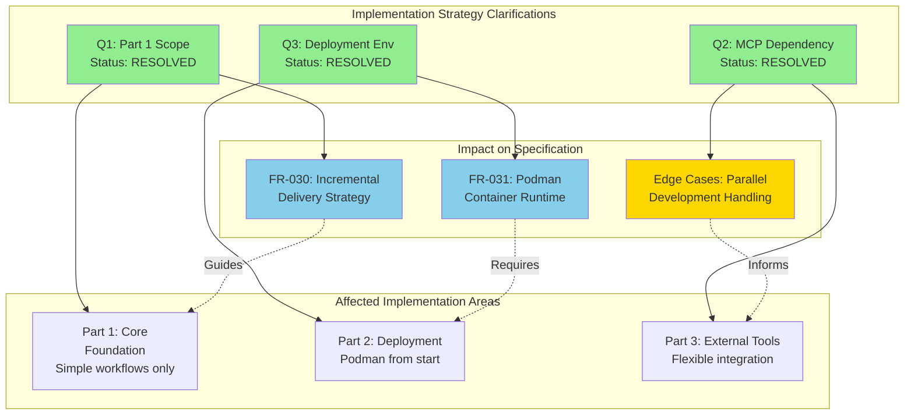

# Feature Specification: Workflow Engine Application

**Feature Branch**: `002-build-the-workflow-engine`
**Created**: 2025-09-25
**Status**: Draft
**Input**: User description: "Build an application to enable me to execute and manage dynamic workflows, comprised of agentic and non-agentic tasks. Use the contents of 'Feature Description.md' for the full feature description. This works alongside the Nexus service (spec 001), which will output a workflow dynamically which must be executable by this workflow engine"

## Execution Flow (main)
```
1. Parse user description from Input
   ✓ Feature description parsed: workflow engine for agentic and non-agentic tasks
2. Extract key concepts from description
   ✓ Identified: workflow orchestration, human-in-the-loop, drag-and-drop designer, monitoring
3. For each unclear aspect:
   ✓ [NEEDS CLARIFICATION: Performance targets for concurrent workflows beyond 1000]
   ✓ [NEEDS CLARIFICATION: Specific enterprise connectors prioritization order]
4. Fill User Scenarios & Testing section
   ✓ User flows defined for workflow creation, execution, and monitoring
5. Generate Functional Requirements
   ✓ 20+ testable requirements covering workflow lifecycle and integration
6. Identify Key Entities
   ✓ Workflow, Activity, Execution, User, Connector entities defined
7. Run Review Checklist
   ✓ WARN "Spec has uncertainties around performance limits and connector priorities"
8. Return: SUCCESS (spec ready for planning)
```

---

##  Quick Guidelines
- Focus on WHAT users need and WHY
- Avoid HOW to implement (no tech stack, APIs, code structure)
- Written for business stakeholders, not developers

---

## User Scenarios & Testing *(mandatory)*

### Primary User Story
As an automation professional, I want to create, execute, and monitor complex workflows that combine AI agents, traditional automation tools, and human decision points, so that I can orchestrate end-to-end business processes with appropriate oversight and governance controls.

### Acceptance Scenarios
1. **Given** I am a non-technical user with access to the platform, **When** I create a simple workflow using the drag-and-drop designer *(future feature - Part 1 validates via REST API)* and launch it, **Then** I should complete this process within 30 minutes and see real-time execution status
2. **Given** I have a workflow that requires human approval, **When** the workflow reaches the approval step, **Then** the system should pause execution, notify the designated approver through the user interface, and wait for human approval.
3. **Given** I am using the Nexus service to generate a workflow, **When** Nexus outputs a YAML workflow definition which is accepted by the user**Then** the workflow engine should automatically validate and execute/save/schedule the workflow without manual intervention
4. **Given** I am monitoring multiple concurrent workflows, **When** I access the unified control plane, **Then** I should see live status of all workflows
5. **Given** I need to integrate with enterprise systems, **When** I create an AI agent, **Then** I should be able to integrate with agentic external tool servers in a standard fashion.
6. **Given** a workflow fails during execution, **When** the system encounters the failure, **Then** it should automatically retry according to defined policies and maintain execution state for recovery

### Edge Cases
- What happens when a workflow has been running for an extended period and the system needs to restart? (The workflow will maintain its status and resume its progress when an available worker comes back online)
- How does the system handle concurrent modifications to the same workflow definition? (System rejects conflicting changes with error message)
- What occurs when a human-in-the-loop step times out without response? (System provides configurable timeout and retry options)
- How does the system manage workflows when external enterprise systems become unavailable? (System retries with exponential backoff)
- What happens when the maximum concurrent automation job limit is exceeded? (System alerts administrators and continues best-effort)
- How does the system handle MCP Server Integration feature (spec 001) being partially implemented during parallel development with uncertain timing? (System design allows flexible integration with available basic implementation and iterates as both features evolve together; Part 3 timing may adjust based on spec 001 readiness)

## Requirements *(mandatory)*

### Functional Requirements
- **FR-001**: System MUST allow users to create, read, update, and delete workflows
- **FR-002**: System MUST accept workflow definitions in YAML format
- **FR-003**: System MUST validate workflow definitions against a defined versioned schema before execution
- **FR-004**: System MUST support both sequential and parallel execution of workflow activities
- **FR-005**: System MUST support conditional branching within workflows based on activity outcomes or user inputs
- **FR-006**: System MUST implement human-in-the-loop capabilities at any point in a workflow
- **FR-007**: System MUST provide role-based access control for workflow creation, modification, and execution *(Implementation: Future Work - see Future Work section)*
- **FR-008**: System MUST support workflow versioning to track changes over time
- **FR-009**: System MUST allow users to pause, resume, cancel, and terminate active workflow executions
- **FR-010**: System MUST provide real-time monitoring and status updates for all workflow executions
- **FR-011**: System MUST maintain comprehensive audit logs of all workflow activities and user actions
- **FR-012**: System MUST support scheduled workflow execution (manual, continuous, time-based triggers, and event-driven triggers)
- **FR-013**: System MUST provide retry mechanisms for failed workflow activities
- **FR-014**: System MUST maintain workflow execution state for recovery after system failures
- **FR-015**: System MUST must be able to scale to handle increased load of automation jobs
- **FR-016**: System MUST provide a unified dashboard for monitoring workflows across different domains *(Implementation: Future Work - UI development deferred)*
- **FR-017**: System MUST generate compliance and usage reports within 5 minutes *(Implementation: Part 4 - Audit Logging & Observability)*
- **FR-018**: System MUST apply consistent governance policies across different business domains
- **FR-019**: System MUST provide REST API endpoints for all workflow management operations
- **FR-020**: Users MUST be able to approve or reject human-in-the-loop requests through conversational or visual interfaces
- **FR-021**: System MUST notify users when workflows require human intervention
- **FR-022**: System MUST allow users to configure timeout and retry behavior for human-in-the-loop steps
- **FR-023**: System MUST allow customization of workflows through both UI and chat interfaces *(Implementation: Future Work - UI/chat interfaces deferred)*
- **FR-024**: System MUST provide detailed execution history and logs for individual workflow activities
- **FR-025**: System MUST support connectors for external agentic tool servers such as MCPs and traditional enterprise systems
- **FR-026**: System MUST support distributed execution across multiple nodes
- **FR-027**: System MUST provide configurable data retention periods for workflow execution data and logs with system defaults
- **FR-028**: System MUST reject conflicting changes when multiple users attempt to modify the same workflow simultaneously
- **FR-029**: System MUST retry failed external system connections with exponential backoff strategy
- **FR-030**: System MUST deliver working end-to-end execution for simple workflows in initial release, with advanced features (approvals, external tools, scheduling) delivered incrementally in subsequent releases
- **FR-031**: System MUST use Podman container runtime and podman-compose for container orchestration in development and deployment environments

## Clarifications

### Session 2025-09-25
- Q: When a human approval step times out without response, what should the system do? → A: User configurable timeout behavior
- Q: What types of external systems should connectors support? → A: External agentic tool servers such as MCPs
- Q: When the system approaches or exceeds concurrent automation job limit, what should happen? → A: Alert administrators and continue best-effort
- Q: How long should the system retain workflow execution data and logs? → A: Configurable with a default
- Q: When multiple users attempt to modify the same workflow simultaneously, how should conflicts be resolved? → A: Reject conflicting changes with error message
- Q: When external enterprise systems become unavailable during workflow execution, what should happen? → A: Retry with exponential backoff
- Q: What is the behavior if an approval is rejected? → A: The workflow should define how to respond to the rejection via the rejection path
- Q: What happens to workflows when they are updated? → A: The system should ask the user for expected behaviors, continue, terminate, or restart the running workflows.

### Session 2025-10-09
- Q: Should Part 1 deliver a complete working end-to-end workflow execution or just the foundational infrastructure pieces? → A: Hybrid: Part 1 delivers working execution for simple workflows; advanced features in later parts
- Q: For Part 3 Ticket 9 (External Tool Integration), what is the expected readiness status of the MCP Server Integration and Tool Management feature (spec 001) dependency? → A: Basic implementation expected to be available; however, parallel development in chunks means exact timing is uncertain at this point
- Q: For Part 1 development and testing, what is the required deployment environment? → A: Podman containers required from start using podman-compose (not Docker)

### Clarification Process Visualization



### Key Entities *(include if feature involves data)*
- **Workflow**: Represents a complete automation process with multiple activities, including metadata, version information, schedule, and execution parameters
- **Activity**: Individual tasks within a workflow that can be agentic (AI-driven), non-agentic (traditional automation), or human-interactive
- **Execution**: Runtime instance of a workflow with current state, execution history, logs, and status information
- **User**: Platform users with different roles (creator, approver, administrator) and associated permissions
- **Connector**: References to external agentic tool servers (MCP servers) defined in the MCP Server Integration and Tool Management feature, enabling workflow activities to invoke external tools and services
- **Approval**: Human-in-the-loop decision points that can pause workflow execution pending user input

---

## Future Work

This work will be addressed in more detail in another spec/plan

- Authorization
- RBAC
- Handling of credentials
- Running activities in a sandboxed environment
- Scalability
- Performance
- Import/Export workflows
- Dry Run

---

## Review & Acceptance Checklist
*GATE: Automated checks run during main() execution*

### Content Quality
- [x] No implementation details (languages, frameworks, APIs)
- [x] Focused on user value and business needs
- [x] Written for non-technical stakeholders
- [x] All mandatory sections completed

### Requirement Completeness
- [x] No [NEEDS CLARIFICATION] markers remain
- [x] Requirements are testable and unambiguous
- [x] Success criteria are measurable
- [x] Scope is clearly bounded
- [x] Dependencies and assumptions identified

---

## Execution Status
*Updated by main() during processing*

- [x] User description parsed
- [x] Key concepts extracted
- [x] Ambiguities marked
- [x] User scenarios defined
- [x] Requirements generated
- [x] Entities identified
- [x] Review checklist passed

---
