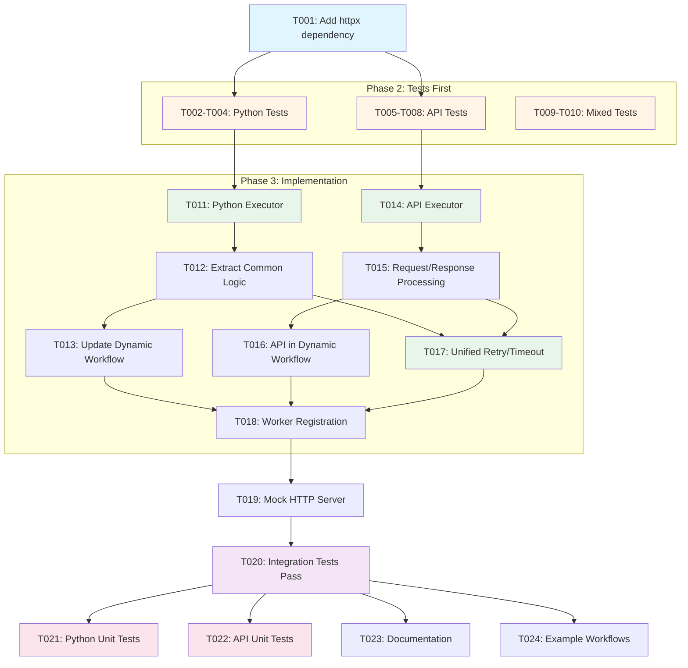

# Tasks: YAML Workflow Execution Engine - Additional Activity Types

**Ticket**: YAML Workflow Execution Engine - Additional Activity Types (5 Story Points)
**Epic**: [AAP-54306](AAP-54306)
**Input**: `/specs/003-workflow-engine/jira-issues.md` (lines 141-160)

## Overview

Extend the workflow execution engine to support additional activity types beyond bash scripts. This ticket adds Python script activities and REST API activities, building on the foundation established in the bash script activities ticket.

**Prerequisites**:
- Bash script activities implementation complete (tasks-yaml-bash-execution.md)
- YAML parser and dynamic workflow engine in place
- Temporal worker service operational

**Tech Stack** (from plan.md):
- Python 3.12+
- Temporal Python SDK (already installed)
- httpx (for async HTTP requests)
- PyYAML (already installed)
- pytest + pytest-asyncio

**Source Directory**: `src/nexus/api/`

## Phase 1: Setup & Dependencies

- [x] **T001** Add httpx to pyproject.toml dependencies
  - File: `pyproject.toml`
  - Add: `httpx` to dependencies list for async HTTP requests
  - Run: `uv sync` to install
  - **Status**: ✅ httpx already present in dependencies

## Phase 2: Tests First (TDD) ⚠️ MUST COMPLETE BEFORE PHASE 3

**CRITICAL: These tests MUST be written and MUST FAIL before ANY implementation**

### Python Script Activity Tests

- [x] **T002 [P]** Integration test: Simple Python script execution
  - File: `tests/integration/workflow/test_python_script_execution.py`
  - Test: Execute workflow with Python script activity (executor: script, language: python)
  - YAML: Simple Python script that prints JSON output
  - Verify: Script executes, stdout captured as JSON, ActivityExecution created
  - Must fail initially (no Python executor exists yet)

- [x] **T003 [P]** Integration test: Python script with input parameters
  - File: `tests/integration/workflow/test_python_script_execution.py` (extend T002)
  - Test: Python script that reads from inputs and produces outputs
  - YAML: Script receives ${input.value}, performs calculation, returns result
  - Verify: Input passed correctly, output parsed and available for next activity
  - Must fail initially

- [x] **T004 [P]** Integration test: Python script with error handling
  - File: `tests/integration/workflow/test_python_script_execution.py` (extend T002)
  - Test: Python script that raises exception, verify retry behavior
  - YAML: Script with retry policy (maxAttempts: 3)
  - Verify: Retry count incremented, error_details captured
  - Must fail initially

### REST API Activity Tests

- [x] **T005 [P]** Integration test: Simple HTTP GET request
  - File: `tests/integration/workflow/test_api_activity_execution.py`
  - Test: Execute workflow with API activity (executor: api, method: GET)
  - Setup: Mock HTTP server returning JSON response
  - Verify: Request made, response captured in activity output
  - Must fail initially (no API executor exists yet)

- [x] **T006 [P]** Integration test: HTTP POST with request body
  - File: `tests/integration/workflow/test_api_activity_execution.py` (extend T005)
  - Test: POST request with JSON body and headers
  - YAML: API activity with body: ${input.data}, headers configuration
  - Verify: Request body sent correctly, response status and body captured
  - Must fail initially

- [x] **T007 [P]** Integration test: API request with authentication
  - File: `tests/integration/workflow/test_api_activity_execution.py` (extend T005)
  - Test: API request with Authorization header from inputs
  - YAML: headers.Authorization: ${input.apiToken}
  - Verify: Token passed in header, authenticated request succeeds
  - Must fail initially

- [x] **T008 [P]** Integration test: API timeout and retry
  - File: `tests/integration/workflow/test_api_activity_execution.py` (extend T005)
  - Test: API request with timeout and exponential backoff retry
  - Setup: Mock server with delayed responses
  - Verify: Timeout triggers retry, backoff strategy applied
  - Must fail initially

### Cross-Activity Type Integration Tests

- [x] **T009 [P]** Integration test: Mixed activity types workflow
  - File: `tests/integration/workflow/test_mixed_activity_types.py`
  - Test: Workflow with bash → python → api activities in sequence
  - YAML: Data flows between different executor types
  - Verify: All activity types execute, data passes correctly
  - Must fail initially

- [x] **T010 [P]** Integration test: Parallel execution with different executors
  - File: `tests/integration/workflow/test_mixed_activity_types.py` (extend T009)
  - Test: Parallel branches with bash, python, and api activities
  - YAML: activity.type="parallel" with mixed executor branches
  - Verify: All execute concurrently, results aggregated
  - Must fail initially

## Phase 3: Core Implementation (ONLY after tests are failing)

**Architecture Reminder**: Follow DRY principle, extract common retry/timeout logic

### Python Script Activity Implementation

- [x] **T011 [P]** Create Python script activity executor
  - File: `src/nexus/api/workflows/activities/script_activity.py` (extend existing)
  - Implement: `async def execute_python_script(script: str, inputs: dict) -> dict`
  - Use: `@activity.defn` decorator for Temporal activity
  - Execute: Python code using asyncio.create_subprocess_exec with python interpreter
  - Capture: stdout, stderr, return code (same as bash executor)
  - Parse: JSON output from stdout as activity outputs
  - Error handling: Raise ScriptExecutionError on non-zero exit or invalid JSON
  - Share: Common subprocess execution logic with bash executor (DRY)

- [x] **T012** Extract common script execution logic
  - File: `src/nexus/api/workflows/activities/script_activity.py` (refactor)
  - Implement: `async def _execute_script_common(command: list, script: str, inputs: dict) -> dict`
  - Extract: Common subprocess creation, timeout, output capture logic
  - Use: Called by both `execute_bash_script` and `execute_python_script`
  - Support: Timeout configuration, environment variables from inputs
  - Return: Standardized output format for all script types

- [x] **T013** Add Python script support to dynamic workflow
  - File: `src/nexus/api/workflows/dynamic_workflow.py` (extend)
  - Update: `_execute_task_activity()` to route language: python to execute_python_script
  - Logic: if config.language == "python" → execute_python_script, else → execute_bash_script
  - Maintain: Same retry policy, timeout, input mapping for both languages
  - Register: execute_python_script activity with Temporal worker

### REST API Activity Implementation

- [x] **T014 [P]** Create API activity executor
  - File: `src/nexus/api/workflows/activities/api_activity.py`
  - Implement: `async def execute_api_request(config: dict, inputs: dict) -> dict`
  - Use: `@activity.defn` decorator for Temporal activity
  - Execute: HTTP requests using httpx.AsyncClient
  - Support: All methods (GET, POST, PUT, PATCH, DELETE)
  - Support: Request body, headers, query parameters from config and inputs
  - Return: {"status_code": int, "headers": dict, "body": dict/str, "elapsed_ms": float}
  - Error handling: Raise APIExecutionError on network/HTTP errors with details

- [x] **T015** Add request/response processing to API executor
  - File: `src/nexus/api/workflows/activities/api_activity.py` (extend T014)
  - Implement: Request body resolution from inputs (${input.data} → actual data)
  - Implement: Header resolution (${input.token} → Bearer token)
  - Implement: Query parameter construction from config.queryParams
  - Parse: JSON response bodies automatically, preserve text for non-JSON
  - Support: Response output extraction via config.outputs (e.g., outputs.userId: $.data.id)

- [x] **T016** Add API activity support to dynamic workflow
  - File: `src/nexus/api/workflows/dynamic_workflow.py` (extend)
  - Update: `_execute_task_activity()` to route executor: api to execute_api_request
  - Logic: if task.executor == "api" → execute_api_request with config and inputs
  - Apply: Same retry policy and timeout handling as script activities
  - Register: execute_api_request activity with Temporal worker

### Common Retry/Timeout Logic

- [x] **T017** Extract unified retry/timeout configuration
  - File: `src/nexus/api/workflows/activities/common.py` (new)
  - Implement: `build_retry_policy(retry_config: dict) -> RetryPolicy`
  - Support: All backoff strategies (exponential, fixed, linear)
  - Implement: `parse_timeout(timeout_str: str) -> timedelta`
  - Use: Shared by bash, python, and api activities (DRY principle)
  - Ensure: Consistent retry behavior across all activity types

- [x] **T018** Update worker registration for all activity types
  - File: `src/nexus/api/services/temporal_worker.py` (extend)
  - Register: execute_python_script and execute_api_request activities
  - Update: Worker to include all three executors (bash, python, api)
  - Verify: All activities available on same task queue
  - Support: Hot reload during development (if applicable)

## Phase 4: Integration & Testing

- [x] **T019** Set up mock HTTP server for API tests
  - File: `tests/integration/workflow/conftest.py` (extend)
  - Add: pytest-httpserver or similar for mocking HTTP endpoints
  - Implement: Fixtures for GET, POST, timeout scenarios
  - Provide: mock_api_server fixture with configurable responses
  - Support: Authentication headers, request body validation

- [x] **T020** Verify all integration tests pass
  - Run: `pytest tests/integration/workflow/test_python_script_execution.py -v`
  - Run: `pytest tests/integration/workflow/test_api_activity_execution.py -v`
  - Run: `pytest tests/integration/workflow/test_mixed_activity_types.py -v`
  - Expected: 10 new integration tests passing (T002-T010)
  - Coverage: All Python and API activity scenarios

## Phase 5: Polish & Documentation

- [x] **T021 [P]** Add unit tests for Python script executor
  - File: `tests/unit/workflows/activities/test_script_activity.py` (extend)
  - Tests: Python script execution, input parameters, output parsing
  - Tests: Error handling, timeout, invalid JSON output
  - Tests: Common script execution logic (_execute_script_common)
  - Coverage: 80%+ on Python executor code paths

- [x] **T022 [P]** Add unit tests for API executor
  - File: `tests/unit/workflows/activities/test_api_activity.py`
  - Tests: All HTTP methods, request body/headers/query params
  - Tests: JSON response parsing, error responses
  - Tests: Timeout handling, retry behavior
  - Tests: Authentication header resolution
  - Coverage: 80%+ on API executor code

- [x] **T023** Update workflow engine documentation
  - File: `specs/003-workflow-engine/implementation-notes.md` (extend)
  - Document: Python script activity configuration and examples
  - Document: API activity configuration (method, url, headers, body)
  - Document: Common retry/timeout logic architecture
  - Include: Complete YAML examples for Python and API activities

- [x] **T024** Create example workflows for new activity types
  - File: `tests/integration/workflow/examples/python-data-processing.yaml`
  - Example: Python script that processes JSON data
  - File: `tests/integration/workflow/examples/api-integration.yaml`
  - Example: API workflow that fetches data and processes it
  - File: `tests/integration/workflow/examples/multi-executor.yaml`
  - Example: Workflow combining bash, python, and api activities

## Dependencies



**Dependency Notes**:
```
Setup (T001) → Tests (T002-T010) → Implementation (T011-T018)

T011 (Python Executor) → T012 (Extract Common)
T012 (Common Logic) → T013 (Dynamic Workflow)
T014 (API Executor) → T015 (Request Processing)
T015 (Request Processing) → T016 (Dynamic Workflow)
[T012, T015] → T017 (Unified Retry/Timeout)
[T013, T016, T017] → T018 (Worker Registration)

Implementation (T018) → Integration Tests (T019-T020)
Integration Tests (T020) → Polish (T021-T024)
```

## Parallel Execution Examples

### Launch all test writing tasks together (T002-T010):
```bash
# Phase 2: All test files are independent
# Python script tests
Task: "Integration test: Simple Python script execution in tests/integration/workflow/test_python_script_execution.py"
# API activity tests
Task: "Integration test: Simple HTTP GET request in tests/integration/workflow/test_api_activity_execution.py"
# Mixed activity tests
Task: "Integration test: Mixed activity types workflow in tests/integration/workflow/test_mixed_activity_types.py"
```

### Launch parallel implementation tasks (T011, T014):
```bash
# These create different files and can run simultaneously
Task: "Create Python script activity executor in src/nexus/api/workflows/activities/script_activity.py"
Task: "Create API activity executor in src/nexus/api/workflows/activities/api_activity.py"
```

### Launch unit test tasks (T021-T022):
```bash
# Different test files, can run in parallel
Task: "Add unit tests for Python script executor in tests/unit/workflows/activities/test_script_activity.py"
Task: "Add unit tests for API executor in tests/unit/workflows/activities/test_api_activity.py"
```

## Notes

- **[P] tasks** = different files, no dependencies, can run in parallel
- **TDD approach**: All tests (T002-T010) MUST fail before starting implementation
- **DRY principle**: Extract common logic for script execution and retry/timeout handling
- **Consistent interfaces**: All executors return standardized output format
- **Backward compatibility**: Bash script activities continue to work unchanged
- **Activity registration**: All executors registered with same Temporal worker
- **Error handling**: Use consistent error types and retry strategies across all executors

## Validation Checklist

Before marking this ticket complete:

- [ ] All 10 integration tests (T002-T010) pass
- [ ] Python script activities execute correctly with JSON output parsing
- [ ] REST API activities make HTTP requests and capture responses
- [ ] All HTTP methods (GET, POST, PUT, PATCH, DELETE) supported
- [ ] Request bodies, headers, and query parameters work correctly
- [ ] Authentication headers resolve from inputs
- [ ] Retry/timeout logic shared across all activity types (DRY)
- [ ] Mixed workflows (bash + python + api) execute successfully
- [ ] Parallel execution works with different executor types
- [ ] Unit tests pass with 80%+ coverage on new code
- [ ] Documentation includes examples for all new activity types
- [ ] Example workflows demonstrate Python and API usage

## File Structure After Completion

```
src/nexus/api/
  workflows/
    activities/
      script_activity.py              # Extended (T011-T012) - bash + python
      api_activity.py                 # New (T014-T015) - HTTP requests
      common.py                       # New (T017) - shared retry/timeout
    dynamic_workflow.py               # Extended (T013, T016) - route to executors
  services/
    temporal_worker.py                # Extended (T018) - register all activities

tests/
  integration/
    workflow/
      test_python_script_execution.py # New (T002-T004) - Python tests
      test_api_activity_execution.py  # New (T005-T008) - API tests
      test_mixed_activity_types.py    # New (T009-T010) - Mixed executor tests
      examples/
        python-data-processing.yaml   # New (T024) - Python example
        api-integration.yaml          # New (T024) - API example
        multi-executor.yaml           # New (T024) - Mixed example
      conftest.py                     # Extended (T019) - mock HTTP server
  unit/
    workflows/
      activities/
        test_script_activity.py       # Extended (T021) - Python tests
        test_api_activity.py          # New (T022) - API unit tests

specs/003-workflow-engine/
  implementation-notes.md             # Extended (T023) - Python + API docs
```

## Estimated Effort: 5 Story Points

- Setup: 0.25 points (T001)
- Tests: 1.5 points (T002-T010)
- Core Implementation: 2.5 points (T011-T018)
- Integration & Polish: 0.75 points (T019-T024)

## Acceptance Criteria

From jira-issues.md (lines 154-159):

- ✅ Python script activities execute correctly
- ✅ REST API activities execute HTTP requests correctly
- ✅ All activity types share common retry/timeout logic
- ✅ Integration tests cover all activity types and features
- ✅ 80%+ test coverage
