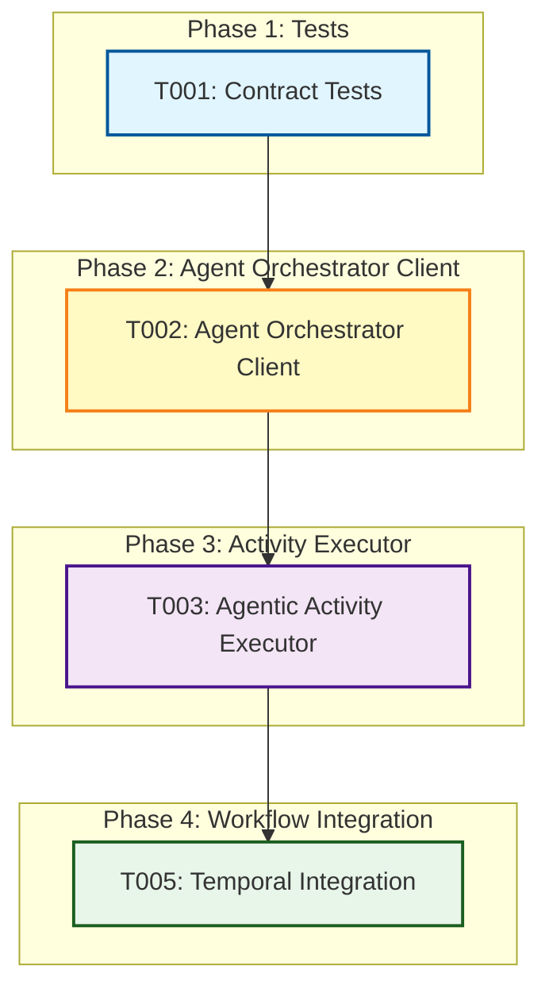

# Tasks: Agentic Activity Integration

**Input**: Design documents from `/specs/003-workflow-engine/`
**Prerequisites**: plan.md, research.md, data-model.md, contracts/, quickstart.md
**Ticket**: AAP-55512 - Agentic Activity Integration
**Story Points**: 5
**Status**: ✅ Completed

## Ticket Context

This ticket integrates the **Workflow Engine** (spec 003) with the **Agent Orchestrator** (spec 002) to enable agentic (AI-driven) activity execution within workflows.

**Scope**:
- ✅ Agentic activities via Agent Orchestrator integration
- ✅ WebSocket streaming for real-time progress
- ✅ Basic error handling with try/except and error reporting
- ✅ Connection retry logic in Agent Orchestrator client
- ✅ Temporal-based activity retry (configured via YAML)
- ❌ Connector activities (separate ticket)
- ❌ Activity Type Discovery API (separate ticket - 3 story points)
- ❌ Advanced error classification and custom retry strategies (not implemented)

**Reuses from Existing Code**:
- Agent Orchestrator API (spec 002): async invocation, WebSocket streaming

**Creates**:
- Agent Orchestrator client with connection retry
- Agentic activity executor for Temporal workflows
- Basic error handling and reporting
- Integration with Temporal's retry capabilities

## Task Dependencies Visualization



## Phase 1: Contract Tests (TDD)

- [X] **T001** Contract tests in `tests/contract/test_agentic_activity_api.py`
  - Test agentic activity calls Agent Orchestrator and returns results
  - Test parameter mapping from workflow YAML to Agent Orchestrator
  - Test error handling when Agent Orchestrator is unavailable
  - Test WebSocket progress streaming
  - **File**: tests/contract/test_agentic_activity_api.py
  - **Status**: ✅ Completed

## Phase 2: Agent Orchestrator Client

- [X] **T002** Agent Orchestrator client in `src/nexus/api/services/agent_orchestrator_client.py`
  - Implement invoke_agent(prompt, model, input_data) -> invocation_id
  - Implement stream_progress(invocation_id) -> AsyncIterator[ProgressEvent]
  - Use httpx for async HTTP requests
  - Use websockets library for WebSocket streaming
  - Handle WebSocket reconnection and session management
  - Map Agent Orchestrator events to ActivityExecution updates
  - Include retry logic with exponential backoff for connection failures
  - Add structured logging with correlation IDs
  - **File**: src/nexus/api/services/agent_orchestrator_client.py
  - **Dependencies**: T001
  - **Status**: ✅ Completed
  - **Note**: Interactive features (send_message, cancel_invocation) deferred to future implementation

## Phase 3: Activity Executor

- [X] **T003** Agentic activity executor in `src/nexus/workflows/activities/agentic_activity.py`
  - Implement execute_agentic_activity(activity_config, input_data)
  - Extract agent URI and model from activity config
  - Connect to Agent Orchestrator via AgentOrchestratorClient (T002)
  - Stream progress and update ActivityExecution status via callbacks
  - Transform Agent Orchestrator response to workflow output format
  - Catch errors and return error status in result dict
  - Wrap exceptions in AgenticActivityError for proper error reporting
  - **File**: src/nexus/workflows/activities/agentic_activity.py
  - **Dependencies**: T002
  - **Status**: ✅ Completed

## Phase 4: Workflow Integration

- [X] **T005** Temporal integration in `src/nexus/workflows/dynamic_workflow.py`
  - Update execute_activity() to handle executor: agentic
  - Route agentic executor to AgenticActivityExecutor (T003)
  - Pass activity config and input_data to executor
  - Capture executor response in ActivityExecution.output_data
  - Handle executor errors and update ActivityExecution.error_details
  - Respect activity timeout and retry configuration from YAML
  - Track progress for long-running agentic activities
  - **File**: src/nexus/workflows/dynamic_workflow.py
  - **Dependencies**: T003
  - **Status**: ✅ Completed

## Dependencies Summary

**Completed Path**:
1. ✅ T001 (Tests) → T002 (Agent Orchestrator Client) → T003 (Agentic Executor) → T005 (Temporal Integration)

## Integration Architecture

```
Workflow Engine (spec 003)
    ↓
Agentic Activity Executor
    └─→ Agent Orchestrator Client
           ├─→ POST /invoke (async invocation)
           ├─→ WS /ws/invoke/{id} (progress streaming)
           ├─→ POST /invoke/{id}/message (interactive messaging)
           └─→ POST /invoke/{id}/cancel (cancellation)

Agent Orchestrator (spec 002) - EXTERNAL
    ├─→ Async-only API
    ├─→ WebSocket progress streaming
    ├─→ Interactive messaging support
    └─→ Workflow generation capabilities
```

## Agent Orchestrator Integration Flow

1. Workflow engine starts agentic activity
2. AgenticActivityExecutor calls Agent Orchestrator POST /invoke
3. Agent Orchestrator returns invocation_id immediately (async-only)
4. AgenticActivityExecutor connects to WS /ws/invoke/{invocation_id}
5. Progress events stream via WebSocket
6. ActivityExecution status updated in real-time
7. Agent Orchestrator sends final result via WebSocket
8. AgenticActivityExecutor maps result to workflow output_data
9. Workflow continues to next activity

## Notes

- **Agent Orchestrator is async-only**: No sync invocation mode
- **WebSocket for progress**: Required for long-running agentic tasks
- **Error handling**: Basic try/except with error reporting, not comprehensive error classification
- **Retry logic**: Connection retries in client, activity retries handled by Temporal
- **Activity Type Discovery API**: Handled in separate 3-point ticket
- Follow TDD: T001 must fail first before implementation
- Structured logging with correlation IDs throughout
- Handle WebSocket reconnection gracefully

## Changes Made

- ✅ Implemented Agent Orchestrator client with async/WebSocket support and connection retry
- ✅ Created agentic activity executor with basic error handling
- ✅ Integrated with Temporal workflows (uses Temporal's native retry)
- ✅ Updated all tests
- ✅ Updated YAML examples
- ✅ All code passes `make format` and `make typecheck`

## Error Handling Implementation

**What We Have**:
- Basic try/except blocks around Agent Orchestrator invocation
- Errors wrapped in `AgenticActivityError` with context
- Error status returned in result dict: `{"status": "error", "error": "...", "invocation_id": "..."}`
- Connection retry with exponential backoff in Agent Orchestrator client
- Temporal handles activity-level retries based on YAML `retry_policy`

**What We Don't Have**:
- ❌ Dedicated error handler module
- ❌ Dedicated retry manager module
- ❌ Error classification (transient vs permanent)
- ❌ Custom retry strategies beyond Temporal's built-in capabilities

## Validation Checklist

- [x] Focuses only on agentic activities (no connectors)
- [x] Activity Type Discovery API excluded (separate ticket)
- [x] Tests come before implementation
- [x] File paths specified for all tasks
- [x] Agent Orchestrator async API integration defined
- [x] WebSocket streaming for progress defined
- [x] Structured logging with correlation IDs
- [x] Code formatting and type checking passes

## Files Modified

**Source Files**:
- src/nexus/workflows/activities/agentic_activity.py
- src/nexus/api/services/agent_orchestrator_client.py
- src/nexus/workflows/dynamic_workflow.py

**Test Files**:
- tests/contract/test_agentic_activity_api.py
- tests/integration/test_agentic_activity_integration.py

**Example Files**:
- tests/integration/workflow/examples/agentic/simple-research.yaml
- tests/integration/workflow/examples/agentic/hybrid-workflow.yaml
- tests/integration/workflow/examples/agentic/multi-agent-pipeline.yaml
- tests/integration/workflow/examples/agentic/parallel-research.yaml
- tests/integration/workflow/examples/agentic/conditional-agent-routing.yaml
