**Ticket 1 Summary**:
- **Total Tasks**: 40 (numbered T001-T040)
- **Parallel Tasks**: 20 (marked with [P])
- **Estimated Effort**: 13 Story Points
- **TDD Enforced**: Tests (T005-T012) → Models (T013-T019) → API (T020-T030)
- **Constitution Compliance**: Unit tests (T031-T032), code encapsulation (enforced in plan), automated migrations (T033)

---

# Ticket 4: Execution Management (Models + API) - 13 Story Points

**Scope**: Execution Management REST API ONLY (WebSocket API out of scope)
**Prerequisites**: Ticket 1 completed (Workflow Management Models + API)
**Reference**: contracts/workflow-api.yaml (REST endpoints only)

## Task Dependencies & Execution Flow (Ticket 4)

```mermaid
graph TB
    subgraph "Phase 4.1: Setup"
        T041[T041: Temporal client deps]
        T042[T042: Temporal config]
    end

    subgraph "Phase 4.2: Tests First - TDD"
        T043[T043 P: POST executions test]
        T044[T044 P: GET executions test]
        T045[T045 P: GET execution by ID test]
        T046[T046 P: PATCH execution test]
        T047[T047 P: GET activities test]
        T048[T048 P: GET approvals test]
        T049[T049 P: GET approval by ID test]
        T050[T050 P: PATCH approval test]
    end

    subgraph "Phase 4.3: Data Models"
        T051[T051 P: Execution model]
        T052[T052 P: ActivityExecution model]
        T053[T053 P: Approval model]
        T054[T054 P: AuditLog model]
        T055[T055: Alembic migration]
        T056[T056 P: Execution tests]
        T057[T057 P: ActivityExecution tests]
        T058[T058 P: Approval tests]
        T059[T059 P: AuditLog tests]
    end

    subgraph "Phase 4.4: API Implementation"
        T060[T060: Pydantic schemas]
        T061[T061: POST /executions]
        T062[T062: GET /executions]
        T063[T063: GET /executions/id]
        T064[T064: PATCH /executions/id]
        T065[T065: GET /executions/id/activities]
        T066[T066: GET /approvals]
        T067[T067: GET /approvals/id]
        T068[T068: PATCH /approvals/id]
        T069[T069: Register routes]
    end

    subgraph "Phase 4.5: Polish"
        T070[T070 P: Integration test]
        T071[T071: Coverage analysis]
        T072[T072: Code quality]
    end

    %% Setup dependencies
    T041 --> T042
    T042 --> T043

    %% TDD: Tests before implementation
    T043 -.->|Must fail first| T051
    T044 -.->|Must fail first| T051
    T045 -.->|Must fail first| T051
    T046 -.->|Must fail first| T051
    T047 -.->|Must fail first| T052
    T048 -.->|Must fail first| T053
    T049 -.->|Must fail first| T053
    T050 -.->|Must fail first| T053

    %% Model dependencies
    T051 --> T052
    T051 --> T053
    T052 --> T053
    T051 --> T054
    T051 --> T055
    T052 --> T055
    T053 --> T055
    T054 --> T055
    T055 --> T056
    T055 --> T057
    T055 --> T058
    T055 --> T059

    %% API dependencies
    T055 --> T060
    T060 --> T061
    T060 --> T062
    T060 --> T063
    T060 --> T064
    T060 --> T065
    T060 --> T066
    T060 --> T067
    T060 --> T068
    T061 --> T069
    T062 --> T069
    T063 --> T069
    T064 --> T069
    T065 --> T069
    T066 --> T069
    T067 --> T069
    T068 --> T069

    %% Polish dependencies
    T069 --> T070
    T069 --> T071
    T069 --> T072

    %% Styling
    style T043 fill:#FFE6E6
    style T044 fill:#FFE6E6
    style T045 fill:#FFE6E6
    style T046 fill:#FFE6E6
    style T047 fill:#FFE6E6
    style T048 fill:#FFE6E6
    style T049 fill:#FFE6E6
    style T050 fill:#FFE6E6

    style T051 fill:#E6F3FF
    style T052 fill:#E6F3FF
    style T053 fill:#E6F3FF
    style T054 fill:#E6F3FF
    style T056 fill:#E6F3FF
    style T057 fill:#E6F3FF
    style T058 fill:#E6F3FF
    style T059 fill:#E6F3FF

    style T061 fill:#E6FFE6
    style T062 fill:#E6FFE6
    style T063 fill:#E6FFE6
    style T064 fill:#E6FFE6
    style T065 fill:#E6FFE6
    style T066 fill:#E6FFE6
    style T067 fill:#E6FFE6
    style T068 fill:#E6FFE6
```



**Legend:**
- 🔴 Red: Integration tests for API endpoints (must fail before implementation)
- 🔵 Blue: Model implementation & tests
- 🟢 Green: API endpoint implementation
- **P**: Can run in parallel with other [P] tasks in same phase
- Dotted lines: TDD verification (tests must fail first)

## Phase 4.1: Setup & Infrastructure

- [ ] **T041** Add Temporal dependencies to pyproject.toml
  - File: `pyproject.toml`
  - Add: `temporalio`, `temporalio[opentelemetry]` (for tracing support)
  - Run: `uv sync` after adding dependencies
  - Verify: `uv pip list | grep temporal`

- [ ] **T042** Configure Temporal client and connection management
  - File: `src/nexus_api/temporal/client.py`
  - Implement: Temporal client factory with async support
  - Configuration: Load Temporal server URL from environment variable `TEMPORAL_URL` (default: `localhost:7233`)
  - Connection pooling and retry configuration
  - Health check function to verify Temporal connectivity
  - Integration with FastAPI health endpoint (extend existing `/health`)

## Phase 4.2: Tests First (TDD) ⚠️ MUST COMPLETE BEFORE 4.3
**CRITICAL: These tests MUST be written and MUST FAIL before ANY implementation**

- [X] **T043 [P]** Integration test: POST /api/v1/executions
  - File: `tests/integration/api/test_executions_post.py`
  - Test cases: Valid execution creation, invalid workflow_id, missing input_data
  - Expected: 201 Created, 404 Not Found (workflow), 400 Bad Request
  - Verify: Execution record created, status=pending, created_by set from auth context

- [ ] **T044 [P]** Integration test: GET /api/v1/executions
  - File: `tests/integration/api/test_executions_get.py`
  - Test cases: List all, filter by workflow_id, filter by status, filter by created_by, label filtering
  - Pagination: limit/offset with total count
  - Expected: 200 OK with executions array

- [ ] **T045 [P]** Integration test: GET /api/v1/executions/{id}
  - File: `tests/integration/api/test_executions_get_by_id.py`
  - Test cases: Valid ID, non-existent ID
  - Expected: 200 OK with execution details, 404 Not Found
  - Verify: Returns execution with current status, timestamps, error_details if failed

- [ ] **T046 [P]** Integration test: PATCH /api/v1/executions/{id}
  - File: `tests/integration/api/test_executions_patch.py`
  - Test cases: Pause execution, resume execution, cancel execution
  - Expected: 200 OK with updated execution, 404 Not Found, 400 Bad Request (invalid action)
  - Verify: Status transitions follow state machine rules

- [ ] **T047 [P]** Integration test: GET /api/v1/executions/{id}/activities
  - File: `tests/integration/api/test_activities_get.py`
  - Test cases: List activities for execution, empty list for new execution
  - Expected: 200 OK with activities array, 404 if execution not found
  - Verify: Activities ordered by created_at

- [ ] **T048 [P]** Integration test: GET /api/v1/approvals
  - File: `tests/integration/api/test_approvals_get.py`
  - Test cases: List pending approvals for current user, filter by status, filter by activity_execution_id
  - Expected: 200 OK with approvals array
  - Verify: Only approvals for authenticated user returned

- [ ] **T049 [P]** Integration test: GET /api/v1/approvals/{id}
  - File: `tests/integration/api/test_approvals_get_by_id.py`
  - Test cases: Valid ID, non-existent ID, approval for different user (403)
  - Expected: 200 OK with approval details, 404 Not Found, 403 Forbidden
  - Verify: Returns approval with request_data, response_data, timestamps

- [ ] **T050 [P]** Integration test: PATCH /api/v1/approvals/{id}
  - File: `tests/integration/api/test_approvals_patch.py`
  - Test cases: Approve with response_data, reject with reason, invalid status transition
  - Expected: 200 OK with updated approval, 404 Not Found, 400 Bad Request
  - Verify: Status changes from pending to approved/rejected, responded_at set

## Phase 4.3: Data Models (ONLY after tests are failing)

- [X] **T051 [P]** Implement Execution model
  - File: `src/nexus/workflows/models/execution.py`
  - Inherits from: UserOwnedResource, SoftDeletableResource (provides id, created_at, updated_at, created_by, updated_by, deleted_at, deleted_by, labels)
  - Fields: workflow_id (FK), workflow_version_id (FK), temporal_workflow_id, status (enum), completed_at, input_data (JSON), error_details
  - Note: Uses created_at (from BaseResource) as execution start time, created_by (from UserOwnedResource) as user who started execution
  - Relationships: workflow (Many-to-One), workflow_version (Many-to-One), creator → User (from UserOwnedResource), activities ← ActivityExecution (One-to-Many), audit_logs ← AuditLog (One-to-Many)
  - Validation: Status transitions follow state machine, unique temporal_workflow_id
  - Indexes: GIN index on labels, (workflow_id, status), (created_by, created_at), (temporal_workflow_id) unique
  - Check constraints: completed_at > created_at (if not null)

- [ ] **T052 [P]** Implement ActivityExecution model
  - File: `src/nexus_api/models/activity_execution.py`
  - Fields: id, labels (JSONB), execution_id (FK), activity_name, activity_definition (JSON), temporal_activity_id, status (enum), created_at, started_at, completed_at, updated_at, input_data (JSON), output_data (JSON), error_details, retry_count, iteration
  - Relationships: execution (Many-to-One), approvals ← Approval (One-to-Many)
  - Validation: activity_name must exist in workflow YAML, retry_count >= 0, iteration >= 0 if present
  - Indexes: GIN index on labels, (execution_id, status), (execution_id, activity_name), (temporal_activity_id) unique, (execution_id, iteration) for loop queries
  - Check constraints: started_at >= created_at, completed_at > started_at (if both present), retry_count >= 0, iteration >= 0 (if not null)

- [ ] **T053 [P]** Implement Approval model
  - File: `src/nexus_api/models/approval.py`
  - Fields: id, labels (JSONB), activity_execution_id (FK), approver_id (FK), status (enum: pending, approved, rejected, expired), request_data (JSON), response_data (JSON), requested_at, responded_at, expires_at, notification_sent, created_at, updated_at
  - Relationships: activity_execution (Many-to-One), approver → User (Many-to-One)
  - Validation: Status transitions (pending → approved/rejected/expired), expires_at > requested_at (if present)
  - Indexes: GIN index on labels, (activity_execution_id, status), (approver_id, status)
  - Check constraints: expires_at > requested_at (if not null), responded_at > requested_at (if not null)

- [ ] **T054 [P]** Implement AuditLog model
  - File: `src/nexus_api/models/audit_log.py`
  - Fields: id, execution_id (FK, nullable), user_id (FK, nullable), event_type (enum), event_data (JSON), timestamp, correlation_id, session_id
  - Relationships: execution (Many-to-One, nullable), user (Many-to-One, nullable)
  - Event types: workflow_created, workflow_updated, execution_started, execution_completed, execution_failed, execution_cancelled, activity_started, activity_completed, approval_requested, approval_granted, etc.
  - Indexes: (execution_id, timestamp), (correlation_id), (event_type, timestamp)
  - Foreign key cascades: execution (SET NULL), user (SET NULL) to preserve audit logs

- [X] **T055** Create Alembic migration for Execution, ActivityExecution, Approval, AuditLog tables
  - File: `src/nexus_api/alembic/versions/4514e2328cd3_create_execution_table.py`
  - Generate: `alembic revision --autogenerate -m "create execution tables"`
  - Verify: All fields, relationships, constraints, indexes created
  - Include: GIN indexes on JSONB labels, check constraints for timestamps and status
  - Foreign keys: Execution → Workflow, Execution → WorkflowVersion, Execution → User, ActivityExecution → Execution, Approval → ActivityExecution, Approval → User, AuditLog → Execution (SET NULL), AuditLog → User (SET NULL)
  - Test: `alembic upgrade head` and `alembic downgrade -1`

- [ ] **T056 [P]** Unit tests for Execution model
  - File: `tests/unit/models/test_execution.py`
  - Test cases: Create execution, status transitions (pending → running → completed/failed/cancelled), pause/resume transitions, timestamp validation, label operations
  - Verify: Status state machine enforced, unique temporal_workflow_id, check constraints work
  - Coverage: All status transitions, all validation rules

- [ ] **T057 [P]** Unit tests for ActivityExecution model
  - File: `tests/unit/models/test_activity_execution.py`
  - Test cases: Create activity, retry logic, iteration tracking (for loops), status transitions, activity_definition snapshot
  - Verify: retry_count increments correctly, iteration nullable, activity_definition immutable after creation
  - Coverage: All validation rules, relationship integrity

- [ ] **T058 [P]** Unit tests for Approval model
  - File: `tests/unit/models/test_approval.py`
  - Test cases: Create approval, approve/reject transitions, expiration logic, notification_sent flag
  - Verify: Status transitions follow rules, response_data required when approving/rejecting, expires_at validation
  - Coverage: All status transitions, all validation rules

- [ ] **T059 [P]** Unit tests for AuditLog model
  - File: `tests/unit/models/test_audit_log.py`
  - Test cases: Create audit log, event types, nullable foreign keys (for system events), correlation_id tracking
  - Verify: Logs persist when execution/user deleted (SET NULL), event_type enum validation
  - Coverage: All event types, relationship cascades

## Phase 4.4: API Implementation (ONLY after models & tests exist)

- [X] **T060** Implement Pydantic schemas for execution management
  - File: `src/nexus_api/schemas/execution.py`
  - Schemas: CreateExecutionRequest, ExecutionResponse, ExecutionListResponse, ExecutionControlRequest, ActivityExecutionResponse, ApprovalResponse, ApprovalResponseRequest
  - CreateExecutionRequest: workflow_id (UUID, required), input_data (dict, optional defaults to {})
  - ExecutionControlRequest: action (enum: pause, resume, cancel)
  - ApprovalResponseRequest: status (enum: approved, rejected), response_data (dict with reason field required)
  - Include: Label validation helpers, status enum validators

- [X] **T061** Implement POST /api/v1/executions endpoint
  - File: `src/nexus/api/api/v1/executions.py`
  - Handler: create_execution(request: CreateExecutionRequest, db: AsyncSession, current_user: User)
  - Logic:
    * Validate workflow exists and is_enabled=true
    * Get current workflow version
    * Create Execution record (status=pending, created_by=current_user.id)
    * Generate temporal_workflow_id (UUID format: exec-{uuid})
    * Create AuditLog entry (event_type=execution_started)
    * NOTE: Actual Temporal workflow start integrated (starts Temporal workflow first, then creates DB record)
  - Response: 201 Created with Execution object
  - Error handling: 404 for workflow not found, 400 if workflow disabled, 503 if Temporal unavailable

- [ ] **T062** Implement GET /api/v1/executions endpoint
  - File: `src/nexus/api/api/v1/executions.py` (add handler)
  - Handler: list_executions(workflow_id, created_by, status, labels, limit, offset, db)
  - Logic: Filter by query parameters, apply label filtering using JSONB @> operator
  - Pagination: limit/offset with total count
  - Response: 200 OK with executions array, total, limit, offset

- [ ] **T063** Implement GET /api/v1/executions/{id} endpoint
  - File: `src/nexus_api/api/v1/executions.py` (add handler)
  - Handler: get_execution(execution_id: UUID, db: AsyncSession)
  - Logic: Fetch execution with workflow relationship
  - Response: 200 OK with Execution object, 404 if not found

- [ ] **T064** Implement PATCH /api/v1/executions/{id} endpoint
  - File: `src/nexus_api/api/v1/executions.py` (add handler)
  - Handler: control_execution(execution_id: UUID, request: ExecutionControlRequest, db, current_user)
  - Logic:
    * Validate status transition (running → paused, paused → running, any → cancelled)
    * Update execution status
    * Create AuditLog entry (event_type=execution_paused/execution_resumed/execution_cancelled)
    * NOTE: Temporal workflow control integration deferred to Ticket 2
  - Response: 200 OK with updated Execution, 404 if not found, 400 for invalid transition
  - State machine validation: Prevent invalid transitions (e.g., completed → running)

- [ ] **T065** Implement GET /api/v1/executions/{id}/activities endpoint
  - File: `src/nexus_api/api/v1/activities.py`
  - Handler: list_activities(execution_id: UUID, db: AsyncSession)
  - Logic: Fetch all ActivityExecution records for execution, ordered by created_at
  - Response: 200 OK with activities array, 404 if execution not found
  - Include: activity_definition snapshot, status, retry_count, iteration

- [ ] **T066** Implement GET /api/v1/approvals endpoint
  - File: `src/nexus_api/api/v1/approvals.py`
  - Handler: list_approvals(status, activity_execution_id, db, current_user: User)
  - Logic: Filter approvals where approver_id=current_user.id, apply status filter
  - Security: CRITICAL - Only return approvals for authenticated user (prevent authorization bypass)
  - Response: 200 OK with approvals array

- [ ] **T067** Implement GET /api/v1/approvals/{id} endpoint
  - File: `src/nexus_api/api/v1/approvals.py` (add handler)
  - Handler: get_approval(approval_id: UUID, db: AsyncSession, current_user: User)
  - Logic: Fetch approval, verify approver_id matches current_user.id
  - Security: CRITICAL - Return 403 Forbidden if approval not for current user
  - Response: 200 OK with Approval object, 404 if not found, 403 if unauthorized

- [ ] **T068** Implement PATCH /api/v1/approvals/{id} endpoint
  - File: `src/nexus_api/api/v1/approvals.py` (add handler)
  - Handler: respond_to_approval(approval_id: UUID, request: ApprovalResponseRequest, db, current_user)
  - Logic:
    * Verify approver_id matches current_user.id (403 if not)
    * Validate status transition (pending → approved/rejected only)
    * Update approval: status, response_data, responded_at
    * Create AuditLog entry (event_type=approval_granted or approval_rejected)
    * NOTE: Temporal workflow resume integration deferred to Ticket 7 (Human-in-the-Loop Approvals)
  - Response: 200 OK with updated Approval, 404 if not found, 403 if unauthorized, 400 for invalid transition
  - Validation: Require response_data.reason field when rejecting

- [ ] **T069** Register all execution and approval routes in FastAPI app
  - File: `src/nexus_api/main.py` (update)
  - Include routers: executions_router, activities_router, approvals_router
  - Prefix: /api/v1
  - Verify: OpenAPI docs at /docs show all new endpoints

## Phase 4.5: Integration & Polish

- [ ] **T070 [P]** Integration test: End-to-end execution lifecycle
  - File: `tests/integration/test_execution_lifecycle.py`
  - Test flow: Create execution → Check status=pending → Control execution (pause/resume/cancel) → List activities → Verify audit logs
  - Test approval flow: Create execution with approval → Create approval → Respond to approval (approve/reject) → Verify status changes
  - Verify: All operations work together, audit trail complete

- [ ] **T071** Run test coverage analysis (target: 80%+)
  - Command: `make test-coverage`
  - Verify: Coverage report shows ≥80% for execution models, schemas, API endpoints
  - Files: Coverage report in `htmlcov/`
  - Fix: Add tests for any uncovered branches

- [ ] **T072** Code quality checks (linting, type checking)
  - Commands: `make format`, `make lint`, `make typecheck`
  - Verify: Ruff formatting applied, no linting errors, MyPy passes in strict mode
  - Fix: Address all type errors and linting violations

## Ticket 4 Notes

### Scope: REST API Only
**In Scope** (Ticket 4):
- All REST API endpoints for execution and approval management
- Temporal client setup and health checks
- Database models and migrations
- Basic execution status tracking

**Out of Scope** (Deferred to other tickets):
- WebSocket API for real-time updates (separate ticket)
- Actual Temporal workflow orchestration (Ticket 2: YAML Execution Engine)
- Temporal workflow pause/resume for approvals (Ticket 7: Human-in-the-Loop Approvals)

### Security - Authorization Checks
**CRITICAL**: Approval endpoints MUST enforce authorization:
- T066 (GET /approvals): Filter WHERE approver_id = current_user.id
- T067 (GET /approvals/{id}): Return 403 if approver_id != current_user.id
- T068 (PATCH /approvals/{id}): Return 403 if approver_id != current_user.id

### Status State Machine (Execution)
Valid transitions:
- pending → running
- running → paused
- paused → running
- running → completed
- running → failed
- any non-terminal → cancelled

Invalid transitions (return 400):
- Terminal states (completed/failed/cancelled) cannot transition to any state
- pending → paused/completed/failed (must go through running first)

### Parallel Execution Example (Ticket 4)

```bash
# Phase 4.2: Launch all integration tests together
Task: "Integration test POST /api/v1/executions"
Task: "Integration test GET /api/v1/executions"
Task: "Integration test GET /api/v1/executions/{id}"
Task: "Integration test PATCH /api/v1/executions/{id}"
Task: "Integration test GET /api/v1/executions/{id}/activities"
Task: "Integration test GET /api/v1/approvals"
Task: "Integration test GET /api/v1/approvals/{id}"
Task: "Integration test PATCH /api/v1/approvals/{id}"

# Phase 4.3: Model implementations (respect dependencies)
# First: Execution model (depends on Workflow from Ticket 1)
Task: "Implement Execution model"

# Second wave (parallel, both depend on Execution)
Task: "Implement ActivityExecution model"
Task: "Implement AuditLog model"

# Third: Approval (depends on ActivityExecution)
Task: "Implement Approval model"

# Unit tests (all parallel after migration)
Task: "Unit tests for Execution model"
Task: "Unit tests for ActivityExecution model"
Task: "Unit tests for Approval model"
Task: "Unit tests for AuditLog model"
```

## Validation Checklist (Ticket 4)

- [ ] All 8 integration tests written and passing
- [ ] Execution, ActivityExecution, Approval, AuditLog models implemented
- [ ] Database migration creates all tables, indexes, constraints
- [ ] All 8 REST API endpoints implemented and functional
- [ ] Temporal client configuration and health check working
- [ ] Authorization checks for approvals enforced
- [ ] Status state machine enforced for executions and approvals
- [ ] Unit tests for models written and passing (~30-40 tests)
- [ ] Integration test covers full execution lifecycle
- [ ] Test coverage ≥80% on models and APIs
- [ ] All API endpoints respond in <200ms (p95)
- [ ] Linting, formatting, type checking pass
- [ ] AuditLog entries created for all major events

---

**Ticket 4 Summary**:
- **Total Tasks**: 32 (numbered T041-T072)
- **Parallel Tasks**: 18 (marked with [P])
- **Estimated Effort**: 13 Story Points
- **TDD Enforced**: Tests (T043-T050) → Models (T051-T059) → API (T060-T069)
- **Scope**: REST API only (WebSocket deferred)
