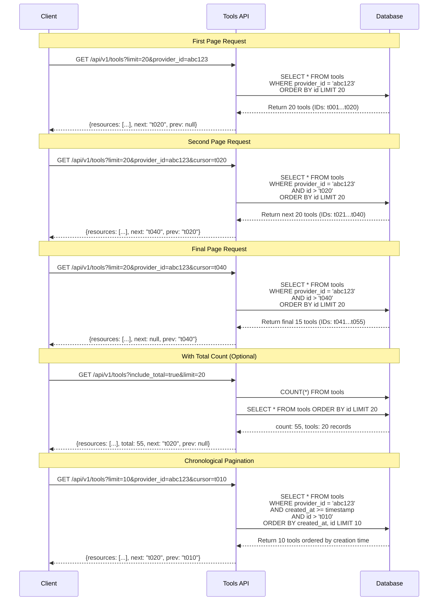

# Data Model: Tool Provider Integration and Tool Management

## Entity Relationship Overview

```
ToolProvider (1) -----> (N) Tool
Tool (1) -----> (N) ToolParameter
ToolProvider (1) -----> (N) RateLimitConfig
Tool (1) -----> (N) RateLimitConfig
UsageCounter (N) -----> (1) ToolProvider
UsageCounter (N) -----> (1) Tool
Users (1) -----> (N) ToolProvider (created_by, updated_by, deleted_by)
Users (1) -----> (N) Tool (created_by, updated_by, deleted_by)
Users (1) -----> (N) ToolParameter (created_by, updated_by, deleted_by)
Users (1) -----> (N) ToolExecution (user_id, created_by, updated_by, deleted_by)
Users (1) -----> (N) RateLimitConfig (created_by, updated_by, deleted_by)
Users (1) -----> (N) UsageCounter (user_id, created_by, updated_by, deleted_by)

# Model Inheritance Hierarchy

## Internal Implementation Models
Resource (Base Model)
├── ToolProviderBase (extends Resource) → shared tool provider fields
│   ├── ToolProvider (database table, extends ToolProviderBase)
│   └── ToolProviderWithConfiguration (API response, extends ToolProviderBase)
└── ToolBase (extends Resource) → shared tool fields
    ├── Tool (database table, extends ToolBase)
    └── ToolWithParameters (API response, extends ToolBase)

## Public API Models
The public API only exposes:
- ToolProviderWithConfiguration (for all tool provider endpoints)
- ToolWithParameters (for all tool endpoints)
```

## Core Entities

### ToolProviderBase
Base model containing shared tool provider fields for both database and API models.

**Extends:** `Resource`

| Field                   | Data Type | Description                                                                                                                                                 |
|-------------------------|-----------|-------------------------------------------------------------------------------------------------------------------------------------------------------------|
| `name`                  | string (unique) | Human-readable provider name (1-255 chars)                                                                                                                 |
| `configuration`         | JSON | Type-specific configuration including provider_type (see Configuration Schema section)                                                                    |
| `enabled`               | boolean (default true) | Tool Provider availability. Disabled providers have all tools disabled.                                                                                    |
| `status`                | enum | Provider status: "validating", "available", "error"                                                                                                        |
| `last_validated_at`     | datetime (nullable) | Last successful validation timestamp                                                                                                                        |
| `validation_error`      | text (nullable) | Last validation error message                                                                                                                               |

**Inherits from Resource:**
- `id`: UUID primary key
- `description`: Optional detailed description (max 2000 chars)
- `created_at`: Creation timestamp
- `updated_at`: Last update timestamp
- `created_by`: UUID of user who created the resource
- `updated_by`: Optional UUID of user who last updated the resource
- `deleted_at`: Optional timestamp when resource was soft deleted
- `deleted_by`: Optional UUID of user who performed the soft delete
- `labels`: Optional key-value metadata

**Model Structure:**
- Abstract base model that contains all tool provider-specific fields
- Extended by both `ToolProvider` (database model) and `ToolProviderWithConfiguration` (API model)
- Enables code reuse and consistent field definitions across implementations

### ToolProvider
Database table model for tool providers - internal implementation only.

**Extends:** `ToolProviderBase`

**Table:** `tool_providers`

**Model Structure:**
- Database table implementation of the ToolProviderBase model
- Includes relationships to Tool entities
- Contains database-specific attributes like indexes and constraints
- Not directly exposed through the public API

**Validation Rules:**
- `name` must be unique across all providers
- `configuration` must include a valid `provider_type` field and conform to provider type schema (see Configuration Schema section)

**State Transitions:**
- New provider starts in "validating" status
- Successful validation → "available"
- Failed connection/validation → "error" with validation_error message
- Admin can toggle enabled independently of status

**Update Operations:**
- **PUT**: Complete replacement of provider configuration
- **PATCH**: Partial updates
  - Only provided fields are updated
  - Configuration values replace the existing configuration
  - No required fields (unlike PUT)

### ToolProviderWithConfiguration
API response model for tool providers that includes typed configuration details - the only model exposed by the public API.

**Extends:** `ToolProviderBase`

| Field                | Data Type | Description                                            |
|----------------------|-----------|--------------------------------------------------------|
| `configuration`      | ProviderConfiguration | Strongly-typed provider configuration object          |

**Model Structure:**
- Extends `ToolProviderBase` (same as the internal `ToolProvider` model) and adds strongly-typed configuration
- This is what all tool provider API endpoints return to clients
- `configuration` field uses discriminated union typing based on `provider_type`
- Provides type-safe access to provider-specific configuration fields
- Used for all API responses to ensure clients receive fully-typed configuration data

**Usage:**
- Used in API responses for GET `/api/v1/tool-providers` (list endpoint)
- Used in API responses for GET `/api/v1/tool-providers/{provider_id}` (detail endpoint)  
- Used in API responses for PUT `/api/v1/tool-providers/{provider_id}` (update endpoint)
- Used in API responses for PATCH `/api/v1/tool-providers/{provider_id}` (patch endpoint)
- Used in API responses for POST `/api/v1/tool-providers` (create endpoint)
- The only tool provider model that external clients see through the public API

**Configuration Polymorphism:**
- Uses discriminator pattern where `provider_type` determines the configuration schema
- Enables type-safe access to provider-specific configuration fields
- Supports multiple provider types (MCP, REST API, Python, Custom) through discriminated unions

**API vs Internal Models:**
- **Internal**: `ToolProvider` (database table) stores raw JSON configuration
- **Public API**: `ToolProviderWithConfiguration` includes strongly-typed configuration objects
- This design provides a clean API interface with type safety while maintaining flexible database storage

### ToolProviderCreate
API model for creating new tool providers and complete updates (POST/PUT operations).

| Field                   | Data Type | Description                                                                                                                                                 |
|-------------------------|-----------|-------------------------------------------------------------------------------------------------------------------------------------------------------------|
| `name`                  | string (required) | Human-readable provider name (1-255 chars)                                                                                                                 |
| `description`           | string (optional, nullable) | Optional provider description (max 2000 chars)                                                                                                             |
| `configuration`         | JSON (required) | Type-specific configuration including provider_type with discriminator                                                                                      |

**Model Structure:**
- Contains only the fields needed to create a tool provider
- Does not inherit system-managed fields like `id`, `created_at`, `updated_at`, or `labels`
- Fields directly map to the service implementation requirements

**Validation Rules:**
- `name` is required and must be unique across all providers
- `configuration` must include a valid `provider_type` field
- Configuration must conform to provider type schema

**Usage:**
- POST `/api/v1/tool-providers` - Create new provider
- PUT `/api/v1/tool-providers/{id}` - Complete replacement

### ToolProviderPatch
API model for partial updates (PATCH operations).

| Field                   | Data Type | Description                                                                                                                                                 |
|-------------------------|-----------|-------------------------------------------------------------------------------------------------------------------------------------------------------------|
| `name`                  | string (optional) | Human-readable provider name (1-255 chars)                                                                                                                 |
| `description`           | string (optional, nullable) | Provider description (max 2000 chars)                                                                                                                      |
| `configuration`         | JSON (optional) | Partial configuration updates with discriminator                                                                                                            |
| `enabled`               | boolean (optional, nullable) | Enable/disable the provider                                                                                                                                 |

**Validation Rules:**
- All fields are optional (supports partial updates)
- When `configuration` is provided, it must still contain `provider_type`
- Configuration values replace the existing configuration
- Uses discriminator pattern for configuration polymorphism

**Usage:**
- PATCH `/api/v1/tool-providers/{id}` - Partial updates with `application/merge-patch+json`


### ToolBase
Base model containing shared tool fields for both database and API models.

**Extends:** `Resource`

| Field                | Data Type | Description                                            |
|----------------------|-----------|--------------------------------------------------------|
| `provider_id`        | UUID | Foreign key to ToolProvider                           |
| `namespaced_name`    | string (max 200 chars, unique) | Provider-prefixed name                                 |
| `enabled`            | boolean (default true) | Tool enabled for use. Available tools may be disabled. |
| `status`             | enum | Tool status: "available", "missing", "error"           |
| `last_refreshed_at`  | datetime (nullable) | Last successful refresh timestamp                     |
| `refresh_error`      | text (nullable) | Last refresh error message                             |
| `last_executed_at`   | datetime (nullable) | Last execution timestamp                               |

**Inherits from Resource:**
- `id`: UUID primary key
- `name`: Human-readable name (1-255 chars)  
- `description`: Optional detailed description (max 2000 chars)
- `created_at`: Creation timestamp
- `updated_at`: Last update timestamp
- `created_by`: UUID of user who created the resource
- `updated_by`: Optional UUID of user who last updated the resource
- `deleted_at`: Optional timestamp when resource was soft deleted
- `deleted_by`: Optional UUID of user who performed the soft delete
- `labels`: Optional key-value metadata

**Model Structure:**
- Abstract base model that contains all tool-specific fields
- Extended by both `Tool` (database model) and `ToolWithParameters` (API model)
- Enables code reuse and consistent field definitions across implementations

### Tool
Database table model for tools - internal implementation only.

**Extends:** `ToolBase`

**Table:** `tools`

**Model Structure:**
- Database table implementation of the ToolBase model
- Includes relationships to ToolParameter and ToolProvider entities
- Contains database-specific attributes like indexes and constraints
- Not directly exposed through the public API

**Relationships:**
- `parameters`: One-to-many relationship with ToolParameter (cascade delete)
- `provider`: Many-to-one relationship with ToolProvider

**Database Attributes:**
- Database indexes and constraints
- Filterable and sortable field definitions

**Validation Rules:**
- `name` must be valid identifier (alphanumeric, underscore, hyphen)
- `namespaced_name` follows pattern "{provider_name}::{tool_name}"
- `namespaced_name` must be unique across all tools
- Tool can only be enabled if status is "available"

**State Transitions:**
- New Tool starts as "available" and enabled=true
- Missing from provider during refresh → status="missing", enabled=false
- Refresh error → status="error" with refresh_error message
- Admin can toggle enabled independently of status

### ToolWithParameters
API response model for tools that includes parameter details - the only model exposed by the public API.

**Extends:** `ToolBase`

| Field                | Data Type | Description                                            |
|----------------------|-----------|--------------------------------------------------------|
| `parameters`         | Array | Array of ToolParameter objects                        |

**Model Structure:**
- Extends `ToolBase` (same as the internal `Tool` model) and adds `parameters` array
- This is what all tool API endpoints return to clients
- Contains all tool fields plus associated parameter definitions
- Provides complete tool information for client consumption

**Usage:**
- Used in API responses for GET `/api/v1/tools` (list endpoint)
- Used in API responses for GET `/api/v1/tools/{tool_id}` (detail endpoint)
- Used in API responses for PATCH `/api/v1/tools/{tool_id}` (update endpoint)
- The only tool model that external clients see through the public API

**API vs Internal Models:**
- **Internal**: `Tool` (database table) has relationships to `ToolParameter` entities
- **Public API**: `ToolWithParameters` includes the parameters as an embedded array
- This design provides a clean API interface while maintaining normalized database structure

### ToolParameter
Represents individual input requirements for tools with validation rules.

| Field | Data Type | Description |
|-------|-----------|-------------|
| `id` | UUID | Primary key |
| `tool_id` | UUID | Foreign key to Tool |
| `name` | string (max 100 chars) | Parameter name |
| `type` | enum | Parameter type: "string", "number", "boolean", "object", "array" |
| `description` | text | Parameter description |
| `required` | boolean | Whether parameter is required |
| `default_value` | object (nullable) | Default parameter value |
| `example_value` | object (nullable) | Example parameter value |
| `created_at` | datetime | Parameter definition timestamp |
| `created_by` | UUID | Foreign key to Users table - Administrator who created parameter |
| `updated_at` | datetime | Last update timestamp |
| `updated_by` | UUID | Foreign key to Users table - Administrator who last updated parameter |
| `deleted_at` | datetime (nullable) | Soft delete timestamp |
| `deleted_by` | UUID (nullable) | Foreign key to Users table - Administrator who deleted parameter |

**Validation Rules:**
- `name` must be valid identifier within Tool scope
- `type` must be one of allowed JSON schema types
- `default_value` must match parameter type

### ToolExecution
Records individual Tool executions for performance monitoring and analysis.

| Field | Data Type | Description |
|-------|-----------|-------------|
| `id` | UUID | Primary key |
| `tool_id` | UUID | Foreign key to Tool |
| `provider_id` | UUID | Foreign key to ToolProvider |
| `user_id` | UUID | Foreign key to Users table - Identifier of executing user/agent |
| `execution_start` | datetime | Execution start timestamp |
| `execution_end` | datetime (nullable) | Execution completion timestamp |
| `duration_ms` | integer (nullable) | Execution duration in milliseconds |
| `status` | enum | Execution status: "running", "success", "error", "timeout" |
| `input_parameters` | JSON | Tool input parameters |
| `output_data` | JSON (nullable) | Tool output data |
| `error_message` | text (nullable) | Error description for failed executions |
| `error_code` | string (nullable) | Structured error code |
| `created_at` | datetime | Record creation timestamp |
| `created_by` | UUID | Foreign key to Users table - Administrator who created execution record |
| `updated_at` | datetime | Last update timestamp |
| `updated_by` | UUID | Foreign key to Users table - Administrator who last updated execution record |
| `deleted_at` | datetime (nullable) | Soft delete timestamp |
| `deleted_by` | UUID (nullable) | Foreign key to Users table - Administrator who deleted execution record |

**Validation Rules:**
- `execution_end` must be after `execution_start` if both present
- `duration_ms` must be positive integer
- `status` must be one of allowed values
- `input_parameters` must be valid JSON
- Completed executions must have `execution_end` and `duration_ms`

### RateLimitConfig
Defines usage limits and time windows at provider, tool, and user levels.

| Field | Data Type | Description |
|-------|-----------|-------------|
| `id` | UUID | Primary key |
| `target_type` | enum | Limit scope: "provider", "tool", "user" |
| `target_id` | string | Target identifier (UUID for provider/tool, string for user) |
| `target_name` | string (nullable) | Human-readable target name for display |
| `requests_per_window` | integer | Maximum requests allowed |
| `window_duration_seconds` | integer | Time window in seconds |
| `burst_allowance` | integer (default 0) | Additional burst requests |
| `enabled` | boolean (default true) | Whether limit is active |
| `current_usage` | integer (default 0) | Current usage count in window |
| `usage_reset_at` | datetime (nullable) | When current usage counter resets |
| `created_at` | datetime | Configuration creation timestamp |
| `created_by` | UUID | Foreign key to Users table - Administrator who set limit |
| `updated_at` | datetime | Last modification timestamp |
| `updated_by` | UUID | Foreign key to Users table - Administrator who last updated limit |
| `deleted_at` | datetime (nullable) | Soft delete timestamp |
| `deleted_by` | UUID (nullable) | Foreign key to Users table - Administrator who deleted rate limit |

**Validation Rules:**
- `target_type` must be one of allowed values
- `target_id` must reference valid provider/tool or be valid user identifier
- `requests_per_window` must be positive integer
- `window_duration_seconds` must be positive integer (minimum 1)
- `burst_allowance` must be non-negative integer

### UsageCounter
Maintains cumulative usage statistics with rolling time window calculations.

| Field | Data Type | Description |
|-------|-----------|-------------|
| `id` | UUID | Primary key |
| `counter_type` | enum | Counter scope: "provider", "tool", "user", "provider_user", "tool_user" |
| `provider_id` | UUID (nullable) | Foreign key to ToolProvider |
| `tool_id` | UUID (nullable) | Foreign key to Tool |
| `user_id` | UUID (nullable) | Foreign key to Users table - User identifier |
| `time_window` | string | Time window identifier (e.g., "2025-01-01-14") |
| `window_duration` | enum | Window duration: "hour", "day", "month" |
| `request_count` | integer (default 0) | Number of requests in window |
| `success_count` | integer (default 0) | Number of successful requests |
| `error_count` | integer (default 0) | Number of failed requests |
| `total_duration_ms` | integer (default 0) | Total execution time in milliseconds |
| `window_start` | datetime | Window start timestamp |
| `window_end` | datetime | Window end timestamp |
| `created_at` | datetime | Counter creation timestamp |
| `created_by` | UUID | Foreign key to Users table - Administrator who created counter |
| `updated_at` | datetime | Last counter update timestamp |
| `updated_by` | UUID | Foreign key to Users table - Administrator who last updated counter |
| `deleted_at` | datetime (nullable) | Soft delete timestamp |
| `deleted_by` | UUID (nullable) | Foreign key to Users table - Administrator who deleted usage counter |

**Validation Rules:**
- `counter_type` determines which ID fields must be populated
- `time_window` must match expected format for window_duration
- `success_count + error_count` must equal `request_count`
- `window_end` must be after `window_start`
- `total_duration_ms` must be non-negative

## Configuration Schema

Tool providers support flexible configuration formats based on their type.

The `configuration` JSON field contains both the provider type and provider-specific settings:

### Base Configuration Structure
```json
{
  "provider_type": "string (required)",
  // provider-specific fields
}
```

### Example Provider Configurations

#### MCP Provider
```json
{
  "provider_type": "mcp",
  "base_url": "https://api.example.com/mcp",
  "api_key": "your-api-key-here"
}
```
Note: MCP protocol options are "sse" or "streaming_http" (stdio not supported)

#### Python Tool Provider
```json
{
  "provider_type": "python",
  "module_path": "my_tools.decorated_functions",
  "class_name": "MyToolClass"
}
```

#### REST API Provider  
```json
{
  "provider_type": "rest_api",
  "base_url": "https://api.example.com/tools",
  "authentication_type": "api_key",
  "authentication_config": {
    "api_key": "secret_key",
    "header_name": "X-API-Key"
  },
  "connection_timeout": 10,
  "read_timeout": 30
}
```

#### Custom Provider Example
```json
{
  "provider_type": "custom",
  "database_url": "postgresql://localhost/tools",
  "schema": "custom_tools",
  "timeout": 5000
}
```

**Configuration Validation Rules:**
- `provider_type` field within configuration determines the expected configuration schema
- Each provider type defines its own required and optional configuration fields
- Provider implementations/adaptors handle type-specific validation
- No predefined list of provider types - new types can be added through implementation

## Database Indexes

**Performance Indexes (from Alembic migration):**

*ToolProvider Indexes:*
- `ix_tool_providers_id` (primary key)
- `ix_tool_providers_created_at` (single column)
- `ix_tool_providers_created_at_id` (composite for chronological pagination)
- `ix_tool_providers_name` (single column)
- `ix_tool_providers_name_unique` (unique, where deleted_at IS NULL)
- `ix_tool_providers_enabled` (single column)
- `ix_tool_providers_status` (single column)
- `ix_tool_providers_last_validated_at` (single column)
- `ix_tool_providers_updated_at` (single column)
- `ix_tool_providers_created_by` (foreign key)
- `ix_tool_providers_updated_by` (foreign key)
- `ix_tool_providers_deleted_at` (soft delete)
- `ix_tool_providers_deleted_by` (foreign key)

*Tool Indexes:*
- `ix_tools_id` (primary key)
- `ix_tools_created_at` (single column)
- `ix_tools_created_at_id` (composite for chronological pagination)
- `ix_tools_name` (single column)
- `ix_tools_namespaced_name` (single column)
- `ix_tools_namespaced_name_unique` (unique, where deleted_at IS NULL)
- `ix_tools_provider_id` (foreign key)
- `ix_tools_provider_id_created_at_id` (composite for provider-filtered pagination)
- `ix_tools_enabled` (single column)
- `ix_tools_status` (single column)
- `ix_tools_last_executed_at` (single column)
- `ix_tools_last_refreshed_at` (single column)
- `ix_tools_updated_at` (single column)
- `ix_tools_created_by` (foreign key)
- `ix_tools_updated_by` (foreign key)
- `ix_tools_deleted_at` (soft delete)
- `ix_tools_deleted_by` (foreign key)

*ToolExecution Indexes:*
- `ix_tool_executions_id` (primary key)
- `ix_tool_executions_created_at` (single column)
- `ix_tool_executions_execution_start` (single column)
- `ix_tool_executions_tool_id` (foreign key)
- `ix_tool_executions_provider_id` (foreign key)
- `ix_tool_executions_user_id` (foreign key)
- `ix_tool_executions_updated_at` (single column)
- `ix_tool_executions_created_by` (foreign key)
- `ix_tool_executions_updated_by` (foreign key)

*ToolParameter Indexes:*
- `ix_tool_parameters_id` (primary key)
- `ix_tool_parameters_tool_id` (foreign key)
- `ix_tool_parameters_created_at` (single column)
- `ix_tool_parameters_updated_at` (single column)

*RateLimitConfig Indexes:*
- `ix_rate_limits_id` (primary key)
- `ix_rate_limits_target_type` (single column)
- `ix_rate_limits_target_id` (single column)
- `ix_rate_limits_created_at` (single column)
- `ix_rate_limits_updated_at` (single column)
- `ix_rate_limits_created_by` (foreign key)
- `ix_rate_limits_updated_by` (foreign key)

*UsageCounter Indexes:*
- `ix_usage_counters_id` (primary key)
- `ix_usage_counters_counter_type` (single column)
- `ix_usage_counters_provider_id` (foreign key)
- `ix_usage_counters_tool_id` (foreign key)
- `ix_usage_counters_user_id` (foreign key)
- `ix_usage_counters_time_window` (single column)
- `ix_usage_counters_window_start` (single column)
- `ix_usage_counters_window_end` (single column)
- `ix_usage_counters_created_at` (single column)
- `ix_usage_counters_updated_at` (single column)
- `ix_usage_counters_created_by` (foreign key)
- `ix_usage_counters_updated_by` (foreign key)

## Keyset Pagination Support

**Cursor Design:**
- All list endpoints use UUID primary keys as cursors for consistent pagination
- Composite indexes include primary key as final column for deterministic ordering
- Chronological pagination uses `(created_at, id)` for stable sort order
- Filtered pagination includes filter columns, timestamp, and ID for efficiency

**Query Patterns by Entity:**

*ToolProvider List:*
```sql
-- Basic pagination
WHERE id > :cursor ORDER BY id LIMIT :limit

-- With status filter
WHERE status = :status AND id > :cursor ORDER BY id LIMIT :limit

-- Chronological order
WHERE created_at >= :timestamp AND id > :cursor ORDER BY created_at, id LIMIT :limit
```

*Tool List:*
```sql
-- Basic pagination
WHERE id > :cursor ORDER BY id LIMIT :limit

-- Provider-filtered
WHERE provider_id = :provider_id AND id > :cursor ORDER BY id LIMIT :limit

-- Multiple filters with chronological order
WHERE provider_id = :provider_id AND enabled = :enabled
  AND created_at >= :timestamp AND id > :cursor
  ORDER BY created_at, id LIMIT :limit
```

*ToolExecution List:*
```sql
-- Chronological pagination (primary use case)
WHERE created_at >= :timestamp AND id > :cursor
  ORDER BY created_at DESC, id LIMIT :limit

-- Tool-specific executions
WHERE tool_id = :tool_id AND created_at >= :timestamp AND id > :cursor
  ORDER BY created_at DESC, id LIMIT :limit

-- User-specific executions  
WHERE user_id = :user_id AND created_at >= :timestamp AND id > :cursor
  ORDER BY created_at DESC, id LIMIT :limit
```

*RateLimitConfig List:*
```sql
-- Basic pagination
WHERE id > :cursor ORDER BY id LIMIT :limit

-- Filtered by target type
WHERE target_type = :target_type AND id > :cursor ORDER BY id LIMIT :limit
```

**Performance Characteristics:**
- Consistent O(log n) performance regardless of pagination depth
- No duplicate/missing records during concurrent writes
- Efficient for large result sets (millions of records)
- Indexes support both forward and backward pagination
- All composite indexes include ID as final column for deterministic ordering

## Keyset Pagination Flow

**Tools Model Pagination Sequence:**



## Data Retention Policies

**Execution Data:**
- ToolExecution records will have configurable archival policies to cold storage
- UsageCounter aggregation policies for hourly to daily and daily to monthly rollups to be defined
- Retention periods to be determined based on operational requirements

**Configuration Data:**
- ToolProvider and Tool records persist until manually removed
- RateLimitConfig records persist until manually removed
- ToolParameter records updated during Tool metadata refresh
