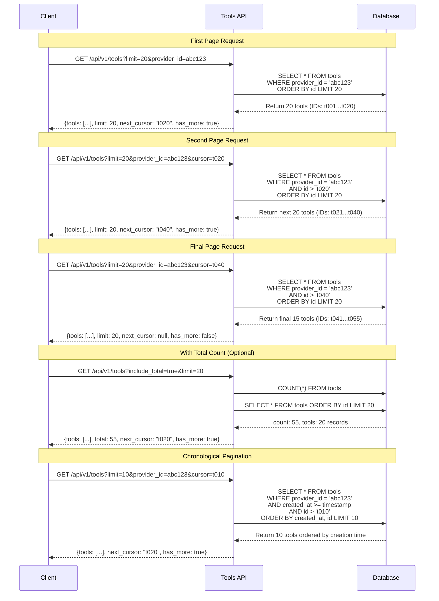

# Data Model: Tool Provider Integration and Tool Management

## Entity Relationship Overview

```
ToolProvider (1) -----> (N) Tool
Tool (1) -----> (N) ToolParameter
Tool (1) -----> (N) ToolMetric
ToolProvider (1) -----> (N) RateLimitConfig
Tool (1) -----> (N) RateLimitConfig
UsageCounter (N) -----> (1) ToolProvider
UsageCounter (N) -----> (1) Tool
Users (1) -----> (N) ToolProvider (created_by, updated_by, deleted_by)
Users (1) -----> (N) Tool (created_by, updated_by, deleted_by)
Users (1) -----> (N) ToolParameter (created_by, updated_by, deleted_by)
Users (1) -----> (N) ToolMetric (user_id, created_by, updated_by, deleted_by)
Users (1) -----> (N) RateLimitConfig (created_by, updated_by, deleted_by)
Users (1) -----> (N) UsageCounter (user_id, created_by, updated_by, deleted_by)
```

## Core Entities

### ToolProvider
Represents a Tool Provider with type-specific configuration and registration metadata.

| Field                   | Data Type | Description                                                                                                                                                 |
|-------------------------|-----------|-------------------------------------------------------------------------------------------------------------------------------------------------------------|
| `id`                    | UUID | Primary key                                                                                                                                                 |
| `name`                  | string (unique) | Human-readable provider name                                                                                                                                |
| `description`           | text (nullable) | Optional provider description                                                                                                                               |
| `provider_type`         | string | Type of Tool Provider (e.g., mcp, python, rest_api, etc.)                                                                                                 |
| `configuration`         | JSON | Type-specific configuration (see Configuration Schema section)                                                                                             |
| `enabled`               | boolean (default true) | Tool Provider availability. Disabled providers have all tools disabled.                                                                                    |
| `status`                | enum | Provider status: "validating", "available", "error"                                                                                                        |
| `last_validated_at`     | datetime (nullable) | Last successful validation timestamp                                                                                                                        |
| `validation_error`      | text (nullable) | Last validation error message                                                                                                                               |
| `created_at`            | datetime | Registration timestamp                                                                                                                                      |
| `created_by`            | UUID | Foreign key to Users table - Administrator who registered provider                                                                                         |
| `updated_at`            | datetime | Last modification timestamp                                                                                                                                 |
| `updated_by`            | UUID | Foreign key to Users table - Administrator who last updated provider                                                                                       |
| `deleted_at`            | datetime (nullable) | Soft delete timestamp                                                                                                                                       |
| `deleted_by`            | UUID (nullable) | Foreign key to Users table - Administrator who deleted provider                                                                                            |

**Validation Rules:**
- `name` must be unique across all providers
- `provider_type` must be a valid string identifier
- `configuration` must conform to provider type schema (see Configuration Schema section)

**State Transitions:**
- New provider starts in "validating" status
- Successful validation → "available"
- Failed connection/validation → "error" with validation_error message
- Admin can toggle enabled independently of status

### Tool
Represents an individual capability exposed by a Tool Provider with enablement control.

| Field                | Data Type | Description                                            |
|----------------------|-----------|--------------------------------------------------------|
| `id`                 | UUID | Primary key                                            |
| `provider_id`        | UUID | Foreign key to ToolProvider                           |
| `name`               | string (max 100 chars) | Tool name from provider                                |
| `namespaced_name`    | string (max 200 chars, unique) | Provider-prefixed name                                 |
| `description`        | text | Tool description from provider                         |
| `schema`             | JSON | Tool parameter schema                                  |
| `enabled`            | boolean (default true) | Tool enabled for use. Available tools may be disabled. |
| `status`             | enum | Tool status: "available", "missing", "error"           |
| `last_discovered_at` | datetime | Last successful discovery timestamp                    |
| `discovery_error`    | text (nullable) | Last discovery error message                           |
| `execution_count`    | integer (default 0) | Total execution counter                                |
| `last_executed_at`   | datetime (nullable) | Last execution timestamp                               |
| `created_at`         | datetime | First discovery timestamp                              |
| `created_by`         | UUID | Foreign key to Users table - Administrator who created tool |
| `updated_at`         | datetime | Last metadata update timestamp                         |
| `updated_by`         | UUID | Foreign key to Users table - Administrator who last updated tool |
| `deleted_at`         | datetime (nullable) | Soft delete timestamp                                  |
| `deleted_by`         | UUID (nullable) | Foreign key to Users table - Administrator who deleted tool |

**Validation Rules:**
- `name` must be valid identifier (alphanumeric, underscore, hyphen)
- `namespaced_name` follows pattern "{provider_name}::{tool_name}"
- `namespaced_name` must be unique across all tools
- `schema` must be valid JSON schema format
- Tool can only be enabled if status is "available"

**State Transitions:**
- New Tool starts as "available" and enabled=true
- Missing from provider during refresh → status="missing", enabled=false
- Discovery error → status="error" with discovery_error message
- Admin can toggle enabled independently of status

### ToolParameter
Represents individual input requirements for tools with validation rules.

| Field | Data Type | Description |
|-------|-----------|-------------|
| `id` | UUID | Primary key |
| `tool_id` | UUID | Foreign key to Tool |
| `name` | string (max 100 chars) | Parameter name |
| `type` | enum | Parameter type: "string", "number", "boolean", "object", "array" |
| `description` | text | Parameter description |
| `required` | boolean | Whether parameter is required |
| `default_value` | JSON (nullable) | Default parameter value |
| `validation_schema` | JSON (nullable) | Additional validation rules |
| `example_value` | JSON (nullable) | Example parameter value |
| `created_at` | datetime | Parameter definition timestamp |
| `created_by` | UUID | Foreign key to Users table - Administrator who created parameter |
| `updated_at` | datetime | Last update timestamp |
| `updated_by` | UUID | Foreign key to Users table - Administrator who last updated parameter |
| `deleted_at` | datetime (nullable) | Soft delete timestamp |
| `deleted_by` | UUID (nullable) | Foreign key to Users table - Administrator who deleted parameter |

**Validation Rules:**
- `name` must be valid identifier within Tool scope
- `type` must be one of allowed JSON schema types
- `default_value` must match parameter type
- `validation_schema` must be valid JSON schema subset

### ToolMetric
Records individual Tool executions for performance monitoring and analysis.

| Field | Data Type | Description |
|-------|-----------|-------------|
| `id` | UUID | Primary key |
| `tool_id` | UUID | Foreign key to Tool |
| `provider_id` | UUID | Foreign key to ToolProvider |
| `user_id` | UUID | Foreign key to Users table - Identifier of executing user/agent |
| `execution_start` | datetime | Execution start timestamp |
| `execution_end` | datetime (nullable) | Execution completion timestamp |
| `duration_ms` | integer (nullable) | Execution duration in milliseconds |
| `status` | enum | Execution status: "running", "success", "error", "timeout" |
| `input_parameters` | JSON | Tool input parameters |
| `output_data` | JSON (nullable) | Tool output data |
| `error_message` | text (nullable) | Error description for failed executions |
| `error_code` | string (nullable) | Structured error code |
| `created_at` | datetime | Record creation timestamp |
| `created_by` | UUID | Foreign key to Users table - Administrator who created metric record |
| `updated_at` | datetime | Last update timestamp |
| `updated_by` | UUID | Foreign key to Users table - Administrator who last updated metric record |
| `deleted_at` | datetime (nullable) | Soft delete timestamp |
| `deleted_by` | UUID (nullable) | Foreign key to Users table - Administrator who deleted metric record |

**Validation Rules:**
- `execution_end` must be after `execution_start` if both present
- `duration_ms` must be positive integer
- `status` must be one of allowed values
- `input_parameters` must be valid JSON
- Completed executions must have `execution_end` and `duration_ms`

### RateLimitConfig
Defines usage limits and time windows at provider, tool, and user levels.

| Field | Data Type | Description |
|-------|-----------|-------------|
| `id` | UUID | Primary key |
| `target_type` | enum | Limit scope: "provider", "tool", "user" |
| `target_id` | string | Target identifier (UUID for provider/tool, string for user) |
| `requests_per_window` | integer | Maximum requests allowed |
| `window_duration_seconds` | integer | Time window in seconds |
| `burst_allowance` | integer (default 0) | Additional burst requests |
| `enabled` | boolean (default true) | Whether limit is active |
| `created_at` | datetime | Configuration creation timestamp |
| `created_by` | UUID | Foreign key to Users table - Administrator who set limit |
| `updated_at` | datetime | Last modification timestamp |
| `updated_by` | UUID | Foreign key to Users table - Administrator who last updated limit |
| `deleted_at` | datetime (nullable) | Soft delete timestamp |
| `deleted_by` | UUID (nullable) | Foreign key to Users table - Administrator who deleted rate limit |

**Validation Rules:**
- `target_type` must be one of allowed values
- `target_id` must reference valid provider/tool or be valid user identifier
- `requests_per_window` must be positive integer
- `window_duration_seconds` must be positive integer (minimum 1)
- `burst_allowance` must be non-negative integer

### UsageCounter
Maintains cumulative usage statistics with rolling time window calculations.

| Field | Data Type | Description |
|-------|-----------|-------------|
| `id` | UUID | Primary key |
| `counter_type` | enum | Counter scope: "provider", "tool", "user", "provider_user", "tool_user" |
| `provider_id` | UUID (nullable) | Foreign key to ToolProvider |
| `tool_id` | UUID (nullable) | Foreign key to Tool |
| `user_id` | UUID (nullable) | Foreign key to Users table - User identifier |
| `time_window` | string | Time window identifier (e.g., "2025-01-01-14") |
| `window_duration` | enum | Window duration: "hour", "day", "month" |
| `request_count` | integer (default 0) | Number of requests in window |
| `success_count` | integer (default 0) | Number of successful requests |
| `error_count` | integer (default 0) | Number of failed requests |
| `total_duration_ms` | integer (default 0) | Total execution time in milliseconds |
| `window_start` | datetime | Window start timestamp |
| `window_end` | datetime | Window end timestamp |
| `created_at` | datetime | Counter creation timestamp |
| `created_by` | UUID | Foreign key to Users table - Administrator who created counter |
| `updated_at` | datetime | Last counter update timestamp |
| `updated_by` | UUID | Foreign key to Users table - Administrator who last updated counter |
| `deleted_at` | datetime (nullable) | Soft delete timestamp |
| `deleted_by` | UUID (nullable) | Foreign key to Users table - Administrator who deleted usage counter |

**Validation Rules:**
- `counter_type` determines which ID fields must be populated
- `time_window` must match expected format for window_duration
- `success_count + error_count` must equal `request_count`
- `window_end` must be after `window_start`
- `total_duration_ms` must be non-negative

## Configuration Schema

Tool providers support flexible configuration formats based on their type.

The `configuration` JSON field contains provider-specific settings (provider_type is now a separate column):

### Base Configuration Structure
```json
{
  // provider-specific fields only
}
```

### Example Provider Configurations

#### MCP Provider
```json
{
  "host": "localhost",
  "port": 3000,
  "protocol": "http",
  "authentication_type": "none",
  "authentication_config": {},
  "connection_timeout": 5,
  "read_timeout": 10
}
```
Note: MCP protocol options are "stdio", "sse", or "http"

#### Python Tool Provider
```json
{
  "module_path": "my_tools.decorated_functions",
  "class_name": "MyToolClass"
}
```

#### REST API Provider  
```json
{
  "base_url": "https://api.example.com/tools",
  "authentication_type": "api_key",
  "authentication_config": {
    "api_key": "secret_key",
    "header_name": "X-API-Key"
  },
  "connection_timeout": 10,
  "read_timeout": 30
}
```

#### Custom Provider Example
```json
{
  "database_url": "postgresql://localhost/tools",
  "schema": "custom_tools",
  "timeout": 5000
}
```

**Configuration Validation Rules:**
- `provider_type` column determines the expected configuration schema
- Each provider type defines its own required and optional configuration fields
- Provider implementations/adaptors handle type-specific validation
- No predefined list of provider types - new types can be added through implementation

## Database Indexes

**Performance Indexes:**

*Primary Key Indexes (for keyset pagination):*
- `ToolProvider.id` (primary key, clustered)
- `Tool.id` (primary key, clustered)
- `ToolMetric.id` (primary key, clustered)
- `RateLimitConfig.id` (primary key, clustered)
- `UsageCounter.id` (primary key, clustered)

*Keyset Pagination Indexes:*
- `ToolProvider.created_at, ToolProvider.id` (composite for chronological pagination)
- `Tool.created_at, Tool.id` (composite for chronological pagination)
- `Tool.provider_id, Tool.created_at, Tool.id` (composite for provider-filtered pagination)
- `ToolMetric.created_at, ToolMetric.id` (composite for chronological pagination)
- `ToolMetric.tool_id, ToolMetric.created_at, ToolMetric.id` (composite for tool-filtered pagination)
- `ToolMetric.user_id, ToolMetric.created_at, ToolMetric.id` (composite for user-filtered pagination)
- `RateLimitConfig.target_type, RateLimitConfig.created_at, RateLimitConfig.id` (composite)

*Unique Constraints:*
- `ToolProvider.name` (unique)
- `Tool.namespaced_name` (unique)

*Foreign Key Indexes:*
- `Tool.provider_id` (foreign key index)
- `ToolMetric.tool_id` (foreign key index)
- `ToolMetric.provider_id` (foreign key index)
- `ToolMetric.user_id` (foreign key index)
- `UsageCounter.provider_id` (foreign key index)
- `UsageCounter.tool_id` (foreign key index)
- `UsageCounter.user_id` (foreign key index)
- `ToolProvider.created_by` (foreign key index)
- `ToolProvider.updated_by` (foreign key index)
- `ToolProvider.deleted_by` (foreign key index)
- `Tool.created_by` (foreign key index)
- `Tool.updated_by` (foreign key index)
- `Tool.deleted_by` (foreign key index)
- `ToolParameter.created_by` (foreign key index)
- `ToolParameter.updated_by` (foreign key index)
- `ToolParameter.deleted_by` (foreign key index)
- `ToolMetric.created_by` (foreign key index)
- `ToolMetric.updated_by` (foreign key index)
- `ToolMetric.deleted_by` (foreign key index)
- `RateLimitConfig.created_by` (foreign key index)
- `RateLimitConfig.updated_by` (foreign key index)
- `RateLimitConfig.deleted_by` (foreign key index)
- `UsageCounter.created_by` (foreign key index)
- `UsageCounter.updated_by` (foreign key index)
- `UsageCounter.deleted_by` (foreign key index)

## Keyset Pagination Support

**Cursor Design:**
- All list endpoints use UUID primary keys as cursors for consistent pagination
- Composite indexes include primary key as final column for deterministic ordering
- Chronological pagination uses `(created_at, id)` for stable sort order
- Filtered pagination includes filter columns, timestamp, and ID for efficiency

**Query Patterns by Entity:**

*ToolProvider List:*
```sql
-- Basic pagination
WHERE id > :cursor ORDER BY id LIMIT :limit

-- With status filter
WHERE status = :status AND id > :cursor ORDER BY id LIMIT :limit

-- Chronological order
WHERE created_at >= :timestamp AND id > :cursor ORDER BY created_at, id LIMIT :limit
```

*Tool List:*
```sql
-- Basic pagination
WHERE id > :cursor ORDER BY id LIMIT :limit

-- Provider-filtered
WHERE provider_id = :provider_id AND id > :cursor ORDER BY id LIMIT :limit

-- Multiple filters with chronological order
WHERE provider_id = :provider_id AND enabled = :enabled
  AND created_at >= :timestamp AND id > :cursor
  ORDER BY created_at, id LIMIT :limit
```

*ToolMetric List:*
```sql
-- Chronological pagination (primary use case)
WHERE created_at >= :timestamp AND id > :cursor
  ORDER BY created_at DESC, id LIMIT :limit

-- Tool-specific metrics
WHERE tool_id = :tool_id AND created_at >= :timestamp AND id > :cursor
  ORDER BY created_at DESC, id LIMIT :limit

-- User-specific metrics  
WHERE user_id = :user_id AND created_at >= :timestamp AND id > :cursor
  ORDER BY created_at DESC, id LIMIT :limit
```

*RateLimitConfig List:*
```sql
-- Basic pagination
WHERE id > :cursor ORDER BY id LIMIT :limit

-- Filtered by target type
WHERE target_type = :target_type AND id > :cursor ORDER BY id LIMIT :limit
```

**Performance Characteristics:**
- Consistent O(log n) performance regardless of pagination depth
- No duplicate/missing records during concurrent writes
- Efficient for large result sets (millions of records)
- Indexes support both forward and backward pagination
- All composite indexes include ID as final column for deterministic ordering

## Keyset Pagination Flow

**Tools Model Pagination Sequence:**



## Data Retention Policies

**Metric Data:**
- ToolMetric records will have configurable archival policies to cold storage
- UsageCounter aggregation policies for hourly to daily and daily to monthly rollups to be defined
- Retention periods to be determined based on operational requirements

**Configuration Data:**
- ToolProvider and Tool records persist until manually removed
- RateLimitConfig records persist until manually removed
- ToolParameter records updated during Tool metadata refresh
