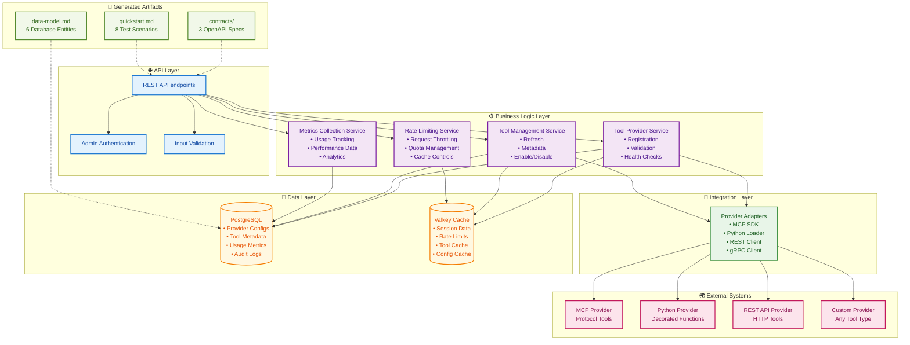
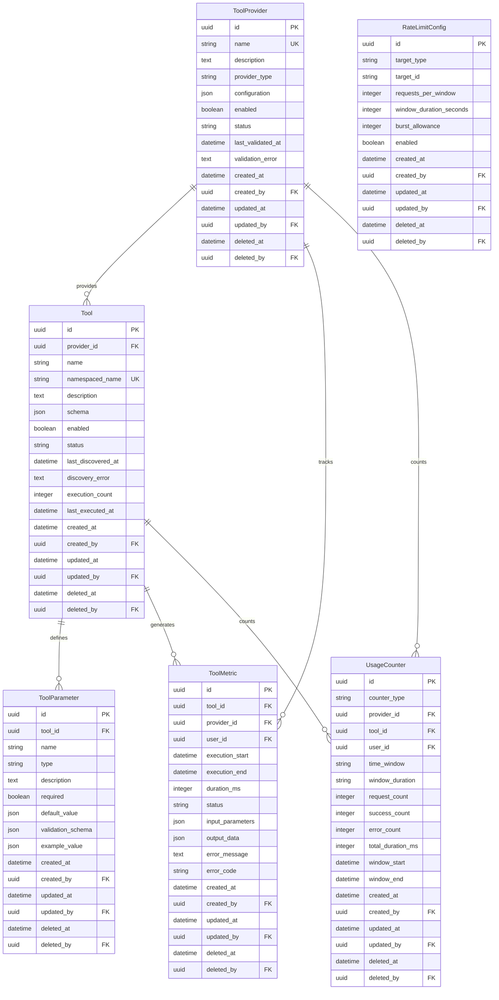
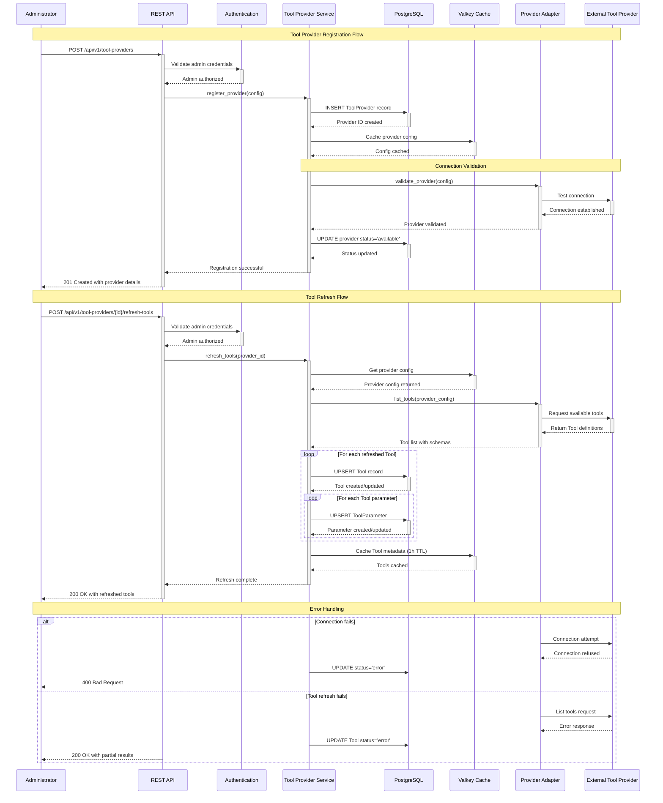
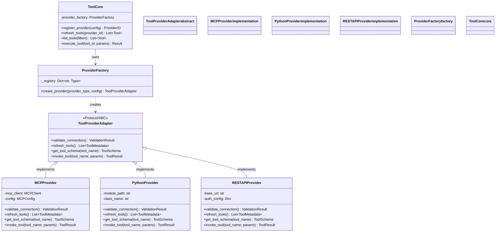

# Implementation Plan: Tool Provider Integration and Tool Management

**Branch**: `004-tool-management` | **Date**: 2025-10-02 | **Spec**: [spec.md](./spec.md)
**Input**: Feature specification from `/specs/004-tool-management/spec.md`

## Execution Flow (/plan command scope)
```
1. Load feature spec from Input path
   → If not found: ERROR "No feature spec at {path}"
2. Fill Technical Context (scan for NEEDS CLARIFICATION)
   → Detect Project Type from context (web=frontend+backend)
   → Set Structure Decision based on project type
3. Fill the Constitution Check section based on the content of the constitution document.
4. Evaluate Constitution Check section below
   → If violations exist: Document in Complexity Tracking
   → If no justification possible: ERROR "Simplify approach first"
   → Update Progress Tracking: Initial Constitution Check
5. Execute Phase 0 → research.md
   → If NEEDS CLARIFICATION remain: ERROR "Resolve unknowns"
6. Execute Phase 1 → contracts, data-model.md, quickstart.md, agent-specific template file (e.g., `CLAUDE.md` for Claude Code, `.github/copilot-instructions.md` for GitHub Copilot, `GEMINI.md` for Gemini CLI, `QWEN.md` for Qwen Code or `AGENTS.md` for opencode).
7. Re-evaluate Constitution Check section
   → If new violations: Refactor design, return to Phase 1
   → Update Progress Tracking: Post-Design Constitution Check
8. Plan Phase 2 → Describe task generation approach (DO NOT create tasks.md)
9. STOP - Ready for /tasks command
```

**IMPORTANT**: The /plan command STOPS at step 7. Phases 2-4 are executed by other commands:
- Phase 2: /tasks command creates tasks.md
- Phase 3-4: Implementation execution (manual or via tools)

## Summary
Backend API for administrators to register and manage external tool providers (MCP, Python, REST APIs). Key capabilities:
- Register providers and auto-discover their tools
- Control tool availability (enable/disable)
- Track usage metrics and rate limits
- Pluggable adapter architecture for multiple provider types

**Tech Stack**: FastAPI, PostgreSQL, SQLAlchemy 2.0, Valkey
**Frontend**: Separate repository

## Implementation Architecture



## Data Model Architecture

### Entity Relationship Diagram



## Tool Provider Registration and Tool Refresh Flow

### Sequence Diagram



## Provider Abstraction Architecture

### Class Diagram: Pluggable Provider Pattern



**Key Design Principles:**
- **Protocol/ABC**: `ToolProviderAdapter` defines the contract all providers must implement
- **Factory Pattern**: `ProviderFactory` routes `provider_type` string → concrete implementation
- **Extensibility**: New provider types (gRPC, GraphQL, etc.) can be added without modifying core
- **MCP as Example**: MCP is ONE implementation, not the only one

**File Structure:**
```
src/nexus/tool_manager/lib/
├── tool_core.py              # Generic tool management (provider-agnostic)
└── providers/
    ├── base.py               # ToolProviderAdapter Protocol/ABC
    ├── factory.py            # ProviderFactory (type routing)
    ├── mcp_provider.py       # MCP implementation (uses MCP SDK)
    ├── python_provider.py    # Python function provider
    └── rest_api_provider.py  # REST API provider
```

## Technical Context
**Language/Version**: Python 3.12+ \
**Primary Dependencies**: FastAPI, uvicorn, pytest, SQLAlchemy 2.0, asyncpg, Valkey, pluggable provider adapters \
**Storage**: PostgreSQL with SQLAlchemy 2.0 + asyncpg driver, Valkey for distributed caching \
**Testing**: pytest with async support, httpx for API testing \
**Target Platform**: Linux server \
**Project Type**: backend (API service only - frontend is separate repository) \
**Performance Goals**: Scalable performance. Metrics to be agreed \
**Constraints**: 5-second provider connection timeouts, 1-hour TTL for Tool metadata caching, Valkey LRU memory management \
**Scale/Scope**: Multiple Tool providers, hundreds of Tools, admin-only API endpoints \
**Arguments**: Feature specification from `/specs/004-tool-management/spec.md`

## Constitution Check
*GATE: Must pass before Phase 0 research. Re-check after Phase 1 design.*

### Core Principles Compliance
- ✅ **Modular Architecture**: Tool provider registration will be designed as independent, reusable modules with clear interfaces
- ✅ **Test-Driven Development**: All functionality will follow Red-Green-Refactor cycle with tests written first
- ✅ **Explicit Configuration**: All Tool provider connections and Tool settings will be explicit and environment-agnostic
- ✅ **Observability First**: Structured logging, metrics, and tracing for all Tool provider interactions and Tool executions
- ✅ **API Stability**: Public APIs will follow semantic versioning with proper deprecation notices

### Development Standards Compliance
- ✅ **Code Quality**: All code will pass linting (ruff), type checking (mypy), and maintain 80%+ test coverage
- ✅ **Code Style**: Self-descriptive names, no magic numbers, 120 char line limit, proper Python conventions
- ✅ **Documentation**: All classes and public functions will have complete docstrings with examples for complex functions

### No Constitution Violations Identified
This feature aligns with constitutional requirements for modular, observable, well-tested code.

## Project Structure

### Documentation (this feature)
```
specs/[###-feature]/
├── plan.md              # This file (/plan command output)
├── research.md          # Phase 0 output (/plan command)
├── data-model.md        # Phase 1 output (/plan command)
├── quickstart.md        # Phase 1 output (/plan command)
├── contracts/           # Phase 1 output (/plan command)
└── tasks.md             # Phase 2 output (/tasks command - NOT created by /plan)
```

### Source Code (repository root)
```
# Backend API Service
src/
├── models/          # SQLAlchemy data models
├── services/        # Business logic and provider integration
├── api/            # FastAPI routers and endpoints
└── lib/            # Shared utilities and helpers (includes providers/)

tests/
├── contract/       # API contract tests
├── integration/    # Integration tests with Tool providers
├── unit/          # Unit tests for services and models
├── e2e/            # End-to-end tests with real providers
└── fixtures/       # Test fixtures and mock servers
```

**Structure Decision**: Backend API service only (frontend handled in separate repository)

## Phase 0: Outline & Research
1. **Extract unknowns from Technical Context** above:
   - For each NEEDS CLARIFICATION → research task
   - For each dependency → best practices task
   - For each integration → patterns task

2. **Generate and dispatch research agents**:
   ```
   For each unknown in Technical Context:
     Task: "Research {unknown} for {feature context}"
   For each technology choice:
     Task: "Find best practices for {tech} in {domain}"
   ```

3. **Consolidate findings** in `research.md` using format:
   - Decision: [what was chosen]
   - Rationale: [why chosen]
   - Alternatives considered: [what else evaluated]

**Output**: research.md with all NEEDS CLARIFICATION resolved

## Phase 1: Design & Contracts
*Prerequisites: research.md complete*

1. **Extract entities from feature spec** → `data-model.md`:
   - Entity name, fields, relationships
   - Validation rules from requirements
   - State transitions if applicable

2. **Generate API contracts** from functional requirements:
   - For each user action → endpoint
   - Use standard REST patterns with generic bracket notation filtering
   - Support field[operator]=value syntax for flexible querying
   - Output OpenAPI schema to `/contracts/`

3. **Generate contract tests** from contracts:
   - One test file per endpoint
   - Assert request/response schemas
   - Tests must fail (no implementation yet)

4. **Extract test scenarios** from user stories:
   - Each story → integration test scenario
   - Quickstart test = story validation steps

5. **Update agent file incrementally** (O(1) operation):
   - Run `.specify/scripts/bash/update-agent-context.sh claude`
     **IMPORTANT**: Execute it exactly as specified above. Do not add or remove any arguments.
   - If exists: Add only NEW tech from current plan
   - Preserve manual additions between markers
   - Update recent changes (keep last 3)
   - Keep under 150 lines for token efficiency
   - Output to repository root

**Output**: data-model.md, /contracts/*, failing tests, quickstart.md, agent-specific file

## Phase 2: Task Planning Approach
*This section describes what the /tasks command will do - DO NOT execute during /plan*

**Task Generation Strategy**:
- Load `.specify/templates/tasks-template.md` as base
- Generate tasks from Phase 1 design docs (contracts, data model, quickstart)
- Each contract → contract test task [P]
- Each entity → model creation task [P]
- Each user story → integration test task
- Backend implementation tasks to make tests pass
- API endpoint implementation and testing

**Ordering Strategy**:
- TDD order: Tests before implementation
- Dependency order: Models before services before API endpoints
- Mark [P] for parallel execution (independent files)

**Estimated Output**: 25-30 numbered, ordered tasks in tasks.md (backend API only)

**IMPORTANT**: This phase is executed by the /tasks command, NOT by /plan

## Phase 3+: Future Implementation
*These phases are beyond the scope of the /plan command*

**Phase 3**: Task execution (/tasks command creates tasks.md)
**Phase 4**: Implementation (execute tasks.md following constitutional principles)
**Phase 5**: Validation (run tests, execute quickstart.md, performance validation)

## Complexity Tracking
*Fill ONLY if Constitution Check has violations that must be justified*

| Violation | Why Needed | Simpler Alternative Rejected Because |
|-----------|------------|-------------------------------------|
| [e.g., 4th project] | [current need] | [why 3 projects insufficient] |
| [e.g., Repository pattern] | [specific problem] | [why direct DB access insufficient] |


## Progress Tracking
*This checklist is updated during execution flow*

**Phase Status**:
- [x] Phase 0: Research complete (/plan command)
- [x] Phase 1: Design complete (/plan command)
- [x] Phase 2: Task planning complete (/plan command - describe approach only)
- [ ] Phase 3: Tasks generated (/tasks command)
- [ ] Phase 4: Implementation complete
- [ ] Phase 5: Validation passed

**Gate Status**:
- [x] Initial Constitution Check: PASS
- [x] Post-Design Constitution Check: PASS
- [x] All NEEDS CLARIFICATION resolved
- [x] Complexity deviations documented

---
*Based on Constitution v1.0.0 - See `.specify/memory/constitution.md`*
