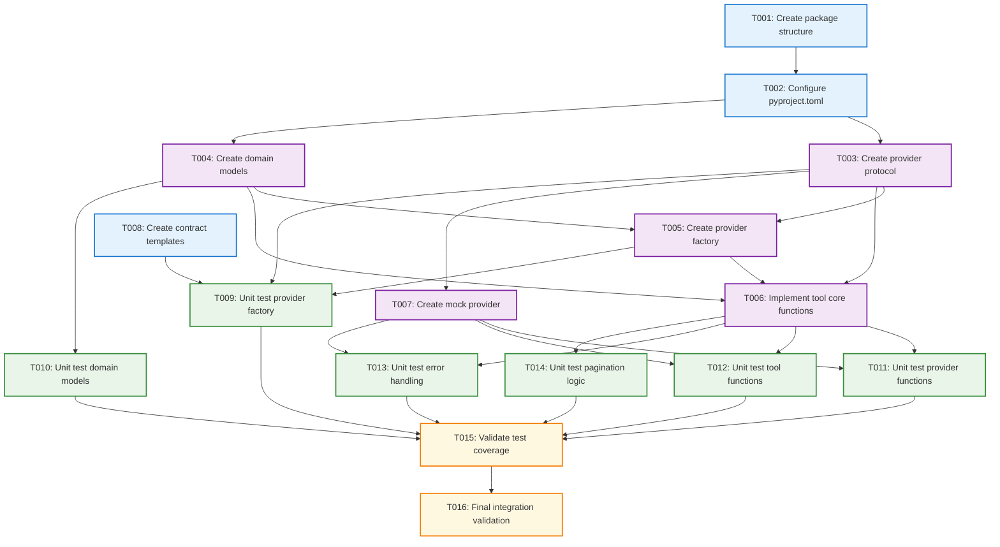

# Tasks: Core Abstractions and Domain Logic (AAP-55729)

**Input**: Design documents from `/specs/004-tool-management/`
**Prerequisites**: plan.md (required), research.md, data-model.md, contracts/

## Task Overview

This ticket delivers the foundational abstraction layer for tool management, creating provider-agnostic architecture with core domain logic, and validates the design with a mock provider implementation. All functionality includes passing tests.

**Tech Stack**: Python 3.12+, FastAPI, SQLAlchemy 2.0, pytest, Redis
**Package**: `nexus_tool_manager`
**Source Directory**: `./src/nexus_tool_manager/`

## Implementation Dependencies



## Phase 3.1: Package Setup and Configuration

### T001: Create nexus_tool_manager package structure ✅ COMPLETED
- [x] Create `src/nexus_tool_manager/` directory
- [x] Create `src/nexus_tool_manager/__init__.py`
- [x] Create `src/nexus_tool_manager/lib/` directory
- [x] Create `src/nexus_tool_manager/lib/__init__.py`
- [x] Create `src/nexus_tool_manager/lib/providers/` directory
- [x] Create `src/nexus_tool_manager/lib/providers/__init__.py`
- [x] Verify package structure is properly organized

### T002: Configure package in pyproject.toml ✅ COMPLETED
- [x] Add package directory mapping: `nexus_tool_manager = "src/nexus_tool_manager"`
- [x] Ensure proper Python package structure with `__init__.py` files
- [x] Include package in build configuration and dependency management
- [x] Add required dependencies: mcp library, httpx, Redis client
- [x] Verify package can be imported and installed correctly
- [x] Add basic import test to verify package setup

## Phase 3.2: Core Abstractions

### T003 [P]: Define ToolProviderAdapter Protocol ✅ COMPLETED
**File**: `./src/nexus_tool_manager/lib/providers/base.py`
- [x] Define `ToolProviderAdapter` Protocol with complete type hints
- [x] Method: `validate_connection() -> ValidationResult`
- [x] Method: `refresh_tools() -> List[ToolMetadata]`
- [x] Method: `get_tool_schema(tool_name: str) -> ToolSchema`
- [x] Method: `test_tool(tool_name: str, params: Dict) -> ToolResult`
- [x] Add complete docstrings for each method's contract
- [x] Include timeout handling specifications in protocol

### T004 [P]: Create domain models and exceptions ✅ COMPLETED
**File**: `./src/nexus_tool_manager/lib/tool_core.py`
- [x] Domain models (dataclasses): `Provider`, `Tool`, `ToolParameter`, `ToolExecution`
- [x] All models with complete type hints and validation
- [x] Exceptions: `ProviderError`, `ToolNotFoundError`, `ValidationError`, `ProviderNotFoundError`
- [x] Repository interfaces (protocols) for data persistence abstraction
- [x] Cache adapter interfaces for future Redis integration
- [x] Comprehensive docstrings for all domain types

### T005 [P]: Implement provider factory ✅ COMPLETED
**File**: `./src/nexus_tool_manager/lib/providers/factory.py`
- [x] Registry pattern for provider type registration
- [x] Factory method to instantiate providers by type: `create_provider(provider_type: str, config: Dict) -> ToolProviderAdapter`
- [x] Thread-safe registration with proper locking
- [x] Type validation for registered providers
- [x] Error handling for unknown provider types
- [x] Support for dynamic provider registration

### T006: Implement core tool management functions ✅ COMPLETED
**File**: `./src/nexus_tool_manager/lib/tool_core.py` (extends T004)
- [x] **Provider Management Functions**:
  - [x] `register_provider(config: Dict) -> str`: Add new provider with validation
  - [x] `list_providers(filters: Dict, pagination: Dict) -> List[Provider]`: Query providers with filters and pagination
  - [x] `get_provider_detail(provider_id: str) -> Provider`: Retrieve single provider with configuration
  - [x] `update_provider(provider_id: str, updates: Dict) -> Provider`: Modify provider settings
  - [x] `delete_provider(provider_id: str) -> bool`: Soft delete provider
  - [x] `validate_provider_connection(provider_id: str) -> ValidationResult`: Test provider connectivity
- [x] **Tool Management Functions**:
  - [x] `refresh_tools(provider_id: str) -> RefreshResult`: Discover/update tools from provider
  - [x] `list_tools(filters: Dict, pagination: Dict) -> List[Tool]`: Query tools with filters and pagination
  - [x] `get_tool_detail(tool_id: str) -> Tool`: Retrieve single tool with schema
  - [x] `update_tool_enabled(tool_id: str, enabled: bool) -> Tool`: Enable/disable tool
  - [x] `bulk_update_tools(tool_ids: List[str], enabled: bool) -> BulkResult`: Batch enable/disable operations
  - [x] `get_tool_metrics_summary(filters: Dict) -> MetricsSummary`: Aggregate usage statistics (mock implementation)
  - [x] `list_executions(filters: Dict, pagination: Dict) -> List[ToolExecution]`: Query execution history (mock implementation)
- [x] Add structured logging hooks and provider timeout handling
- [x] Implement keyset pagination with bracket filters for all list functions
- [x] All functions return proper result types with error handling

### T007 [P]: Create mock provider for testing ✅ COMPLETED
**File**: `./tests/fixtures/mock_provider.py`
- [x] Implements `ToolProviderAdapter` Protocol completely
- [x] Returns predefined test tools and schemas
- [x] Simulates successful and error scenarios (timeouts, auth failures, connection errors)
- [x] Configurable response delays for timeout testing
- [x] Support for different tool configurations (simple tools, complex parameters)
- [x] Mock tool schema generation with various parameter types
- [x] Used to validate core abstractions work correctly

### T008 [P]: Create contract YAML templates ✅ COMPLETED
**File**: `./specs/004-tool-management/contracts/`
- [x] Define expected API contracts (will be implemented in later tickets)
- [x] Include keyset pagination patterns in all list endpoints
- [x] Document bracket filter syntax with all supported operators
- [x] Specify error response formats following RFC 7807
- [x] Template covers all future API endpoints for provider and tool management
- [x] Include rate limiting and metrics endpoints in contracts

## Phase 3.3: Test Implementation (TDD) ✅ COMPLETED

### T009 [P]: Unit test provider factory ✅ COMPLETED
**File**: `./tests/unit/tool_core/test_provider_factory.py`
- [x] Test provider factory registration and retrieval
- [x] Test thread-safe registration with concurrent access
- [x] Test factory validates provider types and raises errors for invalid types
- [x] Test mock provider successfully registered in factory
- [x] Test error handling for unknown provider types
- [x] Test factory can create providers with different configurations
- [x] Achieve ≥80% coverage for factory.py

### T010 [P]: Unit test domain models ✅ COMPLETED
**File**: `./tests/unit/tool_core/test_domain_models.py`
- [x] Test domain model validation and serialization
- [x] Test all dataclass field validation
- [x] Test model relationships and references
- [x] Test exception handling and custom error types
- [x] Test repository interface protocols
- [x] Test cache adapter interfaces
- [x] Validate all domain types work correctly

### T011 [P]: Unit test provider functions ✅ COMPLETED
**File**: `./tests/unit/tool_core/test_provider_functions.py`
- [x] Test all provider core functions with mock provider
- [x] Test provider registration with validation
- [x] Test provider listing with filters and pagination
- [x] Test provider updates (full and partial)
- [x] Test provider soft delete functionality
- [x] Test provider connection validation
- [x] Test error scenarios and timeout handling
- [x] Achieve ≥80% coverage for provider functions

### T012 [P]: Unit test tool functions ✅ COMPLETED
**File**: `./tests/unit/tool_core/test_tool_functions.py`
- [x] Test all tool core functions with mock provider
- [x] Test tool refresh from provider
- [x] Test tool listing with filters and pagination
- [x] Test tool enablement and bulk operations
- [x] Test tool detail retrieval with schema
- [x] Test metrics and execution history (mock)
- [x] Test error scenarios and provider failures
- [x] Achieve ≥80% coverage for tool functions

### T013 [P]: Unit test error handling ✅ COMPLETED
**File**: `./tests/unit/tool_core/test_error_handling.py`
- [x] Test error handling and timeout scenarios
- [x] Test provider connection failures
- [x] Test tool discovery failures
- [x] Test invalid configurations
- [x] Test network timeouts and retries
- [x] Test graceful degradation patterns
- [x] Test error propagation and logging

### T014 [P]: Unit test pagination logic ✅ COMPLETED
**File**: `./tests/unit/tool_core/test_pagination_logic.py`
- [x] Validate pagination and filtering logic
- [x] Test keyset pagination with cursors
- [x] Test bracket filter notation parsing
- [x] Test filter operators (eq, ne, contains, gt, gte, lt, lte, in)
- [x] Test pagination edge cases (empty results, single page)
- [x] Test next_cursor and has_more logic
- [x] Test combined filters and pagination

## Phase 3.4: Validation and Integration

### T015: Validate test coverage ✅ COMPLETED
**File**: Multiple test files
- [x] Run test coverage analysis for all tool_core.py functions
- [x] Ensure ≥80% coverage for tool_core.py (Achieved 93% coverage)
- [x] Verify all unit tests properly isolated (no database, no external services)
- [x] All tests must pass with zero failures (116/116 tests passing)
- [x] Generate coverage report and review uncovered lines
- [x] Document any intentionally uncovered code

### T016: Final integration validation ✅ COMPLETED
**File**: Integration validation across modules
- [x] Can register mock provider → validate connection → refresh tools → list tools → enable tool using pure domain logic
- [x] Verify provider factory works with mock provider
- [x] Verify all core functions integrate properly
- [x] Test complete workflow from provider registration to tool enablement
- [x] Validate logging and error handling throughout workflow
- [x] Confirm architecture supports future provider implementations

## Parallel Execution Strategy

**Phase 3.2 Core Abstractions** (All can run in parallel):
```bash
# Launch T003-T008 together:
Task: "Define ToolProviderAdapter Protocol in ./src/nexus_tool_manager/lib/providers/base.py"
Task: "Create domain models and exceptions in ./src/nexus_tool_manager/lib/tool_core.py"
Task: "Implement provider factory in ./src/nexus_tool_manager/lib/providers/factory.py"
Task: "Create mock provider for testing in ./tests/fixtures/mock_provider.py"
Task: "Create contract YAML templates in ./specs/004-tool-management/contracts/"
```

**Phase 3.3 Test Implementation** (All can run in parallel after core abstractions):
```bash
# Launch T009-T014 together:
Task: "Unit test provider factory in ./tests/unit/tool_core/test_provider_factory.py"
Task: "Unit test domain models in ./tests/unit/tool_core/test_domain_models.py"
Task: "Unit test provider functions in ./tests/unit/tool_core/test_provider_functions.py"
Task: "Unit test tool functions in ./tests/unit/tool_core/test_tool_functions.py"
Task: "Unit test error handling in ./tests/unit/tool_core/test_error_handling.py"
Task: "Unit test pagination logic in ./tests/unit/tool_core/test_pagination_logic.py"
```

## Dependencies

**Sequential Dependencies**:
- T001-T002: Package setup must complete first
- T006: Depends on T003, T004, T005 (core functions need protocols, models, and factory)
- T015-T016: Validation depends on all tests passing

**Parallel Groups**:
- T003, T004, T005, T007, T008: Core abstractions (different files)
- T009, T010, T011, T012, T013, T014: All unit tests (different files)

## Success Criteria

### Package Configuration ✅ COMPLETED
- [x] New package `nexus_tool_manager` properly configured in pyproject.toml
- [x] Package directory mapping: `nexus_tool_manager = "src/nexus_tool_manager"` added
- [x] All necessary `__init__.py` files created for proper Python package structure
- [x] Package can be imported and installed correctly

### Core Abstractions ✅ COMPLETED
- [x] `ToolProviderAdapter` Protocol exists with all 4 required methods documented
- [x] All Protocol methods have complete type hints and docstrings
- [x] Provider factory can register and retrieve adapters by type string
- [x] Provider factory registration is thread-safe
- [x] Factory validates provider types and raises errors for invalid types
- [x] Domain models (Provider, Tool, ToolParameter, ToolExecution) defined with complete type hints
- [x] All domain exceptions defined with clear inheritance hierarchy
- [x] Repository interface protocols defined for data persistence abstraction
- [x] Cache adapter interfaces defined for future Redis integration

### Core Functions ✅ COMPLETED
- [x] `tool_core.py` exports complete provider management API (6 functions) with docstrings
- [x] `tool_core.py` exports complete tool management API (7 functions) with docstrings
- [x] All tool_core provider functions work with mock provider
- [x] All tool_core tool functions work with mock provider
- [x] Core functions implement keyset pagination with bracket filters
- [x] Pagination logic returns next_cursor and has_more correctly
- [x] Filter logic supports: eq, ne, contains, gt, gte, lt, lte, in operators
- [x] Structured logging integrated with proper log levels
- [x] Provider timeout handling works correctly (configurable timeout)

### Mock Provider and Testing ✅ COMPLETED
- [x] Mock provider successfully registered in factory for testing
- [x] Mock provider implements all `ToolProviderAdapter` methods correctly
- [x] Error scenarios properly handled (timeout, connection error, auth failure)
- [x] Mock provider can simulate all error scenarios
- [x] Contract YAML templates created for API contracts
- [x] Contract templates include keyset pagination patterns
- [x] Contract templates document bracket filter syntax
- [x] Contract templates specify error response formats (RFC 7807)

### Test Coverage and Quality ✅ COMPLETED
- [x] **ALL TESTS PASS** - 116/116 tests passing with zero failures
- [x] Test coverage ≥80% for tool_core.py - **ACHIEVED 93% COVERAGE**
- [x] All unit tests properly isolated (no database, no external services)
- [x] Can register mock provider → validate connection → refresh tools → list tools → enable tool using pure domain logic

## Notes

- [P] tasks = different files, no dependencies between them
- This ticket establishes core architecture without any specific provider implementation
- The provider-agnostic design ensures future providers can be added without modifying core logic
- Infrastructure setup (FastAPI, database, dependencies, etc.) is handled in separate tickets
- All functionality uses pure domain logic with mock implementations for future integration points
- Focus on establishing clean abstractions and comprehensive test coverage
