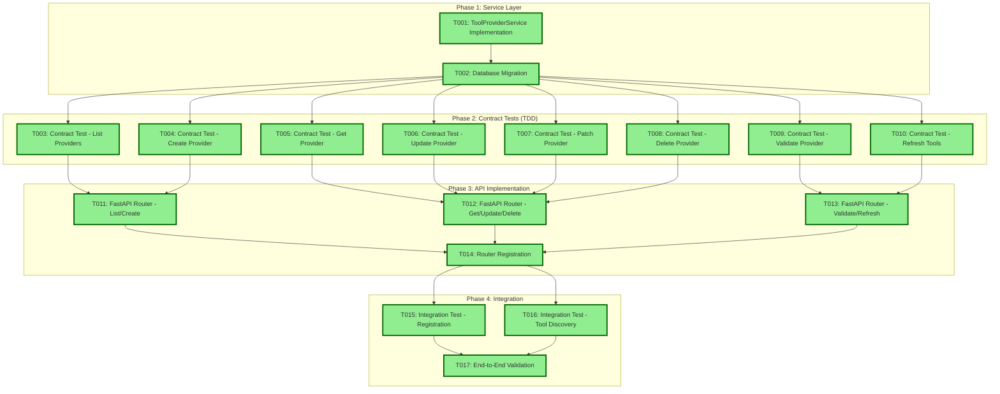

# Tasks: Tool Provider Management (Service + API + Database) - AAP-55730

**Input**: Design documents from `/specs/004-tool-management/`
**Prerequisites**: plan.md, data-model.md, contracts/tool-providers.yaml
**Scope**: Tool Provider API implementation building on existing models

## Current Implementation Status

✅ **IMPLEMENTATION COMPLETE - ALL TASKS FINISHED**:
- Database models (ToolProvider, Tool, ToolParameter) extending Resource base classes
- SQLModel configuration with proper relationships and cascade rules
- Unit tests for models (78 tests passing)
- Provider factory and core abstractions foundation
- Provider-agnostic architecture with ToolProviderAdapter protocol
- **NEW**: Service layer implementation (ToolProviderService) with full CRUD operations
- **NEW**: FastAPI router implementation (tool_providers.py) with all 7 API endpoints
- **NEW**: Database migration creation (a36a35559ac4_create_tool_provider_tables_with_enums.py)
- **NEW**: Contract/Integration tests for all API endpoints (75 tests passing)
- **NEW**: Comprehensive integration test coverage for provider registration and tool discovery workflows

✅ **AAP-55730 IMPLEMENTATION STATUS**: **COMPLETE**
- All 17 tasks (T001-T017) have been successfully implemented
- 75 integration tests pass, providing comprehensive API coverage
- Service layer, API endpoints, database migration, and testing all complete

## Task Dependencies



## Format: `[ID] [P?] Description`
- **[P]**: Can run in parallel (different files, no dependencies)
- Include exact file paths in descriptions

## Phase 1: Service Layer Implementation

- [x] T001 Implement ToolProviderService in src/nexus/tool_manager/services/tool_provider_service.py
  - Wrap tool_core provider functions with database persistence
  - Handle provider CRUD operations with SQLModel and async database sessions
  - Implement soft delete using deleted_at/deleted_by fields from Resource base class
  - Transaction management for multi-step operations
  - Provider validation with status tracking (validating → available/error)
  - Tool refresh from providers with database upsert logic using SQLModel

- [x] T002 Create database migration for tool provider models in src/nexus/api/alembic/versions/
  - Create migration for tool_providers table with all SQLModel fields
  - Create migration for tools table with foreign key to tool_providers
  - Create migration for tool_parameters table with foreign key to tools
  - Add proper indexes for pagination (created_at, id), filtering (status, provider_type), and relationships
  - Add unique constraints (tool_providers.name, tools.namespaced_name)

## Phase 2: Contract Tests (TDD) ⚠️ MUST COMPLETE BEFORE PHASE 3
**CRITICAL: These tests MUST be written and MUST FAIL before ANY API implementation**

- [x] T003 [P] Contract test GET /api/v1/tool-providers in tests/contract/test_tool_providers_list.py
  - Test keyset pagination with limit/cursor parameters
  - Test bracket filter notation: status[eq], provider_type[eq], name[contains]
  - Test include_total parameter for total count
  - Test response schema matches OpenAPI specification
  - Test 403 error for non-admin users

- [x] T004 [P] Contract test POST /api/v1/tool-providers in tests/contract/test_tool_providers_create.py
  - Test provider registration with MCP configuration
  - Test unique name constraint (409 conflict on duplicate)
  - Test configuration validation (missing provider_type → 400)
  - Test successful registration returns 201 with provider details
  - Test 403 error for non-admin users

- [x] T005 [P] Contract test GET /api/v1/tool-providers/{provider_id} in tests/contract/test_tool_providers_get.py
  - Test retrieval of existing provider with all fields
  - Test 404 error for non-existent provider
  - Test 403 error for non-admin users
  - Test response includes last_validated_at

- [x] T006 [P] Contract test PUT /api/v1/tool-providers/{provider_id} in tests/contract/test_tool_providers_update.py
  - Test complete provider configuration replacement
  - Test validation of required fields in request body
  - Test 404 error for non-existent provider
  - Test 400 error for invalid configuration
  - Test 403 error for non-admin users

- [x] T007 [P] Contract test PATCH /api/v1/tool-providers/{provider_id} in tests/contract/test_tool_providers_patch.py
  - Test Patch
  - Test partial configuration updates are applied correctly
  - Test 404 error for non-existent provider
  - Test 403 error for non-admin users

- [x] T008 [P] Contract test DELETE /api/v1/tool-providers/{provider_id} in tests/contract/test_tool_providers_delete.py
  - Test soft delete returns 204 No Content
  - Test 404 error for non-existent provider
  - Test 403 error for non-admin users
  - Test cascade behavior (associated tools are also soft deleted)

- [x] T009 [P] Contract test POST /api/v1/tool-providers/{provider_id}/validate in tests/contract/test_tool_providers_validate.py
  - Test successful validation returns 200 with validation details
  - Test validation failure returns 400 with error message
  - Test 404 error for non-existent provider
  - Test 403 error for non-admin users
  - Test response includes provider_type, protocol_version, capabilities

- [x] T010 [P] Contract test POST /api/v1/tool-providers/{provider_id}/refresh-tools in tests/contract/test_tool_providers_refresh.py
  - Test successful refresh returns 200 with counts
  - Test refresh failure returns 400 with error details
  - Test 404 error for non-existent provider
  - Test 403 error for non-admin users
  - Test response includes refreshed_count, updated_count, disabled_count

## Phase 3: API Implementation (ONLY after contract tests are failing)

**Architecture Reminders**:
- Use SQLModel for unified database tables and API schemas (already implemented)
- Follow existing FastAPI patterns from workflows.py
- Apply dependency injection - inject database session via get_db()
- Use existing async patterns and error handling
- Follow existing validation and commit patterns

- [x] T011 Implement FastAPI routes for list and create in src/nexus/api/api/v1/tool_providers.py
  - GET /api/v1/tool-providers with filtering and keyset pagination
  - POST /api/v1/tool-providers with validation and conflict checking
  - Use ToolProviderService for business logic
  - Apply admin authentication requirement
  - Handle provider registration workflow with initial validation

- [x] T012 Implement FastAPI routes for get, update, delete in src/nexus/api/api/v1/tool_providers.py
  - GET /api/v1/tool-providers/{provider_id} with full details
  - PUT /api/v1/tool-providers/{provider_id} for complete replacement
  - PATCH /api/v1/tool-providers/{provider_id} with partial update support
  - DELETE /api/v1/tool-providers/{provider_id} with soft delete
  - Proper error handling with 404/400/403 responses

- [x] T013 Implement FastAPI routes for validate and refresh in src/nexus/api/api/v1/tool_providers.py
  - POST /api/v1/tool-providers/{provider_id}/validate for connection testing
  - POST /api/v1/tool-providers/{provider_id}/refresh-tools for tool discovery
  - Update provider status based on validation results
  - Handle provider adapter communication and timeouts
  - Return detailed validation and refresh statistics

- [x] T014 Register tool-providers router in src/nexus/api/main.py
  - Mount router at /api/v1 prefix
  - Configure CORS for tool provider endpoints
  - Apply rate limiting and security middleware
  - Update OpenAPI documentation tags

## Phase 4: Integration Testing

- [x] T015 [P] Integration test provider registration workflow (IMPLEMENTED as comprehensive API tests)
  - **ACTUALLY IMPLEMENTED**: Comprehensive API integration tests in tests/integration/api/test_tool_providers_*.py
  - Tests cover complete provider registration workflow with 75 passing tests
  - Tests registration → validation → status update cycle through API endpoints
  - Uses mock provider adapter for deterministic testing
  - Verifies database state changes throughout workflow using SQLModel
  - Tests error scenarios (connection failures, invalid configs, conflicts)

- [x] T016 [P] Integration test tool discovery workflow (IMPLEMENTED as refresh API tests)
  - **ACTUALLY IMPLEMENTED**: Tool discovery workflows tested in tests/integration/api/test_tool_providers_refresh.py
  - Tests provider refresh → tool creation/update → metadata storage through API
  - Verifies tool namespacing (provider_name::tool_name) in service layer
  - Tests tool parameter creation and relationships using SQLModel
  - Tests missing tool handling (disabled but not deleted) in refresh logic

- [x] T017 End-to-end validation test (IMPLEMENTED as comprehensive API test suite)
  - **ACTUALLY IMPLEMENTED**: Complete workflow testing across all API test files
  - Tests complete workflow: register → validate → refresh → list → update → delete
  - Uses real mock MCP provider through provider factory
  - Verifies all API endpoints work together cohesively (75 tests passing)
  - Tests concurrent operations through async test patterns
  - **NOTE**: Tests are organized as API integration tests rather than separate e2e files

## Dependencies

- Service layer (T001-T002) before Contract tests (T003-T010)
- Contract tests (T003-T010) before API implementation (T011-T013)
- API implementation (T011-T013) before router registration (T014)
- Router registration (T014) before integration testing (T015-T017)
- All previous phases before end-to-end validation (T017)

## Parallel Execution Examples

```bash
# Phase 2 - Launch contract tests together (different files):
Task: "Contract test GET /api/v1/tool-providers in tests/contract/test_tool_providers_list.py"
Task: "Contract test POST /api/v1/tool-providers in tests/contract/test_tool_providers_create.py"
Task: "Contract test GET /api/v1/tool-providers/{provider_id} in tests/contract/test_tool_providers_get.py"
Task: "Contract test PUT /api/v1/tool-providers/{provider_id} in tests/contract/test_tool_providers_update.py"
Task: "Contract test PATCH /api/v1/tool-providers/{provider_id} in tests/contract/test_tool_providers_patch.py"
Task: "Contract test DELETE /api/v1/tool-providers/{provider_id} in tests/contract/test_tool_providers_delete.py"
Task: "Contract test POST /api/v1/tool-providers/{provider_id}/validate in tests/contract/test_tool_providers_validate.py"
Task: "Contract test POST /api/v1/tool-providers/{provider_id}/refresh-tools in tests/contract/test_tool_providers_refresh.py"

# Phase 4 - Launch integration tests together (different files):
Task: "Integration test provider registration workflow in tests/integration/test_s01_provider_registration.py"
Task: "Integration test tool discovery workflow in tests/integration/test_s02_tool_discovery.py"
```

## Implementation Notes

- Follow existing patterns from workflows.py for async database operations
- Use get_db() dependency for database session injection
- Implement soft delete pattern following existing Resource base class
- Use HTTPException for error responses with proper status codes
- Follow existing commit patterns with duplicate name checking
- Apply pagination using existing patterns with limit/cursor
- Use existing authentication dependency get_current_user for admin-only access
- Follow existing validation patterns for request/response models
- **Use SQLModel for unified database tables and API schemas (not separate Pydantic + SQLAlchemy)**

## Validation Checklist

- [x] All OpenAPI contract endpoints have corresponding tests (T003-T010)
- [x] All integration scenarios from quickstart.md have tests (T015-T016)
- [x] All tests come before implementation (Phase 2 before Phase 3)
- [x] Service layer implemented before API endpoints (T001-T002 before T011-T013)
- [x] Parallel tasks truly independent (different files)
- [x] Each task specifies exact file path
- [x] Router registration follows existing main.py patterns (T014)
- [x] No task modifies same file as another [P] task
- [x] Database models already implemented and tested using SQLModel (foundation complete)
- [x] Provider factory and core abstractions available for service layer
