# Implementation Plan: Initial Development Environment Setup

**Branch**: `005-initial-development-environment` | **Date**: 2025-10-08 | **Spec**: [spec.md](spec.md)
**Input**: Feature specification from `specs/005-initial-development-environment/spec.md`

## Execution Flow (/plan command scope)
```
1. Load feature spec from Input path
   → If not found: ERROR "No feature spec at {path}"
2. Fill Technical Context (scan for NEEDS CLARIFICATION)
   → Detect Project Type from context (web=frontend+backend, mobile=app+api)
   → Set Structure Decision based on project type
3. Fill the Constitution Check section based on the content of the constitution document.
4. Evaluate Constitution Check section below
   → If violations exist: Document in Complexity Tracking
   → If no justification possible: ERROR "Simplify approach first"
   → Update Progress Tracking: Initial Constitution Check
5. Execute Phase 0 → research.md
   → If NEEDS CLARIFICATION remain: ERROR "Resolve unknowns"
6. Execute Phase 1 → contracts, data-model.md, quickstart.md, agent-specific template file (e.g., `CLAUDE.md` for Claude Code, `.github/copilot-instructions.md` for GitHub Copilot, `GEMINI.md` for Gemini CLI, `QWEN.md` for Qwen Code or `AGENTS.md` for opencode).
7. Re-evaluate Constitution Check section
   → If new violations: Refactor design, return to Phase 1
   → Update Progress Tracking: Post-Design Constitution Check
8. Plan Phase 2 → Describe task generation approach (DO NOT create tasks.md)
9. STOP - Ready for /tasks command
```

**IMPORTANT**: The /plan command STOPS at step 8. Phases 2-4 are executed by other commands:
- Phase 2: /tasks command creates tasks.md
- Phase 3-4: Implementation execution (manual or via tools)

## Summary

This feature provides a containerized PostgreSQL 17 database for local development using podman-compose. The setup includes:
- PostgreSQL 17 container with persistent volume storage
- Environment variable configuration for port customization (NEXUS_DB_PORT, default 5432)
- Database named `nexus_api` with admin/admin credentials
- Make commands integrated into existing Makefile workflow (db-run foreground, db-clean)
- CI configuration with GitHub Actions database service
- Documentation updates for developer onboarding

Technical approach: Use podman-compose.yml at repository root, use podman-compose for container orchestration, integrate with existing uv/make workflow, maintain explicit configuration principle from constitution.

## Implementation Architecture

```mermaid
graph TB
    subgraph "Phase 0: Research"
        R1[research.md]
        R1 --> R1A[Docker/Podman Compatibility]
        R1 --> R1B[PostgreSQL 17 Configuration]
        R1 --> R1C[GitHub Actions Services]
        R1 --> R1D[Make Integration Patterns]
    end

    subgraph "Phase 1: Design Artifacts"
        DM[data-model.md]
        CON[contracts/database-config.yml]
        QS[quickstart.md]
        AGENT[CLAUDE.md]

        DM --> DM1[Container Configuration]
        DM --> DM2[Environment Configuration]
        DM --> DM3[Volume Configuration]
        DM --> DM4[HealthCheck Configuration]
        DM --> DM5[Connection Configuration]

        CON --> CON1[Environment Variable Schema]
        CON --> CON2[Validation Rules]
        CON --> CON3[Test Scenarios]
    end

    subgraph "Phase 2: Tasks - /tasks command"
        T1[Infrastructure Config Tasks]
        T4[Make Command Tasks]
        T5[CI Integration Tasks]
        T6[Documentation Tasks]
    end

    subgraph "Implementation Output"
        DC[podman-compose.yml]
        ENV[.env.example]
        MK[Makefile - updated]
        CI[.github/workflows/ci.yml]
        DOC[README.md - updated]
    end

    R1 --> DM
    R1 --> CON
    R1 --> QS

    DM --> T1
    DM --> T4

    QS --> T6

    T1 --> DC
    T1 --> ENV
    T4 --> MK
    T5 --> CI
    T6 --> DOC

    AGENT -.->|Context for Implementation| T4

    Note1[No tests: Infrastructure-only setup]

    style R1 fill:#e1f5ff
    style DM fill:#d4f1d4
    style CON fill:#d4f1d4
    style QS fill:#d4f1d4
    style DC fill:#fff4d4
    style ENV fill:#fff4d4
    style MK fill:#fff4d4
    style CI fill:#fff4d4
    style DOC fill:#fff4d4
```



## Technical Context

**Language/Version**: Python 3.12 (YAML for podman-compose configuration)
**Primary Dependencies**: `podman-compose` (dev dependency), PostgreSQL 17 official image
**Storage**: PostgreSQL 17 with named volume `nexus_postgres_data` for data persistence
**Testing**: Infrastructure-only setup, no application tests (health checks for validation)
**Target Platform**: Linux, macOS, Windows (cross-platform container support)
**Project Type**: single (backend Python FastAPI project with infrastructure setup)
**Container Runtime**: Podman
**Container Compose**: `podman-compose`
**Environment Configuration**: Environment variables with NEXUS_ prefix (NEXUS_DB_PORT, NEXUS_DB_HOST, NEXUS_DB_USER, NEXUS_DB_PASSWORD, NEXUS_DB_NAME)
**Performance Goals**: Database startup <10 seconds, connection establishment <1 second
**Constraints**: Must work with podman-compose, no hardcoded values, empty database on first run
**Scale/Scope**: Single PostgreSQL container for local development, CI database service configuration
**Execution Mode**: Foreground execution for immediate log visibility (db-run runs without detached mode)

## Constitution Check
*GATE: Must pass before Phase 0 research. Re-check after Phase 1 design.*

### Core Principles Compliance

✅ **I. Modular Architecture**
- Podman-compose configuration is independent and self-contained
- Database connection parameters explicitly configurable via environment variables
- No hidden dependencies - all configuration in podman-compose.yml and .env.example

✅ **II. Test-Driven Development**
- Infrastructure-only setup with no application code yet
- Health checks verify container readiness
- Manual validation following quickstart.md for acceptance testing
- Future features will add proper integration tests

✅ **III. Explicit Configuration**
- All database parameters configurable via environment variables with NEXUS_ prefix
- No magic values - defaults documented in .env.example
- Version pinned (PostgreSQL 17) for reproducibility
- Port configuration explicit (default 5432, overridable via NEXUS_DB_PORT)

✅ **IV. Observability First**
- Foreground execution shows logs immediately in terminal
- Database connection parameters displayed on startup (excluding password)
- Health checks in docker-compose.yml for container status monitoring

✅ **V. API Stability**
- Database schema intentionally empty (delegated to future migration features)
- Connection interface stable (standard PostgreSQL protocol)
- Configuration changes via environment variables (non-breaking)

### Development Standards Compliance

✅ **Code Quality Requirements**
- YAML files validated with yamllint (existing tool in project)
- Health checks verify database readiness
- Documentation updates mandatory (README.md)

✅ **Documentation Standards**
- README.md updated with database setup instructions
- Connection parameters documented in .env.example with inline comments
- Makefile commands documented with ## help text
- Troubleshooting section for common issues (port conflicts, startup failures)

✅ **Workflow & Process**
- Changes via feature branch (005-initial-development-environment)
- CI pipeline updated with database service configuration
- Pre-commit hooks apply to YAML files (yamllint, yamlfmt)

## Project Structure

### Documentation (this feature)
```
specs/005-initial-development-environment/
├── plan.md              # This file (/plan command output)
├── research.md          # Phase 0 output (/plan command)
├── data-model.md        # Phase 1 output (/plan command)
├── quickstart.md        # Phase 1 output (/plan command)
├── contracts/           # Phase 1 output (/plan command)
│   └── database-config.yml
└── tasks.md             # Phase 2 output (/tasks command - NOT created by /plan)
```

### Source Code (repository root)
```
# Option 1: Single project (SELECTED - matches existing structure)
nexus/
├── podman-compose.yml         # NEW: Container orchestration
├── .env.example               # NEW: Environment variable template
├── Makefile                   # UPDATED: Add db-run (foreground), db-clean
├── README.md                  # UPDATED: Add database setup section
├── .github/
│   └── workflows/
│       └── ci.yml             # UPDATED: Add database service
├── src/
│   └── (existing structure)
└── tests/
    └── (existing structure)
```

**Structure Decision**: Option 1 (Single project) - matches existing src/ and tests/ layout

## Phase 0: Outline & Research

### Research Areas

No NEEDS CLARIFICATION markers found in specification (all resolved during /clarify). Research focuses on best practices:

1. **Podman-compose configuration**
   - Research: Podman-compose best practices
   - Goal: Single podman-compose.yml for container orchestration
   - Key consideration: Volume mounting, networking, environment variable handling

2. **PostgreSQL 17 official image configuration**
   - Research: Best practices for development environment setup
   - Goal: Minimal, secure configuration for local development
   - Key areas: POSTGRES_USER, POSTGRES_PASSWORD, POSTGRES_DB environment variables

3. **GitHub Actions PostgreSQL service configuration**
   - Research: Service container setup patterns for CI
   - Goal: Consistent database configuration between local and CI
   - Key consideration: Health checks, readiness probes

4. **Make integration patterns**
   - Research: Best practices for container lifecycle management via Make
   - Goal: Simple, intuitive commands integrated with existing workflow
   - Key commands: db-run (foreground), db-clean (stop + purge)
   - Foreground execution: Immediate log visibility, Ctrl+C to stop

**Output**: research.md documenting findings and decisions

## Phase 1: Design & Contracts

*Prerequisites: research.md complete*

### Phase 1 Artifacts

1. **data-model.md**: Document configuration entities
   - Container Configuration Entity (PostgreSQL version, image, ports, volumes)
   - Environment Configuration Entity (NEXUS_DB_* variables with defaults)
   - Volume Configuration Entity (nexus_postgres_data volume lifecycle)
   - Connection Configuration Entity (host, port, user, password, database name)

2. **contracts/database-config.yml**: Database configuration contract
   - Required environment variables schema
   - Default values specification
   - Connection parameters validation rules
   - Port range constraints (1024-65535)
   - Note: Contract for documentation, no tests needed for infrastructure-only setup

3. **quickstart.md**: Developer onboarding validation
   - Step 1: Clone repository
   - Step 2: Copy .env.example to .env (optional)
   - Step 3: Run `make db-run` (foreground mode)
   - Step 4: Verify connection using psql or database tool
   - Step 5: Stop database with Ctrl+C
   - Step 6: Clean database with `make db-clean`
   - Success criteria: All steps complete without errors

4. **Update agent context**: Run `.specify/scripts/bash/update-agent-context.sh claude`
   - Add podman-compose to technology stack
   - Add PostgreSQL 17 to dependencies
   - Add make commands (db-run, db-clean) to workflow
   - Keep under 150 lines

**Output**: data-model.md, contracts/database-config.yml, quickstart.md, updated CLAUDE.md

## Phase 2: Task Planning Approach
*This section describes what the /tasks command will do - DO NOT execute during /plan*

### Task Generation Strategy

Tasks will be generated from Phase 1 artifacts:

1. **Infrastructure Configuration Tasks** [P = Parallel]
   - [P] Create podman-compose.yml with PostgreSQL 17 service
   - [P] Create .env.example with documented NEXUS_DB_* variables
   - [P] Update .gitignore to exclude .env file

2. **Make Command Implementation Tasks** (sequential - same Makefile)
   - Add runtime detection for podman-compose
   - Implement db-run make target (foreground execution)
   - Implement db-clean make target (stop + remove volume)

3. **CI Integration Tasks**
   - Update .github/workflows/ci.yml with database service
   - Add database service health check

4. **Documentation Tasks** [P = Parallel]
   - Update README.md with database setup section
   - Update README.md with make command documentation
   - Add troubleshooting section for common issues

### Ordering Strategy

- **Infrastructure-only setup**: No application tests needed
- **Dependency order**:
  1. Infrastructure files (podman-compose.yml, .env.example, .gitignore)
  2. Make targets implementation (runtime detection, db-run, db-clean)
  3. CI configuration
  4. Documentation
- **Parallel markers [P]**: Independent file creation tasks
- **Sequential**: Make target implementation (same Makefile, must be sequential)

### Estimated Output

8 numbered, dependency-ordered tasks in tasks.md

**IMPORTANT**: This phase is executed by the /tasks command, NOT by /plan

## Phase 3+: Future Implementation
*These phases are beyond the scope of the /plan command*

**Phase 3**: Task execution (/tasks command creates tasks.md)
**Phase 4**: Implementation (execute tasks.md following constitutional principles)
**Phase 5**: Validation (run tests, execute quickstart.md, verify cross-platform compatibility)

## Complexity Tracking
*Fill ONLY if Constitution Check has violations that must be justified*

No constitutional violations detected. All principles satisfied:
- Modular architecture maintained
- TDD approach enforced
- Explicit configuration via environment variables
- Observability via logs and health checks
- Stable interface (standard PostgreSQL protocol)

## Progress Tracking
*This checklist is updated during execution flow*

**Phase Status**:
- [x] Phase 0: Research complete (/plan command)
- [x] Phase 1: Design complete (/plan command)
- [x] Phase 2: Task planning complete (/plan command - describe approach only)
- [x] Phase 3: Tasks generated (/tasks command)
- [x] Phase 4: Implementation complete
- [x] Phase 5: Validation passed

**Gate Status**:
- [x] Initial Constitution Check: PASS
- [x] Post-Design Constitution Check: PASS
- [x] All NEEDS CLARIFICATION resolved (via /clarify session)
- [x] Complexity deviations documented (none - no violations)

**Phase 1 Artifacts Generated**:
- [x] research.md - Podman-compose configuration, PostgreSQL config, CI setup, Make patterns
- [x] data-model.md - Container, Environment, Volume, HealthCheck, Connection entities
- [x] contracts/database-config.yml - Environment schema, validation rules, test scenarios
- [x] quickstart.md - Developer onboarding validation guide
- [x] CLAUDE.md - Agent context updated with podman-compose, PostgreSQL 17, make commands

---
*Based on Constitution v1.0.0 - See `.specify/memory/constitution.md`*
