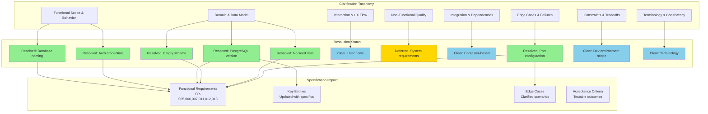
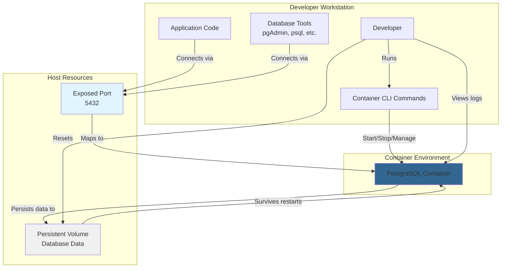

# Feature Specification: Initial Development Environment Setup

**Feature Branch**: `005-initial-development-environment`
**Created**: 2025-10-08
**Status**: Draft
**Input**: User description: "initial-development-environment. I want to include in this project an initial basic setup of a development environment based on containers (podman-compose) that can allow to developers to run easily the components and applications that will be required for the development of the application, starting with the postgresql database."

## Execution Flow (main)
```
1. Parse user description from Input
   � If empty: ERROR "No feature description provided"
2. Extract key concepts from description
   � Identify: actors, actions, data, constraints
3. For each unclear aspect:
   � Mark with [NEEDS CLARIFICATION: specific question]
4. Fill User Scenarios & Testing section
   � If no clear user flow: ERROR "Cannot determine user scenarios"
5. Generate Functional Requirements
   � Each requirement must be testable
   � Mark ambiguous requirements
6. Identify Key Entities (if data involved)
7. Run Review Checklist
   � If any [NEEDS CLARIFICATION]: WARN "Spec has uncertainties"
   � If implementation details found: ERROR "Remove tech details"
8. Return: SUCCESS (spec ready for planning)
```

---

## � Quick Guidelines
-  Focus on WHAT users need and WHY
- L Avoid HOW to implement (no tech stack, APIs, code structure)
- =e Written for business stakeholders, not developers

### Section Requirements
- **Mandatory sections**: Must be completed for every feature
- **Optional sections**: Include only when relevant to the feature
- When a section doesn't apply, remove it entirely (don't leave as "N/A")

### For AI Generation
When creating this spec from a user prompt:
1. **Mark all ambiguities**: Use [NEEDS CLARIFICATION: specific question] for any assumption you'd need to make
2. **Don't guess**: If the prompt doesn't specify something (e.g., "login system" without auth method), mark it
3. **Think like a tester**: Every vague requirement should fail the "testable and unambiguous" checklist item
4. **Common underspecified areas**:
   - User types and permissions
   - Data retention/deletion policies
   - Performance targets and scale
   - Error handling behaviors
   - Integration requirements
   - Security/compliance needs

---

## Clarifications

### Session 2025-10-08
- Q: What should the initial database be named? → A: nexus_api
- Q: What should the default username/password be for development? → A: admin / admin
- Q: Which PostgreSQL version should be used? → A: 17 (latest stable)
- Q: Should the system auto-select a different port if the default PostgreSQL port is already in use, or fail with a clear error? → A: Allow custom port configuration via environment variable
- Q: Is there an initial schema to apply during first startup, or should the database start empty? → A: Start empty (developers apply schema via migrations later)
- Q: Should the database include initial seed data for development purposes? → A: No seed data (preparation for future features addressing migrations/schemas)
- Q: What are the minimum system requirements for running the containerized database? → A: Deferred (not specified at this time)

### Clarification Process Visualization



---

## User Scenarios & Testing

### Primary User Story
As a new developer joining the project, I need to quickly set up a local development environment with a PostgreSQL database running in a container, so I can start developing application features without spending time manually installing and configuring database software. The setup should work consistently across different operating systems and be easily reproducible.

### Acceptance Scenarios
1. **Given** a developer has cloned the project repository, **When** they run the container setup command, **Then** a PostgreSQL database container should start successfully and be ready to accept connections
2. **Given** the PostgreSQL container is running, **When** the developer connects to it using standard database tools, **Then** they should be able to create tables, insert data, and run queries
3. **Given** the developer stops the container environment, **When** they restart it later, **Then** any data they created in the database should still be present
4. **Given** multiple developers are working on the same project, **When** they each run the container setup, **Then** they should all get identical PostgreSQL configurations with the same version and settings
5. **Given** the PostgreSQL container is running, **When** the developer stops or removes containers, **Then** the database data should be preserved in a persistent storage location

### Edge Cases
- What happens when the configured PostgreSQL port is already in use on the developer's machine?
- How does the system handle container startup failures (e.g., insufficient memory, disk space)?
- What happens when a developer needs to completely reset the database to a clean state?
- What happens if the PostgreSQL container crashes or stops unexpectedly?

## Requirements

### Functional Requirements
- **FR-001**: System MUST provide a single command to start the PostgreSQL database container in foreground mode
- **FR-002**: System MUST allow stopping the database container via standard interrupt signal (Ctrl+C)
- **FR-003**: System MUST persist PostgreSQL data between container restarts using persistent storage
- **FR-004**: System MUST expose the PostgreSQL database port to the host machine so developers can connect using database tools
- **FR-005**: System MUST configure PostgreSQL with username `admin` and password `admin` for development access
- **FR-006**: System MUST create an initial database named `nexus_api`
- **FR-007**: System MUST use PostgreSQL version 17
- **FR-008**: System MUST display PostgreSQL container logs in real-time for immediate visibility
- **FR-009**: System MUST provide a way to completely reset the database to a clean state, removing all data
- **FR-010**: System MUST document the database connection parameters (host, port, username, password, database name) for developers
- **FR-011**: System MUST allow PostgreSQL port configuration via environment variable to avoid port conflicts
- **FR-012**: Database MUST start empty without initial schema (schema will be applied via future migration features)
- **FR-013**: Database MUST NOT include seed data (preparation for future features addressing migrations and schemas)
- **FR-014**: System MUST use Podman container runtime and podman-compose for container orchestration

### Key Entities

- **Database Container**: A containerized PostgreSQL 17 instance configured for development use with persistent storage and exposed ports
- **Persistent Storage**: A volume that stores PostgreSQL data files to ensure data survives container restarts and removals
- **Database Connection Configuration**: Settings that define host address, port number (configurable via environment variable), database name (nexus_api), username (admin), and password (admin) for connecting to PostgreSQL
- **Container Environment Configuration**: Definitions that specify PostgreSQL version (17), port mappings, volume mounts, environment variables, and startup behavior

---

## Architecture Visualization



---

## Review & Acceptance Checklist

### Content Quality
- [x] No implementation details (languages, frameworks, APIs)
- [x] Focused on user value and business needs
- [x] Written for non-technical stakeholders
- [x] All mandatory sections completed

### Requirement Completeness
- [x] No [NEEDS CLARIFICATION] markers remain
- [x] Requirements are testable and unambiguous
- [x] Success criteria are measurable
- [x] Scope is clearly bounded
- [x] Dependencies and assumptions identified

---

## Execution Status

- [x] User description parsed
- [x] Key concepts extracted
- [x] Ambiguities marked
- [x] User scenarios defined
- [x] Requirements generated
- [x] Entities identified
- [x] Review checklist passed

---
