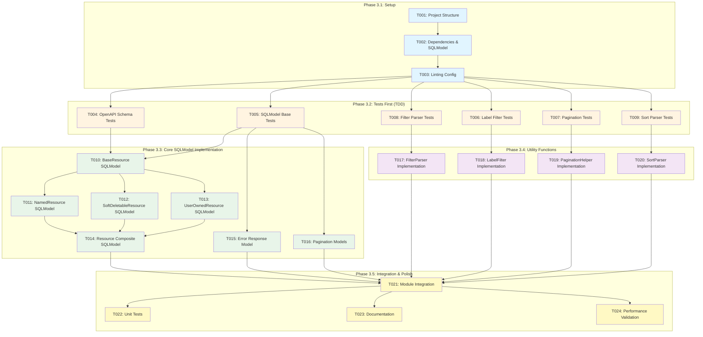

# Tasks: Shared API Resources and Conventions

**Input**: Design documents from `/specs/006-create-shared-resources/`
**Prerequisites**: plan.md (✓), research.md (✓), data-model.md (✓), contracts/ (✓)

## Execution Flow Summary

This feature creates a comprehensive shared library with OpenAPI schemas, SQLModel base classes, and reusable utility functions. The implementation generates base SQLModel classes representing the definitions in `006-create-shared-resources/contracts/shared-resources.openapi.yaml`.

**Tech Stack**: Python 3.12+, SQLModel, Pydantic 2.x, FastAPI 0.104+, OpenAPI 3.0+
**Structure**: Single project with shared library package at `src/nexus_shared/`

## Implementation Workflow



## Phase 3.1: Setup

- [x] **T001** Create shared library project structure in `src/nexus_shared/` with models/, utils/, and __init__.py
- [x] **T002** Add SQLModel dependency and configure pyproject.toml for shared library package
- [x] **T003** [P] Configure ruff and mypy for nexus_shared module with SQLModel type checking

## Phase 3.2: Tests First (TDD) ⚠️ MUST COMPLETE BEFORE 3.3
**CRITICAL: These tests MUST be written and MUST FAIL before ANY implementation**

- [x] **T004** [P] Contract test OpenAPI schema structure validation in `tests/contract/test_openapi_schemas.py`
- [x] **T005** [P] Contract test SQLModel base classes with labels Dict[str,str] in `tests/contract/test_sqlmodel_base.py`
- [x] **T006** [P] Contract test label filtering with key-value pairs in `tests/contract/test_label_filtering.py`
- [x] **T007** [P] Contract test pagination with cursor encoding in `tests/contract/test_pagination.py`
- [x] **T008** [P] Contract test filter parser bracket notation in `tests/contract/test_filter_parser.py`
- [x] **T009** [P] Contract test sort parameter parsing in `tests/contract/test_sort_parser.py`

## Phase 3.3: Core SQLModel Implementation (ONLY after tests are failing)
**Architecture Reminders**: SQLModel combines Pydantic validation with SQLAlchemy ORM capabilities

- [x] **T010** [P] BaseResource SQLModel with UUID, timestamps, labels Dict[str,str] in `src/nexus_shared/models/base.py`
- [x] **T011** [P] NamedResource SQLModel extending BaseResource with name/description in `src/nexus_shared/models/named.py`
- [x] **T012** [P] SoftDeletableResource SQLModel with deletedAt/deletedBy fields in `src/nexus_shared/models/soft_deletable.py`
- [x] **T013** [P] UserOwnedResource SQLModel with createdBy/updatedBy tracking in `src/nexus_shared/models/user_owned.py`
- [x] **T014** Resource composite SQLModel combining all capabilities in `src/nexus_shared/models/resource.py`
- [x] **T015** [P] Error response SQLModel with error/message/details in `src/nexus_shared/models/error.py`
- [x] **T016** [P] Pagination response SQLModels in `src/nexus_shared/models/pagination.py`

## Phase 3.4: Utility Functions

- [x] **T017** [P] FilterParser class for bracket notation query parsing in `src/nexus_shared/utils/filters.py`
- [x] **T018** [P] LabelFilter utility for key-value label matching in `src/nexus_shared/utils/labels.py`
- [x] **T019** [P] PaginationHelper for cursor generation and links in `src/nexus_shared/utils/pagination.py`
- [x] **T020** [P] SortParser for ±field syntax parsing in `src/nexus_shared/utils/sorting.py`

## Phase 3.5: Integration & Polish

- [x] **T021** Module integration and public API exports in `src/nexus_shared/__init__.py`
- [x] **T022** [P] Unit tests for all SQLModel validation rules in `tests/unit/test_model_validation.py`
- [x] **T023** [P] Update contracts/README.md with SQLModel usage examples
- [x] **T024** Performance validation for filter parsing (<1ms) and pagination (<5ms)

## Dependencies

**Sequential Dependencies**:
- Setup (T001-T003) → Tests (T004-T009) → Core (T010-T016) → Utils (T017-T020) → Polish (T021-T024)
- T010 (BaseResource) blocks T011, T012, T013
- T011, T012, T013 block T014 (Resource composite)
- T005 blocks T015, T016 (other response models)
- T006 blocks T018 (LabelFilter)
- T007 blocks T019 (PaginationHelper)
- T008 blocks T017 (FilterParser)  
- T009 blocks T020 (SortParser)

**Parallel Opportunities**:
- All contract tests (T004-T009) can run in parallel
- Base model implementations (T010, T011, T012, T013) can run in parallel after T010
- Utility implementations (T017-T020) can run in parallel
- Final polish tasks (T022, T023) can run in parallel

## Parallel Example

```bash
# Phase 3.2: Launch contract tests together
Task: "Contract test OpenAPI schema structure validation in tests/contract/test_openapi_schemas.py"
Task: "Contract test SQLModel base classes with labels Dict[str,str] in tests/contract/test_sqlmodel_base.py"
Task: "Contract test label filtering with key-value pairs in tests/contract/test_label_filtering.py"
Task: "Contract test pagination with cursor encoding in tests/contract/test_pagination.py"
Task: "Contract test filter parser bracket notation in tests/contract/test_filter_parser.py"
Task: "Contract test sort parameter parsing in tests/contract/test_sort_parser.py"

# Phase 3.3: Launch base model implementations after BaseResource
Task: "NamedResource SQLModel extending BaseResource with name/description in src/nexus_shared/models/named.py"
Task: "SoftDeletableResource SQLModel with deletedAt/deletedBy fields in src/nexus_shared/models/soft_deletable.py"
Task: "UserOwnedResource SQLModel with createdBy/updatedBy tracking in src/nexus_shared/models/user_owned.py"
Task: "Error response SQLModel with error/message/details in src/nexus_shared/models/error.py"
Task: "Pagination response SQLModels in src/nexus_shared/models/pagination.py"
```

## SQLModel Implementation Notes

**Key Patterns for SQLModel Classes**:
- Use `SQLModel` as base class instead of `BaseModel`
- Include `table=True` for database tables
- Use `Field(primary_key=True)` for ID fields
- Use `Field(sa_column=Column(JSON))` for labels Dict[str,str]
- Apply `Field(default_factory=...)` for timestamps
- Use `Field(foreign_key=...)` for relationships
- Mark computed fields with `Field(exclude=True)`

**OpenAPI Schema Mapping**:
- BaseResource → BaseResource SQLModel with UUID primary key
- NamedResource → extends BaseResource with name constraints  
- SoftDeletableResource → adds nullable deleted_at/deleted_by
- UserOwnedResource → adds created_by/updated_by foreign keys
- Resource → multiple inheritance combining all three
- Labels as Dict[str,str] → SQLAlchemy JSON column

## Validation Checklist
*GATE: All items must pass before tasks complete*

- [x] All OpenAPI schemas have corresponding SQLModel classes
- [x] All contract tests come before implementation (T004-T009 → T010-T020)
- [x] BaseResource defined before extensions (T010 → T011,T012,T013)
- [x] Parallel tasks operate on different files
- [x] Each task specifies exact file path
- [x] SQLModel-specific patterns documented
- [x] Labels implemented as Dict[str,str] with JSON storage
- [x] All utility functions support SQLModel integration

## Notes

- SQLModel provides seamless integration between Pydantic models and SQLAlchemy tables
- Labels field requires SQLAlchemy JSON column type for Dict[str,str] storage
- All SQLModel classes maintain OpenAPI schema compatibility
- Filter and pagination utilities work with SQLModel query patterns
- Tests validate both Pydantic validation and SQLAlchemy functionality
