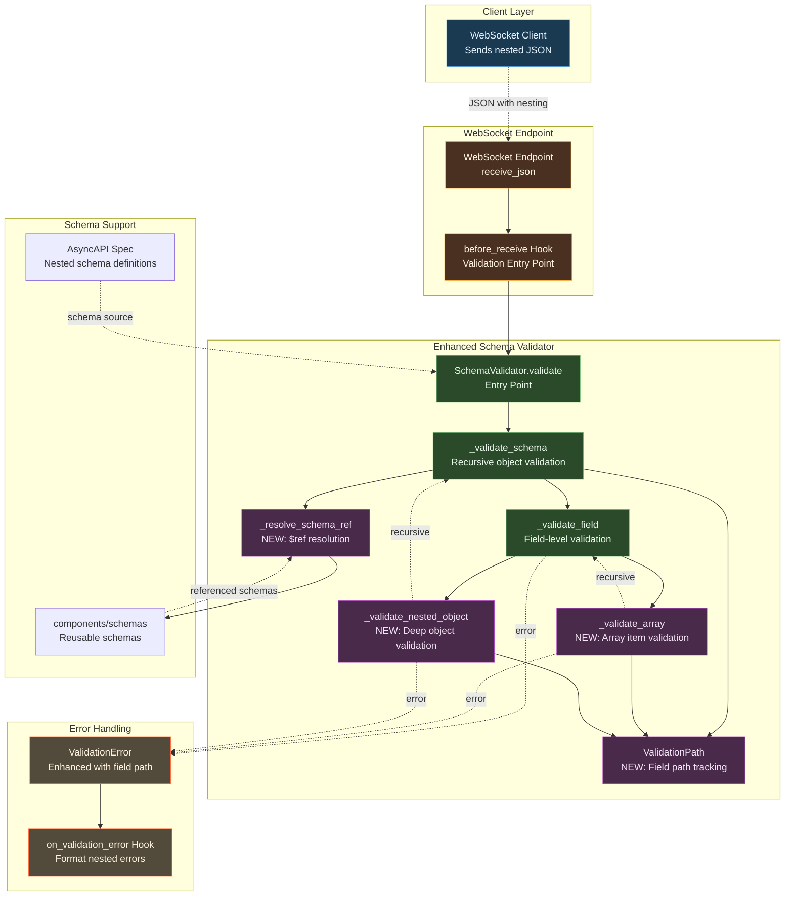
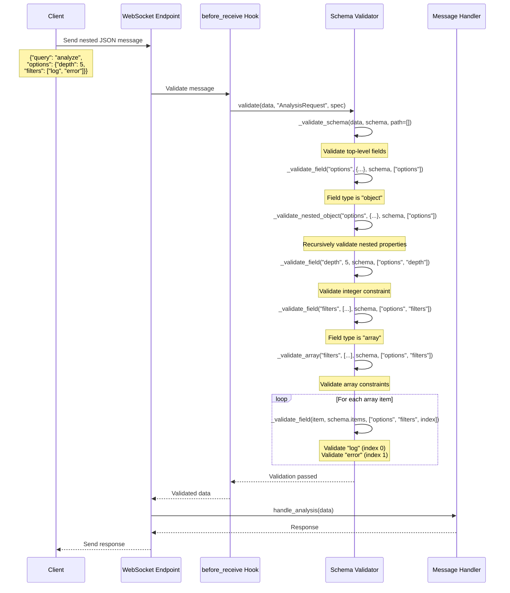
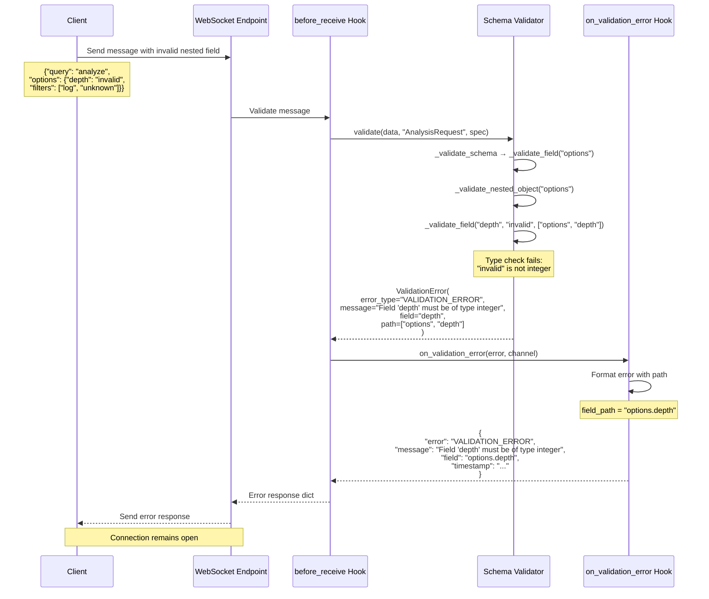
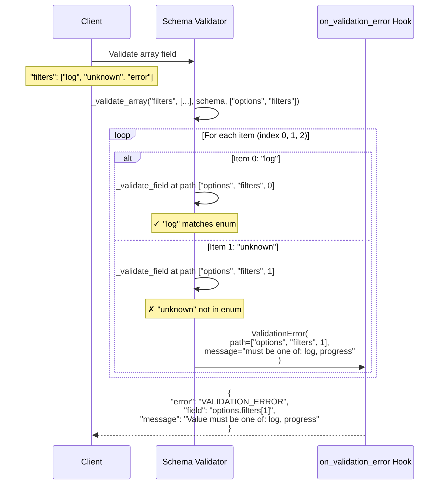

# Implementation Plan: Deep Structured Data Support for WebSocket Messages

**Branch**: TBD | **Date**: 2025-11-03 | **Related**: specs/007-websocket-router-and-patterns/
**Input**: User requirement for nested JSON structure validation

## Summary

Enhance the existing WebSocket implementation to support deep nested JSON structures (nested objects, arrays, complex schemas) with full AsyncAPI schema validation while maintaining backward compatibility with the current flat dict-based approach. The enhancement addresses the limitation where the current `SchemaValidator` only validates top-level fields and doesn't recursively validate nested objects or validate array items against their schemas.

## Problem Statement

**Current Limitation**: The existing `schema_validator.py` implementation (lines 79-241) only validates flat message structures. While it recognizes `object` and `array` types, it doesn't:
- Recursively validate nested object properties
- Validate array items against their item schemas
- Resolve schema references (`$ref`) to component schemas
- Provide detailed field paths for errors in nested structures
- Support advanced JSON Schema features (`anyOf`, `oneOf`, `allOf`, `additionalProperties`)

**Example of Current Gap**:
```yaml
# AsyncAPI spec defines nested structure
AgentEventsRequest:
  payload:
    properties:
      groups:
        type: array
        items:
          type: string
          enum: [log, progress]
```

Current validator checks `groups` is an array but doesn't validate that each item is a string or matches the enum values.

## Architecture Overview



## Component Design

### 1. Enhanced Schema Validator (Core)

**Purpose**: Recursively validate nested JSON structures against AsyncAPI schemas

**New Methods**:

#### `_validate_array(field_name: str, value: list, schema: dict, path: list[str | int]) -> None`
- **Purpose**: Validate array items against item schema
- **Validates**:
  - Item types match schema
  - Array length constraints (`minItems`, `maxItems`)
  - Unique items if specified (`uniqueItems`)
  - Each item recursively against `items` schema
- **Error Path**: Includes array index (e.g., "filters[2]")

#### `_validate_nested_object(field_name: str, value: dict, schema: dict, path: list[str | int]) -> None`
- **Purpose**: Recursively validate nested object properties
- **Process**:
  1. Extract nested properties and required fields
  2. Check required nested fields exist
  3. Recursively call `_validate_field` for each property
  4. Track field path through recursion
- **Error Path**: Includes full dot notation (e.g., "options.metadata.user")

#### `_resolve_schema_ref(ref: str, spec: dict) -> dict`
- **Purpose**: Resolve `$ref` references to component schemas
- **Supports**: `#/components/schemas/SchemaName` format
- **Caching**: Cache resolved schemas to avoid repeated lookups
- **Error Handling**: Raise ValidationError if reference not found

#### `_build_field_path(path: list[str | int]) -> str`
- **Purpose**: Convert path list to human-readable string
- **Examples**:
  - `["options", "depth"]` → `"options.depth"`
  - `["filters", 2]` → `"filters[2]"`
  - `["options", "tags", 0]` → `"options.tags[0]"`

**Updated Methods**:

#### `_validate_field(field_name: str, value: Any, schema: dict, path: list[str | int]) -> None`
- Add `path` parameter for tracking field location
- Delegate to `_validate_array` when type is "array"
- Delegate to `_validate_nested_object` when type is "object"
- Handle `$ref` via `_resolve_schema_ref`
- Pass path to all validation calls

#### `_validate_schema(data: dict, schema: dict, path: list[str | int] = []) -> None`
- Add `path` parameter (default empty list)
- Pass path through to `_validate_field` calls
- Support root-level schema composition (`anyOf`, `oneOf`, `allOf`)

**Interface Update**:
```python
class SchemaValidator:
    def validate(self, data: dict, message_type: str, spec_path: str | Path) -> None:
        # Existing signature maintained for backward compatibility

    def _validate_schema(self, data: dict, schema: dict, path: list[str | int] = []) -> None:
        # Enhanced with path tracking

    def _validate_field(self, field_name: str, value: Any, schema: dict, path: list[str | int]) -> None:
        # Enhanced with path tracking and nested delegation

    def _validate_array(self, field_name: str, value: list, schema: dict, path: list[str | int]) -> None:
        # NEW: Array item validation

    def _validate_nested_object(self, field_name: str, value: dict, schema: dict, path: list[str | int]) -> None:
        # NEW: Recursive object validation

    def _resolve_schema_ref(self, ref: str, spec: dict) -> dict:
        # NEW: Schema reference resolution

    def _build_field_path(self, path: list[str | int]) -> str:
        # NEW: Convert path to readable string
```

### 2. Enhanced ValidationError

**Purpose**: Provide detailed error information for nested field failures

**Updated Interface**:
```python
class ValidationError(Exception):
    def __init__(
        self,
        error_type: str,
        message: str,
        field: str | None = None,
        path: list[str | int] | None = None  # NEW: Field path as list
    ) -> None:
        self.error_type = error_type
        self.message = message
        self.field = field
        self.path = path or []  # NEW: Empty list if not provided
        self.field_path = self._build_path_string()  # NEW: Human-readable path

    def _build_path_string(self) -> str:
        """Convert path list to dot/bracket notation."""
        # Example: ["options", "tags", 0] -> "options.tags[0]"
```

**Error Message Examples**:
```python
# Nested object field error
ValidationError(
    error_type="VALIDATION_ERROR",
    message="Field 'depth' must be an integer",
    field="depth",
    path=["options", "depth"]
)
# field_path = "options.depth"

# Array item error
ValidationError(
    error_type="VALIDATION_ERROR",
    message="Value must be one of: log, progress",
    field="groups",
    path=["groups", 2]
)
# field_path = "groups[2]"

# Deep nested error
ValidationError(
    error_type="VALIDATION_ERROR",
    message="Field 'user' is required",
    field="user",
    path=["options", "metadata", "user"]
)
# field_path = "options.metadata.user"
```

### 3. Advanced JSON Schema Features

**Purpose**: Support schema composition and advanced validation patterns

#### Schema Composition Support

**`anyOf` validation**:
- Data is valid if it matches ANY of the provided schemas
- Try each schema until one passes
- Collect all errors if none match

**`oneOf` validation**:
- Data is valid if it matches EXACTLY ONE schema
- Must match one and only one (not zero, not multiple)
- Error if matches multiple or none

**`allOf` validation**:
- Data must match ALL provided schemas
- Validate against each schema sequentially
- All must pass for data to be valid

**`additionalProperties` support**:
- Control whether properties not in schema are allowed
- `false`: Reject extra properties
- `true` or absent: Allow extra properties
- Schema object: Validate extra properties against schema

**Implementation**:
```python
def _validate_composition(self, data: dict, schema: dict, path: list[str | int]) -> None:
    """Handle anyOf, oneOf, allOf schema composition."""
    if "anyOf" in schema:
        self._validate_any_of(data, schema["anyOf"], path)
    if "oneOf" in schema:
        self._validate_one_of(data, schema["oneOf"], path)
    if "allOf" in schema:
        self._validate_all_of(data, schema["allOf"], path)

def _validate_any_of(self, data: dict, schemas: list, path: list[str | int]) -> None:
    """Data must match at least one schema."""

def _validate_one_of(self, data: dict, schemas: list, path: list[str | int]) -> None:
    """Data must match exactly one schema."""

def _validate_all_of(self, data: dict, schemas: list, path: list[str | int]) -> None:
    """Data must match all schemas."""
```

### 4. AsyncAPI Schema Patterns

**Purpose**: Document best practices for defining nested schemas

#### Pattern 1: Nested Objects with $ref
```yaml
components:
  schemas:
    FilterOptions:
      type: object
      properties:
        enabled:
          type: boolean
        rules:
          type: array
          items:
            type: string

  messages:
    AnalysisRequest:
      payload:
        type: object
        required: [query, options]
        properties:
          query:
            type: string
          options:
            $ref: '#/components/schemas/FilterOptions'
```

#### Pattern 2: Array of Objects
```yaml
components:
  messages:
    BatchRequest:
      payload:
        type: object
        properties:
          items:
            type: array
            minItems: 1
            maxItems: 100
            items:
              type: object
              required: [id, action]
              properties:
                id:
                  type: string
                action:
                  type: string
                  enum: [create, update, delete]
                data:
                  type: object
                  additionalProperties: true
```

#### Pattern 3: Deeply Nested Structures
```yaml
components:
  messages:
    ConfigRequest:
      payload:
        type: object
        properties:
          config:
            type: object
            properties:
              database:
                type: object
                properties:
                  connection:
                    type: object
                    properties:
                      host:
                        type: string
                      port:
                        type: integer
                        minimum: 1
                        maximum: 65535
```

### 5. Hook Pipeline Compatibility

**Purpose**: Ensure hooks work seamlessly with nested structures

**No Changes Required**:
- Hooks already receive and return dicts
- Nested dicts are standard Python data structures
- Validation happens in `before_receive` (default behavior)
- `after_receive` can transform nested structures
- `before_send` can add nested response fields

**Example Hook with Nested Data**:
```python
async def after_receive(data: dict, channel: str) -> dict:
    """Enrich nested data with metadata."""
    if "options" not in data:
        data["options"] = {}

    # Add enrichment to nested structure
    data["options"]["processed_at"] = datetime.now(UTC).isoformat()
    data["options"]["enriched"] = True

    return data
```

## Data Flow

### Successful Nested Validation Flow



### Nested Field Error Flow



### Array Validation Error Flow



## Technology Stack

### Core Dependencies
- **Python 3.12**: Pattern matching, type hints
- **PyYAML**: AsyncAPI spec parsing (existing)
- **FastAPI/Starlette**: WebSocket framework (existing)

### No New Dependencies Required
- All enhancements use standard library features
- Recursive validation uses existing dict/list operations
- Path tracking uses standard list operations

### Testing Tools
- **pytest**: Unit and integration testing (existing)
- **pytest-asyncio**: Async test support (existing)
- **FastAPI TestClient**: WebSocket testing (existing)

## File Structure

```
nexus/
├── src/nexus/
│   ├── core/
│   │   └── websocket/
│   │       ├── schema_validator.py          # ENHANCED: Add nested validation
│   │       ├── hooks.py                     # No changes needed
│   │       └── ...
│   └── ws/
│       ├── example.yaml                     # UPDATED: Add nested schema examples
│       └── example.py                       # UPDATED: Add handler for nested messages
└── tests/
    ├── unit/
    │   └── core/
    │       └── websocket/
    │           ├── test_schema_validator.py # ENHANCED: Add nested tests
    │           └── test_nested_validation.py # NEW: Dedicated nested tests
    └── integration/
        └── websocket/
            └── test_nested_messages.py      # NEW: End-to-end nested tests
```

## Implementation Phases

### Phase 1: Core Recursive Validation (2-3 days)

**Tasks**:
1. Add `path` parameter to existing validation methods
2. Implement `_validate_array()` method
3. Implement `_validate_nested_object()` method
4. Add `_build_field_path()` helper method
5. Update `_validate_field()` to delegate to array/object validators
6. Enhance `ValidationError` with path support

**Deliverables**:
- ✓ Basic nested object validation works
- ✓ Array item validation works
- ✓ Field paths tracked through recursion
- ✓ ValidationError includes path information

**Testing**:
- Unit tests for `_validate_array`
- Unit tests for `_validate_nested_object`
- Unit tests for path building
- Backward compatibility tests (flat messages still work)

### Phase 2: Schema Reference Resolution (1-2 days)

**Tasks**:
1. Implement `_resolve_schema_ref()` method
2. Add schema reference caching
3. Handle circular reference detection
4. Update `_validate_field()` to resolve `$ref` before validation
5. Support both absolute and relative references

**Deliverables**:
- ✓ `$ref` references resolve to component schemas
- ✓ Cached references avoid repeated lookups
- ✓ Circular references detected and reported
- ✓ Works with AsyncAPI 3.0 schema structure

**Testing**:
- Unit tests for reference resolution
- Tests with circular references
- Tests with missing references
- Integration tests with real AsyncAPI specs

### Phase 3: Advanced Schema Features (2-3 days)

**Tasks**:
1. Implement `_validate_any_of()` method
2. Implement `_validate_one_of()` method
3. Implement `_validate_all_of()` method
4. Add `additionalProperties` validation support
5. Implement `patternProperties` support (optional)
6. Add `dependencies` support (optional)

**Deliverables**:
- ✓ Schema composition (`anyOf`, `oneOf`, `allOf`) works
- ✓ `additionalProperties` enforced when specified
- ✓ Error messages clear for composition failures

**Testing**:
- Unit tests for each composition type
- Tests with complex composition scenarios
- Tests with additionalProperties variations
- Edge case testing (empty schemas, conflicts)

### Phase 4: Example Implementation & Documentation (1-2 days)

**Tasks**:
1. Update `example.yaml` with nested schema examples
2. Add new channel demonstrating deep nesting
3. Create handler for nested message processing
4. Document nested schema patterns
5. Add examples to data-model.md
6. Update quickstart.md with nested examples

**Deliverables**:
- ✓ Working example with 3+ levels of nesting
- ✓ Example with array of objects
- ✓ Example with schema references
- ✓ Documentation covers all patterns

**Example Schema to Add**:
```yaml
channels:
  analysis:
    address: /ws/example/v1/analysis
    messages:
      analysisRequest:
        $ref: '#/components/messages/AnalysisRequest'

components:
  schemas:
    FilterOptions:
      type: object
      properties:
        depth:
          type: integer
          minimum: 1
          maximum: 10
        filters:
          type: array
          items:
            type: string
            enum: [log, error, warning, info]
        metadata:
          type: object
          additionalProperties: true

  messages:
    AnalysisRequest:
      payload:
        type: object
        required: [query, options]
        properties:
          query:
            type: string
            minLength: 1
          options:
            $ref: '#/components/schemas/FilterOptions'
```

### Phase 5: Integration Testing & Performance (2 days)

**Tasks**:
1. Create comprehensive integration test suite
2. Test backward compatibility with existing channels
3. Performance benchmarking (simple vs complex schemas)
4. Memory profiling for deeply nested structures
5. Load testing with concurrent connections
6. Fix any performance issues discovered

**Deliverables**:
- ✓ All integration tests pass
- ✓ Backward compatibility verified
- ✓ Performance metrics documented
- ✓ No memory leaks detected
- ✓ Handles 100+ concurrent connections with nested messages

**Testing Scenarios**:
- Flat messages (backward compatibility)
- 2-level nesting
- 5-level deep nesting
- Arrays with 100+ items
- Large objects with 50+ properties
- Mixed nested structures
- Concurrent connections with different message types

## Success Criteria

### Functional Requirements
- ✓ Validates nested objects recursively
- ✓ Validates array items against schemas
- ✓ Resolves `$ref` to component schemas
- ✓ Provides detailed field paths in errors
- ✓ Supports `anyOf`, `oneOf`, `allOf` composition
- ✓ Handles `additionalProperties` correctly
- ✓ Maintains backward compatibility with flat structures

### Non-Functional Requirements
- ✓ Validation latency < 10ms for typical nested messages (p95)
- ✓ No performance degradation for flat messages
- ✓ Memory usage scales linearly with message size
- ✓ 90%+ test coverage for new code
- ✓ Clear error messages with full field paths
- ✓ Documentation includes practical examples

### Quality Gates
- ✓ All unit tests pass (target: 50+ new tests)
- ✓ All integration tests pass
- ✓ mypy strict mode passes
- ✓ Code coverage > 90% for modified files
- ✓ Performance benchmarks meet targets
- ✓ Backward compatibility tests pass

## Security Considerations

### Input Validation
- **Maximum depth limit**: Prevent deep recursion attacks (default: 20 levels)
- **Array size limits**: Enforce `maxItems` to prevent memory exhaustion
- **String size limits**: Existing `maxLength` constraints apply to nested fields
- **Schema complexity limits**: Limit number of `$ref` resolutions per message

### Implementation**:
```python
class SchemaValidator:
    MAX_NESTING_DEPTH = 20  # Configurable via environment variable
    MAX_ARRAY_SIZE = 10000  # Prevent memory exhaustion
    MAX_REF_DEPTH = 10      # Prevent circular reference loops

    def _validate_schema(self, data: dict, schema: dict, path: list[str | int] = []) -> None:
        if len(path) > self.MAX_NESTING_DEPTH:
            raise ValidationError(
                "VALIDATION_ERROR",
                f"Maximum nesting depth ({self.MAX_NESTING_DEPTH}) exceeded",
                self._build_field_path(path)
            )
```

### Error Information Disclosure
- Field paths in errors don't expose sensitive data
- Error messages are generic for internal errors
- Detailed validation errors only for client mistakes

## Deployment Notes

### Development
- Feature developed on dedicated branch
- Unit tests run locally before commit
- Integration tests run in CI pipeline

### Staging
- Deploy to staging environment first
- Test with real AsyncAPI specs
- Monitor validation performance metrics
- Verify backward compatibility with existing clients

### Production
- Gradual rollout with feature flag (optional)
- Monitor error rates and validation latency
- Collect metrics on nested structure usage
- Rollback plan if issues detected

### Configuration
```python
# Environment variables
WEBSOCKET_MAX_NESTING_DEPTH = 20    # Maximum nested levels
WEBSOCKET_MAX_ARRAY_SIZE = 10000    # Maximum array items
WEBSOCKET_MAX_REF_DEPTH = 10        # Maximum $ref resolution depth
WEBSOCKET_VALIDATION_STRICT = true  # Enforce additionalProperties: false
```

## Migration Notes

### Backward Compatibility
- **No breaking changes**: Existing flat message handlers work unchanged
- **Opt-in enhancement**: Nested validation only applies when schemas define nested structures
- **Error format change**: ValidationError now includes `path` field, but `field` and `message` remain

### Existing AsyncAPI Specs
- No changes required for existing specs
- Flat schemas continue to work as before
- Can gradually add nested structures to specs

### Client Migration
```python
# Before: Flat structure (still works)
{"input": "hello", "mode": "fast"}

# After: Can use nested structures
{
    "query": "hello",
    "options": {
        "mode": "fast",
        "filters": ["log", "error"]
    }
}
```

## Dependencies

### Runtime
- **No new dependencies**: All features use Python stdlib
- **Existing**: PyYAML, FastAPI, Starlette

### Development
- **Existing testing tools**: pytest, pytest-asyncio, FastAPI TestClient

## Risks & Mitigation

### Risk 1: Performance Degradation
- **Risk**: Deep nesting could slow validation significantly
- **Mitigation**:
  - Implement depth limits
  - Schema caching for repeated validations
  - Performance benchmarking in CI
  - Optimize hot paths

### Risk 2: Backward Compatibility Issues
- **Risk**: Changes break existing message handlers
- **Mitigation**:
  - Comprehensive backward compatibility test suite
  - Default parameters maintain existing behavior
  - No changes to handler API
  - CI tests against existing specs

### Risk 3: Complex Error Messages
- **Risk**: Nested errors too verbose or confusing
- **Mitigation**:
  - Clear field path format (dot/bracket notation)
  - Concise error messages
  - Documentation with examples
  - User testing of error messages

### Risk 4: Edge Cases in JSON Schema
- **Risk**: Uncommon schema features not handled correctly
- **Mitigation**:
  - Comprehensive test suite covering JSON Schema spec
  - Fail gracefully for unsupported features
  - Clear error messages for unsupported keywords
  - Documentation of supported features

## Future Enhancements

### Not in Scope (But Considered)
1. **JSON Schema Draft 2020-12 features**
   - `prefixItems` for tuple validation
   - `unevaluatedProperties` for complex composition
   - `$dynamicRef` for runtime schema resolution

2. **Advanced Array Validation**
   - `contains` keyword for array content validation
   - `minContains` / `maxContains` for occurrence counting
   - Tuple validation with positional schemas

3. **Performance Optimizations**
   - Compiled schema validators (like jsonschema library)
   - Async validation for large messages
   - Parallel validation for independent fields

4. **Developer Tools**
   - Schema visualization tool
   - Error message localization (i18n)
   - Interactive schema tester
   - AsyncAPI spec linter with nested validation

## References

### AsyncAPI Specification
- **AsyncAPI 3.0.0 Specification**: https://www.asyncapi.com/docs/reference/specification/v3.0.0
- **AsyncAPI 3.0.0 Schema Object**: https://www.asyncapi.com/docs/reference/specification/v3.0.0#schemaObject
  - The Schema Object is a superset of JSON Schema Draft 07
- **AsyncAPI - Defining Payload Schemas**: https://www.asyncapi.com/docs/concepts/asyncapi-document/define-payload
- **AsyncAPI Schemas Guide**: https://asyncapi.pavelon.dev/schemas/

### JSON Schema Specification
- **JSON Schema Validation (Draft 07)**: https://json-schema.org/draft-07/json-schema-validation.html
  - AsyncAPI Schema Object extends this specification
- **JSON Schema Core (Draft 07)**: https://json-schema.org/draft-07/json-schema-core.html
- **JSON Schema Latest (2020-12)**: https://json-schema.org/draft/2020-12/json-schema-validation.html
  - Reference for future enhancements

### Related Nexus Documentation
- WebSocket Router Spec: `specs/007-websocket-router-and-patterns/spec.md`
- Data Model: `specs/007-websocket-router-and-patterns/data-model.md`
- Hooks Documentation: `specs/007-websocket-router-and-patterns/hooks.md`

### Implementation References
- Current SchemaValidator: `src/nexus/core/websocket/schema_validator.py`
- Example AsyncAPI Spec: `src/nexus/ws/example.yaml`
- Hook System: `src/nexus/core/websocket/hooks.py`
