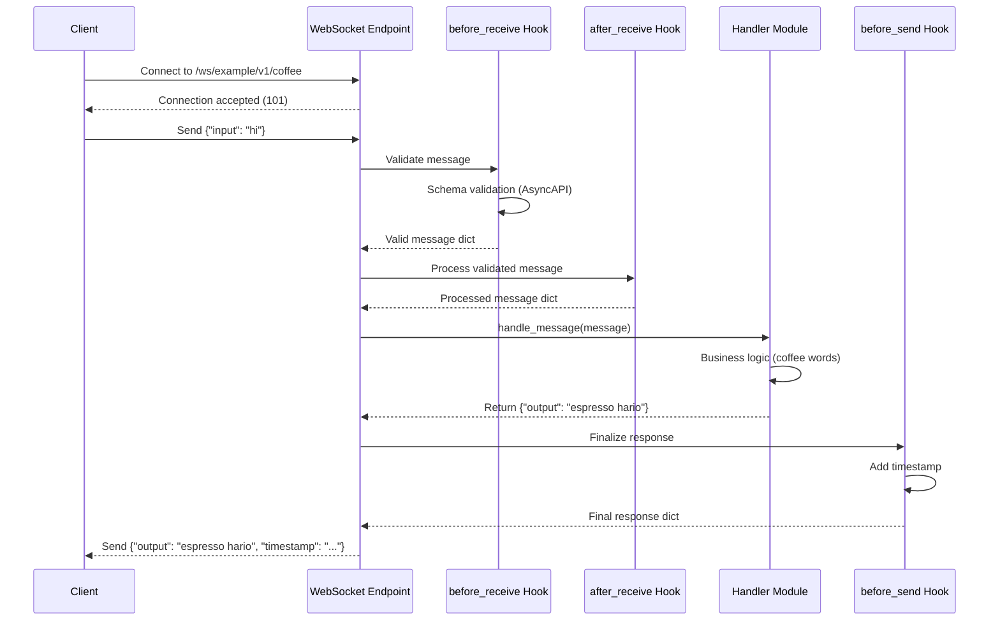
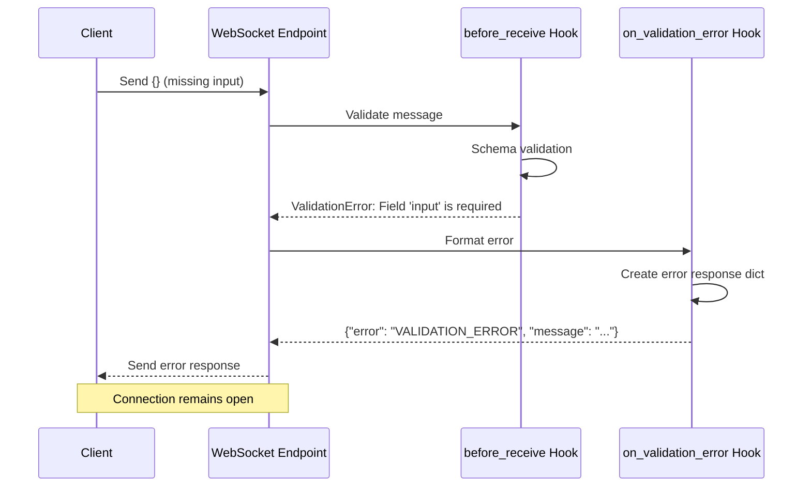
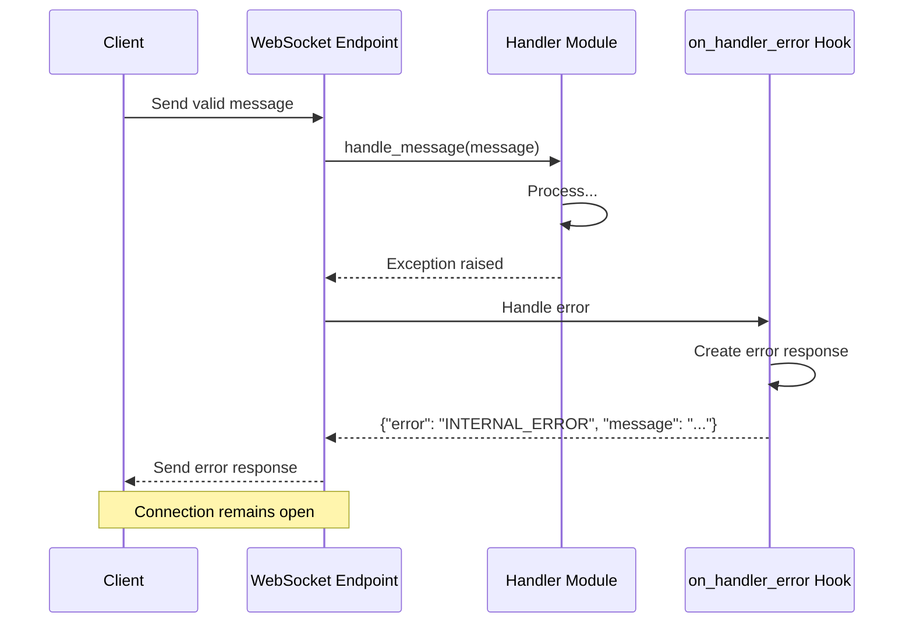

# Implementation Plan: Generic WebSocket API

**Branch**: `007-simple-websocket` | **Date**: 2025-10-23 | **Spec**: [spec.md](./spec.md)
**Input**: Feature specification from `./spec.md`

## Summary

Implement a generic, extensible multi-channel WebSocket router system with hook-based message processing and bootstrap-time validation via interceptors. The system uses convention-based discovery to automatically register WebSocket channels from AsyncAPI specifications, with channel-specific Python handlers. Components can define multiple channels in a single YAML file, each with independent endpoints and handlers. Features a hook pipeline for validation and message transformation, plus support for background tasks enabling server-initiated messaging and subscription management. Includes an example component with three channels: `/ws/example/v1/coffee` (request/response pattern), `/ws/example/v1/chat` (bidirectional with server-initiated random messages every 3 seconds), and `/ws/example/v1/agent_events` (subscription-based event streaming with dynamic subscription management for log and progress event groups). All message handling is ephemeral—no persistent storage required.

## Architecture Overview

```mermaid
graph TB
    subgraph "Client Layer"
        Client[WebSocket Client<br/>Browser/Application]
    end

    subgraph "Router Layer"
        Router[WebSocket Router<br/>YAML-First Discovery]
        Interceptor[Interceptor System<br/>Bootstrap Validation]
        Factory[Endpoint Factory<br/>Dynamic Endpoint Creation]
    end

    subgraph "WebSocket Endpoint"
        WSEndpoint[WebSocket Endpoint<br/>/ws/{component}/v1/{channel}]
        ConnMgr[Connection Manager<br/>Track Active Connections]
    end

    subgraph "Hook Pipeline"
        BeforeRcv[before_receive Hook<br/>Schema Validation]
        AfterRcv[after_receive Hook<br/>Message Processing]
        BeforeSend[before_send Hook<br/>Response Finalization]
        OnValErr[on_validation_error Hook<br/>Error Formatting]
        OnHdlErr[on_handler_error Hook<br/>Internal Error Handling]
    end

    subgraph "Handler Layer"
        Handler[Handler Module<br/>example.py or Default]
        Validator[Schema Validator<br/>AsyncAPI JSON Schema]
    end

    subgraph "Observability"
        Logs[Structured Logs<br/>Lifecycle Events]
    end

    Client -.WebSocket.-> WSEndpoint
    Router --> Interceptor
    Interceptor --> Factory
    Factory --> WSEndpoint

    WSEndpoint --> ConnMgr
    WSEndpoint --> BeforeRcv
    WSEndpoint --> Logs

    BeforeRcv --> Validator
    Validator -.valid.-> AfterRcv
    Validator -.invalid.-> OnValErr

    AfterRcv --> Handler
    Handler -.success.-> BeforeSend
    Handler -.error.-> OnHdlErr

    BeforeSend --> WSEndpoint
    OnValErr --> WSEndpoint
    OnHdlErr --> WSEndpoint

    classDef clientClass fill:#1a3a52,stroke:#64b5f6,color:#e3f2fd
    classDef routerClass fill:#2a4a2a,stroke:#81c784,color:#e8f5e9
    classDef endpointClass fill:#4a3020,stroke:#ffb74d,color:#fff3e0
    classDef hookClass fill:#3a2845,stroke:#ba68c8,color:#f3e5f5
    classDef handlerClass fill:#524a3a,stroke:#ffa726,color:#fff8e1
    classDef obsClass fill:#4a4520,stroke:#fdd835,color:#fffde7

    class Client clientClass
    class Router,Factory routerClass
    class WSEndpoint,ConnMgr endpointClass
    class BeforeRcv,AfterRcv,BeforeSend,OnValErr,OnHdlErr hookClass
    class Handler,Validator handlerClass
    class Logs obsClass
```

## Component Design

### 1. WebSocket Router (Convention-Based Multi-Channel Discovery)

**Purpose**: Auto-discover and register WebSocket channels using automatic path mapping based on filename convention

**Responsibilities**:
- Scan `src/nexus/{component}/ws/*.py` for handler files
- Automatically derive spec path from handler filename: `{handler}.py` → `src/nexus/schemas/{component}/websocket-{handler}.yaml`
- Validate handler/spec pairing at startup (fail-fast if mismatch)
- Load and parse AsyncAPI schemas from derived paths
- Merge multiple schemas per component (if multiple handlers exist)
- Extract all channels from merged AsyncAPI spec
- Create WebSocket endpoints dynamically via endpoint factory for each channel
- Register endpoints with FastAPI router at `/ws/{component}/v1/{channel}`
- Cache merged schemas in `_SPEC_CACHE` for runtime validation

**Interface**:
```python
def build_websocket_router() -> APIRouter:
    # Scan src/nexus/{component}/ws/*.py for handler files
    # For each handler:
    #   - Derive spec path: {handler}.py → src/nexus/schemas/{component}/websocket-{handler}.yaml
    #   - Validate handler/spec pairing exists (fail-fast if mismatch)
    #   - Load AsyncAPI schema from derived path
    # Check for orphan specs (specs without handlers)
    # Merge schemas per component
    # For each channel in merged spec:
    #   - Create endpoint at /ws/{component}/v1/{channel}
    # Cache merged schemas
    # Register with router
    # Return configured router
```

**Convention**:
- Handler files in `src/nexus/{component}/ws/{handler}.py` are automatically mapped to specs
- Spec path is derived from handler filename: `{handler}.py` → `src/nexus/schemas/{component}/websocket-{handler}.yaml`
- Schema files in `src/nexus/schemas/{component}/` directory define channels
- Each channel has address field: `/ws/example/v1/coffee`, `/ws/example/v1/chat`, etc.
- Channel names with hyphens (e.g., `agent-events`) are normalized to underscores (e.g., `agent_events`)
- Handler functions named: `handle_{channel}()` (e.g., `handle_coffee()`, `handle_chat()`)
- Optional background tasks: `on_connect_{channel}()` for server-initiated messaging
- Multiple handlers per component allowed (schemas are merged)
- Duplicate channel names across schemas cause startup error

**Fail-Fast Validation**:
- Handler without spec: If handler file exists but corresponding spec file is missing, fail startup
- Spec without handler: If spec file exists but corresponding handler file is missing, fail startup
- Derived spec path must follow `src/nexus/schemas/{component}/websocket-{handler}.yaml` pattern
- Supports both `.yaml` and `.yml` extensions

### 2. Interceptor System (Bootstrap-Time Validation)

**Purpose**: Validate WebSocket configuration at bootstrap time before accepting any connections

**Responsibilities**:
- Execute validation checks during router initialization
- Validate that channel addresses in YAML match actual channel names
- Run bootstrap lifecycle hooks: `on_bootstrap_start`, `before_endpoint_creation`, `after_endpoint_creation`, `on_bootstrap_complete`
- Prevent server startup if validation fails
- Provide extension points for custom bootstrap validations

**Interface**:
```python
class InterceptorRegistry:
    def register(self, interceptor: BaseInterceptor) -> None:
        # Register interceptor for bootstrap lifecycle

    async def on_bootstrap_start(self, channels: dict[str, ChannelInfo]) -> None:
        # Called before any endpoints are created

    async def before_endpoint_creation(self, channel_name: str, channel_info: ChannelInfo) -> None:
        # Called before each endpoint is created

    async def after_endpoint_creation(self, channel_name: str, endpoint: Callable) -> None:
        # Called after each endpoint is created

    async def on_bootstrap_complete(self) -> None:
        # Called after all endpoints are created
```

**Built-in Interceptors**:
- **ValidationInterceptor**: Validates that channel addresses match channel names (prevents misconfigurations)

**Example Use Cases**:
- Validate channel configuration before startup
- Check required handler functions exist
- Verify AsyncAPI spec compliance
- Initialize shared resources (connection pools, caches)
- Register metrics and monitoring hooks

### 3. Connection Context System

**Purpose**: Provide connection-specific state access to handler functions

**Responsibilities**:
- Store connection ID in context variable for each connection
- Make connection context available to all handler functions
- Manage context lifecycle (set on connect, cleanup on disconnect)
- Enable connection-specific state management (e.g., subscriptions)

**Interface**:
```python
# Context variable for storing connection ID
_connection_context: ContextVar[str | None] = ContextVar("connection_id", default=None)

def get_current_connection_id() -> str | None:
    # Retrieve connection ID for current async context
    return _connection_context.get()
```

**Use Cases**:
- Track subscription state per connection (agent-events channel)
- Implement connection-specific caching or rate limiting
- Associate background tasks with specific connections
- Enable connection-scoped logging and metrics

### 4. Endpoint Factory (Dynamic Multi-Channel Creation)

**Purpose**: Generate WebSocket endpoint functions from merged AsyncAPI specs with channel-specific handlers

**Responsibilities**:
- Accept merged AsyncAPI spec (already loaded and validated)
- Extract component name from handler directory structure
- Extract message types for specific channel from merged spec
- Discover handler functions in `src/nexus/{component}/ws/*.py` files
- Look up channel-specific handler function: `handle_{channel}()`
- Check for optional background task: `on_connect_{channel}()`
- Build hook pipeline from handler or use defaults
- Create endpoint function with full lifecycle including background task management
- Use cached schema from `_SPEC_CACHE` for runtime validation

**Interface**:
```python
def create_websocket_endpoint(
    channel_name: str,
    spec: dict[str, Any],  # Merged AsyncAPI spec
    component_name: str     # Component name (e.g., "example")
) -> Callable:
    # Extract message types for this channel from merged spec
    # Scan src/nexus/{component}/ws/*.py for handler modules
    # Find handler function: handle_{channel}()
    # Find optional background task: on_connect_{channel}()
    # Create hooks instance (with validation using cached schema)
    # Build async endpoint function with background task support
    # Return endpoint callable
```

**Path Mapping Convention** (validated at startup):
- Handler filename determines spec filename: `{handler}.py` → `websocket-{handler}.yaml`
- Spec files located in `src/nexus/schemas/{component}/` directory
- Component name derived from handler's parent directory
- Supports both `.yaml` and `.yml` extensions
- Handler/spec pairing validated at startup (fail-fast)

### 5. WebSocket Endpoint (Generated per Channel)

**Purpose**: Handle WebSocket connections for a specific channel with optional background tasks

**Responsibilities**:
- Accept WebSocket handshake
- Generate connection ID and register with connection manager
- Start background task if `on_connect_{channel}()` exists
- Enter message receive loop
- Pass messages through hook pipeline using channel-specific handler
- Send responses back to client
- Cancel background task on disconnect
- Clean up connection resources

**Generated Interface**:
```python
async def websocket_endpoint(websocket: WebSocket):
    # Accept connection
    # Generate connection ID
    # Register with connection manager
    # Start background task: asyncio.create_task(on_connect_{channel}(websocket, connection_id))
    try:
        # Message loop:
        #   - Receive JSON → before_receive → after_receive
        #   - handle_{channel}() → before_send → Send JSON
        # Loop runs concurrently with background task
    finally:
        # Cancel background task
        # Clean up connection
```

**Background Task Pattern**:
- Background tasks enable server-initiated messaging
- Run concurrently with main message loop
- Share the same WebSocket connection
- Cancelled automatically on disconnect
- Example: Chat channel sends random messages every 3 seconds
- Agent-events channel: Manages subscription state and sends events to subscribed connections only

### 6. Hook Pipeline (WebSocketHooks)

**Purpose**: Provide interception points for message processing and validation

**Responsibilities**:
- Execute hooks at key lifecycle points
- Provide default behaviors for all hooks
- Allow handler-specific hook overrides
- Handle hook errors gracefully

**Hooks**:

#### `before_receive(data: dict, message_type: str, channel: str) -> dict`
- **Default**: Validate against AsyncAPI JSON schema
- **Override**: Add custom validation, transformation, sanitization
- **Raises**: `ValidationError` if validation fails

#### `after_receive(data: dict, channel: str) -> dict`
- **Default**: Pass-through (no transformation)
- **Override**: Enrich data, add context, transform structure

#### `before_send(response: dict, channel: str) -> dict`
- **Default**: Add timestamp if not present
- **Override**: Add metadata, transform output, filter fields

#### `on_validation_error(error: ValidationError, channel: str) -> dict`
- **Default**: Standard error format with error_type and message
- **Override**: Custom error responses, logging, alerts

#### `on_handler_error(error: Exception, channel: str) -> dict`
- **Default**: Generic internal error message
- **Override**: Error classification, detailed logging, recovery

**Interface**:
```python
class WebSocketHooks:
    async def before_receive(self, data: dict, message_type: str, channel: str) -> dict:
        validate_message(data, message_type, self.spec_path)  # Default
        return data

    async def after_receive(self, data: dict, channel: str) -> dict:
        return data  # Default: pass-through

    async def before_send(self, response: dict, channel: str) -> dict:
        if "timestamp" not in response:
            response["timestamp"] = datetime.now(UTC).isoformat()
        return response

    async def on_validation_error(self, error: ValidationError, channel: str) -> dict:
        return {
            "error": error.error_type,
            "message": error.message,
            "timestamp": datetime.now(UTC).isoformat()
        }

    async def on_handler_error(self, error: Exception, channel: str) -> dict:
        return {
            "error": "INTERNAL_ERROR",
            "message": f"Handler error: {str(error)}",
            "timestamp": datetime.now(UTC).isoformat()
        }
```

**Hook Discovery**:
Handlers can override hooks by implementing functions with matching names:

```python
# In example.py
async def before_receive(data: dict, message_type: str, channel: str) -> dict:
    # Custom validation
    if len(data.get("input", "")) > 1000:
        raise ValidationError("VALIDATION_ERROR", "Input too long")
    return data
```

### 7. Schema Validator

**Purpose**: Validate dicts against AsyncAPI JSON schemas

**Responsibilities**:
- Load and cache AsyncAPI specifications
- Validate messages against schema definitions
- Check required fields and types
- Validate string/number constraints
- Generate validation errors

**Validation Rules** (from AsyncAPI schema):
- Type checking (string, number, boolean, array, object)
- Required field validation
- String: minLength, maxLength, enum
- Number: minimum, maximum

**Interface**:
```python
def validate_message(data: dict, message_type: str, spec_path: Path) -> None:
    # Raises ValidationError if invalid
```

### 8. Handler Module (Multi-Channel Component)

**Purpose**: Implement business logic for message processing across multiple channels in a component

**Responsibilities**:
- Provide channel-specific handler functions
- Process validated messages per channel
- Generate response data per channel
- Optionally provide background tasks per channel
- Optionally override hooks

**Interface**:
```python
# example.py
async def handle_coffee(message: dict) -> dict:
    # Process coffee channel request
    # Return response dict

async def handle_chat(message: dict) -> dict:
    # Process chat channel request
    # Return response dict

async def handle_agent_events(message: dict) -> dict:
    # Process agent-events channel subscription management
    # Return confirmation response dict

async def on_connect_chat(websocket: WebSocket, connection_id: str) -> None:
    # Background task for chat channel
    # Send periodic messages to websocket
    # Runs until connection closes or task is cancelled

async def on_connect_agent_events(websocket: WebSocket, connection_id: str) -> None:
    # Background task for agent-events channel
    # Manage subscriptions and send events to subscribed connections
    # Uses get_current_connection_id() for connection-specific subscription state
    # Runs until connection closes or task is cancelled
```

**Handler Discovery Convention**:
- Handler functions named: `handle_{channel}()`
- Background tasks named: `on_connect_{channel}()`
- Discovered by endpoint factory via `getattr(module, f"handle_{channel}")`
- If function doesn't exist, default empty handler returns `{}`

**Example Structure**:
```python
# src/nexus/ws/example.py

# Coffee channel: Request/response pattern
async def handle_coffee(message: dict) -> dict:
    """Coffee word generator."""
    return {"output": generate_coffee_words(message["input"])}

# Chat channel: Bidirectional with server-initiated messages
async def handle_chat(message: dict) -> dict:
    """Chat message echo in uppercase."""
    return {"reply": message["message"].upper(), "type": "echo"}

async def on_connect_chat(websocket: WebSocket, connection_id: str) -> None:
    """Send random messages every 3 seconds."""
    while True:
        await asyncio.sleep(3)
        await websocket.send_json({
            "reply": random.choice(RANDOM_MESSAGES),
            "type": "random",
            "timestamp": datetime.now(UTC).isoformat()
        })

# Agent-events channel: Subscription-based event streaming
async def handle_agent_events(message: dict) -> dict:
    """Manage event subscriptions (subscribe/unsubscribe)."""
    action = message["action"]
    groups = message["groups"]

    connection_id = get_current_connection_id()
    if action == "subscribe":
        agent_subscriptions[connection_id].update(groups)
        status = "subscribed"
    elif action == "unsubscribe":
        agent_subscriptions[connection_id] -= set(groups)
        status = "unsubscribed"

    return {"status": status, "action": action, "groups": groups}

async def on_connect_agent_events(websocket: WebSocket, connection_id: str) -> None:
    """Send events to subscribed connections only."""
    # Start independent background tasks for each event group
    # Each task generates events every 3-8 seconds (random interval)
    # Events only sent if connection is subscribed to that group
```

### 9. Connection Manager

**Purpose**: Track active WebSocket connections

**Responsibilities**:
- Register new connections with unique IDs
- Store connection metadata (client address, channel)
- Remove connections on disconnect
- Provide connection lookup

**Interface**:
```python
class WebSocketConnectionManager:
    def add_connection(self, connection_id: str, client_address: str, channel: str)
    def remove_connection(self, connection_id: str)
    def get_connection(self, connection_id: str) -> ConnectionInfo | None
```

## Data Flow

### Successful Request Flow (with Hooks)



### Error Handling Flow (Validation)



### Error Handling Flow (Handler Error)



## Technology Stack

### Core Framework
- **FastAPI**: Web framework with native WebSocket support
- **Python 3.12**: Runtime environment with asyncio
- **Plain Python dicts**: Message handling (no ORM/validation framework)

### WebSocket
- **Starlette WebSockets**: Built into FastAPI (`receive_json()`, `send_json()`)
- **asyncio**: Asynchronous message handling and hook execution

### Message Processing
- **Hook-based pipeline**: Custom hook system for validation and transformation
- **JSON Schema validation**: Lightweight schema validation against AsyncAPI specs
- **AsyncAPI 3.0**: API specification format for WebSocket channels

### Discovery & Routing
- **Convention-based**: YAML filename → channel name → Python handler (optional)
- **Dynamic endpoint generation**: Endpoints created at startup from specs
- **No configuration required**: Zero-config for simple handlers

### Observability
- **Structlog**: Structured logging
- **Connection tracking**: In-memory connection manager

### Testing
- **pytest**: Test framework
- **pytest-asyncio**: Async test support
- **FastAPI TestClient**: WebSocket testing support

## Configuration

```python
# Environment variables
WEBSOCKET_MAX_MESSAGE_SIZE = 1048576  # 1MB
WEBSOCKET_MAX_CONNECTIONS = 100
WEBSOCKET_PING_INTERVAL = 30  # seconds
WEBSOCKET_PING_TIMEOUT = 10  # seconds
```

## File Structure

```
nexus/
├── src/nexus/
│   ├── api/
│   │   └── v1/
│   │       └── websocket/
│   │           └── __init__.py              # Router with YAML-first discovery
│   ├── core/
│   │   └── websocket/
│   │       ├── __init__.py                  # Public API exports
│   │       ├── connection.py                # Connection manager with context
│   │       ├── hooks.py                     # Runtime hook system
│   │       ├── interceptor.py               # Bootstrap interceptor system (NEW)
│   │       ├── schema_validator.py          # JSON schema validation
│   │       ├── discovery.py                 # Handler discovery
│   │       └── endpoint_factory.py          # Dynamic endpoint creation
│   └── ws/                                  # WebSocket handlers directory
│       ├── __init__.py
│       ├── example.py                       # Handler (optional, dict-based)
│       └── example.yaml                     # AsyncAPI spec (auto-discovered)
└── tests/
    ├── unit/
    │   └── websocket/
    │       ├── test_handlers.py             # Handler tests
    │       └── test_validator.py            # Schema validation tests
    ├── integration/
    │   └── websocket/
    │       ├── test_concurrent_connections.py
    │       └── test_hello_endpoint.py
    └── contract/
        └── test_websocket_contracts.py      # AsyncAPI contract tests
```

**Key Changes**:
- Added `hooks.py`: Runtime hook system with default behaviors
- Added `interceptor.py`: Bootstrap-time validation and lifecycle hooks
- Added `schema_validator.py`: Lightweight JSON schema validation
- Updated `connection.py`: Connection context system using ContextVar
- Removed `messages.py`: No SQLModel generation (dict-based approach)
- Added `/ws/` directory: Convention-based handler location
- Handlers are optional: Default empty handler used if missing
- Three example channels: coffee (request/response), chat (bidirectional), agent_events (subscription-based)

## Implementation Phases

### Phase 1: Schema Validation (Completed)
1. ✅ Create `schema_validator.py` with JSON schema validation
2. ✅ Remove SQLModel dependency for WebSocket messages
3. ✅ Implement ValidationError with error types
4. ✅ Add caching for loaded specs

### Phase 2: Hook System (Completed)
1. ✅ Create `hooks.py` with WebSocketHooks base class
2. ✅ Implement all 5 hooks with default behaviors
3. ✅ Add hook discovery from handler modules
4. ✅ Integrate hooks into endpoint pipeline

### Phase 3: Convention-Based Discovery (Completed)
1. ✅ Update `discovery.py` for convention-based matching
2. ✅ Implement default empty handler creation
3. ✅ Update `endpoint_factory.py` for YAML-first scanning
4. ✅ Implement automatic path mapping (replaced SPEC_PATH)

### Phase 4: Router Integration (Completed)
1. ✅ Update WebSocket router for auto-discovery
2. ✅ Implement endpoint generation with hooks
3. ✅ Update example handler to use dicts
4. ✅ Update module exports

### Phase 5: Testing & Validation (Completed)
1. ✅ Run and fix unit tests (41 passed)
2. ✅ Run and fix integration tests (39 passed)
3. ✅ Run and fix contract tests (21 passed)
4. ✅ Fix mypy type checking issues

## Testing Strategy

### Unit Tests
- Message validation logic
- Hello handler response generation
- Error handler error formatting
- Timestamp generation

### Integration Tests
- WebSocket connection establishment
- Message round-trip (request → response)
- Error response handling
- Connection cleanup

### Load Tests
- 100 concurrent connections
- 1000 messages/second throughput
- Connection stability over time
- Memory leak detection

## Success Criteria

**Functional**:
- ✓ WebSocket connections establish successfully
- ✓ Hello requests receive correct greeting responses
- ✓ Invalid requests receive error responses
- ✓ Multiple sequential requests work per connection
- ✓ Connections close gracefully

**Non-Functional**:
- ✓ Message latency < 50ms (p95)
- ✓ Support 100+ concurrent connections
- ✓ Handle 1000+ messages/second
- ✓ No memory leaks
- ✓ 80%+ test coverage

**Observability**:
- ✓ Connection events logged
- ✓ Metrics exposed
- ✓ Errors tracked by type

## Security Considerations

**For MVP**:
- Input validation (length limits, UTF-8 encoding)
- JSON parsing safety
- Message size limits
- Connection limits

**Future Enhancements**:
- Authentication/authorization
- Rate limiting per connection
- TLS/WSS in production
- CORS configuration

## Deployment Notes

**Development**:
- WebSocket endpoint: `ws://localhost:8000/ws/hello/v1`
- Hot reload enabled
- Debug logging enabled

**Production**:
- WebSocket endpoint: `wss://api.nexus.example.com/ws/hello/v1`
- TLS required (WSS)
- Structured logging
- Metrics exposed for Prometheus

## Dependencies

**Runtime**:
- FastAPI (with WebSocket support)
- PyYAML (for AsyncAPI spec parsing)
- Structlog (logging)
- **No SQLModel/Pydantic** for WebSocket messages (plain dicts)

**Development**:
- pytest
- pytest-asyncio
- FastAPI TestClient (WebSocket testing)

**Removed Dependencies**:
- ❌ Pydantic/SQLModel (for WebSocket message validation)
- ❌ Complex validation frameworks

**No External Services**:
- No Redis/ValKey required
- No database required
- No message queue required
- No configuration management system

## Migration Notes

**New Feature**: No migrations required

**Configuration**:
- Add WebSocket settings to environment configuration
- Update API documentation with AsyncAPI spec
- Add WebSocket endpoint to API routes

## Future Enhancements

**Hook System Extensions**:
- Pre-connection hooks (authentication before accept)
- Post-connection hooks (session initialization)
- Middleware-style hook chaining
- Async hook composition

**Advanced Features**:
- Binary message support alongside JSON
- Message compression (permessage-deflate)
- Authentication via hooks
- Rate limiting per connection
- Connection pooling and load balancing
- Pub/sub message routing patterns
- WebSocket subprotocol support

**Developer Experience**:
- CLI tool to generate handler scaffolding
- AsyncAPI spec validator
- Interactive API documentation (like Swagger for WebSockets)
- Hot-reload for handler changes
- Handler testing utilities

**Performance**:
- Connection pooling
- Message batching
- Compression negotiation
- Keep-alive ping/pong optimization
