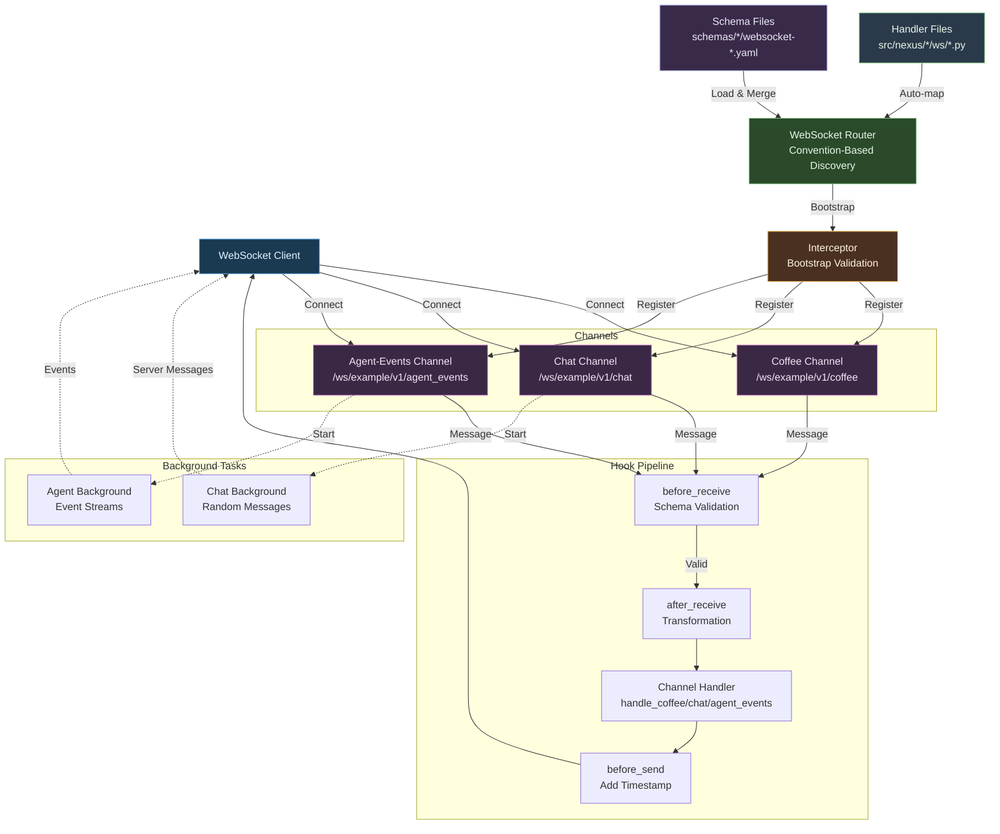
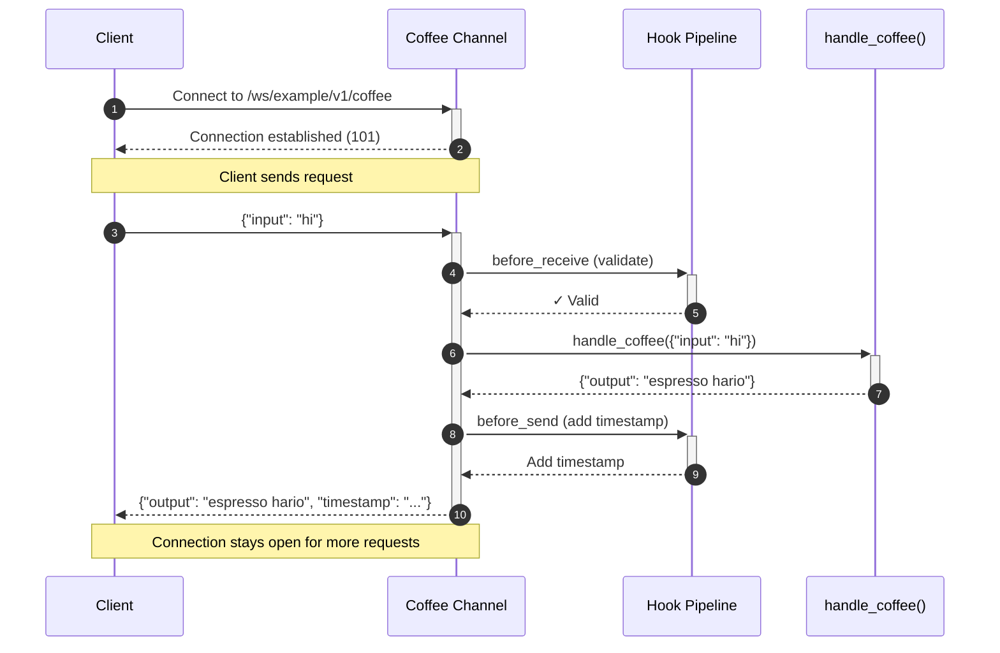
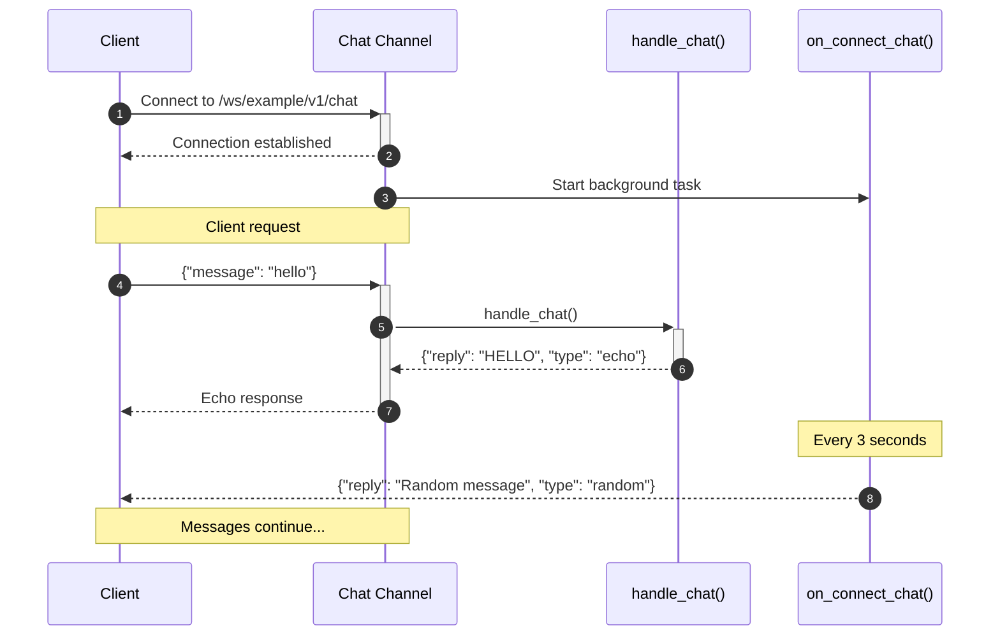
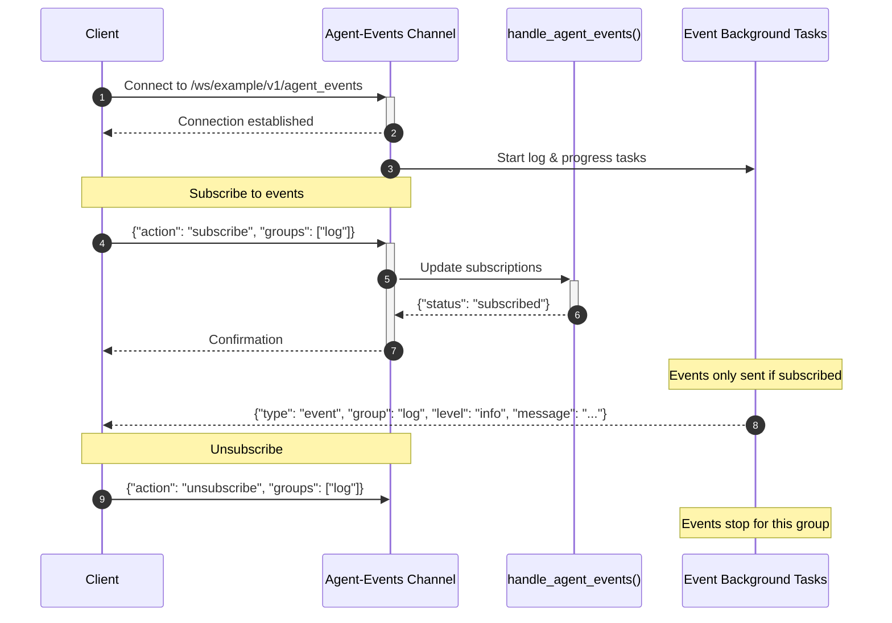

# WebSocket API - Technical Presentation

**Feature Branch**: `007-simple-websocket`
**Date**: 2025-10-24
**Status**: Implementation Complete

---

## 1. Main Goal

Provide a **generic, multi-channel WebSocket API** that enables real-time bidirectional communication between clients and the Nexus server with support for different communication patterns.

### Why WebSockets?

- **Persistent Connection**: No need to repeatedly establish HTTP connections
- **Real-Time**: Messages are delivered instantly in both directions
- **Efficient**: Lower overhead compared to HTTP polling
- **Multi-Channel Support**: One component can expose multiple independent channels
- **Flexible Patterns**: Request/response, bidirectional, and subscription-based patterns

### Communication Patterns Implemented

1. **Request/Response** (Coffee Channel)
   - Simple synchronous message exchange
   - Client sends request, server responds immediately

2. **Bidirectional** (Chat Channel)
   - Client requests AND server-initiated messages
   - Background tasks for periodic server messages

3. **Subscription-Based** (Agent-Events Channel)
   - Dynamic subscription management
   - Selective event delivery based on subscriptions
   - Connection-specific state tracking

---

## 2. High-Level Architecture

### Components Overview

The WebSocket API consists of these key components:

**File Organization**:
```
src/nexus/
└── {component}/
    └── ws/
        └── {handler}.py      # Handler files (auto-mapped to specs)

schemas/
└── {component}/
    └── websocket-{handler}.yaml  # AsyncAPI specifications
```

1. **WebSocket Router** (Convention-Based Discovery)
   - Scans `src/nexus/{component}/ws/*.py` for handler files
   - Automatically derives spec path: `{handler}.py` → `src/nexus/schemas/{component}/websocket-{handler}.yaml`
   - Validates handler/spec pairing at startup (fail-fast)
   - Loads and merges AsyncAPI specs per component
   - Auto-discovers channels from merged specifications
   - Registers channel-specific endpoints dynamically
   - Caches merged schemas for runtime validation

2. **Multi-Channel Endpoints**
   - `/ws/example/v1/coffee` - Request/response pattern
   - `/ws/example/v1/chat` - Bidirectional with server messages
   - `/ws/example/v1/agent_events` - Subscription-based events

3. **Schema Discovery Flow**:
   1. Scan handler files: `src/nexus/example/ws/example.py`
   2. Derive spec path: `example.py` → `schemas/example/websocket-example.yaml`
   3. Validate handler/spec pairing exists (fail-fast if missing)
   4. Load AsyncAPI schema from derived path
   5. Merge schemas if multiple handlers exist
   6. Cache merged schema in `_SPEC_CACHE["example"]`
   7. Create endpoints for all channels in merged spec

4. **Interceptor System** (Bootstrap)
   - Validates configuration at startup
   - Ensures channel addresses match channel names
   - Validates handler/spec pairing (fail-fast validation)
   - Prevents server start with misconfigurations
   - Detects duplicate channels across schemas

5. **Hook Pipeline** (Runtime)
   - `before_receive`: Validates incoming messages against cached AsyncAPI schema
   - `after_receive`: Optional message transformation
   - Handler function: Processes message, returns response
   - `before_send`: Adds timestamp and metadata
   - Error hooks: Format validation and handler errors

6. **Connection Context**
   - Tracks connection-specific state using ContextVar
   - Enables per-connection subscriptions (agent-events)
   - Accessible from handlers and background tasks

7. **Background Tasks**
   - Optional per-channel server-initiated messaging
   - Chat: Sends random messages every 3 seconds
   - Agent-events: Two independent event streams (log, progress)
   - Automatically cancelled on disconnect

### Component Interaction



---

## 3. Example Flows - How It Works

### Pattern 1: Coffee Channel (Request/Response)



### Pattern 2: Chat Channel (Bidirectional)



### Pattern 3: Agent-Events Channel (Subscription)



### Message Formats by Channel

**Coffee Request/Response**:
```json
// Request
{"input": "hi"}

// Response
{"output": "espresso hario", "timestamp": "2025-10-30T10:30:00.000Z"}
```

**Chat Request/Response**:
```json
// Request
{"message": "hello"}

// Echo Response
{"reply": "HELLO", "type": "echo", "timestamp": "..."}

// Server-Initiated Response
{"reply": "How's your day?", "type": "random", "timestamp": "..."}
```

**Agent-Events Subscription**:
```json
// Subscribe Request
{"action": "subscribe", "groups": ["log", "progress"]}

// Subscribe Response
{"status": "subscribed", "action": "subscribe", "groups": ["log", "progress"], "timestamp": "..."}

// Log Event
{"type": "event", "group": "log", "level": "info", "message": "Processing...", "timestamp": "..."}

// Progress Event
{"type": "event", "group": "progress", "progress": 45, "task": "Data processing", "timestamp": "..."}
```

---

## 4. Code Examples

### Python Client - Coffee Channel (Request/Response)

```python
import asyncio
import json
from websockets import connect

async def coffee_websocket():
    """Simple request/response with coffee channel."""
    uri = "ws://localhost:8000/ws/example/v1/coffee"

    async with connect(uri) as websocket:
        # Send request
        await websocket.send(json.dumps({"input": "hi"}))

        # Receive response
        response = await websocket.recv()
        data = json.loads(response)
        print(f"Coffee words: {data['output']}")
        # Output: Coffee words: espresso hario

        # Send another request
        await websocket.send(json.dumps({"input": "go"}))
        response = await websocket.recv()
        data = json.loads(response)
        print(f"Coffee words: {data['output']}")
        # Output: Coffee words: grande origin

asyncio.run(coffee_websocket())
```

### Python Client - Chat Channel (Bidirectional)

```python
import asyncio
import json
from websockets import connect

async def chat_websocket():
    """Bidirectional chat with server messages."""
    uri = "ws://localhost:8000/ws/example/v1/chat"

    async with connect(uri) as websocket:
        # Send message
        await websocket.send(json.dumps({"message": "hello"}))

        # Receive both echo and random server messages
        while True:
            response = await websocket.recv()
            data = json.loads(response)

            if data["type"] == "echo":
                print(f"Echo: {data['reply']}")
            elif data["type"] == "random":
                print(f"Server says: {data['reply']}")

asyncio.run(chat_websocket())
```

### Python Client - Agent-Events Channel (Subscription)

```python
import asyncio
import json
from websockets import connect

async def agent_events_websocket():
    """Subscription-based event streaming."""
    uri = "ws://localhost:8000/ws/example/v1/agent_events"

    async with connect(uri) as websocket:
        # Subscribe to log and progress events
        await websocket.send(json.dumps({
            "action": "subscribe",
            "groups": ["log", "progress"]
        }))

        # Receive subscription confirmation
        response = await websocket.recv()
        print(f"Subscribed: {json.loads(response)}")

        # Receive events
        while True:
            response = await websocket.recv()
            event = json.loads(response)

            if event["group"] == "log":
                print(f"[LOG] {event['level']}: {event['message']}")
            elif event["group"] == "progress":
                print(f"[PROGRESS] {event['task']}: {event['progress']}%")

asyncio.run(agent_events_websocket())
```

### JavaScript/Node.js Client - Chat Channel

```javascript
const WebSocket = require('ws');

const ws = new WebSocket('ws://localhost:8000/ws/example/v1/chat');

ws.on('open', () => {
    console.log('Connected to chat channel');

    // Send chat message
    ws.send(JSON.stringify({ message: 'hello world' }));
});

ws.on('message', (data) => {
    const response = JSON.parse(data);

    if (response.type === 'echo') {
        console.log(`Echo: ${response.reply}`);
        // Output: Echo: HELLO WORLD
    } else if (response.type === 'random') {
        console.log(`Server: ${response.reply}`);
        // Output: Server: How's your day going?
    }
});

ws.on('error', (error) => {
    console.error('WebSocket error:', error);
});

ws.on('close', () => {
    console.log('Connection closed');
});
```

### Command Line Examples (using websocat)

Install websocat:
```bash
cargo install websocat
# or: brew install websocat (macOS)
```

**Coffee Channel**:
```bash
websocat "ws://localhost:8000/ws/example/v1/coffee"

# Type messages (one per line):
{"input": "hi"}
# Response: {"output": "espresso hario", "timestamp": "2025-10-30T10:30:00.000Z"}

{"input": "go"}
# Response: {"output": "grande origin", "timestamp": "2025-10-30T10:30:01.000Z"}
```

**Chat Channel**:
```bash
websocat "ws://localhost:8000/ws/example/v1/chat"

{"message": "hello"}
# Response: {"reply": "HELLO", "type": "echo", "timestamp": "..."}
# Then every 3 seconds: {"reply": "How's your day?", "type": "random", "timestamp": "..."}
```

**Agent-Events Channel**:
```bash
websocat "ws://localhost:8000/ws/example/v1/agent_events"

{"action": "subscribe", "groups": ["log"]}
# Response: {"status": "subscribed", "action": "subscribe", "groups": ["log"], "timestamp": "..."}
# Then events: {"type": "event", "group": "log", "level": "info", "message": "...", "timestamp": "..."}
```

### Browser JavaScript Example - Coffee Channel

```html
<!DOCTYPE html>
<html>
<head>
    <title>WebSocket Coffee Example</title>
</head>
<body>
    <h1>WebSocket Coffee Demo</h1>
    <input type="text" id="inputText" placeholder="Enter text (e.g., 'hi')" />
    <button onclick="sendCoffee()">Convert to Coffee Words</button>
    <div id="response"></div>

    <script>
        // Connect to Coffee WebSocket
        const ws = new WebSocket('ws://localhost:8000/ws/example/v1/coffee');

        ws.onopen = () => {
            console.log('Connected to Coffee WebSocket');
            document.getElementById('response').innerHTML =
                '<span style="color:green">Connected! Enter text to convert.</span>';
        };

        ws.onmessage = (event) => {
            const data = JSON.parse(event.data);

            if (data.error) {
                document.getElementById('response').innerHTML =
                    `<span style="color:red">Error: ${data.message}</span>`;
            } else {
                document.getElementById('response').innerHTML =
                    `<span style="color:blue">Coffee words: ${data.output}</span>`;
            }
        };

        function sendCoffee() {
            const input = document.getElementById('inputText').value;
            ws.send(JSON.stringify({ input: input }));
        }

        ws.onerror = (error) => {
            console.error('WebSocket error:', error);
            document.getElementById('response').innerHTML =
                '<span style="color:red">Connection error!</span>';
        };

        ws.onclose = () => {
            document.getElementById('response').innerHTML =
                '<span style="color:orange">Connection closed</span>';
        };
    </script>
</body>
</html>
```

---

## Key Features

### Multi-Channel Architecture
- **One component, multiple channels** in single YAML file
- Each channel has independent endpoint and handler
- Channels: coffee (request/response), chat (bidirectional), agent-events (subscription)
- Channel name normalization (kebab-case → snake_case)

### Ephemeral Design
- **No persistent storage** required
- All processing is in-memory
- Messages are not logged or stored (except connection-specific subscriptions)
- Lightweight and fast

### Error Handling
- **Connection stays open** after errors
- Clients can retry immediately
- Clear error codes and messages
- Three error types:
  - `INVALID_REQUEST`: Malformed JSON
  - `VALIDATION_ERROR`: Missing/invalid fields per channel schema
  - `INTERNAL_ERROR`: Server-side issues

### Multiple Requests Per Connection
- Send as many requests as needed
- Each request gets exactly one response
- Responses are ordered (FIFO)
- Connection closes when either party disconnects
- Background tasks cancelled automatically on disconnect

### Validation Rules (Per Channel)
**Coffee Channel**:
- `input` field **required** (string, 1-100 characters)

**Chat Channel**:
- `message` field **required** (string, 1-1000 characters)

**Agent-Events Channel**:
- `action` field **required** ("subscribe" or "unsubscribe")
- `groups` field **required** (array of event group names)

**All Channels**:
- JSON must be **valid UTF-8**
- Message size limit: **1MB**

---

## Performance Characteristics

- **Latency**: < 50ms (p95) for message processing
- **Throughput**: 1000+ messages/second
- **Concurrency**: 100+ simultaneous connections
- **Memory**: ~1KB per active connection
- **No external dependencies**: No Redis, no database

---

## Testing

Run the contract tests:
```bash
# Test message contracts
uv run pytest tests/contract/test_websocket_contracts.py

# Run all tests
make test-all
```

Manual testing with quickstart guide:
```bash
# See detailed testing scenarios
cat specs/007-simple-websocket/quickstart.md
```

---

## Next Steps

### Current Implementation
- ✓ Multi-channel WebSocket system (coffee, chat, agent-events)
- ✓ Three communication patterns implemented
- ✓ Bootstrap interceptor system for configuration validation
- ✓ Runtime hook pipeline for message processing
- ✓ Connection context system with ContextVar
- ✓ Subscription management for selective event streaming
- ✓ Background task support with automatic cleanup
- ✓ Dict-based message validation against AsyncAPI schemas
- ✓ Contract tests and comprehensive documentation

### Future Enhancements (Out of Scope)
- Authentication and authorization per channel
- Additional components beyond `/example`
- Binary message support
- Message compression (permessage-deflate)
- Rate limiting per connection/channel
- Message persistence for audit logs
- Metrics and observability hooks
- Connection pooling and load balancing

---

## Questions?

For detailed documentation:
- **Specification**: [spec.md](./spec.md)
- **Implementation Plan**: [plan.md](./plan.md)
- **Quickstart Guide**: [quickstart.md](./quickstart.md)
- **Data Model**: [data-model.md](./data-model.md)
- **Task Breakdown**: [tasks.md](./tasks.md)
