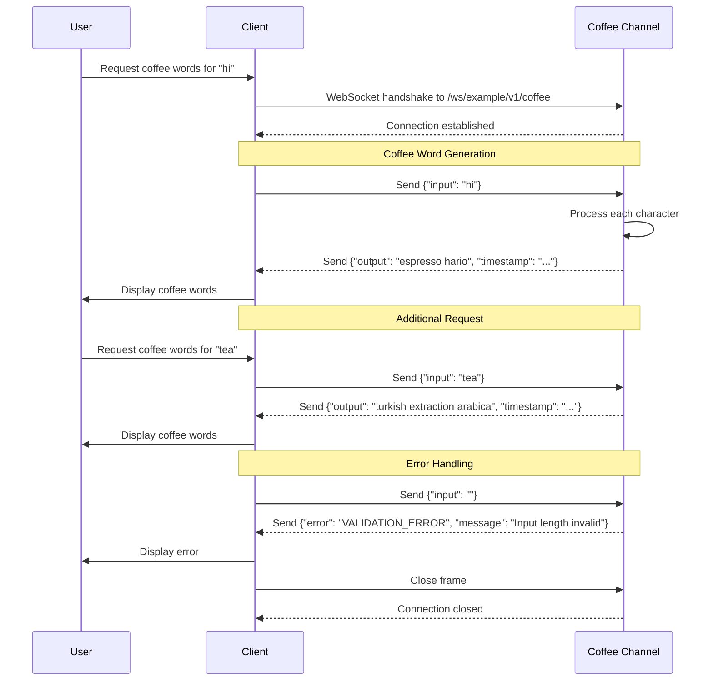
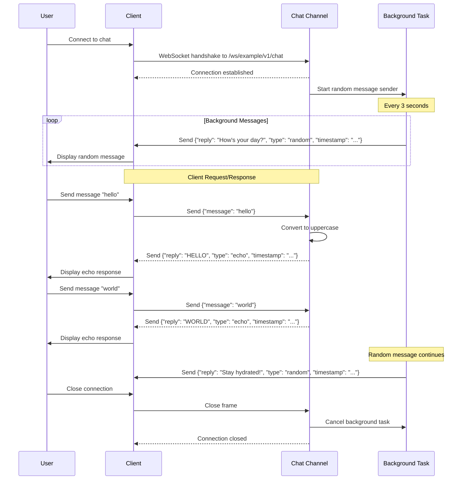
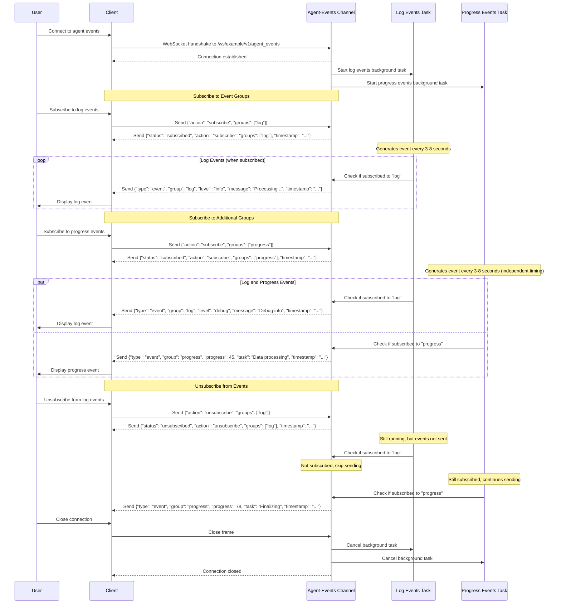

# Feature Specification: Generic WebSocket API

**Feature Branch**: `007-simple-websocket`
**Created**: 2025-10-23
**Last Updated**: 2025-10-29
**Status**: Core Implemented (Production-Ready Pending Observability)
**Input**: User description: "Simple WebSocket API for ephemeral request/response communication"

## Overview

This feature provides a generic, extensible WebSocket router system that enables bidirectional, real-time communication between clients and the server. The system automatically discovers and registers WebSocket endpoints from multi-channel specifications, with extensible validation and processing hooks. Components can define multiple channels, each with independent message handlers. All interactions are ephemeral—no persistent storage is required. Each request is processed independently while maintaining an active connection.

The example implementation provides three channels demonstrating different communication patterns:
- **Coffee channel**: Simple request/response pattern
- **Chat channel**: Bidirectional communication with server-initiated messages
- **Agent-events channel**: Subscription-based event streaming with dynamic subscription management

**Key Characteristics**:
- Multi-channel architecture: One component can expose multiple WebSocket channels
- Auto-discovery of channels from AsyncAPI specifications
- Extensible validation and processing pipeline per channel
- Support for server-initiated messaging via background tasks
- Subscription management for selective event streaming
- Zero-configuration for simple use cases
- Optional customization for complex scenarios

**File Organization**:
- Handler files in `src/nexus/{component}/ws/*.py` contain WebSocket logic
- Schema files in `src/nexus/schemas/{component}/websocket-{handler}.[yaml,yml]` define message contracts
- Automatic path mapping: handler filename determines spec filename (no configuration needed)
- Multiple handlers per component supported, with automatic schema merging
- Fail-fast validation ensures every handler has a matching spec and vice versa

---

## File Organization

The WebSocket framework uses a two-directory structure that separates handler logic from schema definitions, with automatic path mapping based on filename conventions.

### Handler Files: `src/nexus/{component}/ws/*.py`

- **Location**: Component-specific WebSocket handlers
- **Multiple files**: One component can have multiple `.py` files in its `ws/` directory
- **Handler functions**: Files contain `handle_*` and optional `on_connect_*` functions
- **No configuration needed**: Spec path is automatically derived from handler filename

### Schema Files: `src/nexus/schemas/{component}/websocket-{handler}.[yaml,yml]`

- **Centralized location**: All AsyncAPI specifications stored in `schemas/` directory
- **Automatic mapping**: `{handler}.py` → `websocket-{handler}.yaml`
- **Supported formats**: YAML (`.yaml`, `.yml`)

### Automatic Path Mapping Convention

The system automatically maps handler files to spec files based on filename:

```
src/nexus/{component}/ws/{handler}.py  →  src/nexus/schemas/{component}/websocket-{handler}.yaml
```

**Examples**:
- `src/nexus/example/ws/example.py` → `schemas/example/websocket-example.yaml`
- `src/nexus/agent_orchestrator/ws/invocations.py` → `schemas/agent_orchestrator/websocket-invocations.yaml`
- `src/nexus/chat/ws/messages.py` → `schemas/chat/websocket-messages.yaml`

### Example Structure

```
src/nexus/
├── example/
│   └── ws/
│       ├── __init__.py
│       └── example.py                # → schemas/example/websocket-example.yaml
└── agent_orchestrator/
    └── ws/
        ├── __init__.py
        ├── invocations.py            # → schemas/agent_orchestrator/websocket-invocations.yaml
        └── workflows.py              # → schemas/agent_orchestrator/websocket-workflows.yaml

schemas/
├── example/
│   └── websocket-example.yaml
└── agent_orchestrator/
    ├── websocket-invocations.yaml
    └── websocket-workflows.yaml
```

### Fail-Fast Validation

At application startup, the system validates handler/spec pairing:

1. **Handler without spec**: If a handler file exists but the corresponding spec file is missing, the application fails to start with a clear error message
2. **Spec without handler**: If a spec file exists but the corresponding handler file is missing (for components with a `ws/` directory), the application fails to start

This ensures consistency between code and specifications, preventing runtime errors from misconfigurations.

**Example error messages**:
```
ValueError: Handler file 'orphan.py' in component 'example' has no corresponding spec file.
Expected: schemas/example/websocket-orphan.yaml

ValueError: Found 1 orphan spec file(s) without corresponding handlers:
  - schemas/example/websocket-missing.yaml (expected handler: src/nexus/example/ws/missing.py)
```

### Schema Merging

When a component has multiple handler files:
- All specs are loaded and validated based on automatic path mapping
- Schemas are merged into a single unified specification for the component
- **Duplicate channel names** across schemas cause an error at startup
- Each handler function is matched to its corresponding channel from the merged schema

---

## Quick Guidelines
- Focus on WHAT users need and WHY
- Avoid HOW to implement (no tech stack, APIs, code structure)
- Written for business stakeholders, not developers

---

## User Scenarios & Testing

### Primary User Story
As a user who needs real-time bidirectional communication with the server, I want to establish a WebSocket connection to different channels and send/receive messages dynamically, so I can interact with server functionality without the overhead of HTTP polling.

### Acceptance Scenarios

#### Coffee Channel (Request/Response)
1. **Given** I want to generate coffee words, **When** I connect to `/ws/example/v1/coffee` and send text input, **Then** I receive coffee-related words for each character

2. **Given** I have an active coffee channel connection, **When** I send `{"input": "hi"}`, **Then** I receive `{"output": "espresso hario", "timestamp": "..."}`

3. **Given** I send invalid input (empty or too long), **When** the server validates my request, **Then** I receive an error response with validation details

#### Chat Channel (Bidirectional with Server-Initiated Messages)
4. **Given** I want to use the chat channel, **When** I connect to `/ws/example/v1/chat`, **Then** the server starts sending random messages every 3 seconds

5. **Given** I have an active chat connection, **When** I send `{"message": "hello"}`, **Then** I receive `{"reply": "HELLO", "type": "echo", "timestamp": "..."}`

6. **Given** I'm connected to chat, **When** 3 seconds elapse, **Then** I receive a random message with `{"reply": "...", "type": "random", "timestamp": "..."}`

#### Agent-Events Channel (Subscription-Based Event Streaming)
7. **Given** I want to receive agent events, **When** I connect to `/ws/example/v1/agent_events`, **Then** I can subscribe to specific event groups and receive events only for those groups

8. **Given** I have an active agent-events connection, **When** I send `{"action": "subscribe", "groups": ["log"]}`, **Then** I receive `{"status": "subscribed", "action": "subscribe", "groups": ["log"], "timestamp": "..."}` and start receiving log events

9. **Given** I'm subscribed to both log and progress groups, **When** an event occurs, **Then** I receive events like `{"type": "event", "group": "log", "level": "info", "message": "...", "timestamp": "..."}` or `{"type": "event", "group": "progress", "progress": 45, "task": "...", "timestamp": "..."}`

10. **Given** I'm subscribed to event groups, **When** I send `{"action": "unsubscribe", "groups": ["log"]}`, **Then** I receive confirmation and stop receiving log events while continuing to receive other subscribed events

11. **Given** I have no active subscriptions, **When** events occur, **Then** I do not receive any event messages until I subscribe

#### Multi-Channel & General
12. **Given** I have an active connection, **When** I send multiple requests sequentially, **Then** each request is processed independently and I receive corresponding responses

13. **Given** I want to close the connection, **When** I send a close frame, **Then** the connection terminates gracefully and background tasks are cancelled

14. **Given** the server encounters an internal error, **When** processing my request, **Then** I receive an error response with appropriate error code

15. **Given** the system has multiple channels defined, **When** the server starts, **Then** all channels are automatically discovered and registered from the AsyncAPI specification

16. **Given** I need custom validation rules, **When** I define them for my channel, **Then** the system applies my rules in addition to standard validation

### Edge Cases
- What happens when I send malformed JSON?
  - System returns an error response with INVALID_REQUEST error code

- What happens when connection is idle for extended period?
  - Connection remains open until explicitly closed by either party

- What happens when I send very large payloads?
  - System validates payload size and rejects requests exceeding limits

- What happens when the server is under heavy load?
  - System processes requests sequentially per connection, maintaining order

### User Flow Diagrams

#### Coffee Channel Flow (Request/Response Pattern)



#### Chat Channel Flow (Bidirectional with Server-Initiated Messages)



#### Agent-Events Channel Flow (Subscription-Based Event Streaming)



---

## Requirements

### Functional Requirements

**Core Communication Capabilities**
- **FR-001**: System MUST accept WebSocket connections to designated endpoints
- **FR-002**: System MUST maintain bidirectional communication over established connections
- **FR-003**: System MUST process incoming JSON messages
- **FR-004**: System MUST respond with JSON messages
- **FR-005**: System MUST support multiple sequential requests per connection
- **FR-006**: System MUST process requests independently (stateless per request)

**Endpoint Discovery & Registration**
- **FR-007**: System MUST automatically discover channels from AsyncAPI specifications
- **FR-008**: System MUST register discovered channels without manual configuration
- **FR-009**: System MUST support multiple channels per component simultaneously
- **FR-010**: System MUST include timestamp in responses (via extensible processing pipeline)
- **FR-011**: System MUST support server-initiated messaging via background tasks per channel

**Extensibility & Customization**
- **FR-012**: System MUST allow custom validation rules per channel
- **FR-013**: System MUST provide hooks for message processing customization per channel
- **FR-014**: System MUST use default behaviors when customization not provided

**Subscription Management**
- **FR-015**: System MUST support subscription-based event streaming per connection
- **FR-016**: System MUST allow clients to subscribe to specific event groups dynamically
- **FR-017**: System MUST allow clients to unsubscribe from event groups dynamically
- **FR-018**: System MUST only send events to clients subscribed to the corresponding group
- **FR-019**: System MUST maintain independent subscription state per connection
- **FR-020**: System MUST support multiple concurrent event groups with independent timing

**Validation & Error Handling**
- **FR-021**: System MUST validate incoming message format (valid JSON)
- **FR-022**: System MUST validate required fields in messages according to channel schema
- **FR-023**: System MUST respond with error messages for invalid requests
- **FR-024**: System MUST include error codes and descriptions in error responses
- **FR-025**: System MUST continue processing subsequent requests after errors

**Connection Management**
- **FR-026**: System MUST support graceful connection closure by either party
- **FR-027**: System MUST clean up connection resources on disconnect
- **FR-028**: System MUST cancel background tasks when connection closes
- **FR-029**: System MUST handle connection errors without crashing

### Non-Functional Requirements

**Performance**
- **NFR-001**: Message processing latency MUST be less than 50ms (p95)
- **NFR-002**: System MUST support at least 100 concurrent connections
- **NFR-003**: System MUST handle at least 1000 messages per second across all connections

**Reliability**
- **NFR-004**: System MUST maintain connection stability during normal operations
- **NFR-005**: System MUST handle errors gracefully without connection termination

**Scalability**
- **NFR-006**: System MUST scale horizontally to support increased load
- **NFR-007**: System MUST not require persistent storage (ephemeral design)

**Security**
- **NFR-008**: System MUST support secure WebSocket (WSS) connections in production
- **NFR-009**: System MUST validate and sanitize all incoming messages

**Observability**
- **NFR-010**: System MUST log connection lifecycle events (connect, disconnect, errors)
- **NFR-011**: System MUST expose metrics for connection count and message throughput

### Key Entities

All message entities are defined in AsyncAPI schemas located in `src/nexus/schemas/{component}/websocket-{handler}.yaml` files. Handler modules in `src/nexus/{component}/ws/{handler}.py` are automatically mapped to their corresponding schemas based on filename convention.

- **WebSocketConnection**: Represents an active client connection to a specific channel. Tracks connection state, handles message routing, manages background tasks, and maintains subscription state for event streaming
- **CoffeeRequest**: Message sent by client containing input text to convert to coffee words (defined in `schemas/example/websocket-example.yaml`)
- **CoffeeResponse**: Message sent by server containing space-separated coffee words and timestamp
- **ChatRequest**: Message sent by client containing message text for uppercase echo
- **ChatResponse**: Message sent by server containing reply (uppercase echo or random message), type indicator ('echo' or 'random'), and timestamp
- **AgentEventsRequest**: Message sent by client to manage event subscriptions, containing action ('subscribe' or 'unsubscribe') and list of event groups to modify
- **AgentEventsResponse**: Message sent by server confirming subscription changes, containing status, action, affected groups, and timestamp
- **AgentEvent**: Event message sent by server to subscribed clients, containing type ('event'), group identifier ('log' or 'progress'), and group-specific fields (level/message for logs, progress/task for progress events)
- **ErrorResponse**: Message sent by server when request validation or processing fails

---

## Advanced Channel Addressing

### Path Variables in Channel Addresses

Channel addresses can include path variables for dynamic routing patterns. This allows channels to accept parameterized connections without defining separate channels for each parameter value.

**Example channel with path variable**:
```yaml
channels:
  user_session:
    address: /ws/example/v1/session/{session_id}

  workflow_execution:
    address: /ws/workflows/v1/execution/{execution_id}/step/{step_id}
```

**Validation behavior**:
- Path variables (segments matching `/{variable_name}`) are stripped before validation
- Base path must match expected format: `/ws/{component}/v1/{channel_name}`
- Example: `/ws/example/v1/session/{session_id}` validates against `/ws/example/v1/session`

**Use cases**:
- User-specific channels (sessions, notifications)
- Resource-specific channels (document editing, workflow monitoring)
- Hierarchical resources (parent/child relationships)

### Server Pathname Support

AsyncAPI servers can specify a base pathname that is prepended to all channel addresses:

**Schema definition**:
```yaml
servers:
  development:
    host: localhost:8000
    protocol: ws
    pathname: /api/v1  # Base path prepended to all channels
```

**Effect on endpoints**:
- Without pathname: `/ws/example/v1/coffee`
- With pathname `/api/v1`: `/api/v1/ws/example/v1/coffee`

**Validation behavior**:
- Expected format becomes: `{pathname}/ws/{component}/v1/{channel_name}`
- Pathname is optional - defaults to empty string if not specified
- Trailing slashes in pathname are automatically removed

---

## Review & Acceptance Checklist

### Content Quality
- [x] No implementation details (languages, frameworks, APIs)
- [x] Focused on user value and business needs
- [x] Written for non-technical stakeholders
- [x] All mandatory sections completed

### Requirement Completeness
- [x] No [NEEDS CLARIFICATION] markers remain
- [x] Requirements are testable and unambiguous
- [x] Success criteria are measurable
- [x] Scope is clearly bounded
- [x] Dependencies and assumptions identified

---

## Dependencies and Assumptions

### Dependencies
- None (standalone WebSocket implementation)

### Assumptions
- WebSocket support is available in the runtime environment
- JSON is the primary message format
- No authentication required for MVP (can be added later)
- No message persistence required
- Single-server deployment for MVP (horizontal scaling future enhancement)

### Scope Boundaries

**In Scope:**
- WebSocket connection establishment and management per channel
- Multi-channel architecture with component-level organization
- JSON message parsing and validation per channel schema
- Request/response pattern (coffee channel)
- Bidirectional communication with server-initiated messages (chat channel)
- Subscription-based event streaming (agent-events channel)
- Background tasks for server-initiated messaging
- Coffee channel: Character-to-coffee-word conversion
- Chat channel: Uppercase echo and periodic random messages
- Agent-events channel: Dynamic subscription management and selective event streaming
- Connection-specific subscription state tracking
- Multiple independent event groups with separate timing
- Error handling and reporting
- Connection and background task cleanup

**Out of Scope (Future):**
- Authentication and authorization
- Message persistence or logging
- Complex routing patterns beyond channel-based
- Binary message support
- Connection pooling or load balancing
- Rate limiting per connection
- Message compression
- Pub/sub patterns across connections

---

## Success Metrics

**User Experience**
- Users can establish WebSocket connections reliably
- Message round-trip time < 50ms (p95)
- Clear error messages for invalid requests

**System Performance**
- Support 100+ concurrent connections
- Handle 1000+ messages/second
- No memory leaks during long-running connections

**Quality**
- 80%+ test coverage
- All acceptance scenarios passing
- Zero critical bugs in production

---

## Production Readiness Status

**Core Feature**: ✅ Implemented and tested
**Production Prerequisites**:
- [ ] Structured logging (T014b)
- [ ] Metrics collection (T015)
- [ ] Metrics integration (T016)

The WebSocket implementation is fully functional for development and testing. Production deployment requires completion of observability tasks for monitoring and operational visibility.
