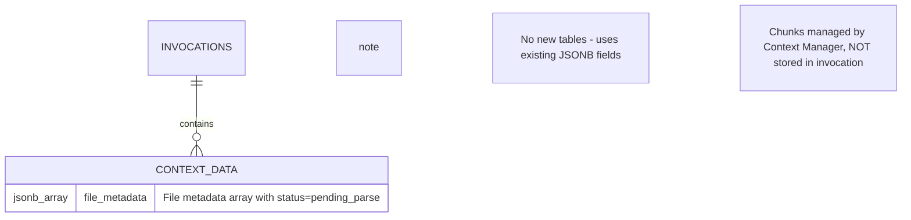

# Data Model: File Attachment Support

**Feature**: File attachment for invocations
**Date**: 2025-11-12

## Overview

This feature extends the existing `Invocation` model to support optional file attachments. **This ticket focuses on file upload, validation, and storage** - file parsing will be handled in a future ticket. Files are saved to temporary storage (`/tmp`), and file metadata (with status="pending_parse") is stored in the existing `invocation.context_data` JSONB field. **No new database tables are required**.

## Entities

### Invocation (Extended)

**Table**: `invocations` (existing)
**Changes**: Extend `context_data` JSONB field structure

**No Schema Changes Required** - leveraging existing JSONB flexibility

**Extended context_data Structure - API Response (This Ticket)**:
```json
{
  "file_metadata": [
    {
      "file_id": "string",           // Public file identifier (UUID) - for future file retrieval
      "filename": "string",          // Original filename
      "size_bytes": "integer",       // File size in bytes (must be > 0)
      "mime_type": "string",         // MIME type (application/pdf, etc.)
      "status": "pending_parse"      // Always "pending_parse" in this ticket
    }
  ]
}
```

**Security Note**: `file_path` is stored internally but **NOT exposed in API responses** to prevent filesystem path disclosure. Use `file_id` for public file references.

**Internal Storage Structure (not in API response)**:
The FileManager internally stores complete metadata including `file_path` for future parsing:
```python
# Internal FileMetadata structure
{
  "file_id": "uuid-string",
  "filename": "string",
  "size_bytes": integer,
  "mime_type": "string",
  "file_path": "/tmp/nexus-uuid-filename.pdf",  // Internal only - for future parsing ticket
  "status": "pending_parse"
}
```

**Example API Response with multiple files**:
```json
{
  "file_metadata": [
    {
      "file_id": "123e4567-e89b-12d3-a456-426614174000",
      "filename": "document.pdf",
      "size_bytes": 524288,
      "mime_type": "application/pdf",
      "status": "pending_parse"
    },
    {
      "file_id": "234e5678-f90c-23e4-b567-537725285111",
      "filename": "appendix.docx",
      "size_bytes": 102400,
      "mime_type": "application/vnd.openxmlformats-officedocument.wordprocessingml.document",
      "status": "pending_parse"
    }
  ]
}
```

**Future Ticket (Parsing) Will Add**:
- `parsing_status`: "success" or "failed" per file
- `error_details`: Parsing error details if failed
- **Note**: Chunks will be managed by Context Manager (not stored in invocation)

**Validation Rules (This Ticket)**:
- `file_metadata` is optional (empty array when no files attached)
- `file_metadata` is an array (supports multiple files)
- Maximum 10 files per invocation (configurable via file_upload_max_files)
- `status` must be "pending_parse" for each file when uploaded
- `file_path` must be valid path to file in `/tmp` for each file

### FileMetadata (In-Memory Only - This Ticket)

**Storage**: Not persisted, used during processing only
**Purpose**: Transfer object between FileManager and InvocationService

**Attributes (This Ticket)**:
```python
@dataclass
class FileMetadata:
    filename: str
    size_bytes: int
    mime_type: str
    file_path: str                           # Path in storage dir where file is saved
    status: Literal["pending_parse"] = "pending_parse"  # Always this value in this ticket
```

**Future Ticket Will Add** (to FileMetadata):
- `parsing_status: Literal["success", "failed"]` - Parsing result
- `error_details: str | None` - Parsing error details

**Note**: Chunks will NOT be added to invocation - they are managed by Context Manager


## Entity Relationships



## Data Flow

### Upload & Storage Flow
```
1. User uploads files (1-10) with invocation request
2. InvocationAPI forwards request to InvocationService
3. InvocationService receives list of UploadFile objects
4. InvocationService calls FileManager.validate_and_save_files(files, invocation_id)
5. FileManager validates all files:
   a. Validates file count (≤ 10 files)
   b. For each file: validates size (≤ 10MB) and MIME type
   c. Saves each file to storage directory (configurable, default /tmp)
   d. Returns list of FileMetadata (filename, size, mime_type, file_path, status="pending_parse")
6. InvocationService builds context_data with file_metadata array
7. Invocation saved to database
```

## Database Impact Analysis

### Storage Requirements
- **Per Invocation with Files**:
  - File metadata in JSONB: ~200 bytes per file (filename, size, mime_type, file_path, status)
  - Total JSONB storage: ~200 bytes per file
  - Maximum with 10 files: ~2000 bytes (~2KB) per invocation
- **Temporary File Storage**: Files stored in `/tmp` directory (not in database)
- **No Binary Storage**: Files not stored in database
- **Chunks Storage**: Will be managed by Context Manager in future ticket (not in invocation)

### Migration Requirements
**NONE** - No schema changes needed

The existing `invocations` table already has:
```sql
context_data JSONB NOT NULL DEFAULT '{}'::jsonb
```

This is sufficient to store file metadata. **Note**: Chunks are NOT stored here - they are managed by Context Manager.

## Validation Rules

### File Metadata Validation
- `file_metadata`: Array of file metadata objects
- Maximum array length: 10 files (configurable via file_upload_max_files)
- Per file metadata:
  - `filename`: Non-empty string, max 255 chars
  - `size_bytes`: Positive integer, max configured limit (default 10MB per file)
  - `mime_type`: Must match allowed types (PDF, DOC, DOCX, TXT, MD)
  - `file_path`: Valid path string to file in `/tmp`
  - `status`: Must be "pending_parse"


## Indexing Strategy

**No New Indexes Required**

Existing indexes are sufficient:
- `invocations.id` (PK) for direct lookups
- `invocations.created_by` + `status` composite index for filtering

**Note**: `context_data` has no index. File metadata queries will use sequential scans, which is acceptable given the small payload size (~2KB max) and file retrieval by invocation ID (indexed).

## Data Retention

### File Content
- **Temporary Files**: Saved to configurable storage directory (default `/tmp` via `file_upload_storage_dir`), NOT deleted in this ticket (deletion handled in future parsing ticket)
- **File Metadata**: Persisted in `context_data` JSONB
- **Chunks**: NOT stored in invocation - managed by Context Manager
- **Lifecycle**: file_path references file in storage directory until future parsing ticket processes it

### Lifecycle
- **Invocation Record**: Persists in database (no deletion endpoint exists)
- **context_data**: Persists with invocation record
- **Files in storage directory**: Remain after upload (cleanup handled in future parsing ticket)

## Security & Privacy

### Data Protection
- File metadata in `context_data` (same security as prompt/result)
- Files stored in configurable storage directory (default `/tmp`) with invocation-specific naming
- No direct file access endpoints
- Tenant isolation via invocation ownership

### Sensitive Data
- File metadata has same sensitivity level as invocation prompt
- Files in `/tmp` readable only by application process
- Subject to same access controls as invocations
- Audit log captures file upload events

## Performance Considerations

### Read Performance
- JSONB access is efficient for small payloads (~200 bytes file metadata per file, ~2KB max)
- File metadata loaded with invocation (single query by invocation ID)

### Write Performance
- JSONB update atomic
- No foreign key cascades (no related tables)
- File validation synchronous but fast (<100ms for MIME detection)
- File save to storage directory uses async I/O (aiofiles) - non-blocking for FastAPI event loop
- Upload latency is network-dependent (no specific performance target)

### Scale Limits
- **Single Invocation**: ~200 bytes file metadata in JSONB (minimal)
- **Concurrent Uploads**: Limited by FastAPI worker count and `/tmp` disk I/O
- **Database Size**: Minimal impact (~202 bytes per file-based invocation)

## Error Scenarios

### Validation Failures
**No Database Write** - Request rejected before invocation created

Examples:
- File too large (>10MB per file): 400 Bad Request with RFC 9457 error
- Too many files (>10 files): 400 Bad Request with RFC 9457 error
- Unsupported MIME type: 400 Bad Request with RFC 9457 error
- Missing required fields: 400 Bad Request with RFC 9457 error

### Storage Failures
**No Database Write** - Request rejected when file save fails

Examples:
- Disk full: 500 Internal Server Error with generic message to client; detailed error logged internally
- Permission denied: 500 Internal Server Error with generic message to client; detailed error logged internally
- I/O errors: 500 Internal Server Error with generic message to client; detailed error logged internally

**Security Note**: Do not expose internal infrastructure details (disk space, permissions) to API clients

### Logging
**All file uploads logged** - For monitoring and troubleshooting

Logged metadata includes:
- Filename
- File size (bytes)
- User ID (created_by)
- Timestamp
- Upload status (success/failure)
- Detailed error information for storage failures (disk full, permission denied, I/O errors with full exception details)

## Summary

This ticket implements multiple file upload, validation, and storage without parsing. The design leverages existing database infrastructure with zero schema changes. The JSONB `context_data` field stores an array of file metadata (filename, size, MIME type, file_path, status="pending_parse"). Supports 1-10 files per invocation (configurable). Files are saved to `/tmp` for future parsing. **Chunks will be managed by Context Manager, not stored in invocation.**

**Benefits (This Ticket)**:
- ✅ No database migration required
- ✅ Minimal storage overhead (~200 bytes per file, max ~2KB for 10 files)
- ✅ Existing indexes sufficient
- ✅ Files ready for future parsing ticket (file_path stored)
- ✅ Future-proof (JSONB allows schema evolution for parsing fields)
- ✅ Flexible (supports 1-10 files with configurable limits)
- ✅ Clean separation: chunks managed by Context Manager, not in invocation
