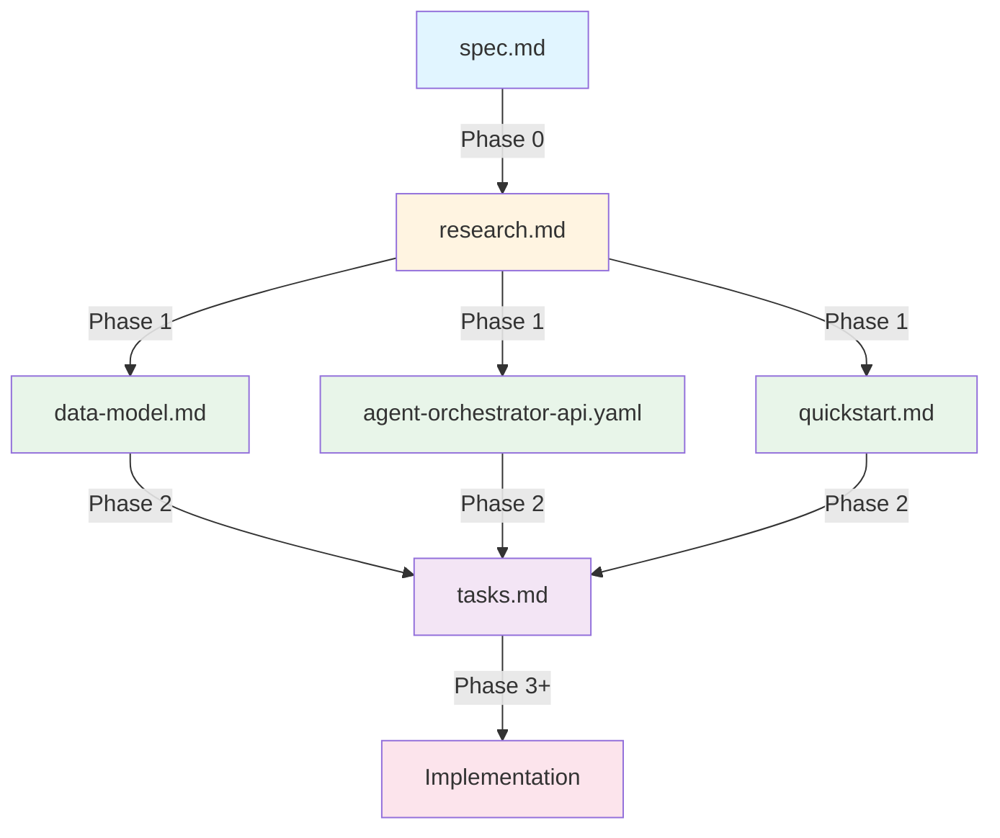
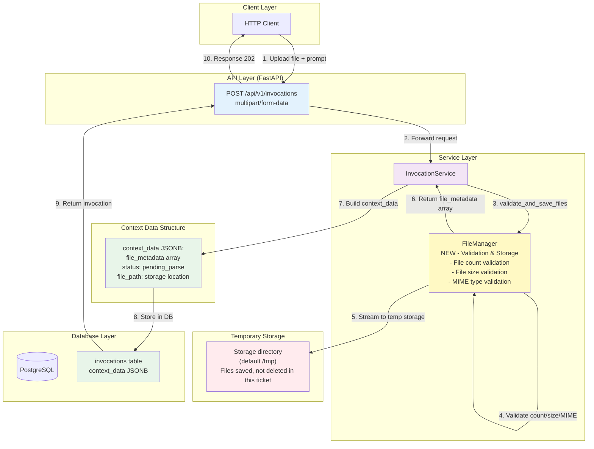
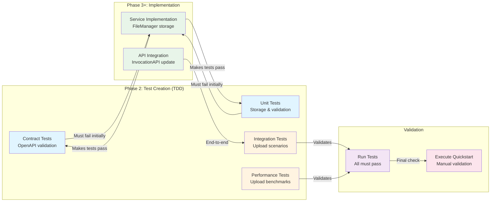

# Implementation Plan: File Attachment Support for Invocations

**Branch**: `008-file-manager-modify` | **Date**: 2025-11-12 | **Spec**: [spec.md](./spec.md)
**Input**: Feature specification from `/specs/008-file-manager-upload/spec.md`

## Execution Flow (/plan command scope)

```text
1. Load feature spec from Input path
   → ✅ COMPLETE: Loaded spec.md and verified all NEEDS CLARIFICATION resolved
2. Fill Technical Context (scan for NEEDS CLARIFICATION)
   → ✅ COMPLETE: All technical decisions documented in research.md
3. Fill the Constitution Check section based on the content of the constitution document.
   → ✅ COMPLETE: All checks passed
4. Evaluate Constitution Check section below
   → ✅ COMPLETE: No violations detected
5. Execute Phase 0 → research.md
   → ✅ COMPLETE: research.md created with all decisions documented
6. Execute Phase 1 → schemas, data-model.md, quickstart.md, CLAUDE.md
   → ✅ COMPLETE: All artifacts created
7. Re-evaluate Constitution Check section
   → ✅ COMPLETE: All checks still passing post-design
8. Plan Phase 2 → Describe task generation approach (DO NOT create tasks.md)
   → ✅ COMPLETE: See Phase 2 section below
9. STOP - Ready for /tasks command
   → ✅ COMPLETE: Execution stopped, ready for /tasks
```

## Summary

Add optional multiple file attachment support to the POST /invocations endpoint. Users can upload 1-10 files per invocation (configurable via file_upload_max_files). Files (PDF, DOC, DOCX, TXT, MD) up to 10MB each are uploaded via multipart/form-data, **saved to temporary storage**, and file metadata array is captured in the invocation's context_data JSONB field. File parsing will be handled in a future ticket - this ticket focuses on file upload, validation, and storage.

**Technical Approach**: Create standalone **FileManager** service for file storage and validation. Leverage configurable storage directory (default `/tmp` via `file_upload_storage_dir` setting) for temporary file storage, FastAPI's `UploadFile` for streaming uploads, and extend existing `invocations.context_data` JSONB field with file metadata array (zero database migrations required). **Note**: Actual file parsing (PyPDF2, python-docx) will be added in a future ticket. Future integration with Planner and Context Manager services will also be handled in separate tickets.

**This Ticket Scope**: Multiple file upload (1-10 files), file count/size/MIME validation, temporary storage, metadata array capture (status="pending_parse"). Chunks managed by Context Manager.
**Future Ticket**: File parsing logic, chunk extraction, parsing error handling

## Technical Context

- **Language/Version**: Python 3.12
- **Primary Dependencies**: FastAPI, SQLModel, python-magic (^0.4.27) for MIME detection, aiofiles (^24.1.0) for async file I/O, httpx
- **Storage**: PostgreSQL with SQLModel ORM (no new tables - uses existing JSONB field), temporary file storage in configurable directory (default `/tmp`)
- **Testing**: pytest
- **Target Platform**: Linux server
- **Project Type**: single (backend API only)
- **Constraints**:
  - <10MB file size limit per file (configurable via file_upload_max_size_mb)
  - Max 10 files per invocation (configurable via file_upload_max_files)
  - Files saved to configurable storage directory (default `/tmp` via file_upload_storage_dir, not deleted in this ticket - cleanup in future parsing ticket)
  - Streaming to prevent memory overflow
  - MIME type validation using python-magic
  - Async I/O using aiofiles to prevent blocking FastAPI event loop
  - 500 Internal Server Error for file save failures (generic message to client, detailed logging internally)
  - Log all file uploads with metadata (filename, size, user, timestamp) and detailed storage errors
- **Scale/Scope**:
  - Supports 4 file formats (PDF, DOC/DOCX, TXT, MD) - validation only, not parsing
  - File metadata array stored in JSONB (~200 bytes per file, max ~2KB for 10 files)
  - Chunks managed by Context Manager (not stored in invocation)
  - Concurrent upload handling via FastAPI workers
  - Upload latency is network-dependent (no specific performance target)

## Constitution Check

*GATE: Must pass before Phase 0 research. Re-check after Phase 1 design.*

### Technology Standards Compliance

- ✅ **SQLModel for Data Models**: No new data models required (using existing `Invocation` model with extended JSONB)

### Code Architecture Compliance

- ✅ **DRY Principle**: FileManager encapsulates all file storage/validation logic, no duplication
- ✅ **SOLID Principles**:
  - Single Responsibility: FileManager handles only file storage and validation (parsing added in future ticket)
  - Open/Closed: Future parsing logic can be added without modifying existing storage code
  - Dependency Injection: FileManager injected into InvocationService
- ✅ **Separation of Concerns**: Clear layers: API (FastAPI) → Service (InvocationService) → Storage (FileManager)
- ✅ **Dependency Injection**: FileManager injected via constructor
- ✅ **Composition vs Inheritance**: Uses composition (service calling storage service)

### API Specification Standards Compliance

- ✅ **OpenAPI Compliance**: Extended existing OpenAPI 3.0.3 schema with multipart/form-data
- ✅ **Naming Convention**: All schema fields use snake_case (file_metadata, file_path, status)
- ✅ **Documentation Completeness**: All new parameters, error codes, and examples fully documented
- ✅ **RFC 9457 Error Format**: All error responses (fileTooLarge, unsupportedFormat, tooManyFiles, 500 for storage failures) follow Problem Details standard (parsingFailed will be added in future parsing ticket)
- ✅ **Error Message Safety**: Error messages are actionable without exposing temp paths or stack traces
- ✅ **API Versioning**: Uses existing /api/v1 versioning scheme
- ✅ **API Path Structure**: Extends existing /api/v1/invocations endpoint
- ✅ **Pagination Support**: N/A (not a collection endpoint)
- ✅ **Filtering/Sorting Consistency**: N/A (not a collection endpoint)
- ✅ **Security Documentation**: Extends existing authentication requirements (BearerAuth/ApiKeyAuth)
- ✅ **Schema Compatibility**: Backward compatible - file parameter is optional, existing JSON requests still work

## Project Structure

### Documentation (this feature)

```text
specs/008-file-manager-upload/
├── plan.md              # This file (/plan command output)
├── spec.md              # Feature specification
├── research.md          # Phase 0 output (/plan command) ✅
├── data-model.md        # Phase 1 output (/plan command) ✅
├── quickstart.md        # Phase 1 output (/plan command) ✅
└── tasks.md             # Phase 2 output (/tasks command - NOT created by /plan)
```

### Source Code (repository root)

```text
src/nexus/
├── agent_orchestrator/
│   ├── models/
│   │   └── invocation.py                        # Extended context_data structure (MODIFY)
│   ├── services/
│   │   └── invocation_service.py                # Accept UploadFile parameter (MODIFY)
│   └── context_manager/                          # NEW: Directory for context management
│       └── file_manager/                         # NEW: File manager package
│           ├── __init__.py                       # NEW: Main FileManager service class
│           ├── retrievers/                       # NEW: Retriever adapters (for future multi-source support)
│           │   ├── __init__.py                   # NEW
│           │   ├── base.py                       # NEW: Abstract base retriever interface
│           │   └── local.py                      # NEW: Local filesystem retriever (THIS TICKET)
│           ├── validators.py                     # NEW: Validation logic (count, size, MIME)
│           └── storage.py                        # NEW: Storage operations (async file I/O with aiofiles)
├── core/
│   └── config.py                                 # Add file upload settings (MODIFY)
└── api/
    └── v1/
        └── invocation.py                         # Accept multipart/form-data (MODIFY)

tests/
├── contract/
│   └── test_invocation_file_upload_contract.py  # NEW: OpenAPI schema validation
├── integration/
│   └── api/
│       └── test_file_upload.py                   # NEW: End-to-end file upload tests
├── unit/
│   ├── test_file_manager.py                     # NEW: File storage/validation unit tests
│   ├── test_file_validation_count.py            # NEW: File count validation tests
│   ├── test_file_validation_size.py             # NEW: File size validation tests
│   └── test_file_validation_mime.py             # NEW: MIME type validation tests
└── fixtures/
    ├── __init__.py                               # Helper functions including generate_large_file()
    └── files/                                    # NEW: Test files (just for MIME detection, not parsing)
        ├── sample.pdf
        ├── sample.docx
        ├── sample.txt
        ├── sample.md
        ├── sample1.pdf through sample15.pdf      # For multi-file testing (~50KB each, 1-10 for valid, 11-15 for too-many-files error)
        └── image.png                             # For unsupported format testing

        Note: large.pdf (>10MB) generated dynamically in tests, not committed to repository

src/nexus/schemas/agent_orchestrator/
└── agent-orchestrator-api.yaml                   # Extended with multipart (MODIFIED) ✅
```

**Structure Decision**: Option 1 (Single project) - Backend API only, no frontend component

**Future Extensibility Note**: The `file_manager/retrievers/` directory is designed for future multi-source support:
- **This Ticket**: `local.py` - Local filesystem retriever only
- **Future Tickets**: Additional retrievers for external sources:
  - `google_docs.py` - Google Docs/Drive integration
  - `dropbox.py` - Dropbox integration
  - `atlassian.py` - Confluence/Jira attachments
  - `sharepoint.py` - SharePoint integration
  - etc.

All retrievers will implement the `base.py` interface, allowing the FileManager to work with any source transparently.

## Architecture Overview

### Implementation Plan Artifact Flow



### System Architecture & Data Flow

#### This Ticket - File Upload & Storage



#### Future Ticket - File Parsing

- Add parsing logic to FileManager
- Parse file from temp storage → extract chunks
- Store chunks in Context Manager (not in invocation)
- Delete temp file after parsing

### Test Strategy Flow



## Phase 0: Outline & Research

**Status**: ✅ COMPLETE

**Output**: [research.md](./research.md)

**Key Decisions**:
1. **File Upload Handling**: FastAPI's `UploadFile` with streaming (prevents memory overflow)
2. **Multiple Files Support**: Support 1-10 files per invocation (configurable via file_upload_max_files)
3. **Temporary File Storage**: Save to configurable storage directory (default `/tmp` via file_upload_storage_dir, deletion handled in future parsing ticket)
4. **MIME Detection**: python-magic for file type validation
5. **Async I/O**: Use aiofiles library for non-blocking file operations to prevent blocking FastAPI event loop
6. **Configuration**: Pydantic Settings with `file_upload_max_size_mb=10`, `file_upload_max_files=10`, `file_upload_storage_dir="/tmp"`, `file_upload_allowed_mime_types=[...]`
7. **Data Model**: No new tables - extend existing `invocations.context_data` JSONB field with file_metadata array (status="pending_parse" per file). Chunks managed by Context Manager.
8. **Validation**: All validation in FileManager (file count, size per file, and MIME type using python-magic) - API layer just forwards requests
9. **Error Format**: RFC 9457 Problem Details (400 for validation errors, 500 for storage failures with generic message)
10. **Logging**: Log every file upload event with metadata (filename, size, user ID, timestamp) and detailed storage failure information
11. **Security**: Do not expose internal infrastructure details in error responses (disk space, permissions, paths)
12. **Latency**: No specific target - network dependent (variable based on client connection)
13. **Parsing Deferred**: File parsing (PyPDF2, python-docx) will be added in future ticket

**All NEEDS CLARIFICATION Resolved**: ✅

## Phase 1: Design & Contracts

**Status**: ✅ COMPLETE

**Prerequisites**: research.md complete ✅

### Artifacts Created

1. ✅ **data-model.md** ([data-model.md](./data-model.md)):
   - Extended `Invocation.context_data` structure with `file_metadata` array (status="pending_parse" per file)
   - Chunks managed by Context Manager (not stored in invocation)
   - No database migrations required (leverages existing JSONB field)
   - In-memory `FileMetadata` dataclass for file storage metadata
   - Validation rules for file metadata array (max 10 files, configurable)
   - Storage requirements analysis (~200 bytes per file, max ~2KB for 10 files per invocation)

2. ✅ **OpenAPI Schema** ([src/nexus/schemas/agent_orchestrator/agent-orchestrator-api.yaml](../../src/nexus/schemas/agent_orchestrator/agent-orchestrator-api.yaml)):
   - Moved from `specs/002-agent-orchestrator/contracts/` to constitutional location
   - Created `InvocationRequestWithFile` schema extending `InvocationRequest` via `allOf`
   - Updated POST /invocations to accept both `application/json` and `multipart/form-data`
   - Added files array with maxItems: 10 constraint
   - Added file-specific error examples (fileTooLarge, unsupportedFormat, tooManyFiles)
   - Updated `Invocation.contextData` documentation to show file_metadata array structure

3. ✅ **quickstart.md** ([quickstart.md](./quickstart.md)):
   - Test scenarios covering upload and validation requirements (parsing scenarios deferred to future ticket)
   - Scenario 1: Upload Valid PDF File (validates storage, not parsing)
   - Scenario 2: Upload DOCX File (validates storage, not parsing)
   - Scenario 3: Upload Text/Markdown Files (validates storage, not parsing)
   - Scenario 4: Invocation Without Files (Backward Compatibility)
   - Scenario 5: File Too Large Error
   - Scenario 6: Unsupported File Format Error
   - Scenario 7: Too Many Files Error (>10 files)
   - Scenario 8+: Multiple files upload scenarios
   - Automated test suite command: `uv run pytest tests/integration/api/test_file_upload.py -v`

4. ✅ **Agent Context Update** (CLAUDE.md):
   - Executed `.specify/scripts/bash/update-agent-context.sh claude`
   - Updated with new technical context from this plan

### Contract Tests Plan
Will be created in Phase 2 (tasks.md):
- `tests/contract/test_invocation_file_upload_contract.py`:
  - Validate multipart/form-data request schema with files array
  - Validate response schema includes file_metadata array
  - Validate error response schemas (400 errors for file issues including tooManyFiles)
  - Assert backward compatibility (JSON requests still work)

### Integration Test Scenarios
From quickstart.md, will be implemented in Phase 2:
- All scenarios (single file, multiple files, error cases) → integration tests in `tests/integration/api/test_file_upload.py`

## Phase 2: Task Planning Approach

**Status**: ✅ PLANNED (tasks.md will be created by /tasks command)

**Task Generation Strategy**:

1. Load `.specify/templates/tasks-template.md` as base template
2. Generate tasks from Phase 1 design artifacts:
   - From `agent-orchestrator-api.yaml` → Contract test tasks
   - From `data-model.md` → Model extension tasks
   - From `quickstart.md` scenarios → Integration test tasks
3. Task structure:
   - **Setup Tasks**: Create test fixtures directory and sample files
   - **Contract Test Tasks** [P]: OpenAPI schema validation tests (can run in parallel)
   - **Unit Test Tasks** [P]: FileManager tests for each format and file count validation (can run in parallel)
   - **Service Layer Tasks**: Implement FileManager with file iteration, extend InvocationService to handle file arrays
   - **API Layer Tasks**: Update InvocationAPI to accept multipart/form-data with files array
   - **Integration Test Tasks**: Implement quickstart scenarios including multiple files tests
   - **Configuration Tasks**: Add Pydantic settings for file upload limits (file_upload_max_size_mb, file_upload_max_files)
   - **Cleanup Tasks**: Ensure tempfile cleanup works in all error scenarios

**Ordering Strategy**:

1. **TDD Order**: Tests before implementation
   - Write contract tests first (must fail - no implementation yet)
   - Write unit tests next (must fail)
   - Implement services to make tests pass
   - Write integration tests
   - Implement API layer to make integration tests pass

2. **Dependency Order**:
   - Test fixtures first (needed by all tests)
   - Contract tests [P] (independent, can run parallel)
   - Unit tests [P] (independent, can run parallel)
   - FileManager implementation (makes unit tests pass)
   - InvocationService extension (depends on FileManager)
   - API layer update (depends on InvocationService)
   - Integration tests (validates end-to-end)

3. **Parallel Execution Markers** [P]:
   - Contract tests for different endpoints [P]
   - Unit tests for different file formats [P]
   - Test fixture file creation [P]

**Estimated Output**: 25-30 numbered, dependency-ordered tasks in tasks.md

**Example Task Breakdown**:

```text
1. Create test fixtures directory and sample files [P]
2. Write contract test: POST /invocations with multipart/form-data files array [P]
3. Write contract test: Backward compatibility JSON requests [P]
4. Write unit test: FileManager.validate_and_save_files() [P]
5. Write unit test: File count validation in FileManager [P]
6. Write unit test: File size validation in FileManager [P]
7. Write unit test: MIME type validation in FileManager [P]
8. Implement FileManager.validate_and_save_files() with all validations
9. Extend InvocationService to accept list[UploadFile]
10. Update InvocationService to call FileManager.validate_and_save_files()
11. Update InvocationAPI to accept multipart/form-data with files array
12. Write integration test: Scenario 1 (upload valid PDF) [P]
13. Write integration test: Scenario 5 (file too large) [P]
14. Write integration test: Scenario 7 (too many files) [P]
15. Write integration test: Multiple files scenario [P]
...
25. Run all tests and verify cleanup behavior
```

**IMPORTANT**: This phase is executed by the `/tasks` command, NOT by `/plan`

## Phase 3+: Future Implementation

**Phase 3**: Task execution (/tasks command creates tasks.md)
**Phase 4**: Implementation (execute tasks.md following constitutional principles)
**Phase 5**: Validation (run tests, execute quickstart.md, performance validation)

## Complexity Tracking

*No violations detected - this section is empty*

All constitutional checks passed without requiring justification.

## Progress Tracking

**Phase Status**:

- ✅ Phase 0: Research complete (/plan command)
- ✅ Phase 1: Design complete (/plan command)
- ✅ Phase 2: Task planning complete (/plan command - describe approach only)
- ⏳ Phase 3: Tasks generated (/tasks command) - NEXT STEP
- ⏳ Phase 4: Implementation complete
- ⏳ Phase 5: Validation passed

**Gate Status**:

- ✅ Initial Constitution Check: PASS
- ✅ Post-Design Constitution Check: PASS
- ✅ All NEEDS CLARIFICATION resolved
- ✅ Complexity deviations documented (none)

**Artifacts Created**:

- ✅ research.md (Phase 0)
- ✅ data-model.md (Phase 1)
- ✅ src/nexus/schemas/agent_orchestrator/agent-orchestrator-api.yaml (Phase 1)
- ✅ quickstart.md (Phase 1)
- ✅ CLAUDE.md updated (Phase 1)
- ✅ plan.md (this file - Phase 1)

**Ready for**: `/tasks` command to generate tasks.md

---
*Based on Constitution v1.2.0 - See `.specify/memory/constitution.md`*
