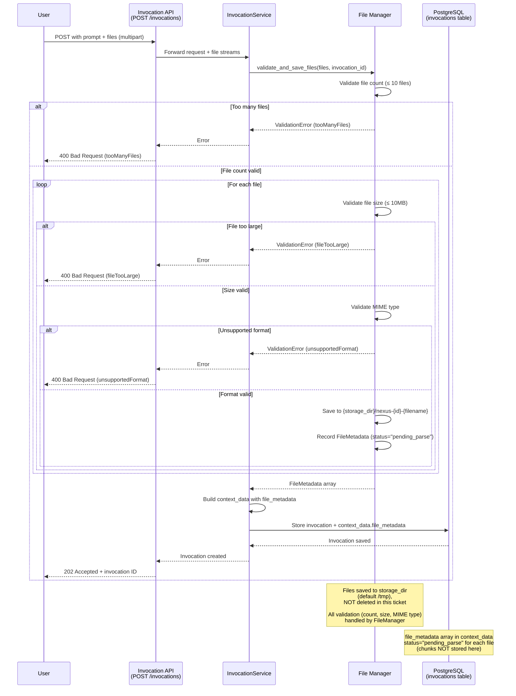

# Feature Specification: File Attachment Support for Invocations

**Feature Branch**: `008-file-manager-modify`
**Created**: 2025-01-12
**Status**: Draft
**Input**: User description: "File Manager: Modify the invocations endpoint to attach a file, and pass this file, via the context manager and planner to the file manager"

## Clarifications

### Session 2025-11-12
- Q: What is the maximum file size that should be accepted for upload? → A: Configurable setting, default 10 MB
- Q: Which file formats should the system support for upload validation? → A: PDF, DOC/DOCX, TXT, and MD (MIME type validation only in this ticket - parsing in future ticket)
- Q: How long should uploaded files be retained in storage? → A: Files remain in storage for future parsing ticket (this ticket does NOT delete files - deletion will be handled in future parsing ticket after processing)
- Q: Who should have permission to access uploaded files? → A: Not accessible via API/UI after upload

### Session 2025-11-14
- Q: What is the acceptable maximum latency for the complete file upload operation (validation + storage) for a 10MB file? → A: No specific target - network dependent (variable based on client connection)
- Q: If saving a file to the storage directory fails (e.g., disk full, permission denied), what should the system do? → A: Return 500 Internal Server Error with generic message; log detailed storage error internally for ops/debugging
- Q: Should the system log file upload events for monitoring and troubleshooting? → A: Log every file upload with metadata (filename, size, user, timestamp)
- Q: Should file save operations use async I/O (e.g., aiofiles) to avoid blocking the FastAPI event loop? → A: Yes - use async I/O (aiofiles) for non-blocking operations

### Clarification Impact Analysis

```mermaid
graph TB
    subgraph "Taxonomy Coverage"
        FS[File Size Limits<br/>Status: RESOLVED]
        FF[File Formats<br/>Status: RESOLVED]
        ST[Storage & Retention<br/>Status: RESOLVED]
        EH[Error Handling<br/>Status: RESOLVED]
        AC[Access Control<br/>Status: RESOLVED]
        MF[Multi-File Support<br/>Status: RESOLVED]

        MF -->|Updated| FR1[FR-001: Multiple Files]
        MF -->|Updated| FR4[FR-004: File Count Validation]
        FS -->|Updated| FR5[FR-005: Size Validation]
        FF -->|Updated| FR6[FR-006: Format Validation]
        ST -->|Updated| FR7[FR-007: File Storage]
        EH -->|Updated| FR10[FR-010: Error Response]
        AC -->|Updated| FR9[FR-009: Access Control]

        FR5 --> NFR1[NFR-001: Size Check Before Upload]
        FR6 --> NFR2[NFR-002: Format Check During Upload]
        FR4 --> NFR3[NFR-003: Early Count Validation]
        FR7 --> NFR5[NFR-005: Async I/O]

        style FS fill:#90EE90
        style FF fill:#90EE90
        style ST fill:#90EE90
        style EH fill:#90EE90
        style AC fill:#90EE90
        style MF fill:#90EE90
        style FR1 fill:#87CEEB
        style FR4 fill:#87CEEB
        style FR5 fill:#87CEEB
        style FR6 fill:#87CEEB
        style FR7 fill:#87CEEB
        style FR9 fill:#87CEEB
        style FR10 fill:#87CEEB
    end

    subgraph "Impact Areas"
        API[API Contract Changes]
        DATA[Data Model Updates]
        FLOW[Workflow Changes]

        FR1 --> API
        FR4 --> API
        FR5 --> API
        FR6 --> API
        FR10 --> API
        FR9 --> API

        FR7 --> DATA
        FR9 --> DATA

        FR10 --> FLOW

        style API fill:#FFB6C1
        style DATA fill:#FFB6C1
        style FLOW fill:#FFB6C1
    end

    FS -.->|Configurable| IMPL[Implementation Note:<br/>Config-driven with<br/>sensible default]

    style IMPL fill:#FFA500
```



**Legend:**
- 🟢 Green: Resolved taxonomy categories
- 🟡 Yellow: Deferred (low impact / future scope)
- 🔵 Blue: Functional requirements updated
- 🌸 Pink: Specification sections impacted

---

## Execution Flow (main)
```
1. Parse user description from Input
   → Extracted: invocation endpoint, file attachment, context manager, planner, file manager
2. Extract key concepts from description
   → Identified: actors (developer, system), actions (attach, pass, parse), data (files, context), constraints (file format, processing flow)
3. For each unclear aspect:
   → RESOLVED: File size limits - configurable, default 10MB per file
   → RESOLVED: Supported file formats - PDF, DOC/DOCX, TXT, MD (MIME validation only, parsing in future ticket)
   → RESOLVED: File storage and retention - files remain in storage for future parsing ticket (NOT deleted in this ticket)
   → RESOLVED: Error handling - 500 for storage failures (generic message to client, detailed logs internally)
   → RESOLVED: File access control - not accessible via API/UI after upload
   → RESOLVED: Async I/O - use aiofiles for non-blocking file operations
   → RESOLVED: Logging - log all uploads with metadata
   → RESOLVED: Latency - no specific target (network dependent)
4. Fill User Scenarios & Testing section
   → User flow defined with file upload to invocation
5. Generate Functional Requirements
   → 16 requirements identified (11 FR + 5 NFR), all clarified
6. Identify Key Entities (if data involved)
   → File attachment metadata, context package
7. Run Review Checklist
   → SUCCESS: All clarifications resolved
8. Return: SUCCESS (spec ready for planning)
```

---

## ⚡ Quick Guidelines
- ✅ Focus on WHAT users need and WHY
- ❌ Avoid HOW to implement (no tech stack, APIs, code structure)
- 👥 Written for business stakeholders, not developers

### Section Requirements
- **Mandatory sections**: Must be completed for every feature
- **Optional sections**: Include only when relevant to the feature
- When a section doesn't apply, remove it entirely (don't leave as "N/A")

### For AI Generation
When creating this spec from a user prompt:
1. **Mark all ambiguities**: Use [NEEDS CLARIFICATION: specific question] for any assumption you'd need to make
2. **Don't guess**: If the prompt doesn't specify something (e.g., "login system" without auth method), mark it
3. **Think like a tester**: Every vague requirement should fail the "testable and unambiguous" checklist item
4. **Common underspecified areas**:
   - User types and permissions
   - Data retention/deletion policies
   - Performance targets and scale
   - Error handling behaviors
   - Integration requirements
   - Security/compliance needs

---

## User Scenarios & Testing *(mandatory)*

### Primary User Story
As a developer using the invocation API, I want to attach one or more files (such as PDF documents, up to 10 files per invocation) to my invocation request so that the system can store them for future processing, enabling the agent to eventually process document-specific information alongside my prompt.

**Note**: This ticket focuses on file upload, validation, and storage. File parsing and chunk management will be handled in a future ticket by the Context Manager.

### Acceptance Scenarios
1. **Given** a user has 1-3 PDF files to analyze, **When** they submit a POST request to `/invocations` with a prompt and multiple file attachments, **Then** the system accepts the request, validates and stores files to temporary storage, captures file metadata with status="pending_parse", and returns an invocation ID
2. **Given** a user submits an invocation with file attachments, **When** the InvocationService processes the request, **Then** it calls FileManager to validate and save files (FileManager validates count, size, MIME type and saves to storage directory)
3. **Given** a user retrieves invocation details, **When** they query the invocation, **Then** the file metadata array (filename, size, mime_type, file_path, status) is included in the response
4. **Given** a user uploads more than 10 files, **When** the system validates the request, **Then** it rejects the upload with an error indicating the maximum file count limit
5. **Given** a file exceeds the configured size limit (10MB per file), **When** a user attempts to upload it, **Then** the system rejects the upload with a clear error message indicating the size limit
6. **Given** a file with an unsupported format is uploaded, **When** the system validates the file type, **Then** it rejects the request with an error listing supported formats (PDF, DOC, DOCX, TXT, MD)
7. **Given** a user submits an invocation without file attachments, **When** the system processes it, **Then** it works as before (backward compatible)

### Edge Cases
- What happens when a user submits an invocation without file attachments? (Should still work as before - backward compatible)
- What happens when the file is too large? (System rejects upload if any file exceeds configured size limit per file, default 10 MB)
- What happens when the file format is not supported? (System rejects upload with error listing supported formats: PDF, DOC/DOCX, TXT, MD)
- What happens when a user tries to attach more than 10 files? (System rejects upload with error indicating maximum 10 files per invocation, configurable via file_upload_max_files)
- What happens when file save fails (disk full, permission denied)? (System returns 500 Internal Server Error with generic message to client; detailed error logged internally)
- How are files secured and who can access them? (Files stored in storage directory with invocation-specific naming, not accessible via API/UI)
- What happens to uploaded files after this ticket completes? (Files remain in storage directory with status="pending_parse" for future parsing ticket)

---

## Requirements *(mandatory)*

### Functional Requirements
- **FR-001**: System MUST accept multiple file attachments (1-10 files per invocation) in invocation requests via multipart form-data encoding
- **FR-002**: System MUST maintain backward compatibility by allowing invocation requests without file attachments
- **FR-003**: System MUST record file metadata array (filename, size, mime type, file_path, status) in the invocation context_data
- **FR-004**: System MUST validate file count and reject requests exceeding the configurable limit (default: 10 files per invocation via file_upload_max_files)
- **FR-005**: System MUST validate file attachments against a configurable size limit (default: 10 MB per file via file_upload_max_size_mb) and reject files exceeding this limit with clear error messaging
- **FR-006**: System MUST restrict file types to supported formats (PDF, DOC/DOCX, TXT, MD) using MIME type detection and reject unsupported formats with an error message listing allowed types
- **FR-007**: System MUST save uploaded files to configurable temporary storage directory (default `/tmp` via file_upload_storage_dir setting) with invocation-specific naming (nexus-{invocation_id}-{filename})
- **FR-008**: System MUST capture file metadata with status="pending_parse" for each uploaded file in the context_data.file_metadata array
- **FR-009**: System MUST NOT expose uploaded files via API or UI endpoints after upload - files are only accessible via file_path for future parsing
- **FR-010**: System MUST respond with 500 Internal Server Error (with generic error message) when file save operations fail due to storage issues (disk full, permission denied, I/O errors) and MUST log detailed error information internally for operations/debugging
- **FR-011**: System MUST log every file upload event with metadata including filename, file size, user ID (created_by), and timestamp for monitoring and troubleshooting purposes

### Non-Functional Requirements
- **NFR-001**: File size validation MUST occur before file upload completes to minimize bandwidth waste
- **NFR-002**: File format validation MUST occur during upload to provide fast feedback
- **NFR-003**: File count validation MUST occur early in request processing to reject oversized requests quickly
- **NFR-004**: Upload latency is network-dependent and not constrained by system performance targets
- **NFR-005**: File save operations MUST use async I/O (non-blocking) to prevent blocking the FastAPI event loop during file writes

### Key Entities *(include if feature involves data)*

#### Upload & Storage

- **File Metadata (Array Element)**: Information about an uploaded file recorded in invocation's context_data.file_metadata array
  - Attributes: filename (string), size_bytes (int), mime_type (string), file_path (string), status (string: "pending_parse")
  - Relationship: Multiple file metadata elements per invocation (max 10), stored as array in context_data JSONB field
  - Lifecycle: Created on upload, persists in database with invocation
  - Storage: Each element ~200 bytes, max ~2KB for 10 files per invocation
  - Example:
    ```json
    {
      "file_metadata": [
        {
          "filename": "document.pdf",
          "size_bytes": 524288,
          "mime_type": "application/pdf",
          "file_path": "/tmp/nexus-550e8400-...-document.pdf",
          "status": "pending_parse"
        }
      ]
    }
    ```

- **Temporary File**: Physical file stored in configurable storage directory
  - Location: `{storage_dir}/nexus-{invocation_id}-{filename}` (storage_dir from file_upload_storage_dir setting, default `/tmp`)
  - Lifecycle: Created on upload, NOT deleted in this ticket (deletion handled in future parsing ticket)
  - Access: Not accessible via API/UI, only via file_path for future parsing

---

## Data Flow Diagram

### Upload & Storage Flow



## Review & Acceptance Checklist
*GATE: Automated checks run during main() execution*

### Content Quality
- [x] No implementation details (languages, frameworks, APIs)
- [x] Focused on user value and business needs
- [x] Written for non-technical stakeholders
- [x] All mandatory sections completed

### Requirement Completeness
- [x] No [NEEDS CLARIFICATION] markers remain
- [x] Requirements are testable and unambiguous
- [x] Success criteria are measurable
- [x] Scope is clearly bounded
- [x] Dependencies and assumptions identified

---

## Execution Status
*Updated by main() during processing*

- [x] User description parsed
- [x] Key concepts extracted
- [x] Ambiguities marked and resolved (8 clarifications completed across 2 sessions: 4 in Session 2025-11-12, 4 in Session 2025-11-14)
- [x] User scenarios defined
- [x] Requirements generated and clarified
- [x] Entities identified
- [x] Review checklist passed

---

## Next Steps

All critical ambiguities have been resolved through the clarification session. The specification is now complete and ready for the planning phase.

**Resolved Decisions:**
1. ✅ **Multiple Files Support**: Support 1-10 files per invocation (configurable via file_upload_max_files)
2. ✅ **File Size Limits**: Configurable setting with 10 MB per file default (file_upload_max_size_mb)
3. ✅ **File Format Support**: PDF, DOC/DOCX, TXT, and MD (MIME type validation only in this ticket - parsing in future ticket)
4. ✅ **Storage Strategy**: Files saved to configurable storage directory (default `/tmp` via file_upload_storage_dir), NOT deleted in this ticket (deletion in future parsing ticket)
5. ✅ **Error Handling**: 500 for storage failures with generic message to client, detailed logs internally; 400 for validation errors
6. ✅ **Async I/O**: Use aiofiles for non-blocking file operations
7. ✅ **Logging**: Log all file uploads with metadata (filename, size, user, timestamp)
8. ✅ **Latency**: No specific target - network dependent
9. ✅ **Security Model**: Files not accessible via API/UI after upload; no internal details exposed in errors
10. ✅ **Chunk Management**: Chunks managed by Context Manager in future ticket, NOT stored in invocation's context_data

**Ready for**: `/plan` command to generate technical implementation plan
