# Tasks: Multiple File Attachments Support for Invocations

**Input**: Design documents from `/specs/008-file-manager-upload/`
**Prerequisites**: plan.md, research.md, data-model.md, quickstart.md, schemas/agent_orchestrator/agent-orchestrator-api.yaml

**Scope**: Multiple file upload (1-10 files per invocation), file count/size/MIME validation, temporary storage, and metadata array capture. File parsing will be added in a future ticket.

## Execution Flow

```
1. Load plan.md from feature directory ✅
   → Tech stack: Python 3.12, FastAPI, SQLModel, python-magic (MIME detection only)
   → Structure: Single project (src/, tests/)
2. Load design documents ✅
   → data-model.md: No new entities (extends existing Invocation.context_data with file_metadata array)
   → schemas/agent_orchestrator/agent-orchestrator-api.yaml: Extended with multipart/form-data files array
   → quickstart.md: 11 integration test scenarios (storage, validation, and multiple files support)
3. Generate tasks by category ✅
   → Setup: dependencies, test fixtures
   → Tests: contract tests, unit tests, integration tests
   → Core: FileManager (storage/validation only), InvocationService extension, API update
   → Configuration: File upload settings
4. Apply task rules ✅
   → Different files = [P] for parallel
   → Tests before implementation (TDD)
5. Number tasks sequentially ✅
```

## Format: `[ID] [P?] Description`
- **[P]**: Can run in parallel (different files, no dependencies)
- Include exact file paths in descriptions

## Phase 3.1: Setup

- [ ] **T001** Create test fixtures directory structure
  - Path: `tests/fixtures/files/`
  - Create directory if it doesn't exist
  - Prepare for sample file creation in T002-T007

- [ ] **T002** [P] Create sample.pdf test fixture
  - Path: `tests/fixtures/files/sample.pdf`
  - Create valid PDF file (~500KB, 10-12 pages)
  - Should be parseable by PyPDF2
  - Used in Scenario 1, 8, 9 from quickstart.md

- [ ] **T003** [P] Create sample.docx test fixture
  - Path: `tests/fixtures/files/sample.docx`
  - Create valid DOCX file (~200KB)
  - Should be parseable by python-docx
  - Used in Scenario 2 from quickstart.md

- [ ] **T004** [P] Create sample.txt test fixture
  - Path: `tests/fixtures/files/sample.txt`
  - Create valid text file (~10KB, UTF-8)
  - Used in Scenario 3 from quickstart.md

- [ ] **T005** [P] Create sample.md test fixture
  - Path: `tests/fixtures/files/sample.md`
  - Create valid markdown file (~5KB)
  - Used in Scenario 3 from quickstart.md

- [ ] **T006** [P] Create test helper to generate large file dynamically
  - Path: `tests/fixtures/__init__.py` or `tests/helpers/file_generator.py`
  - Add helper function `generate_large_file(size_mb: int) -> bytes` to create large dummy file
  - Used in Scenario 5 from quickstart.md
  - Note: File generated at test runtime, not committed to repository

- [ ] **T007** [P] Create image.png test fixture
  - Path: `tests/fixtures/files/image.png`
  - Create PNG image file (~100KB)
  - Used for unsupported format testing in Scenario 6

- [ ] **T008** [P] Create multiple sample files for multi-file testing
  - Paths: `tests/fixtures/files/sample1.pdf` through `sample15.pdf`
  - Create 15 small PDF files (~50KB each)
  - Used in Scenario 7 (too many files error) and Scenario 10 (multiple files upload)
  - Files sample1-sample10 for valid multi-file tests
  - Files sample11-sample15 for exceeding limit tests

- [ ] **T009** Add MIME detection and async file I/O dependencies to pyproject.toml
  - Add: `python-magic = "^0.4.27"`
  - Add: `aiofiles = "^24.1.0"`
  - Run: `uv sync` to install dependencies

## Phase 3.2: Tests First (TDD) ⚠️ MUST COMPLETE BEFORE 3.3

**CRITICAL: These tests MUST be written and MUST FAIL before ANY implementation**

### Contract Tests

- [ ] **T010** [P] Contract test: POST /invocations with multipart/form-data files array
  - Path: `tests/contract/test_invocation_file_upload_contract.py`
  - Test multipart/form-data request schema with files array
  - Validate files parameter is optional
  - Validate files array maxItems: 10 constraint
  - Validate response includes file_metadata array in context_data
  - Must validate against schemas/agent_orchestrator/agent-orchestrator-api.yaml
  - **This test MUST FAIL initially** (no implementation yet)

- [ ] **T011** [P] Contract test: Backward compatibility with JSON requests
  - Path: `tests/contract/test_invocation_backward_compatibility.py`
  - Test application/json still works without files
  - Validate context_data is empty object when no files
  - **This test MUST FAIL initially** (no implementation yet)

- [ ] **T012** [P] Contract test: File error responses (400 and 500 errors)
  - Path: `tests/contract/test_invocation_file_errors.py`
  - Test RFC 9457 error format for fileTooLarge (400)
  - Test RFC 9457 error format for unsupportedFormat (400)
  - Test RFC 9457 error format for tooManyFiles (400)
  - Test RFC 9457 error format for storage failures (500 with generic message, no internal details exposed)
  - **This test MUST FAIL initially** (no implementation yet)

### Unit Tests

- [ ] **T013** [P] Unit test: FileManager.validate_and_save_files()
  - Path: `tests/unit/test_file_manager.py`
  - Test file save to storage directory (from config, default `/tmp`)
  - Verify files saved with correct naming pattern (nexus-{invocation_id}-{filename})
  - Verify list of FileMetadata returned with file_path, status="pending_parse"
  - Test async I/O (aiofiles) is used for file write operations
  - Test storage exception on save failures (disk full simulation)
  - Test logging of file upload events with metadata
  - Test detailed error logging for storage failures (but not exposed to client)
  - **This test MUST FAIL initially** (no implementation yet)

- [ ] **T014** [P] Unit test: FileManager file count validation
  - Path: `tests/unit/test_file_validation_count.py`
  - Test FileManager raises ValidationError when file count exceeds limit (10 files default)
  - Test error message includes actual count and max count
  - **This test MUST FAIL initially** (no implementation yet)

- [ ] **T015** [P] Unit test: FileManager file size validation
  - Path: `tests/unit/test_file_validation_size.py`
  - Test FileManager raises ValidationError when any file exceeds size limit (10MB default per file)
  - Test error message includes actual and max size
  - **This test MUST FAIL initially** (no implementation yet)

- [ ] **T016** [P] Unit test: FileManager MIME type validation
  - Path: `tests/unit/test_file_validation_mime.py`
  - Test FileManager MIME type detection using python-magic for each file
  - Test FileManager raises ValidationError for unsupported formats (e.g., image/png)
  - Test error message lists supported formats
  - **This test MUST FAIL initially** (no implementation yet)

### Integration Tests

- [ ] **T017** [P] Integration test: Scenario 1 - Upload Valid PDF File
  - Path: `tests/integration/api/test_file_upload.py::test_upload_pdf_file`
  - Implement Scenario 1 from quickstart.md
  - POST with sample.pdf file
  - Validate 202 response, file_metadata array with status="pending_parse"
  - Verify file exists at file_path location
  - **This test MUST FAIL initially** (no implementation yet)

- [ ] **T018** [P] Integration test: Scenario 2 - Upload DOCX File
  - Path: `tests/integration/api/test_file_upload.py::test_upload_docx_file`
  - Implement Scenario 2 from quickstart.md
  - POST with sample.docx file
  - Validate DOCX MIME type detection
  - **This test MUST FAIL initially** (no implementation yet)

- [ ] **T019** [P] Integration test: Scenario 3 - Upload Text/Markdown Files
  - Path: `tests/integration/api/test_file_upload.py::test_upload_text_and_markdown`
  - Implement Scenario 3 from quickstart.md
  - POST with sample.txt and sample.md
  - Validate MIME type detection
  - **This test MUST FAIL initially** (no implementation yet)

- [ ] **T020** [P] Integration test: Scenario 4 - Backward Compatibility (No Files)
  - Path: `tests/integration/api/test_file_upload.py::test_invocation_without_files`
  - Implement Scenario 4 from quickstart.md
  - POST with JSON (no files)
  - Validate empty context_data
  - **This test MUST FAIL initially** (no implementation yet)

- [ ] **T021** [P] Integration test: Scenario 5 - File Too Large Error
  - Path: `tests/integration/api/test_file_upload.py::test_file_too_large_error`
  - Implement Scenario 5 from quickstart.md
  - Use helper function to generate large file (>10MB) at test runtime
  - POST with dynamically generated large file
  - Validate 400 error with size limit message
  - **This test MUST FAIL initially** (no implementation yet)

- [ ] **T022** [P] Integration test: Scenario 6 - Unsupported Format Error
  - Path: `tests/integration/api/test_file_upload.py::test_unsupported_format_error`
  - Implement Scenario 6 from quickstart.md
  - POST with image.png
  - Validate 400 error listing supported formats
  - **This test MUST FAIL initially** (no implementation yet)

- [ ] **T023** [P] Integration test: Scenario 7 - Too Many Files Error
  - Path: `tests/integration/api/test_file_upload.py::test_too_many_files_error`
  - Implement Scenario 7 from quickstart.md
  - POST with 15 files (exceeds limit of 10)
  - Validate 400 error with file count limit message
  - Verify no invocation created
  - **This test MUST FAIL initially** (no implementation yet)

- [ ] **T024** [P] Integration test: Scenario 8 - File Storage Verification
  - Path: `tests/integration/api/test_file_upload.py::test_file_storage`
  - Implement Scenario 8 from quickstart.md
  - Verify files saved to storage directory (from config)
  - Verify file exists at file_path location
  - Verify file NOT deleted (cleanup in future ticket)
  - **This test MUST FAIL initially** (no implementation yet)

- [ ] **T025** [P] Integration test: Scenario 9 - Concurrent File Uploads
  - Path: `tests/integration/api/test_file_upload.py::test_concurrent_uploads`
  - Implement Scenario 9 from quickstart.md
  - Launch 5 concurrent uploads
  - Verify all succeed (202)
  - Verify unique file_path values in storage directory (no conflicts)
  - **This test MUST FAIL initially** (no implementation yet)

- [ ] **T026** [P] Integration test: Scenario 10 - Multiple Files Upload
  - Path: `tests/integration/api/test_file_upload.py::test_multiple_files_upload`
  - Implement Scenario 10 from quickstart.md
  - POST with 3 files (sample.pdf, sample.docx, sample.txt)
  - Validate 202 response, file_metadata array with 3 elements
  - Verify all files have correct metadata and exist at file_path locations
  - **This test MUST FAIL initially** (no implementation yet)

- [ ] **T027** [P] Integration test: Scenario 11 - Context Data Integration
  - Path: `tests/integration/api/test_file_upload.py::test_context_metadata`
  - Implement Scenario 11 from quickstart.md (Python version)
  - Verify file_metadata array accessible via GET /invocations/{id}
  - Validate file_metadata is array type
  - Validate status is "pending_parse" for each file
  - Verify chunks managed by Context Manager (not in invocation)
  - **This test MUST FAIL initially** (no implementation yet)

## Phase 3.3: Core Implementation (ONLY after tests are failing)

**Architecture Reminders**:
- Apply DRY principle - extract reusable functions/classes
- Follow SOLID principles - single responsibility per class
- Use dependency injection - inject dependencies via constructors
- Prefer composition over inheritance
- Maintain clear separation of concerns
- **Use SQLModel for all data models** - unified models for database tables and API schemas

**API Specification Reminders**:
- Implement RFC 9457 Problem Details for error responses
- All error messages must be actionable without exposing internals
- Validate backward compatibility (file parameter is optional)

### Service Layer

- [ ] **T028** Implement FileManager package
  - Paths (all NEW):
    - `src/nexus/agent_orchestrator/context_manager/file_manager/__init__.py` - Main FileManager class
    - `src/nexus/agent_orchestrator/context_manager/file_manager/retrievers/__init__.py` - Retriever module init
    - `src/nexus/agent_orchestrator/context_manager/file_manager/retrievers/base.py` - Abstract base retriever
    - `src/nexus/agent_orchestrator/context_manager/file_manager/retrievers/local.py` - Local filesystem retriever
    - `src/nexus/agent_orchestrator/context_manager/file_manager/validators.py` - Validation logic
    - `src/nexus/agent_orchestrator/context_manager/file_manager/storage.py` - Storage operations
  - Implement `async validate_and_save_files(files: list[UploadFile], invocation_id: str) -> list[FileMetadata]` in FileManager class
  - Validation logic (in validators.py):
    - File count validation (max 10 files, configurable via settings.file_upload_max_files)
    - File size validation per file (max 10MB, configurable via settings.file_upload_max_size_mb)
    - MIME type validation using python-magic (must be in allowed list from settings)
  - Storage logic (in storage.py):
    - Save to `{storage_dir}/nexus-{invocation_id}-{filename}` using aiofiles for async I/O
    - Use local filesystem retriever (retrievers/local.py) for this ticket
  - Return list of FileMetadata with filename, size_bytes, mime_type, file_path, status="pending_parse"
  - Raise ValidationError for count/size/MIME violations (caller converts to 400)
  - Handle storage failures with generic exception (disk full, permission denied, I/O errors) - caller will return 500
  - Log every file upload event with metadata (filename, size, user ID, timestamp)
  - Log detailed storage failure information internally (full exception details, paths, etc.)
  - Do NOT expose internal details in exception messages
  - **This makes T013-T016 pass**

- [ ] **T029** Extend InvocationService to accept multiple file uploads
  - Path: `src/nexus/agent_orchestrator/services/invocation_service.py` (MODIFY)
  - Add optional `files: list[UploadFile] | None` parameter to create method
  - Call FileManager.validate_and_save_files(files, invocation_id) if files provided
  - Build file_metadata array for context_data from returned list
  - Inject FileManager via constructor (dependency injection)
  - Catch ValidationError from FileManager and propagate to API layer (becomes 400)
  - Catch storage exceptions from FileManager and propagate to API layer (becomes 500)
  - **This makes T017-T027 pass**

### Configuration

- [ ] **T030** Add file upload settings to configuration
  - Path: `src/nexus/core/config.py` (MODIFY)
  - Add `file_upload_max_size_mb: int = 10` (max size per file)
  - Add `file_upload_max_files: int = 10` (max files per invocation)
  - Add `file_upload_storage_dir: str = "/tmp"` (storage directory for uploaded files)
  - Add `file_upload_allowed_extensions: list[str] = ["pdf", "doc", "docx", "txt", "md"]`
  - Add `file_upload_allowed_mime_types: list[str] = [...]`
  - Use Pydantic Settings pattern

### API Layer

- [ ] **T031** Update POST /invocations to accept multipart/form-data with files array
  - Path: `src/nexus/api/v1/invocation.py` (MODIFY)
  - Accept both `application/json` and `multipart/form-data`
  - Add optional `files: list[UploadFile] = File(None)` parameter
  - Forward files list to InvocationService (no validation at API layer)
  - Catch ValidationError from service layer and return RFC 9457 400 errors (fileTooLarge, unsupportedFormat, tooManyFiles)
  - Catch storage exceptions from service layer and return RFC 9457 500 Internal Server Error with generic message
  - Do NOT expose internal infrastructure details (disk space, permissions, paths) in error responses
  - **This makes T010-T012 pass**

## Task Dependencies

```mermaid
graph TB
    subgraph "Phase 3.1: Setup"
        T001[T001: Create fixtures dir]
        T002[T002: sample.pdf]
        T003[T003: sample.docx]
        T004[T004: sample.txt]
        T005[T005: sample.md]
        T006[T006: large file helper]
        T007[T007: image.png]
        T008[T008: Multiple sample files]
        T009[T009: Add python-magic]
    end

    subgraph "Phase 3.2: Tests (TDD)"
        T010[T010: Contract multipart]
        T011[T011: Contract backward compat]
        T012[T012: Contract errors]
        T013[T013: Unit save_file]
        T014[T014: Unit file count]
        T015[T015: Unit size validation]
        T016[T016: Unit MIME validation]
        T017[T017: Integration Scenario 1]
        T018[T018: Integration Scenario 2]
        T019[T019: Integration Scenario 3]
        T020[T020: Integration Scenario 4]
        T021[T021: Integration Scenario 5]
        T022[T022: Integration Scenario 6]
        T023[T023: Integration Scenario 7]
        T024[T024: Integration Scenario 8]
        T025[T025: Integration Scenario 9]
        T026[T026: Integration Scenario 10]
        T027[T027: Integration Scenario 11]
    end

    subgraph "Phase 3.3: Implementation"
        T028[T028: FileManager]
        T029[T029: InvocationService ext]
        T030[T030: Configuration]
        T031[T031: API endpoint update]
    end

    T001 --> T002
    T001 --> T003
    T001 --> T004
    T001 --> T005
    T001 --> T006
    T001 --> T007
    T001 --> T008

    T002 --> T010
    T002 --> T013
    T002 --> T017
    T003 --> T018
    T004 --> T019
    T005 --> T019
    T006 --> T021
    T007 --> T022
    T008 --> T023

    T009 --> T013
    T009 --> T015
    T009 --> T016

    T010 --> T028
    T011 --> T029
    T012 --> T031
    T013 --> T028
    T014 --> T028
    T015 --> T028
    T016 --> T028
    T017 --> T029
    T018 --> T029
    T019 --> T029
    T020 --> T029
    T021 --> T031
    T022 --> T031
    T023 --> T029
    T024 --> T029
    T025 --> T029
    T026 --> T029
    T027 --> T029

    T028 --> T029
    T029 --> T031
    T030 --> T031

    style T010 fill:#e1f5ff
    style T011 fill:#e1f5ff
    style T012 fill:#e1f5ff
    style T013 fill:#e1f5ff
    style T014 fill:#e1f5ff
    style T015 fill:#e1f5ff
    style T016 fill:#e1f5ff
    style T017 fill:#fff4e1
    style T018 fill:#fff4e1
    style T019 fill:#fff4e1
    style T020 fill:#fff4e1
    style T021 fill:#fff4e1
    style T022 fill:#fff4e1
    style T023 fill:#fff4e1
    style T024 fill:#fff4e1
    style T025 fill:#fff4e1
    style T026 fill:#fff4e1
    style T027 fill:#fff4e1
    style T028 fill:#e8f5e9
    style T029 fill:#e8f5e9
    style T030 fill:#e8f5e9
    style T031 fill:#e8f5e9
```



## Parallel Execution Examples

### Setup Phase (T002-T007 can run in parallel)
```bash
# Create all test fixtures concurrently
Task: "Create sample.pdf in tests/fixtures/files/sample.pdf"
Task: "Create sample.docx in tests/fixtures/files/sample.docx"
Task: "Create sample.txt in tests/fixtures/files/sample.txt"
Task: "Create sample.md in tests/fixtures/files/sample.md"
Task: "Create large file helper function in tests/fixtures/__init__.py or tests/helpers/file_generator.py"
Task: "Create image.png in tests/fixtures/files/image.png"
```

### Contract Tests (T009-T011 can run in parallel)
```bash
# Write all contract tests concurrently
Task: "Contract test POST /invocations multipart in tests/contract/test_invocation_file_upload_contract.py"
Task: "Contract test backward compatibility in tests/contract/test_invocation_backward_compatibility.py"
Task: "Contract test file errors in tests/contract/test_invocation_file_errors.py"
```

### Unit Tests (T013-T016 can run in parallel)
```bash
# Write all unit tests concurrently
Task: "Unit test FileManager.validate_and_save_files() in tests/unit/test_file_manager.py"
Task: "Unit test FileManager file count validation in tests/unit/test_file_validation_count.py"
Task: "Unit test FileManager file size validation in tests/unit/test_file_validation_size.py"
Task: "Unit test FileManager MIME type validation in tests/unit/test_file_validation_mime.py"
```

### Integration Tests (T017-T027 can run in parallel)
```bash
# Write all integration tests concurrently
Task: "Integration test Scenario 1 in tests/integration/api/test_file_upload.py::test_upload_pdf_file"
Task: "Integration test Scenario 2 in tests/integration/api/test_file_upload.py::test_upload_docx_file"
Task: "Integration test Scenario 3 in tests/integration/api/test_file_upload.py::test_upload_text_and_markdown"
Task: "Integration test Scenario 4 in tests/integration/api/test_file_upload.py::test_invocation_without_file"
Task: "Integration test Scenario 5 in tests/integration/api/test_file_upload.py::test_file_too_large_error"
Task: "Integration test Scenario 6 in tests/integration/api/test_file_upload.py::test_unsupported_format_error"
Task: "Integration test Scenario 7 in tests/integration/api/test_file_upload.py::test_too_many_files_error"
Task: "Integration test Scenario 8 in tests/integration/api/test_file_upload.py::test_file_storage"
Task: "Integration test Scenario 9 in tests/integration/api/test_file_upload.py::test_concurrent_uploads"
Task: "Integration test Scenario 10 in tests/integration/api/test_file_upload.py::test_multiple_files_upload"
Task: "Integration test Scenario 11 in tests/integration/api/test_file_upload.py::test_context_metadata"
```

## Notes

- **[P] tasks** = different files, no dependencies, can run in parallel
- **TDD Critical**: All tests (T010-T027) MUST be written and MUST FAIL before implementing T028-T031
- **Multiple Files**: Supports 1-10 files per invocation (configurable via file_upload_max_files)
- **Temporary Files**: Files saved to configurable storage directory (default `/tmp` via file_upload_storage_dir), NOT deleted in this ticket
- **No Database Migrations**: This feature extends existing `invocations.context_data` JSONB field with file_metadata array
- **Backward Compatibility**: Files parameter is optional, existing JSON requests must still work
- **Error Format**: All errors follow RFC 9457 Problem Details standard
- **Scope**: This ticket implements multiple file upload, validation (count, size, MIME), and storage only. Parsing will be added in future ticket.
- **Commit Strategy**: Commit after each task or logical group of [P] tasks
- **FileManager Structure**: Designed as a package under `agent_orchestrator/context_manager/file_manager/` with:
  - Retriever pattern for future multi-source support (Google Docs, Dropbox, Atlassian, etc.)
  - This ticket implements local filesystem retriever only (`retrievers/local.py`)
  - Future tickets will add additional retrievers implementing the same `base.py` interface

## Validation Checklist

- ✅ All schemas have corresponding tests (T010-T012 test agent-orchestrator-api.yaml)
- ✅ All tests come before implementation (Phase 3.2 before 3.3)
- ✅ Parallel tasks truly independent (marked [P], different files)
- ✅ Each task specifies exact file path
- ✅ No task modifies same file as another [P] task
- ✅ All 11 quickstart scenarios have integration tests (T017-T027)
- ✅ Scope limited to storage/validation (parsing removed)
- ✅ Multiple files support (1-10 files per invocation)

## Extension Output: Mermaid Diagrams

The task dependency diagram above shows:
- **Phase 3.1 Setup** (T001-T009): Fixtures and dependencies (including multiple file fixtures)
- **Phase 3.2 Tests** (T010-T027): Contract, unit, and integration tests (TDD)
- **Phase 3.3 Implementation** (T028-T031): Service, configuration, and API layer

**Color coding**:
- Blue: Contract and unit tests
- Yellow: Integration tests
- Green: Implementation

**Scope**: Multiple file storage and validation (1-10 files). Parsing tasks removed for future ticket.

**Total Tasks**: 31 tasks (9 setup, 18 tests, 4 implementation)

---
*Generated from plan.md, data-model.md, quickstart.md, and schemas/agent_orchestrator/agent-orchestrator-api.yaml*
