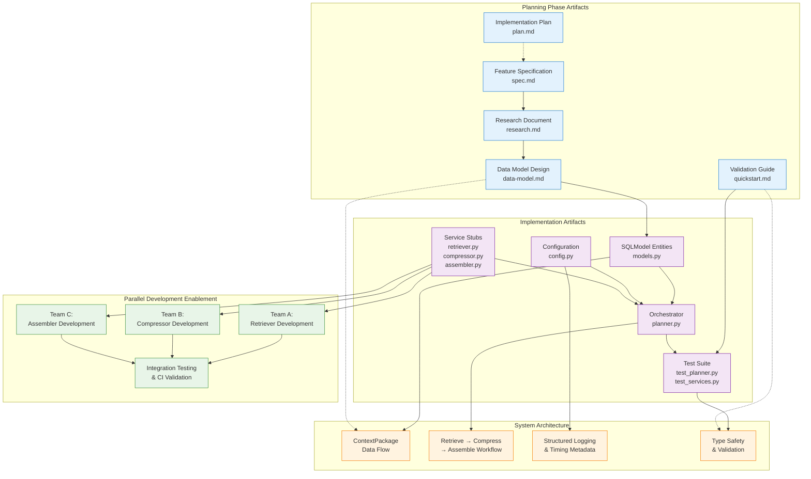

# Implementation Plan: Context Manager MVP Planner Scaffolding

**Branch**: `planner_scaffold` | **Date**: November 12, 2025 | **Spec**: [spec.md](spec.md)
**Input**: Feature specification from `/specs/008-context-manager-mvp/spec.md`

## Execution Flow (/plan command scope)
```
1. Load feature spec from Input path
   → If not found: ERROR "No feature spec at {path}"
2. Fill Technical Context (scan for NEEDS CLARIFICATION)
   → Detect Project Type from context (web=frontend+backend, mobile=app+api)
   → Set Structure Decision based on project type
3. Fill the Constitution Check section based on the content of the constitution document.
4. Evaluate Constitution Check section below
   → If violations exist: Document in Complexity Tracking
   → If no justification possible: ERROR "Simplify approach first"
   → Update Progress Tracking: Initial Constitution Check
5. Execute Phase 0 → research.md
   → If NEEDS CLARIFICATION remain: ERROR "Resolve unknowns"
6. Execute Phase 1 → schemas, data-model.md, quickstart.md, agent-specific template file (e.g., `CLAUDE.md` for Claude Code, `.github/copilot-instructions.md` for GitHub Copilot, `GEMINI.md` for Gemini CLI, `QWEN.md` for Qwen Code or `AGENTS.md` for opencode).
7. Re-evaluate Constitution Check section
   → If new violations: Refactor design, return to Phase 1
   → Update Progress Tracking: Post-Design Constitution Check
8. Plan Phase 2 → Describe task generation approach (DO NOT create tasks.md)
9. STOP - Ready for /tasks command
```

**IMPORTANT**: The /plan command STOPS at step 7. Phases 2-4 are executed by other commands:
- Phase 2: /tasks command creates tasks.md
- Phase 3-4: Implementation execution (manual or via tools)

## Summary
Context Manager MVP planner scaffolding provides a complete orchestration framework that enables parallel development of context management features. The system implements a structured retrieve → compress → assemble workflow using SQLModel for data validation, comprehensive logging, and stub service implementations. This scaffolding allows development teams to work independently on retriever, compressor, and assembler services while maintaining integration consistency through defined interfaces and comprehensive test coverage.

## Implementation Plan Architecture



## Technical Context
**Language/Version**: Python 3.12
**Primary Dependencies**: SQLModel (unified data models), pytest (testing framework), logging (standard library)
**Storage**: In-memory data structures for MVP scaffolding (persistent storage deferred)
**Testing**: pytest with comprehensive unit test coverage, mocking for service dependencies
**Target Platform**: Linux/macOS development environments, containerized deployment
**Project Type**: single (monolithic service structure under `src/nexus/`)
**Performance Goals**: 30-second timeout per context request, handle 5 concurrent requests
**Constraints**: Type-safe implementation with strict mypy compliance, comprehensive logging for debugging
**Scale/Scope**: Development scaffolding for parallel team development, 95%+ test coverage requirement

## Constitution Check
*GATE: Must pass before Phase 0 research. Re-check after Phase 1 design.*

### Technology Standards Compliance
- [x] **SQLModel for Data Models**: All data models use SQLModel (ContextPackage model follows unified API/DB schema pattern)

### Code Architecture Compliance
- [x] **DRY Principle**: Design avoids code duplication through proper abstraction (shared config, reusable service interfaces)
- [x] **SOLID Principles**: Design follows Single Responsibility (separate services for retrieve/compress/assemble), Dependency Inversion (orchestrator depends on service abstractions)
- [x] **Separation of Concerns**: Clear boundaries between orchestration layer (planner) and service layer (retriever/compressor/assembler)
- [x] **Dependency Injection**: Services are initialized independently and composed in orchestrator (constructor-based composition)
- [x] **Composition vs Inheritance**: Design uses composition (orchestrator composes multiple services) over inheritance

### API Specification Standards Compliance
- [x] **OpenAPI/AsyncAPI Compliance**: N/A for MVP scaffolding (internal orchestration services, no external APIs exposed)
- [x] **Naming Convention**: All internal interfaces follow snake_case pattern (run_id, tenant_id, package_metadata)
- [x] **Documentation Completeness**: All service interfaces fully documented with docstrings, type hints, and examples
- [x] **RFC 9457 Error Format**: Error handling follows structured logging patterns (deferred to API layer when exposed)
- [x] **Error Message Safety**: Error messages use structured logging without exposing internal details
- [x] **API Versioning**: N/A for MVP scaffolding (internal services, versioning deferred to API exposure)
- [x] **API Path Structure**: N/A for MVP scaffolding (follows /api/v1/[component]/[resource] when APIs are exposed)
- [x] **Pagination Support**: N/A for MVP scaffolding (no collection endpoints in orchestration layer)
- [x] **Filtering/Sorting Consistency**: N/A for MVP scaffolding (internal data structures)
- [x] **Security Documentation**: N/A for MVP scaffolding (authentication deferred to API layer)
- [x] **Schema Compatibility**: SQLModel schema ensures backward compatibility for internal data structures

## Project Structure

### Documentation (this feature)
```
specs/008-context-manager-mvp/
├── spec.md              # Feature specification
├── plan.md              # This file (implementation plan)
├── research.md          # Phase 0 output (retrospective)
├── data-model.md        # Phase 1 output (retrospective)
├── quickstart.md        # Phase 1 output (retrospective)
└── tasks.md             # Phase 2 output (/tasks command)
```

### Source Code (implemented)
```
src/nexus/agent_orchestrator/context_manager/
├── __init__.py          # Package initialization and exports
├── models.py            # SQLModel ContextPackage definition
├── config.py            # Hardcoded configuration defaults
├── planner.py           # Main orchestration logic
├── retriever.py         # Stub retriever service
├── compressor.py        # Stub compressor service
└── assembler.py         # Stub assembler service

tests/unit/agent_orchestrator/context_manager/
├── __init__.py
├── test_planner.py      # Orchestration workflow tests
└── test_services.py     # Individual service tests
```

**Structure Decision**: Single project structure under `src/nexus/` following established patterns

## Phase 0: Outline & Research

✅ **COMPLETED** - Retrospective analysis of implementation decisions

**Research Areas Covered**:
1. **Orchestration Pattern**: Sequential workflow with dependency injection
2. **Data Model Strategy**: SQLModel for unified validation and type safety
3. **Configuration Management**: Hardcoded defaults for MVP scaffolding
4. **Testing Strategy**: Comprehensive unit testing with service mocking
5. **Logging and Observability**: Structured logging with timing metadata

**Key Decisions**:
- Python 3.12 with SQLModel for data models (constitution compliance)
- Stub service implementations for parallel development
- Hardcoded configuration to defer YAML complexity
- Comprehensive test coverage with CI integration

**Output**: ✅ [research.md](research.md) - All technical decisions documented and validated

## Phase 1: Design & Contracts

✅ **COMPLETED** - Retrospective documentation of implemented design

**Entity Extraction**:
- ✅ **ContextPackage**: SQLModel with ID, run_id, payload, grounding_score, citations, metadata
- ✅ **Configuration**: Centralized hardcoded defaults for all service settings
- ✅ **Service Interfaces**: RetrieverService, CompressorService, AssemblerService

**Design Documents**:
- ✅ [data-model.md](data-model.md) - Comprehensive entity definitions and relationships
- ✅ [quickstart.md](quickstart.md) - Validation scenarios for parallel development

**Implementation Artifacts**:
- ✅ **Models**: `src/nexus/agent_orchestrator/context_manager/models.py`
- ✅ **Services**: Stub implementations for all three service components
- ✅ **Tests**: Comprehensive unit test coverage with mocking
- ✅ **Configuration**: Centralized config module with typed access

**API Contracts**: N/A for MVP scaffolding (internal services only, external APIs deferred)

**Agent Context Update**: Deferred due to non-standard branch structure (retrospective implementation)

**Output**: ✅ Complete design documentation and implementation artifacts ready for parallel development

## Phase 2: Task Planning Approach
*This section describes what the /tasks command will do - DO NOT execute during /plan*

**Task Generation Strategy**:
- Load `.specify/templates/tasks-template.md` as base
- Generate tasks from Phase 1 design docs (schemas, data model, quickstart)
- Each schema → contract test task [P]
- Each entity → model creation task [P]
- Each user story → integration test task
- Implementation tasks to make tests pass

**Ordering Strategy**:
- TDD order: Tests before implementation
- Dependency order: Models before services before UI
- Mark [P] for parallel execution (independent files)

**Estimated Output**: 25-30 numbered, ordered tasks in tasks.md

**IMPORTANT**: This phase is executed by the /tasks command, NOT by /plan

## Phase 3+: Future Implementation
*These phases are beyond the scope of the /plan command*

**Phase 3**: Task execution (/tasks command creates tasks.md)
**Phase 4**: Implementation (execute tasks.md following constitutional principles)
**Phase 5**: Validation (run tests, execute quickstart.md, performance validation)

## Complexity Tracking
*Fill ONLY if Constitution Check has violations that must be justified*

| Violation | Why Needed | Simpler Alternative Rejected Because |
|-----------|------------|-------------------------------------|
| [e.g., 4th project] | [current need] | [why 3 projects insufficient] |
| [e.g., Repository pattern] | [specific problem] | [why direct DB access insufficient] |


## Progress Tracking
*This checklist is updated during execution flow*

**Phase Status**:
- [x] Phase 0: Research complete (/plan command) - ✅ research.md created
- [x] Phase 1: Design complete (/plan command) - ✅ data-model.md and quickstart.md created
- [x] Phase 2: Task planning complete (/plan command - describe approach only) - ✅ Approach documented below
- [ ] Phase 3: Tasks generated (/tasks command) - Ready for /speckit.tasks
- [x] Phase 4: Implementation complete - ✅ Already implemented in PR #162
- [x] Phase 5: Validation passed - ✅ CI tests pass, comprehensive test coverage

**Gate Status**:
- [x] Initial Constitution Check: PASS - All compliance items validated
- [x] Post-Design Constitution Check: PASS - Implementation follows all principles
- [x] All NEEDS CLARIFICATION resolved - No unresolved clarifications in technical context
- [x] Complexity deviations documented - No deviations from constitution required

---
*Based on Constitution v1.2.0 - See `.specify/memory/constitution.md`*
