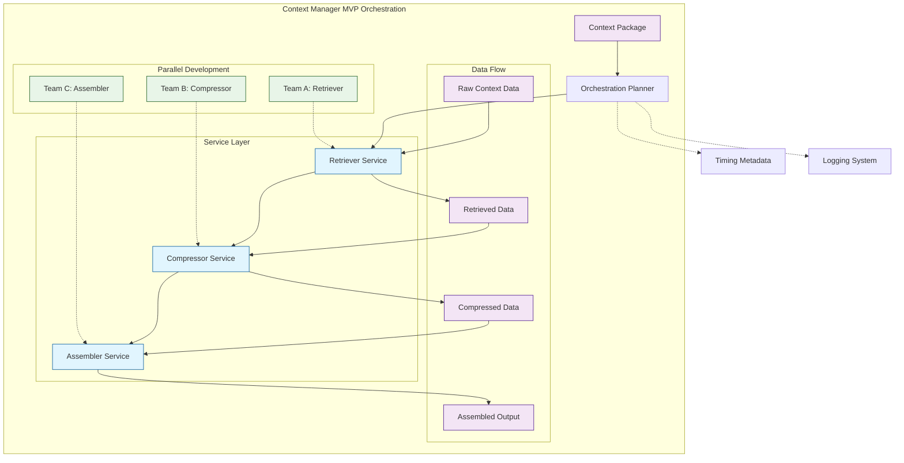

# Feature Specification: Context Manager MVP Planner Scaffolding

**Feature Branch**: `008-context-manager-mvp`
**Created**: November 12, 2025
**Status**: Draft
**Input**: User description: "Context Manager MVP planner scaffolding - Add complete Context Manager orchestration framework with proper SQLModel integration, logging, and comprehensive test coverage to enable parallel team development. Features: ContextManagerPlanner orchestrates retrieve → compress → assemble workflow, SQLModel ContextPackage with proper validation and UUID generation, Stub service implementations (RetrieverService, CompressorService, AssemblerService), Hardcoded configuration defaults, Comprehensive test coverage with logging verification, Proper error handling and timing metadata collection, Type-safe implementation with full mypy compliance. This scaffolding enables teammates to implement actual retrieval, compression, and assembly logic while maintaining the orchestration framework."

---

## ⚡ Quick Guidelines
- ✅ Focus on WHAT users need and WHY
- ❌ Avoid HOW to implement (no tech stack, APIs, code structure)
- 👥 Written for business stakeholders, not developers

---

## User Scenarios & Testing *(mandatory)*

### Primary User Story
Development teams need a structured framework to build context management capabilities in parallel without stepping on each other's work. The system must provide a clear orchestration pattern that allows different developers to work on retrieval, compression, and assembly components independently while ensuring they integrate correctly.

### Acceptance Scenarios
1. **Given** a development team is building context management features, **When** they need to work on different components simultaneously, **Then** they can develop retriever, compressor, and assembler services independently without conflicts
2. **Given** a developer wants to understand the context management workflow, **When** they examine the system, **Then** they can see a clear retrieve → compress → assemble orchestration pattern
3. **Given** a team member implements a new retriever service, **When** they integrate it with the framework, **Then** the orchestration system properly validates and processes context packages
4. **Given** developers are working on context management components, **When** they need to test their integration, **Then** they have comprehensive test coverage that verifies the orchestration workflow
5. **Given** a context package is processed, **When** the workflow executes, **Then** proper timing metadata and logging information is captured for monitoring and debugging

### Edge Cases
- What happens when one service in the orchestration chain fails?
- How does the system handle malformed or incomplete context packages?
- What occurs when service dependencies are not available during development?

## Requirements *(mandatory)*

### Functional Requirements
- **FR-001**: System MUST provide a structured orchestration framework that coordinates retrieve, compress, and assemble operations in sequence
- **FR-002**: System MUST enable parallel development by providing stub implementations that can be independently replaced
- **FR-003**: Development teams MUST be able to work on retriever, compressor, and assembler components without interfering with each other's work
- **FR-004**: System MUST validate context packages to ensure data integrity throughout the orchestration workflow
- **FR-005**: System MUST generate unique identifiers for context packages to enable tracking and debugging
- **FR-006**: System MUST capture timing metadata for each orchestration step to enable performance monitoring
- **FR-007**: System MUST provide comprehensive logging to support debugging and operational monitoring
- **FR-008**: System MUST gracefully handle service failures without breaking the overall orchestration framework
- **FR-009**: System MUST provide clear interfaces and contracts for each service component
- **FR-010**: System MUST include comprehensive test coverage to verify orchestration behavior and service integration

### Key Entities *(include if feature involves data)*
- **Context Package**: Represents a unit of work being processed through the orchestration pipeline, containing source data, metadata, timing information, and processing status
- **Orchestration Workflow**: Represents the sequence of operations (retrieve → compress → assemble) applied to context packages
- **Service Components**: Represents individual processing services (Retriever, Compressor, Assembler) that can be developed and deployed independently

### System Architecture Overview

### Success Criteria *(mandatory)*
- **SC-001**: Development teams can work on different service components simultaneously without merge conflicts or integration issues
- **SC-002**: New service implementations can be integrated into the orchestration framework within 1 day of development completion
- **SC-003**: Context package processing workflow completes successfully with proper error handling and logging
- **SC-004**: All orchestration steps capture timing metadata within 1ms accuracy for performance monitoring
- **SC-005**: Test suite provides 95%+ coverage of orchestration scenarios and service integration patterns
- **SC-006**: System maintains type safety and passes strict type checking to prevent runtime errors
- **SC-007**: Logging provides sufficient detail for debugging issues within the orchestration workflow

### Assumptions
- Teams are working on a shared codebase with version control
- Standard development practices include automated testing and code review
- Service implementations will follow defined interface contracts
- Error handling patterns should allow graceful degradation rather than complete failure
- Performance monitoring is important for operational visibility
- Type safety is critical for maintaining code quality and preventing runtime issues

---

## Review & Acceptance Checklist
*GATE: Automated checks run during main() execution*

### Content Quality
- [x] No implementation details (languages, frameworks, APIs)
- [x] Focused on user value and business needs
- [x] Written for non-technical stakeholders
- [x] All mandatory sections completed

### Requirement Completeness
- [x] No [NEEDS CLARIFICATION] markers remain
- [x] Requirements are testable and unambiguous
- [x] Success criteria are measurable
- [x] Scope is clearly bounded
- [x] Dependencies and assumptions identified

---

## Execution Status
*Updated by main() during processing*

- [x] User description parsed
- [x] Key concepts extracted
- [x] Ambiguities marked
- [x] User scenarios defined
- [x] Requirements generated
- [x] Entities identified
- [x] Review checklist passed

---
