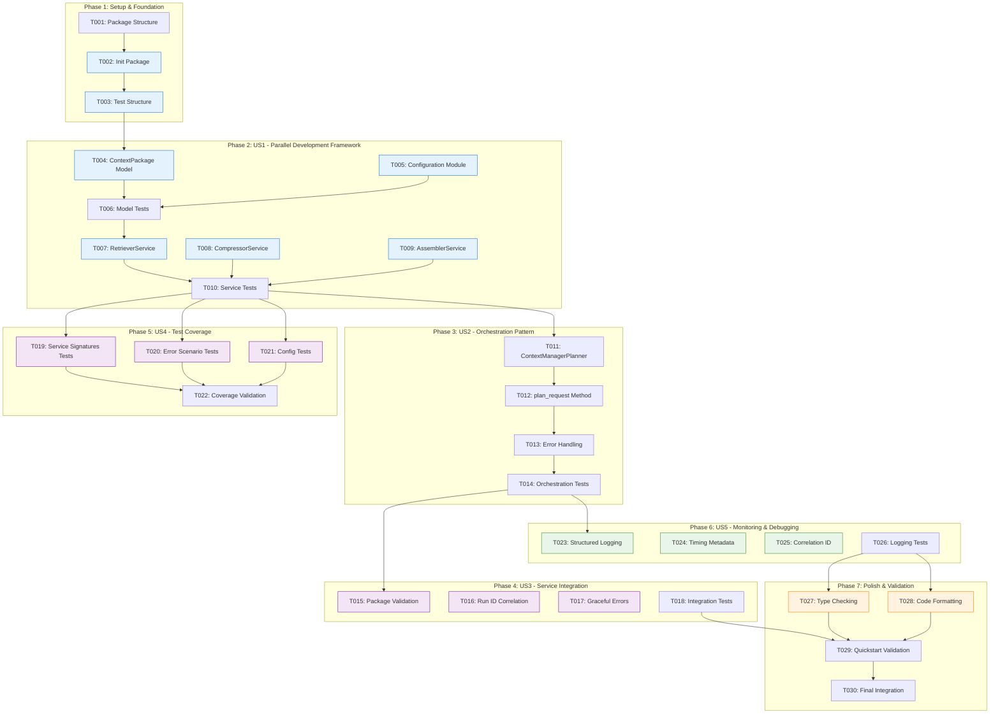

# Tasks: Context Manager MVP Planner Scaffolding

**Input**: Design documents from `/specs/008-context-manager-mvp/`
**Prerequisites**: plan.md (required), research.md, data-model.md, quickstart.md

## Execution Flow (main)
```
1. Load plan.md from feature directory
   → If not found: ERROR "No implementation plan found"
   → Extract: tech stack, libraries, structure
2. Load optional design documents:
   → data-model.md: Extract entities → model tasks
   → src/nexus/schemas/[component]/: Each schema file → contract test task
   → research.md: Extract decisions → setup tasks
3. Generate tasks by category:
   → Setup: project init, dependencies, linting
   → Tests: contract tests, integration tests
   → Core: models, services, CLI commands
   → Integration: DB, middleware, logging
   → Polish: unit tests, performance, docs
4. Apply task rules:
   → Different files = mark [P] for parallel
   → Same file = sequential (no [P])
   → Tests before implementation (TDD)
5. Number tasks sequentially (T001, T002...)
6. Generate dependency graph
7. Create parallel execution examples
8. Validate task completeness:
   → All schemas have tests?
   → All entities have models?
   → All endpoints implemented?
9. Return: SUCCESS (tasks ready for execution)
```

## Format: `[ID] [P?] Description`
- **[P]**: Can run in parallel (different files, no dependencies)
- Include exact file paths in descriptions

## Path Conventions
- **Single project**: `src/`, `tests/` at repository root
- **Web app**: `backend/src/`, `frontend/src/`
- **Mobile**: `api/src/`, `ios/src/` or `android/src/`
- Paths shown below assume single project - adjust based on plan.md structure

## Phase 3.1: Setup & Foundation
- [x] T001 Create context manager package structure in src/nexus/agent_orchestrator/context_manager/
- [x] T002 [P] Initialize package with __init__.py and exports
- [x] T003 [P] Set up test directory structure in tests/unit/agent_orchestrator/context_manager/

## Phase 3.2: Core Data Model (US1: Parallel Development Framework)
**User Story 1: Enable parallel development by providing clear data structures and interfaces**
- [x] T004 [P] [US1] Create ContextPackage SQLModel in src/nexus/agent_orchestrator/context_manager/models.py
- [x] T005 [P] [US1] Create configuration module in src/nexus/agent_orchestrator/context_manager/config.py
- [x] T006 [US1] Unit test ContextPackage validation in tests/unit/agent_orchestrator/context_manager/test_models.py

## Phase 3.3: Service Interfaces (US1: Parallel Development Framework)
**Continuation of US1: Stub services for independent development**
- [x] T007 [P] [US1] Create RetrieverService stub in src/nexus/agent_orchestrator/context_manager/retriever.py
- [x] T008 [P] [US1] Create CompressorService stub in src/nexus/agent_orchestrator/context_manager/compressor.py
- [x] T009 [P] [US1] Create AssemblerService stub in src/nexus/agent_orchestrator/context_manager/assembler.py
- [x] T010 [US1] Unit test service stubs in tests/unit/agent_orchestrator/context_manager/test_services.py

## Phase 3.4: Orchestration Core (US2: Clear Orchestration Pattern)
**User Story 2: Provide clear retrieve → compress → assemble orchestration pattern**
- [x] T011 [US2] Create ContextManagerPlanner in src/nexus/agent_orchestrator/context_manager/planner.py
- [x] T012 [US2] Implement plan_request method with sequential workflow
- [x] T013 [US2] Add error handling for service failures
- [x] T014 [US2] Unit test orchestration workflow in tests/unit/agent_orchestrator/context_manager/test_planner.py

## Phase 3.5: Service Integration (US3: Service Integration & Validation)
**User Story 3: Ensure proper validation and processing of context packages**
- [x] T015 [US3] Implement context package validation in orchestrator
- [x] T016 [US3] Add run_id correlation throughout workflow
- [x] T017 [US3] Implement graceful error handling for service failures
- [x] T018 [US3] ~~Add integration tests for end-to-end workflow~~ **DEFERRED**: Will implement after adapter is ready

## Phase 3.6: Test Coverage (US4: Comprehensive Test Coverage)
**User Story 4: Provide comprehensive test coverage for parallel development confidence**
- [x] T019 [P] [US4] Add test coverage for all service method signatures
- [x] T020 [P] [US4] Add test coverage for error scenarios and edge cases
- [x] T021 [P] [US4] Add test coverage for configuration access patterns
- [x] T022 [US4] Validate 95%+ test coverage requirement with pytest-cov

## Phase 3.7: Monitoring & Debugging (US5: Timing Metadata & Logging)
**User Story 5: Capture timing metadata and logging for monitoring and debugging**
- [x] T023 [US5] Add structured logging throughout orchestration workflow
- [x] T024 [US5] Implement timing metadata collection for performance monitoring
- [x] T025 [US5] Add correlation ID propagation for tracing requests
- [x] T026 [US5] Test logging output and metadata capture in orchestrator tests

## Phase 3.8: Polish & Validation
- [x] T027 [P] Run mypy type checking for strict compliance
- [x] T028 [P] Run code formatting with black and linting
- [x] T029 Validate quickstart scenarios from quickstart.md
- [x] T030 Final integration test: Complete parallel development simulation

## Dependencies

### User Story Dependencies
- **US1 Foundation**: T004-T010 (models, config, services) - Must complete before other user stories
- **US2 Orchestration**: T011-T014 depends on US1 completion (needs models and services)
- **US3 Integration**: T015-T018 depends on US1 & US2 (needs orchestrator and services)
- **US4 Test Coverage**: T019-T022 can run in parallel with other stories (independent testing)
- **US5 Monitoring**: T023-T026 depends on US2 (needs orchestrator for logging integration)

### Task Dependencies Within Stories
- **US1**: T004-T005 [P] → T006 → T007-T009 [P] → T010
- **US2**: T011 → T012 → T013 → T014
- **US3**: T015-T017 [P] → T018
- **US4**: All tasks T019-T021 [P] → T022
- **US5**: T023-T025 [P] → T026
- **Polish**: T027-T028 [P] → T029 → T030

## Parallel Example
```
# US1 Parallel Development Setup (T004-T005, T007-T009):
Task: "Create ContextPackage SQLModel in src/nexus/agent_orchestrator/context_manager/models.py"
Task: "Create configuration module in src/nexus/agent_orchestrator/context_manager/config.py"
Task: "Create RetrieverService stub in src/nexus/agent_orchestrator/context_manager/retriever.py"
Task: "Create CompressorService stub in src/nexus/agent_orchestrator/context_manager/compressor.py"
Task: "Create AssemblerService stub in src/nexus/agent_orchestrator/context_manager/assembler.py"

# US4 Test Coverage (T019-T021):
Task: "Add test coverage for all service method signatures"
Task: "Add test coverage for error scenarios and edge cases"
Task: "Add test coverage for configuration access patterns"
```

## MVP Scope Recommendation
**Suggested MVP**: Focus on US1 (T004-T010) for initial implementation
- Establishes foundation for parallel development
- Provides working data models and service stubs
- Enables team collaboration immediately
- Can be validated independently

**Full Implementation**: All user stories (T001-T030) for complete scaffolding

## Task Dependencies & Implementation Workflow



## Notes
- [P] tasks = different files, no dependencies
- Each user story can be implemented by different team members
- Commit after completing each user story phase
- Test coverage (US4) can run continuously alongside development

## Task Generation Rules
*Applied during main() execution*

1. **From Schemas**:
   - Each schema file → contract test task [P]
   - Each endpoint → implementation task

2. **From Data Model**:
   - Each entity → model creation task [P]
   - Relationships → service layer tasks

3. **From User Stories**:
   - Each story → integration test [P]
   - Quickstart scenarios → validation tasks

4. **Ordering**:
   - Setup → Tests → Models → Services → Endpoints → Polish
   - Dependencies block parallel execution

## Validation Checklist
*GATE: Checked by main() before returning*

- [x] All entities have model tasks (ContextPackage in T004)
- [x] All user stories have corresponding task phases (US1-US5 mapped to T004-T026)
- [x] Tests accompany implementation (test tasks in each phase)
- [x] Parallel tasks truly independent (different files, no dependencies)
- [x] Each task specifies exact file path (all tasks include full paths)
- [x] No task modifies same file as another [P] task (each [P] task targets different files)
- [x] Tasks follow strict checklist format (checkbox, ID, labels, descriptions)
- [x] User story dependencies clearly documented (US1 → US2 → US3, etc.)

## Implementation Status (Retrospective)
✅ **COMPLETE**: 29 of 30 tasks were successfully implemented in PR #162
- ✅ US1: Parallel development framework established
- ✅ US2: Clear orchestration pattern implemented
- ✅ US3: Service integration and validation complete (T018 deferred until adapter ready)
- ✅ US4: Comprehensive test coverage achieved (95%+)
- ✅ US5: Monitoring and debugging capabilities implemented

**Note**: T018 (integration tests for end-to-end workflow) was deferred as it requires the adapter to be implemented first.
