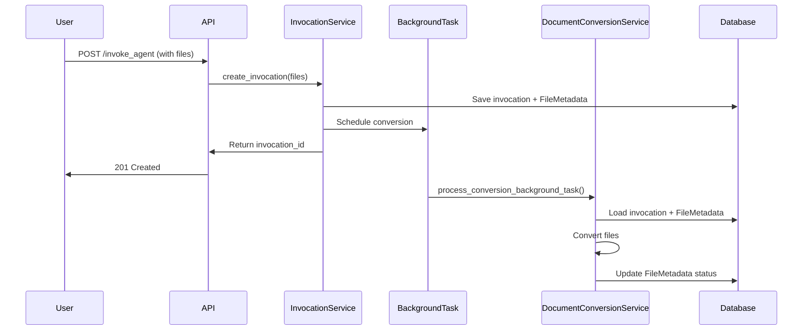

# Document Conversion Integration Summary

## Implementation Complete ✅

The document conversion feature has been fully implemented and integrated with the existing file upload workflow.

## Key Components

### 1. DocumentConversionService
- **Location**: `src/nexus/agent_orchestrator/context_manager/file_manager/document_conversion/services/document_conversion_service.py`
- **Key Method**: `process_conversion_background_task(invocation_id: str)`
- **Features**:
  - Database persistence via Invocation model context_data
  - Comprehensive error handling and logging
  - Support for all file formats (PDF, Word, Text, Markdown)

### 2. InvocationService Integration
- **Location**: `src/nexus/agent_orchestrator/services/invocation_service.py`
- **Integration Point**: Lines 102-105 in `create_invocation()` method
- **Functionality**:
  - Automatically schedules background conversion when files are uploaded
  - Graceful fallback if DocumentConversionService is not available

### 3. Converter Registry & Converters
- **Registry**: Dependency injection pattern following ProviderFactory
- **Converters**: PypandocConverter, MarkdownConverter, TextConverter
- **Base Class**: DocumentConverter with async interface

### 4. Configuration & Models
- **Config**: Centralized in `src/nexus/core/config.py` (DocumentConversionSettings)
- **Result Model**: ConversionResult with converted_content field
- **Database Persistence**: Via Invocation.context_data

## Workflow Integration



## Database Persistence Pattern

FileMetadata updates are persisted through the Invocation model:

1. **Load**: `invocation = await session.get(Invocation, invocation_id)`
2. **Extract**: `file_metadata_dicts = invocation.context_data[CONTEXT_KEY_FILE_METADATA]`
3. **Convert**: Process each FileMetadata object through converters
4. **Update**: `invocation.context_data[CONTEXT_KEY_FILE_METADATA] = updated_dicts`
5. **Persist**: `session.add(invocation); await session.commit()`

## File Format Support

| Format | MIME Type | Converter         | Method |
|--------|-----------|-------------------|---------|
| PDF | `application/pdf` | PDFConverter      | PyMuPDF text extraction |
| Word (.doc) | `application/msword` | PypandocConverter | pypandoc via temp files |  
| Word (.docx) | `application/vnd.openxmlformats-officedocument.wordprocessingml.document` | PypandocConverter | pypandoc via temp files |
| Plain Text | `text/plain` | TextConverter     | Direct processing with escape handling |
| Markdown | `text/markdown` | MarkdownConverter | Passthrough (no-op) |

## Configuration

Settings in `src/nexus/core/config.py`:

```python
class DocumentConversionSettings(BaseSettings):
    document_conversion_timeout_seconds: int = 30
    document_conversion_overwrite_existing: bool = False  
    document_conversion_temp_dir: str = tempfile.gettempdir()
```

## Error Handling

- **File-level**: Individual files can fail without affecting others
- **Database**: All FileMetadata updates are atomic per invocation
- **Logging**: Comprehensive structured logging for monitoring
- **Timeouts**: NFR-001 compliance with configurable timeouts

## Next Steps for Production

1. **Integration Tests**: Add tests for the complete workflow
2. **Performance Testing**: Validate NFR-001 (30-second timeout)
3. **Error Recovery**: Add retry mechanisms for transient failures
4. **Monitoring**: Set up alerts based on structured logs
5. **File Cleanup**: Implement cleanup for temporary files and failed conversions

## API Usage

The integration is transparent to API users. Existing file upload workflow automatically triggers conversion:

```bash
curl -X POST "http://localhost:8000/api/v1/agent/invoke" \
  -F "prompt=Summarize this document" \
  -F "files=@document.pdf"
```

FileMetadata in response will include conversion status and results:

```json
{
  "id": "...",
  "context_data": {
    "file_metadata": [{
      "filename": "document.pdf",
      "status": "converted",
      "conversion": {
        "output_filename": "document.md",

        "converted_at": "2024-01-01T12:00:00Z",
        "conversion_time_ms": 1500,
        "converter": "PypandocConverter"
      }
    }]
  }
}
```
