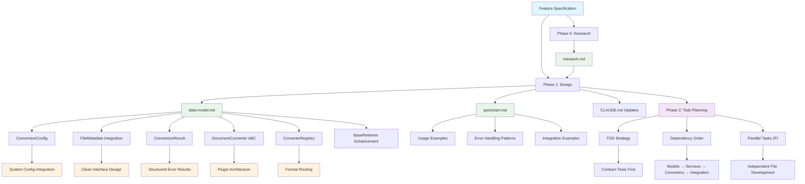

# Implementation Plan: Document Conversion to Markdown

**Branch**: `AAP-58176` | **Date**: 2025-11-17 | **Spec**: [spec.md](spec.md)
**Input**: Feature specification from `/specs/010-document-conversion/spec.md`

## Execution Flow (/plan command scope)
```
1. Load feature spec from Input path
   → Feature spec loaded successfully with clarifications
2. Fill Technical Context (scan for NEEDS CLARIFICATION)
   → Detect Project Type from context (web=frontend+backend, mobile=app+api)
   → Set Structure Decision based on project type
3. Fill the Constitution Check section based on the content of the constitution document.
4. Evaluate Constitution Check section below
   → If violations exist: Document in Complexity Tracking
   → If no justification possible: ERROR "Simplify approach first"
   → Update Progress Tracking: Initial Constitution Check
5. Execute Phase 0 → research.md
   → If NEEDS CLARIFICATION remain: ERROR "Resolve unknowns"
6. Execute Phase 1 → schemas, data-model.md, quickstart.md, agent-specific template file (e.g., `CLAUDE.md` for Claude Code, `.github/copilot-instructions.md` for GitHub Copilot, `GEMINI.md` for Gemini CLI, `QWEN.md` for Qwen Code or `AGENTS.md` for opencode).
7. Re-evaluate Constitution Check section
   → If new violations: Refactor design, return to Phase 1
   → Update Progress Tracking: Post-Design Constitution Check
8. Plan Phase 2 → Describe task generation approach (DO NOT create tasks.md)
9. STOP - Ready for /tasks command
```

**IMPORTANT**: The /plan command STOPS at step 9. Phases 2-4 are executed by other commands:
- Phase 2: /tasks command creates tasks.md
- Phase 3-4: Implementation execution (manual or via tools)

## Summary
Agent invocation-based document conversion component that integrates with the existing agent orchestration system to convert documents (PDF, DOC/DOCX, TXT, MD) to markdown format using FastAPI Background Tasks. Document conversion is triggered when FileMetadata objects are created during agent invocation processing, with status tracking through the existing invocation system. The system uses a plugin-based architecture for extensibility and graceful error handling.

## Technical Context
**Language/Version**: Python 3.12

**Primary Dependencies**: python-magic (^0.4.27) for MIME type detection (shared with file-manager-upload), pypandoc-binary for document conversion

**Integration Dependencies**: FileMetadata structure and BaseRetriever interface from agent_orchestrator.context_manager.file_manager

**FileMetadata Integration**: Uses existing FileMetadata structure from 008-file-manager-upload with extended status values (converting, converted, conversion_failed)

**BaseRetriever Enhancement**: Requires new load_file(), file_exists(), and get_file_metadata() methods for bidirectional file operations

**Agent Integration Dependencies**: InvocationService.create_invocation() method enhancement, FastAPI BackgroundTasks integration, existing invocation status tracking system

**Background Tasks Architecture**: Conversion requests detected through FileMetadata presence in invocation creation, processed asynchronously via FastAPI Background Tasks, status tracked through existing Invocation model

**API Integration**: Uses existing /api/v1/invocations endpoint pattern following constitution path structure requirements

**FileManager Refactoring**: Requires making _get_retriever_for_file() public for use by DocumentConversionService

**Storage**: Uses BaseRetriever interface for both loading source files and saving converted files - no direct filesystem access

**Testing**: pytest with TDD approach

**Target Platform**: Linux server

**Project Type**: single (library component)

**Performance Goals**: Individual file conversion within 30 seconds under normal server load conditions, support files up to configurable limit (currently 10MB)

**Constraints**: Memory-bound processing, configurable file size limit (currently 10MB), third-party library limitations for complex formatting, standard logging requirements (NFR-004)

**Scale/Scope**: Individual file processing, extensible for future format support, programmatic usage only, integrates with existing file upload workflow

**Execution Model**:
- Agent invocation triggered: FileMetadata objects created in InvocationService.create_invocation() method trigger background conversion tasks
- Background processing: FastAPI Background Tasks handle asynchronous conversion processing
- Execution gating: Invocation CANNOT execute while ANY FileMetadata has status="pending_parse" or "converting"
- Terminal state handling: Invocation CAN execute when ALL FileMetadata reach terminal status ("converted" or "conversion_failed")
- Failure logging: Conversion failures are logged but do not block invocation execution
- Integration points: invoke_agent endpoint enhancement, invocation status tracking, FileMetadata workflow integration

## Constitution Check
*GATE: Must pass before Phase 0 research. Re-check after Phase 1 design.*

### Technology Standards Compliance
- [x] **SQLModel for Data Models**: Not applicable - no database persistence required

### Code Architecture Compliance
- [x] **DRY Principle**: Reuses FileMetadata structure from file-manager-upload, eliminates duplication of MIME detection and file metadata management
- [x] **Modular Architecture**: Component follows existing structure under agent_orchestrator.context_manager.file_manager
- [x] **SOLID Principles**: Design follows Single Responsibility (format-specific converters), Open/Closed (extensible converter plugins), Liskov Substitution (converter interface), Interface Segregation (minimal converter contract), and Dependency Inversion (depends on converter abstractions)
- [x] **Separation of Concerns**: Clear boundaries between file upload (file-manager), conversion logic, and output storage
- [x] **Dependency Injection**: Dependencies are explicitly injected via constructors (converter registry, configuration, FileMetadata from upload component)
- [x] **Composition vs Inheritance**: Design uses composition with converter plugins rather than inheritance hierarchies, integrates with existing FileMetadata structure

### API Specification Standards Compliance
- [x] **OpenAPI/AsyncAPI Compliance**: Uses existing /api/v1/invocations endpoint, no new API endpoints required
- [x] **Naming Convention**: Python module follows snake_case pattern for all names
- [x] **Documentation Completeness**: All public methods fully documented with descriptions, parameters, examples
- [x] **RFC 9457 Error Format**: Errors returned via invocation.error_message field using existing patterns
- [x] **Error Message Safety**: Error messages are actionable and don't expose internal implementation details
- [x] **API Versioning**: Uses existing /api/v1/ versioning pattern, no version changes required
- [x] **API Path Structure**: Complies with /api/v1/[component]/[resource] using existing invocations endpoint
- [x] **Pagination Support**: Not applicable - uses existing invocation status tracking
- [x] **Filtering/Sorting Consistency**: Not applicable - uses existing invocation querying
- [x] **Security Documentation**: Uses existing invocation authentication and authorization patterns
- [x] **Schema Compatibility**: Maintains backward compatibility with existing InvocationCreateRequest schema

## Project Structure

### Documentation (this feature)
```
specs/010-document-conversion/
├── plan.md              # This file (/plan command output)
├── research.md          # Phase 0 output (/plan command)
├── data-model.md        # Phase 1 output (/plan command)
├── quickstart.md        # Phase 1 output (/plan command)
└── tasks.md             # Phase 2 output (/tasks command - NOT created by /plan)
```

### Source Code (repository root)
```
src/
└── nexus/
    ├── api/
    │   └── v1/
    │       └── invocation.py               # Enhanced with BackgroundTasks
    ├── agent_orchestrator/
    │   ├── services/
    │   │   └── invocation_service.py       # Enhanced for FileMetadata detection
    │   └── context_manager/
    │       └── file_manager/
    │           ├── retrievers/
    │           │   ├── __init__.py
    │           │   ├── base.py              # Enhanced BaseRetriever with load_file()
    │           │   └── local.py             # LocalRetriever with enhanced methods
    │           └── document_conversion/
    │               ├── __init__.py          # Main public interface
    │               ├── models/
    │               │   ├── __init__.py
    │               │   ├── conversion_config.py
    │               │   └── conversion_result.py
    │               ├── services/
    │               │   ├── __init__.py
    │               │   ├── document_conversion_service.py
    │               │   └── document_conversion_task.py
    │               ├── converters/
    │               │   ├── __init__.py
    │               │   ├── base.py
    │               │   ├── pypandoc_converter.py
    │               │   ├── markdown_converter.py
    │               │   ├── text_converter.py
    │               │   └── registry.py
    │               └── exceptions.py

tests/
├── unit/
│   └── agent_orchestrator/
│       └── context_manager/
│           └── file_manager/
│               ├── retrievers/
│                   ├── test_base_retriever.py
│                   └── test_local_retriever.py
│               └── document_conversion/
│                   ├── test_conversion_config.py
│                   ├── test_conversion_result.py
│                   ├── test_document_converter.py
│                   ├── test_converter_registry.py
│                   ├── test_document_conversion_service.py
│                   └── converters/
│                       ├── test_pypandoc_converter.py
│                       ├── test_markdown_converter.py
│                       └── test_text_converter.py
├── integration/
│   └── agent_orchestrator/
│       └── context_manager/
│           └── file_manager/
│               └── document_conversion/
│                   ├── test_pdf_conversion.py
│                   ├── test_word_conversion.py
│                   ├── test_text_conversion.py
│                   └── test_error_handling.py
└── performance/
    └── agent_orchestrator/
        └── context_manager/
            └── file_manager/
                └── document_conversion/
                    └── test_performance.py
```

**Structure Decision**: Option 1 (Single project) - Library component within existing Nexus agent orchestrator

## Implementation Plan Architecture



## Phase 0: Outline & Research

1. **Extract unknowns from Technical Context** above:
   - Primary document conversion library selection (docling vs pypandoc vs specialized library combination)
   - Integration with existing system configuration for file size limits
   - Error handling patterns for third-party library failures
   - Configuration patterns for output directories and conversion settings

2. **Generate and dispatch research agents**:
   - Task: "Research document conversion libraries for Python including docling, pypandoc, and specialized combinations (python-docx + PyPDF2/pdfplumber) for multi-format document conversion to markdown"
   - Task: "Find error handling patterns and exception types for robust document conversion libraries in Python"
   - Task: "Research integration patterns for accessing system configuration (file size limits) in Python library components"
   - Task: "Find best practices for configuration management in Python library components"
   - Task: "Research extensible plugin patterns for document conversion libraries in Python"

3. **Consolidate findings** in `research.md` using format:
   - Decision: [what was chosen]
   - Rationale: [why chosen]
   - Alternatives considered: [what else evaluated]

**Output**: research.md with all NEEDS CLARIFICATION resolved

## Phase 1: Design & Contracts
*Prerequisites: research.md complete*

1. **Extract entities from feature spec** → `data-model.md`:
   - FileMetadata: Reuse from file-manager-upload with extended status values (pending_parse, converting, converted, conversion_failed)
   - ConversionConfig: max_file_size (from system config), overwrite_existing, supported_mime_types
   - ConversionResult: success, output_path, output_filename, conversion_time, error_message, conversion_time_ms
   - ConverterRegistry: mime_type_converters, format_mapping
   - BaseRetriever enhancements: load_file(), file_exists(), get_file_metadata() methods

2. **Generate library interface contracts** from functional requirements:
   - DocumentConverter.convert(file_content: bytes, file_metadata: FileMetadata, config: ConversionConfig) -> ConversionResult
   - DocumentConverter.supports_mime_type(mime_type: str) -> bool
   - DocumentConversionService.process_pending_conversions() -> List[FileMetadata]
   - FileManager.get_retriever_for_file(file_metadata: FileMetadata) -> BaseRetriever (refactored to public)
   - BaseRetriever.load_file(file_path: str) -> bytes (new method)
   - Custom exceptions for conversion errors

3. **Generate contract tests** from contracts:
   - test_document_converter_interface.py
   - test_conversion_config_validation.py
   - test_conversion_result_structure.py

4. **Extract test scenarios** from user stories:
   - PDF conversion integration test
   - Word document conversion integration test
   - Text file conversion integration test
   - Markdown no-op conversion integration test
   - Error handling integration tests (large files, corrupted files, unsupported formats)

5. **Update agent file incrementally**:
   - Run `.specify/scripts/bash/update-agent-context.sh claude`
   - Add document conversion component context
   - Preserve existing manual additions

**Output**: data-model.md, library interface contracts, failing tests, quickstart.md, updated agent file

## Phase 2: Task Planning Approach
*This section describes what the /tasks command will do - DO NOT execute during /plan*

**Task Generation Strategy**:
- Load `.specify/templates/tasks-template.md` as base
- Generate tasks from Phase 1 design docs (interface contracts, data models, quickstart)
- Each data model → model creation task [P]
- Each converter → converter implementation task [P]
- Each interface method → contract test task [P]
- Each user story → integration test task
- Implementation tasks to make tests pass

**Ordering Strategy**:
- TDD order: Tests before implementation
- Dependency order: Models → Base Classes → Converters → Main Interface → Integration
- Mark [P] for parallel execution (independent files)

**Estimated Output**: 26 numbered, ordered tasks in tasks.md

**IMPORTANT**: This phase is executed by the /tasks command, NOT by /plan

## Phase 3+: Future Implementation
*These phases are beyond the scope of the /plan command*

**Phase 3**: Task execution (/tasks command creates tasks.md)
**Phase 4**: Implementation (execute tasks.md following constitutional principles)
**Phase 5**: Validation (run tests, execute quickstart.md, performance validation)

## Complexity Tracking
*No constitutional violations requiring justification*

## Progress Tracking
*This checklist is updated during execution flow*

**Phase Status**:
- [x] Phase 0: Research complete (/plan command)
- [x] Phase 1: Design complete (/plan command)
- [x] Phase 2: Task planning complete (/plan command - describe approach only)
- [x] Phase 3: Tasks generated (/tasks command)
- [ ] Phase 4: Implementation complete
- [ ] Phase 5: Validation passed

**Gate Status**:
- [x] Initial Constitution Check: PASS
- [x] Post-Design Constitution Check: PASS
- [x] All NEEDS CLARIFICATION resolved
- [x] Complexity deviations documented (none required)

---
*Based on Constitution v1.2.0 - See `.specify/memory/constitution.md`*
