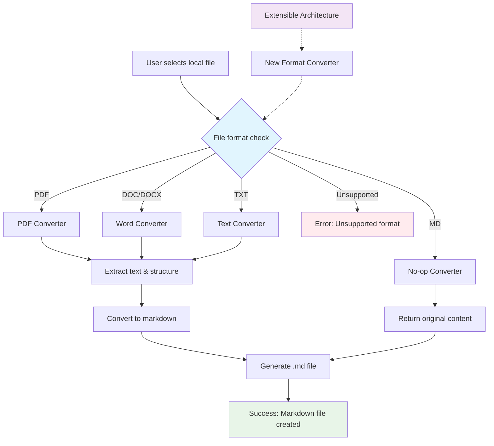
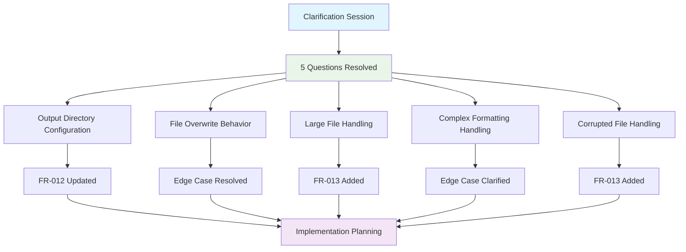
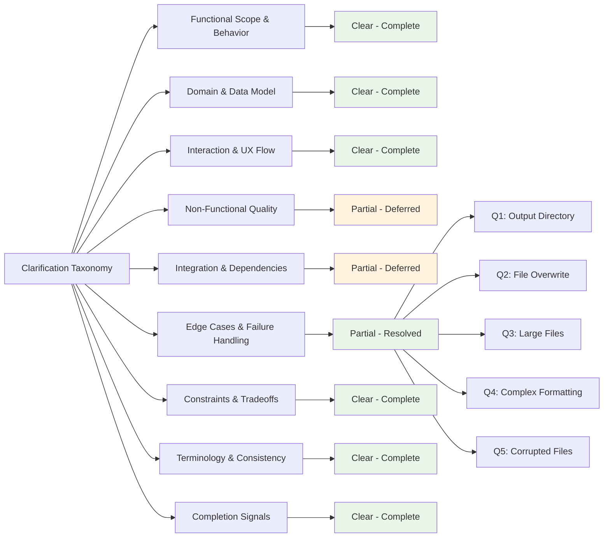
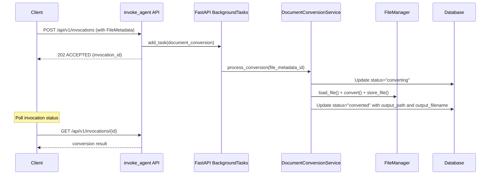

# Feature Specification: Document Conversion to Markdown

**Feature Branch**: `AAP-58176`  
**Created**: 2025-11-17  
**Status**: Draft  
**Input**: User description: I need to convert documents from source formats into markdown. I want an extensible mechanism that can be later enhanced to support more file types."

## Execution Flow (main)
```
1. Parse user description from Input
   � Feature involves converting local files to markdown
2. Extract key concepts from description
   � Actors: users who need document conversion
   � Actions: convert documents from various formats to markdown
   � Data: source files on local filesystem, output markdown files
   � Constraints: extensible architecture for future file type support
3. For each unclear aspect:
   � Resolved through user clarification
4. Fill User Scenarios & Testing section
   � Clear user flow: select file, convert to markdown
5. Generate Functional Requirements
   � Each requirement testable and specific
6. Identify Key Entities (data involved)
   � Source documents, conversion results, file formats
7. Run Review Checklist
   � Checked for implementation details and clarity
8. Return: SUCCESS (spec ready for planning)
```

---

## � Quick Guidelines
- Focus on WHAT users need and WHY
- Avoid HOW to implement (no tech stack, APIs, code structure)
- Written for business stakeholders, not developers

---

## System Overview



---

## Clarifications

### Session 2025-11-17
- Q: When converting documents, should the output markdown file be created in the same directory as the source file, or should there be a configurable output directory? → A: Default output directory with override option (override will be a system setting)
- Q: When the output file already exists, what should happen? → A: Overwrite without warning (input filenames are unique, existing output indicates re-conversion request)
- Q: What should happen when a file is too large to process in memory? → A: Fail with clear error message about file size limit
- Q: When complex formatting cannot be translated to markdown (like embedded objects, special fonts, etc.), what should happen? → A: Conversion handled by third-party library, limitations are library-dependent
- Q: What should happen when a source file is corrupted or unreadable? → A: Fail the entire operation with error message

### Session 2025-11-19
- Q: What level of logging detail should be captured during document conversion operations? → A: Standard logging - include success/failure status and error details when failures occur

### Clarification Impact Analysis



### Taxonomy Coverage Analysis



---

## User Scenarios & Testing *(mandatory)*

### Primary User Story
As a user, I need to convert individual documents stored on my local file system from their original formats (PDF, DOC/DOCX, TXT, or MD) into markdown format so that I can use them in markdown-compatible systems and workflows. The conversion system should be easily extensible to support additional file formats as my needs evolve.

### Acceptance Scenarios
1. **Given** I have a PDF file on my local filesystem, **When** I request conversion to markdown, **Then** the system produces a properly formatted markdown file with preserved text content and structure
2. **Given** I have a Microsoft Word document (DOC or DOCX), **When** I request conversion to markdown, **Then** the system converts the document preserving headings, paragraphs, and basic formatting
3. **Given** I have a plain text file (TXT), **When** I request conversion to markdown, **Then** the system converts it to markdown format with appropriate paragraph breaks
4. **Given** I have an existing markdown file (MD), **When** I request conversion to markdown, **Then** the system performs a no-op conversion returning the file unchanged
5. **Given** I encounter an unsupported file format, **When** I attempt conversion, **Then** the system clearly indicates the format is not supported
6. **Given** I have uploaded files and created FileMetadata objects, **When** I create an invocation that triggers document conversion, **Then** the system processes conversions asynchronously in background tasks and returns an invocation_id for status tracking
7. **Given** I have initiated document conversion through an invocation, **When** I poll the invocation status endpoint, **Then** the system returns current conversion progress and results when complete

### Edge Cases
- What happens when a source file is corrupted or unreadable? (Resolved: fail the entire operation with error message)
- How does the system handle very large files that might exceed memory limits? (Resolved: fail with clear error message about file size limit)
- What occurs when the source file contains complex formatting that doesn't translate well to markdown? (Resolved: handled by third-party conversion library capabilities and limitations)
- How are file naming conflicts resolved when the output file already exists? (Resolved: overwrite without warning as re-conversion is expected)

## Requirements *(mandatory)*

### Functional Requirements
- **FR-001**: System MUST convert documents with mime_type "application/pdf" to markdown format
- **FR-002**: System MUST convert documents with mime_types "application/vnd.openxmlformats-officedocument.wordprocessingml.document" and "application/msword" to markdown format
- **FR-003**: System MUST convert documents with mime_type "text/plain" to markdown format  
- **FR-004**: System MUST handle documents with mime_type "text/markdown" as a no-op conversion (return unchanged content)
- **FR-005**: System MUST support all MIME types through python-magic detection: application/pdf, application/vnd.openxmlformats-officedocument.wordprocessingml.document, application/msword, text/plain, text/markdown
- **FR-006**: System MUST use BaseRetriever interface to load source files for conversion (not direct filesystem access)
- **FR-007**: System MUST use BaseRetriever interface to save converted markdown files (consistent with upload component)
- **FR-008**: System MUST preserve the essential content structure during conversion including: heading levels 1-6 (H1-H6), paragraph breaks, ordered and unordered lists, bold and italic text formatting, and basic table structures where supported by the conversion library
- **FR-009**: System MUST provide clear feedback when conversion succeeds or fails
- **FR-010**: System MUST be extensible to allow adding new source format support without modifying existing conversion logic
- **FR-011**: System MUST validate that source files exist and are readable before attempting conversion
- **FR-012**: System MUST generate output markdown files with the same base filename as the source file but with .md extension using configurable storage location (configurable via system setting override)
- **FR-013**: System MUST handle all conversion errors gracefully without crashing and provide clear error messages for: (a) unsupported file formats, (b) files exceeding memory processing limits, (c) corrupted or unreadable source files
- **FR-014**: System MUST integrate document conversion with the existing agent invocation system through the `invoke_agent` endpoint by enhancing InvocationService to use FileMetadata objects and schedule background conversion tasks
- **FR-015**: System MUST use FastAPI Background Tasks to process document conversions asynchronously when triggered through agent invocations by adding BackgroundTasks dependency injection to the invoke_agent endpoint and scheduling conversion tasks via background_tasks.add_task() method
- **FR-016**: System MUST detect document conversion requests using FileMetadata objects created in the InvocationService.create_invocation() method
- **FR-017**: System MUST track conversion progress and results through the existing invocation status tracking system
- **FR-018**: System MUST prevent invocation execution while any FileMetadata object has status="pending_parse" or status="converting"
- **FR-019**: System MUST allow invocation execution only when ALL FileMetadata objects have terminal status ("converted" or "conversion_failed")
- **FR-020**: System MUST log conversion failures but allow invocation execution to proceed when FileMetadata status="conversion_failed"

### Non-Functional Requirements
- **NFR-001**: System MUST complete individual file conversion within 30 seconds under normal server load conditions
- **NFR-002**: System MUST support files up to configurable size limit (inherits from FileUploadSettings.file_upload_max_size_mb)
- **NFR-003**: System MUST handle conversion failures gracefully without affecting other operations
- **NFR-004**: System MUST log conversion operations using standard Python logging including success/failure status and error details when failures occur

### Key Entities *(include if feature involves data)*
- **FileMetadata**: Reuses structure from file-manager-upload component with extensions for conversion tracking
  - Base attributes: filename, size_bytes, mime_type, file_path, status
  - Extended status values: "pending_parse", "converting", "converted", "conversion_failed"
  - Optional conversion metadata: output_path, output_filename, converted_at, conversion_time_ms, error_message
- **ConversionConfig**: Configuration for conversion operations with attributes like max_file_size (inherited from system config), overwrite_existing, supported_mime_types
- **ConversionResult**: Transient result object for individual conversion operations containing success flag, output_path, output_filename, conversion_time, and error details

---

## Integration with Agent Invocation System

### Workflow Integration Pattern

The document conversion component integrates with the existing agent invocation system (`invoke_agent` endpoint) through FastAPI Background Tasks:



### Extended FileMetadata Schema

The conversion component extends the FileMetadata structure with additional fields:

```json
{
  "filename": "document.pdf",
  "size_bytes": 524288,
  "mime_type": "application/pdf",
  "file_path": "/tmp/nexus-550e8400-e29b-41d4-a716-446655440000-document.pdf",
  "status": "converted",
  "conversion": {
    "output_path": "/tmp/document.md",
    "output_filename": "document.md",
    "converted_at": "2025-11-19T10:30:00Z",
    "conversion_time_ms": 1250
  }
}
```

---

## BaseRetriever Enhancements Required

The document conversion component requires enhancements to the BaseRetriever interface from file-manager-upload to support reading/loading files in addition to the existing storing capabilities.

### Current BaseRetriever Interface (from 008-file-manager-upload)

The BaseRetriever interface currently provides:
- `store_file(content: bytes, filename: str) -> str` - Store file and return storage location
- Support for multiple storage backends (local filesystem, cloud storage, etc.)

### Required Enhancements for Document Conversion

The BaseRetriever interface must be enhanced with the following capabilities:

#### New Methods Required

1. **load_file(file_path: str) -> bytes**
   - Load file content from storage location specified in FileMetadata.file_path
   - Return file content as bytes for conversion processing
   - Must support all storage backends that store_file supports

2. **file_exists(file_path: str) -> bool**
   - Check if file exists at the specified storage location
   - Used for validation before attempting conversion
   - Must work across all storage backends

3. **get_file_metadata(file_path: str) -> Dict[str, Any]**
   - Return file metadata (size, last_modified, etc.) from storage
   - Used for validation and logging
   - Optional but recommended for better error handling

### Implementation Notes for BaseRetriever Enhancement

- **Backward Compatibility**: New methods must be added without breaking existing file-manager-upload functionality
- **Storage Backend Consistency**: All retriever implementations (local.py, future cloud retrievers) must implement the new load_file method
- **Error Handling**: load_file should raise clear exceptions for missing files, permission errors, or storage backend issues
- **Performance**: load_file should be optimized for the document conversion use case (files up to 10MB)

### FileManager Refactoring Required

The document conversion component also requires refactoring of the FileManager class from 008-file-manager-upload:

#### Current FileManager Implementation (from 008-file-manager-upload)

The FileManager class currently has:
- `_get_retriever_for_file(file_metadata: FileMetadata) -> BaseRetriever` - Private method that returns appropriate retriever based on file metadata

#### Required Refactoring for Document Conversion

1. **Make Method Public**:
   - Refactor `_get_retriever_for_file` to become `get_retriever_for_file` (remove underscore prefix)
   - This allows DocumentConversionService to obtain the correct retriever instance

2. **Method Signature Consistency**:
   - Keep the same method signature: `get_retriever_for_file(file_metadata: FileMetadata) -> BaseRetriever`
   - Maintain the same logic for determining which retriever to use based on file metadata

3. **Backward Compatibility**:
   - File manager upload component can continue using the method internally
   - No breaking changes to existing upload functionality

### Integration Impact

- **File Manager Upload**: Method becomes public, but existing functionality unchanged
- **Document Conversion**: Uses FileManager.get_retriever_for_file to obtain correct BaseRetriever instances for both loading and saving operations
- **Future Components**: Can leverage the same retriever selection logic through public FileManager interface

---

## Architecture Decision Record

### Decision: Integration with Agent Invocation System

**Status**: Accepted  
**Date**: 2025-11-19

#### Context
The original specification outlined a standalone document conversion system with polling-based processing. During implementation planning, the need to integrate with the existing Nexus agent invocation architecture was identified.

#### Decision
Document conversion will be integrated with the existing `invoke_agent` endpoint (`src/nexus/api/v1/invocation.py:31`) using FastAPI Background Tasks rather than implementing a separate polling-based conversion system.

#### Consequences

**Positive:**
- Unified API experience using existing invocation patterns
- Leverages existing invocation status tracking and error handling
- Maintains API responsiveness through background task processing
- Consistent with Nexus agent-based architecture

**Neutral:**
- Requires enhancement of invocation system to support background tasks
- Document conversion requests use FileMetadata objects created during invocation

**Implementation Impact:**
- `invoke_agent` endpoint enhanced with FastAPI BackgroundTasks parameter
- Agent routing logic added to detect document conversion requests through FileMetadata presence
- Conversion processing moved to background tasks triggered by invocations
- Status tracking reuses existing invocation status system

---

## Review & Acceptance Checklist
*GATE: Automated checks run during main() execution*

### Content Quality
- [x] No implementation details (languages, frameworks, APIs)
- [x] Focused on user value and business needs
- [x] Written for non-technical stakeholders
- [x] All mandatory sections completed

### Requirement Completeness
- [x] No [NEEDS CLARIFICATION] markers remain
- [x] Requirements are testable and unambiguous
- [x] Success criteria are measurable
- [x] Scope is clearly bounded
- [x] Dependencies and assumptions identified

---

## Execution Status
*Updated by main() during processing*

- [x] User description parsed
- [x] Key concepts extracted
- [x] Ambiguities marked
- [x] User scenarios defined
- [x] Requirements generated
- [x] Entities identified
- [x] Review checklist passed

---
