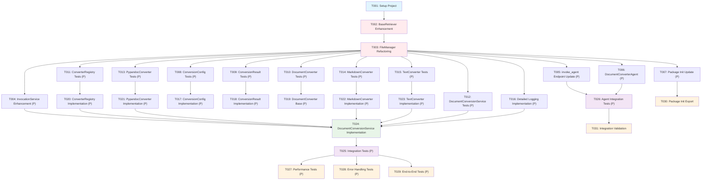

# Tasks: Document Conversion to Markdown

**Input**: Design documents from `/specs/010-document-conversion/`
**Prerequisites**: plan.md (required), research.md, data-model.md, quickstart.md

## Execution Flow (main)
```
1. Load plan.md from feature directory
   → Tech stack: Python 3.12, pytest, python-magic, pypandoc-binary, FastAPI BackgroundTasks
   → Extract: Agent invocation integration, FileMetadata detection, Background task processing
   → Terminology: "document conversion via agent invocation" (consistent with spec.md architectural decision)
2. Load design documents:
   → data-model.md: FileMetadata integration, ConversionConfig, ConversionResult
   → research.md: pypandoc-binary selected, FileMetadata pattern decisions
   → quickstart.md: Integration test scenarios extracted
3. Generate tasks by category:
   → Setup: BaseRetriever enhancement, project structure
   → Tests: contract tests, integration tests (TDD)
   → Core: models, services, converters
   → Integration: FileManager refactoring, FileMetadata workflow
   → Polish: unit tests, performance validation
4. Apply task rules:
   → Different files = mark [P] for parallel
   → BaseRetriever enhancement before conversion service
   → Tests before implementation (TDD)
5. Number tasks sequentially (T001, T002...)
6. Generate dependency graph with FileMetadata workflow
```

## Task Dependencies and Execution Workflow



## Format: `[ID] [P?] Description`
- **[P]**: Can run in parallel (different files, no dependencies)
- Include exact file paths in descriptions

## Path Conventions
- **Single project**: `src/nexus/agent_orchestrator/context_manager/file_manager/`
- **Tests**: `tests/unit/`, `tests/integration/`, `tests/performance/`
- All paths are relative to repository root

## Phase 3.1: Setup

- [ ] **T001** Create project structure for document conversion component in `src/nexus/agent_orchestrator/context_manager/file_manager/document_conversion/`
  - Create directory structure: `models/`, `services/`, `converters/`, `__init__.py`, `exceptions.py`
  - Create test directories: `tests/unit/agent_orchestrator/context_manager/file_manager/document_conversion/`
  - Add pypandoc-binary dependency to `pyproject.toml`

- [ ] **T002** Enhance BaseRetriever interface in `src/nexus/agent_orchestrator/context_manager/file_manager/retrievers/base.py`
  - Add `load_file(file_path: str) -> bytes` method
  - Add `file_exists(file_path: str) -> bool` method  
  - Add `get_file_metadata(file_path: str) -> Dict[str, Any]` method
  - Update LocalRetriever implementation in `local.py`

- [ ] **T003** Refactor FileManager to make retriever method public in `src/nexus/agent_orchestrator/context_manager/file_manager/__init__.py`
  - Change `_get_retriever_for_file()` to `get_retriever_for_file()` (remove underscore)
  - Update docstring and maintain backward compatibility

## Phase 3.1.5: Agent Invocation Integration

- [ ] **T004** Enhance InvocationService.create_invocation() method in `src/nexus/agent_orchestrator/services/invocation_service.py`
  - Add optional background_tasks parameter to method signature  
  - Add FileMetadata detection logic in method body
  - Add document conversion background task scheduling when FileMetadata detected
  - Implement invocation execution gating: block execution while ANY FileMetadata has status="pending_parse" or "converting" (FR-018)
  - Allow execution when ALL FileMetadata reach terminal status ("converted" or "conversion_failed") (FR-019)
  - Maintain backward compatibility with existing invocation creation

- [ ] **T005** Update invoke_agent endpoint in `src/nexus/api/v1/invocation.py`
  - Add FastAPI BackgroundTasks dependency injection to invoke_agent function (line 31)
  - Pass background_tasks parameter to InvocationService.create_invocation()
  - Maintain existing 202 ACCEPTED response pattern
  - Follow constitution API path structure requirements

- [ ] **T006** Create DocumentConverterAgent in `src/nexus/agent_orchestrator/context_manager/file_manager/document_conversion/agents/document_converter_agent.py`
  - Implement agent interface compatible with existing agent system
  - Integrate with DocumentConversionService for actual conversion processing
  - Return AgentResponse format for invocation result tracking
  - Handle FileMetadata objects and conversion error states

- [ ] **T007** Update main package init in `src/nexus/agent_orchestrator/context_manager/file_manager/document_conversion/__init__.py`
  - Export public API classes for agent and service integration
  - Follow existing structure under agent_orchestrator.context_manager.file_manager

## Phase 3.2: Tests First (TDD) ⚠️ MUST COMPLETE BEFORE 3.3

- [ ] **T008 [P]** Create ConversionConfig model tests in `tests/unit/agent_orchestrator/context_manager/file_manager/document_conversion/test_conversion_config.py`
  - Test configuration validation
  - Test max_file_size validation
  - Test supported_mime_types validation

- [ ] **T009 [P]** Create ConversionResult model tests in `tests/unit/agent_orchestrator/context_manager/file_manager/document_conversion/test_conversion_result.py`
  - Test result structure validation
  - Test success/failure states
  - Test conversion metadata structure

- [ ] **T010 [P]** Create DocumentConverter interface tests in `tests/unit/agent_orchestrator/context_manager/file_manager/document_conversion/test_document_converter.py`
  - Test abstract base class contract
  - Test supports_mime_type method
  - Test convert method signature

- [ ] **T011 [P]** Create ConverterRegistry tests in `tests/unit/agent_orchestrator/context_manager/file_manager/document_conversion/test_converter_registry.py`
  - Test converter registration
  - Test MIME type routing
  - Test unknown format handling

- [ ] **T012 [P]** Create DocumentConversionService tests in `tests/unit/agent_orchestrator/context_manager/file_manager/document_conversion/test_document_conversion_service.py`
  - Test process_pending_conversions method
  - Test FileMetadata status updates
  - Test BaseRetriever integration
  - Test FileManager.get_retriever_for_file usage

- [ ] **T013 [P]** Create PypandocConverter tests in `tests/unit/agent_orchestrator/context_manager/file_manager/document_conversion/converters/test_pypandoc_converter.py`
  - Test PDF conversion
  - Test Word document conversion
  - Test error handling
  - Test MIME type support

- [ ] **T014 [P]** Create MarkdownConverter tests in `tests/unit/agent_orchestrator/context_manager/file_manager/document_conversion/converters/test_markdown_converter.py`
  - Test no-op conversion for markdown files
  - Test pass-through behavior
  - Test MIME type detection

- [ ] **T015 [P]** Create TextConverter tests in `tests/unit/agent_orchestrator/context_manager/file_manager/document_conversion/converters/test_text_converter.py`
  - Test plain text to markdown conversion
  - Test paragraph formatting
  - Test encoding handling

- [ ] **T016 [P]** Implement detailed logging infrastructure in `src/nexus/agent_orchestrator/context_manager/file_manager/document_conversion/logging.py`
  - **Complete NFR-004 compliance**: Structured logging for conversion operations including ALL required elements:
    - Log converter type used (PypandocConverter, MarkdownConverter, TextConverter)
    - Log source file metadata (filename, size_bytes, MIME type) from FileMetadata
    - Log conversion duration in milliseconds
    - Log success/failure status for each conversion attempt
    - Log detailed error messages when failures occur with error classification
  - Integration with existing Nexus logging framework
  - Ensure logging covers all conversion paths in DocumentConversionService

## Phase 3.3: Core Implementation

- [ ] **T017 [P]** Implement ConversionConfig model in `src/nexus/agent_orchestrator/context_manager/file_manager/document_conversion/models/conversion_config.py`
  - Dataclass with max_file_size, overwrite_existing, supported_mime_types
  - Input validation
  - System config integration: read nexus.conversion.max_file_size_bytes from system configuration file

- [ ] **T018 [P]** Implement ConversionResult model in `src/nexus/agent_orchestrator/context_manager/file_manager/document_conversion/models/conversion_result.py`
  - Dataclass with success, output_path, conversion_time, error_message
  - Convenience properties for FileMetadata integration

- [ ] **T019 [P]** Implement DocumentConverter base class in `src/nexus/agent_orchestrator/context_manager/file_manager/document_conversion/converters/base.py`
  - Abstract base class with convert and supports_mime_type methods
  - Type hints for FileMetadata integration
  - Error handling patterns

- [ ] **T020 [P]** Implement ConverterRegistry in `src/nexus/agent_orchestrator/context_manager/file_manager/document_conversion/converters/registry.py`
  - Converter registration and MIME type mapping
  - Format routing logic
  - Unknown format handling

## Phase 3.4: Converter Implementation

- [ ] **T021 [P]** Implement PypandocConverter in `src/nexus/agent_orchestrator/context_manager/file_manager/document_conversion/converters/pypandoc_converter.py`
  - PDF to markdown conversion using pypandoc-binary
  - Word document (DOC/DOCX) to markdown conversion
  - Error handling and format validation
  - MIME type support: application/pdf, application/vnd.openxmlformats-officedocument.wordprocessingml.document, application/msword

- [ ] **T022 [P]** Implement MarkdownConverter in `src/nexus/agent_orchestrator/context_manager/file_manager/document_conversion/converters/markdown_converter.py`
  - No-op converter for text/markdown files
  - Return content unchanged
  - Validate markdown format

- [ ] **T023 [P]** Implement TextConverter in `src/nexus/agent_orchestrator/context_manager/file_manager/document_conversion/converters/text_converter.py`
  - Plain text to markdown conversion
  - Paragraph break handling
  - MIME type support: text/plain

## Phase 3.5: Service Integration

- [ ] **T024** Implement DocumentConversionService in `src/nexus/agent_orchestrator/context_manager/file_manager/document_conversion/services/document_conversion_service.py`
  - Implement process_conversion_background_task method for background task execution
  - Implement convert_document method for invocation-based processing
  - FileMetadata status management (pending_parse → converting → converted/conversion_failed)
  - Implement execution gating logic: check ALL FileMetadata for terminal status (FR-018, FR-019)
  - Support conversion failure handling: log failures but allow invocation execution (FR-020)
  - Integration with InvocationService for status tracking and result storage
  - BaseRetriever integration for loading source files and saving converted files
  - FileManager.get_retriever_for_file integration
  - Detailed logging per NFR-004 requirements
  - Error handling and file preservation

## Phase 3.6: Integration Tests

- [ ] **T025 [P]** Create integration tests in `tests/integration/agent_orchestrator/context_manager/file_manager/document_conversion/test_integration.py`
  - Test complete agent invocation workflow with FileMetadata conversion
  - Test invoke_agent endpoint with FileMetadata objects
  - Test background task execution and completion
  - Test invocation status tracking (CREATED → RUNNING → COMPLETED/FAILED)
  - Test BaseRetriever integration for file loading and saving
  - Test FileManager.get_retriever_for_file integration
  - Test status progression: pending_parse → converting → converted

- [ ] **T026 [P]** Create agent integration tests in `tests/integration/agent_orchestrator/test_document_conversion_agent.py`
  - Test DocumentConverterAgent execution with FileMetadata objects
  - Test agent response format compliance
  - Test error handling in agent layer
  - Test integration with existing agent orchestrator patterns

- [ ] **T027 [P]** Create performance tests in `tests/performance/agent_orchestrator/context_manager/file_manager/document_conversion/test_performance.py`
  - Test conversion time under 30 seconds (NFR-001)
  - Test 10MB file size limit (NFR-002)
  - Test memory usage during conversion

- [ ] **T028 [P]** Create error handling tests in `tests/integration/agent_orchestrator/context_manager/file_manager/document_conversion/test_error_handling.py`
  - Test comprehensive error handling per FR-013: (a) unsupported file formats, (b) files exceeding memory limits, (c) corrupted/unreadable files
  - Test conversion_failed status tracking for all error types
  - Test error message clarity and actionability

## Phase 3.7: End-to-End Validation

- [ ] **T029 [P]** Create end-to-end tests in `tests/integration/agent_orchestrator/context_manager/file_manager/document_conversion/test_end_to_end.py`
  - Test PDF conversion scenario from quickstart.md
  - Test Word document conversion scenario
  - Test text file conversion scenario
  - Test markdown no-op conversion scenario
  - Validate FileMetadata.conversion metadata structure

- [ ] **T030** Update main package init in `src/nexus/agent_orchestrator/context_manager/file_manager/document_conversion/__init__.py`
  - Export main public interface classes
  - Add component documentation
  - Version information

- [ ] **T031** Run integration validation per quickstart.md
  - Execute all quickstart examples
  - Validate FileMetadata integration workflow
  - Validate BaseRetriever enhancement
  - Confirm detailed logging functionality
  - **Validate extensible architecture (FR-010)**: Test adding a new converter format without modifying existing conversion logic by creating a test converter for an unsupported MIME type and verifying it integrates through the registry system

## Parallel Execution Examples

### Phase 3.2 (Tests): Run in parallel
```bash
# All test creation tasks can run simultaneously
Task_Agent T008 &  # ConversionConfig tests
Task_Agent T009 &  # ConversionResult tests  
Task_Agent T010 &  # DocumentConverter tests
Task_Agent T011 &  # ConverterRegistry tests
Task_Agent T012 &  # DocumentConversionService tests
wait
```

### Phase 3.3 (Models): Run in parallel
```bash
# All model implementations can run simultaneously  
Task_Agent T017 &  # ConversionConfig implementation
Task_Agent T018 &  # ConversionResult implementation
Task_Agent T019 &  # DocumentConverter base
Task_Agent T020 &  # ConverterRegistry implementation
wait
```

### Phase 3.4 (Converters): Run in parallel
```bash
# All converter implementations can run simultaneously
Task_Agent T021 &  # PypandocConverter
Task_Agent T022 &  # MarkdownConverter  
Task_Agent T023 &  # TextConverter
wait
```

## Dependencies

**Critical Path**: T001 → T002 → T003 → T004 → T005 → T006 → T007 → T012 → T024 → T025 → T026 → T031

**Agent Integration Requirements**:
- T004 (InvocationService enhancement) must complete before T024 (DocumentConversionService)
- T005 (invoke_agent endpoint) must complete before T026 (agent integration tests)
- T006 (DocumentConverterAgent) must complete before T026 (agent integration tests)
- T007 (package init update) must complete for proper component integration

**FileMetadata Integration Requirements**:
- T002 (BaseRetriever enhancement) must complete before T024 (DocumentConversionService)
- T003 (FileManager refactoring) must complete before T024 (DocumentConversionService)
- T012 (Service tests) must complete before T024 (Service implementation)

**TDD Requirements**:
- All test tasks (T008-T016) must complete before corresponding implementation tasks
- Integration tests (T025-T029) must wait for service implementation (T024)

## Validation Checklist

- [ ] All FileMetadata integration points implemented
- [ ] BaseRetriever enhanced with load_file(), file_exists(), get_file_metadata()
- [ ] FileManager.get_retriever_for_file() made public (refactored from _get_retriever_for_file)  
- [ ] All MIME types supported: application/pdf, application/vnd.openxmlformats-officedocument.wordprocessingml.document, application/msword, text/plain, text/markdown
- [ ] Detailed logging implemented per NFR-004
- [ ] All quickstart scenarios working
- [ ] All integration tests passing
- [ ] Performance requirements met (30s, 10MB limit)
- [ ] TDD approach followed (tests before implementation)

---

**Total Tasks**: 31 (Setup: 3, Agent Integration: 4, Tests: 9, Implementation: 8, Integration: 4, Validation: 3)  
**Parallel Tasks**: 25 marked [P]  
**Critical Path Length**: 12 sequential tasks  
**Estimated Parallel Speedup**: ~60% reduction in execution time
