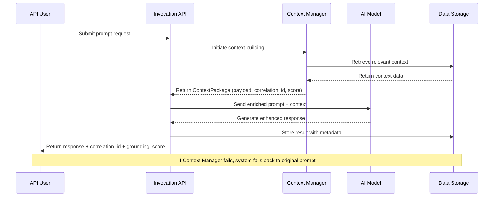

# Feature Specification: Invocation Context Integration

**Feature Branch**: `011-adaptor-initiate-context`
**Created**: November 13, 2025
**Status**: Draft
**Input**: User description: "Adaptor: Initiate Context building when /invocation is called, return ContextManager obj, attach context to the prompt"

## Execution Flow (main)
```
1. Parse user description from Input
   �  Feature parsed: Integration of Context Manager with invocation endpoint
2. Extract key concepts from description
   � Actors: API users, Context Manager, LLM Adapter
   � Actions: invoke, build context, enrich prompt, return enhanced response
   � Data: user prompts, context data, LLM responses, trace metadata
   � Constraints: maintain backward compatibility, preserve existing API
3. For each unclear aspect:
   � Mark with [NEEDS CLARIFICATION: specific question]
4. Fill User Scenarios & Testing section
   �  Clear user flow: submit prompt � get context-enriched response
5. Generate Functional Requirements
   � Each requirement must be testable
6. Identify Key Entities (if data involved)
   �  ContextPackage, Enhanced Response
7. Run Review Checklist
   � Validate against quality criteria
8. Return: SUCCESS (spec ready for planning)
```

---

## � Quick Guidelines
-  Focus on WHAT users need and WHY
- L Avoid HOW to implement (no tech stack, APIs, code structure)
- =e Written for business stakeholders, not developers

---

## User Scenarios & Testing *(mandatory)*

### Primary User Story
As an API user, I want my prompts to be automatically enriched with relevant contextual information so that I receive more accurate and grounded responses from the AI system, without having to manually provide context each time.

### System Flow Diagram



### Acceptance Scenarios
1. **Given** I submit a prompt to the invocation API, **When** the system processes my request, **Then** the AI response includes relevant contextual information and provides a trace ID for debugging
2. **Given** I submit a complex query requiring background knowledge, **When** the context system finds relevant information, **Then** the AI response demonstrates understanding of that context and includes a grounding score
3. **Given** the context system encounters an error, **When** processing my invocation, **Then** I still receive a response to my original prompt without context enhancement
4. **Given** I retrieve my invocation result, **When** checking the response metadata, **Then** I can see the trace ID and grounding score that indicate how well the context supported the response

### Edge Cases
- What happens when context retrieval fails or times out?
- How does system handle prompts that don't benefit from additional context?
- What occurs when the context payload would exceed reasonable size limits?
- How does the system behave when grounding score is below acceptable threshold?

## Requirements *(mandatory)*

### Functional Requirements
- **FR-001**: System MUST automatically initiate context building when an invocation request is received
- **FR-002**: System MUST enrich user prompts with relevant contextual information before sending to the AI model
- **FR-003**: System MUST return responses that include both the AI-generated content and context metadata
- **FR-004**: System MUST provide a unique trace ID with each response for request correlation and debugging
- **FR-005**: System MUST include a grounding score indicating the quality and relevance of the contextual information used
- **FR-006**: System MUST maintain backward compatibility with existing invocation API behavior
- **FR-007**: System MUST gracefully handle context system failures by falling back to non-context-enriched responses
- **FR-008**: System MUST preserve the original user prompt while enhancing it with additional context
- **FR-009**: System MUST format contextual information in a way that improves AI response quality without overwhelming the model
- **FR-010**: Users MUST be able to access both the enhanced response and the underlying context metadata

### Key Entities *(include if feature involves data)*
- **Enhanced Invocation Response**: Contains the AI-generated content, original prompt, trace ID, grounding score, and context metadata for user consumption
- **Context Package**: Internal representation of retrieved and processed contextual information, including relevance metrics and source citations

---

## Success Criteria *(mandatory)*

### User Experience
- Users receive more accurate and contextually-aware responses compared to non-enhanced prompts
- Response times remain acceptable despite additional context processing overhead
- Users can trace and understand how contextual information influenced their responses

### System Performance
- Response time thresholds will be defined by the performance and scale team during implementation
- Context enhancement succeeds for majority of requests without degrading user experience
- System maintains high availability even when context subsystem has issues

### Quality Metrics
- Grounding scores accurately reflect the relevance and quality of contextual information
- Trace IDs enable effective debugging and request correlation across system components
- Enhanced responses demonstrate measurable improvement in accuracy and relevance

---

## Scope & Boundaries *(mandatory)*

### In Scope
- Integration of existing context management capabilities with the invocation API
- Enhancement of API responses with context metadata (trace ID, grounding score)
- Graceful error handling when context processing fails
- Preservation of existing invocation API behavior and contracts

### Out of Scope
- Modification of the core context retrieval, compression, or assembly algorithms
- Changes to the underlying AI model or LLM provider integration
- Creation of new API endpoints beyond enhancing existing invocation functionality
- User interface changes for displaying context information

---

## Dependencies & Assumptions *(mandatory)*

### Dependencies
- Context Manager scaffolding must be available and functional
- Existing invocation API infrastructure must remain operational
- LLM provider integration must support enhanced prompts with additional context

### Assumptions
- Context processing adds acceptable latency to overall response time
- Users benefit from automatically enhanced prompts without explicit opt-in
- Current invocation API users will not be negatively impacted by response format additions
- Context system has been designed to handle production-level request volumes

---

## Review & Acceptance Checklist
*GATE: Automated checks run during main() execution*

### Content Quality
- [x] No implementation details (languages, frameworks, APIs)
- [x] Focused on user value and business needs
- [x] Written for non-technical stakeholders
- [x] All mandatory sections completed

### Requirement Completeness
- [x] No [NEEDS CLARIFICATION] markers remain
- [x] Requirements are testable and unambiguous
- [x] Success criteria are measurable
- [x] Scope is clearly bounded
- [x] Dependencies and assumptions identified

---

## Execution Status
*Updated by main() during processing*

- [x] User description parsed
- [x] Key concepts extracted
- [x] Ambiguities marked (resolved: performance thresholds deferred to scale team)
- [x] User scenarios defined
- [x] Requirements generated
- [x] Entities identified
- [x] Review checklist passed

---
