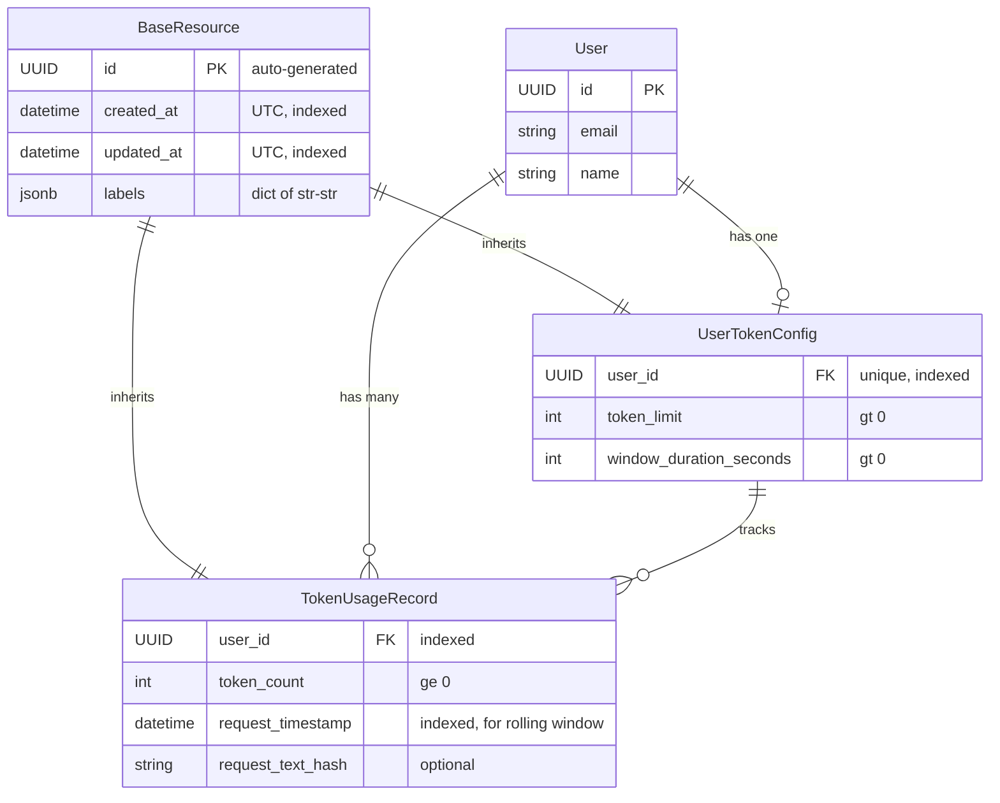

# Data Model: Token Count Validation and Tracking

**Feature**: 012-token-counting
**Date**: 2025-11-21

## Overview

This document defines the data models for the token counting and validation system. All models use SQLModel for unified database and API representation, following the Nexus constitution.

## BaseResource Inheritance

All database models in the token counting system inherit from `BaseResource` (defined in `src/nexus/core/models/base/base_resource.py`), which provides standard system-managed metadata fields:

- **id**: UUID primary key (auto-generated)
- **created_at**: Timestamp when resource was created (UTC, timezone-aware, auto-managed)
- **updated_at**: Timestamp when resource was last updated (UTC, timezone-aware, auto-managed)
- **labels**: Optional key-value metadata (dict[str, str], stored as JSONB)

By inheriting from BaseResource, our models:
1. **Maintain consistency** with other Nexus resources
2. **Gain automatic labeling** support for flexible metadata and filtering
3. **Use proper timezone handling** (UTC, timezone-aware datetimes)
4. **Follow validation standards** (labels must be string key-value pairs, extra fields forbidden)
5. **Benefit from future BaseResource enhancements** automatically

The models below only define domain-specific fields; all BaseResource fields are inherited automatically.

## Entities

### 1. UserTokenConfig

**Purpose**: Stores per-user token limit configuration and rolling window settings.

**SQLModel Definition**:
```python
# File: src/nexus/agent_orchestrator/token_manager/models.py
from sqlmodel import Field, Relationship
from uuid import UUID
from typing import Optional

from nexus.core.models.base.base_resource import BaseResource

class UserTokenConfig(BaseResource, table=True):
    """Per-user token limit configuration.

    Each user has their own token limit and rolling window duration.
    The rolling window determines the time period over which token
    usage is tracked.

    Inherits from BaseResource:
    - id: UUID (primary key)
    - created_at: datetime (UTC, auto-managed)
    - updated_at: datetime (UTC, auto-managed)
    - labels: dict[str, str] (JSONB, for metadata)
    """
    __tablename__ = "user_token_configs"

    user_id: UUID = Field(foreign_key="users.id", unique=True, index=True)

    # Token limit within the rolling window
    token_limit: int = Field(gt=0, description="Maximum tokens allowed within window")

    # Rolling window duration in seconds
    window_duration_seconds: int = Field(
        gt=0,
        description="Rolling window duration in seconds (e.g., 3600 for 1 hour, 86400 for 24 hours)"
    )

    # Tiktoken model name for token encoding
    model_name: str = Field(
        default="gpt-4",
        description="Tiktoken model name for token counting (e.g., 'gpt-4', 'gpt-3.5-turbo')"
    )

    # Relationship to usage records
    usage_records: list["TokenUsageRecord"] = Relationship(back_populates="user_config")
```

**Fields**:

*Inherited from BaseResource:*
- `id`: Primary key (UUID, auto-generated)
- `created_at`: When the configuration was created (UTC, auto-managed)
- `updated_at`: When the configuration was last modified (UTC, auto-managed)
- `labels`: Optional key-value metadata (dict[str, str], JSONB storage)

*Domain-specific fields:*
- `user_id`: Foreign key to User table, unique (one config per user)
- `token_limit`: Maximum tokens allowed within the rolling window (must be > 0)
- `window_duration_seconds`: Rolling window size in seconds (must be > 0)
- `model_name`: Tiktoken model name for token encoding (defaults to "gpt-4")

**Indexes**:
- Primary key on `id`
- Unique index on `user_id` (enforces one config per user)

**Constraints**:
- `token_limit` must be greater than 0
- `window_duration_seconds` must be greater than 0
- `user_id` must reference valid user in `users` table

**Validation Rules**:
- Cannot set negative or zero limits
- Cannot set negative or zero window duration
- User must exist before creating config
- model_name cannot be null or empty (defaults to "gpt-4")
- tiktoken will use fallback encoding if model_name is unknown

**State Transitions**:
- Created → Active (on insert)
- Active → Updated (on configuration change)
- No deletion (soft delete not required; keep for audit trail)

### 2. TokenUsageRecord

**Purpose**: Immutable record of token usage for each request. Used to calculate rolling window usage.

**SQLModel Definition**:
```python
# File: src/nexus/agent_orchestrator/token_manager/models.py
from datetime import datetime

class TokenUsageRecord(BaseResource, table=True):
    """Immutable record of token usage for a user's request.

    These records are used to calculate cumulative usage within
    the rolling time window. Records are append-only (never updated).

    Inherits from BaseResource:
    - id: UUID (primary key)
    - created_at: datetime (when record was inserted into DB, UTC, auto-managed)
    - updated_at: datetime (UTC, auto-managed, same as created_at for immutable records)
    - labels: dict[str, str] (JSONB, for metadata)

    Note: request_timestamp is separate from created_at. It represents when the
    actual request was made, while created_at represents when the record was
    persisted to the database.
    """
    __tablename__ = "token_usage_records"

    user_id: UUID = Field(foreign_key="users.id", index=True)

    # Token count for this specific request
    token_count: int = Field(ge=0, description="Number of tokens in this request")

    # When the request was made (used for rolling window calculation)
    request_timestamp: datetime = Field(default_factory=datetime.utcnow, index=True)

    # Optional: hash of request text for deduplication/debugging
    request_text_hash: Optional[str] = Field(default=None, max_length=64)

    # Relationship
    user_config: Optional[UserTokenConfig] = Relationship(back_populates="usage_records")
```

**Fields**:

*Inherited from BaseResource:*
- `id`: Primary key (UUID, auto-generated)
- `created_at`: When this record was inserted into the database (UTC, auto-managed)
- `updated_at`: Same as created_at for immutable records (UTC, auto-managed)
- `labels`: Optional key-value metadata (dict[str, str], JSONB storage)

*Domain-specific fields:*
- `user_id`: Foreign key to User table
- `token_count`: Number of tokens calculated for the request (>= 0)
- `request_timestamp`: When the request was made (used for rolling window filtering)
- `request_text_hash`: Optional SHA-256 hash of request text (for debugging/deduplication)

**Indexes**:
- Primary key on `id`
- Composite index on `(user_id, request_timestamp DESC)` for efficient rolling window queries
- Individual index on `request_timestamp` for cleanup operations

**Constraints**:
- `token_count` must be >= 0
- `user_id` must reference valid user
- Records are **immutable** (insert-only, no updates)

**State**:
- No state transitions (immutable records)
- Records are deleted only by background cleanup job after retention period

### 3. TokenValidationResult (Pydantic Model)

**Purpose**: Response object for validation operations. Not persisted to database.

**Pydantic Definition**:
```python
# File: src/nexus/agent_orchestrator/token_manager/services.py (internal model)
from pydantic import BaseModel

class TokenValidationResult(BaseModel):
    """Result of token validation check.

    Used internally to communicate validation results.
    Not persisted to database.
    """
    allowed: bool
    user_id: UUID
    current_usage: int
    token_limit: int
    request_tokens: int
    window_duration_seconds: int
    reason: Optional[str] = None

    @property
    def total_after_request(self) -> int:
        """Calculate what total usage would be if request proceeds."""
        return self.current_usage + self.request_tokens

    @property
    def remaining_budget(self) -> int:
        """Calculate remaining token budget."""
        return max(0, self.token_limit - self.current_usage)
```

**Fields**:
- `allowed`: Whether the request is within limits
- `user_id`: User being validated
- `current_usage`: Current token usage within rolling window
- `token_limit`: User's configured limit
- `request_tokens`: Tokens calculated for the current request
- `window_duration_seconds`: User's configured window duration
- `reason`: Optional explanation when `allowed=False`

**Properties**:
- `total_after_request`: What usage would be if request proceeds
- `remaining_budget`: How many tokens remain in budget

## Relationships



## Database Migration

**Alembic Migration** (generated via `alembic revision --autogenerate`):

```python
"""Add token counting tables

Revision ID: 011_add_token_counting
Revises: <previous_revision>
Create Date: 2025-11-21
"""
from alembic import op
import sqlalchemy as sa
from sqlalchemy.dialects import postgresql
import uuid

def upgrade() -> None:
    # Create user_token_configs table
    # Note: Inherits BaseResource fields (id, created_at, updated_at, labels)
    op.create_table(
        'user_token_configs',
        sa.Column('id', postgresql.UUID(as_uuid=True), primary_key=True, default=uuid.uuid4),
        sa.Column('user_id', postgresql.UUID(as_uuid=True), nullable=False),
        sa.Column('token_limit', sa.Integer(), nullable=False),
        sa.Column('window_duration_seconds', sa.Integer(), nullable=False),
        # BaseResource timestamp fields (timezone-aware)
        sa.Column('created_at', sa.DateTime(timezone=True), nullable=False, server_default=sa.text('now()')),
        sa.Column('updated_at', sa.DateTime(timezone=True), nullable=False, server_default=sa.text('now()')),
        # BaseResource labels field (JSONB)
        sa.Column('labels', postgresql.JSONB, nullable=False, server_default=sa.text("'{}'::jsonb")),
        sa.ForeignKeyConstraint(['user_id'], ['users.id'], ondelete='CASCADE'),
        sa.UniqueConstraint('user_id'),
        sa.CheckConstraint('token_limit > 0', name='check_token_limit_positive'),
        sa.CheckConstraint('window_duration_seconds > 0', name='check_window_duration_positive')
    )
    op.create_index('ix_user_token_configs_user_id', 'user_token_configs', ['user_id'])
    op.create_index('ix_user_token_configs_id', 'user_token_configs', ['id'])
    op.create_index('ix_user_token_configs_created_at', 'user_token_configs', ['created_at'])
    op.create_index('ix_user_token_configs_updated_at', 'user_token_configs', ['updated_at'])

    # Create token_usage_records table
    # Note: Inherits BaseResource fields (id, created_at, updated_at, labels)
    op.create_table(
        'token_usage_records',
        sa.Column('id', postgresql.UUID(as_uuid=True), primary_key=True, default=uuid.uuid4),
        sa.Column('user_id', postgresql.UUID(as_uuid=True), nullable=False),
        sa.Column('token_count', sa.Integer(), nullable=False),
        sa.Column('request_timestamp', sa.DateTime(timezone=True), nullable=False),
        # BaseResource timestamp fields (timezone-aware)
        sa.Column('created_at', sa.DateTime(timezone=True), nullable=False, server_default=sa.text('now()')),
        sa.Column('updated_at', sa.DateTime(timezone=True), nullable=False, server_default=sa.text('now()')),
        # BaseResource labels field (JSONB)
        sa.Column('labels', postgresql.JSONB, nullable=False, server_default=sa.text("'{}'::jsonb")),
        sa.Column('request_text_hash', sa.String(64), nullable=True),
        sa.ForeignKeyConstraint(['user_id'], ['users.id'], ondelete='CASCADE'),
        sa.CheckConstraint('token_count >= 0', name='check_token_count_non_negative')
    )

    # Create composite index for efficient rolling window queries
    op.create_index(
        'ix_token_usage_user_time',
        'token_usage_records',
        ['user_id', sa.text('request_timestamp DESC')]
    )

    # Create individual index for cleanup operations
    op.create_index('ix_token_usage_timestamp', 'token_usage_records', ['request_timestamp'])

    # BaseResource indexes
    op.create_index('ix_token_usage_records_id', 'token_usage_records', ['id'])
    op.create_index('ix_token_usage_records_created_at', 'token_usage_records', ['created_at'])
    op.create_index('ix_token_usage_records_updated_at', 'token_usage_records', ['updated_at'])

def downgrade() -> None:
    # Drop token_usage_records indexes
    op.drop_index('ix_token_usage_records_updated_at', table_name='token_usage_records')
    op.drop_index('ix_token_usage_records_created_at', table_name='token_usage_records')
    op.drop_index('ix_token_usage_records_id', table_name='token_usage_records')
    op.drop_index('ix_token_usage_timestamp', table_name='token_usage_records')
    op.drop_index('ix_token_usage_user_time', table_name='token_usage_records')
    op.drop_table('token_usage_records')

    # Drop user_token_configs indexes
    op.drop_index('ix_user_token_configs_updated_at', table_name='user_token_configs')
    op.drop_index('ix_user_token_configs_created_at', table_name='user_token_configs')
    op.drop_index('ix_user_token_configs_id', table_name='user_token_configs')
    op.drop_index('ix_user_token_configs_user_id', table_name='user_token_configs')
    op.drop_table('user_token_configs')
```

## Query Patterns

### 1. Get User Configuration
```python
# File: src/nexus/agent_orchestrator/token_manager/repository.py
async def get_user_config(user_id: UUID, session: AsyncSession) -> UserTokenConfig:
    result = await session.execute(
        select(UserTokenConfig).where(UserTokenConfig.user_id == user_id)
    )
    return result.scalar_one()

async def get_user_config_with_lock(user_id: UUID, session: AsyncSession) -> UserTokenConfig:
    """Get config with row-level lock for concurrent request safety."""
    result = await session.execute(
        select(UserTokenConfig)
        .where(UserTokenConfig.user_id == user_id)
        .with_for_update()  # Row-level lock prevents race conditions
    )
    return result.scalar_one()
```

### 2. Calculate Current Usage (Rolling Window)
```python
# File: src/nexus/agent_orchestrator/token_manager/repository.py
async def calculate_current_usage(
    user_id: UUID,
    window_duration_seconds: int,
    session: AsyncSession
) -> int:
    """Calculate total tokens used within the rolling window."""
    window_start = datetime.utcnow() - timedelta(seconds=window_duration_seconds)

    result = await session.execute(
        select(func.coalesce(func.sum(TokenUsageRecord.token_count), 0))
        .where(
            TokenUsageRecord.user_id == user_id,
            TokenUsageRecord.request_timestamp >= window_start,
            TokenUsageRecord.request_timestamp <= datetime.utcnow()
        )
    )
    return result.scalar()
```

### 3. Record Usage
```python
# File: src/nexus/agent_orchestrator/token_manager/repository.py
async def record_usage(
    user_id: UUID,
    token_count: int,
    session: AsyncSession
) -> TokenUsageRecord:
    """Create immutable usage record."""
    record = TokenUsageRecord(
        user_id=user_id,
        token_count=token_count,
        request_timestamp=datetime.utcnow()
    )
    session.add(record)
    await session.flush()
    return record
```

### 4. Update User Configuration
```python
# File: src/nexus/agent_orchestrator/token_manager/repository.py
async def update_user_config(
    user_id: UUID,
    token_limit: int,
    window_duration_seconds: int,
    session: AsyncSession
) -> UserTokenConfig:
    """Update user's token configuration."""
    result = await session.execute(
        select(UserTokenConfig).where(UserTokenConfig.user_id == user_id)
    )
    config = result.scalar_one()

    config.token_limit = token_limit
    config.window_duration_seconds = window_duration_seconds
    config.updated_at = datetime.utcnow()

    await session.flush()
    return config
```

## Validation Business Rules

1. **Token Limit Check**:
   - `current_usage + request_tokens <= token_limit`
   - Where `current_usage` is sum of all tokens within rolling window

2. **Rolling Window Calculation**:
   - Include only records where `request_timestamp >= (now - window_duration_seconds)`
   - Window is sliding (recalculated on each request)

3. **Configuration Constraints**:
   - `token_limit > 0` (enforced by database CHECK constraint)
   - `window_duration_seconds > 0` (enforced by database CHECK constraint)
   - One configuration per user (enforced by UNIQUE constraint)

4. **Usage Record Immutability**:
   - Records are never updated after creation
   - Records are only deleted by background cleanup job after retention period

## Performance Considerations

- **Index on (user_id, request_timestamp DESC)**: Enables fast rolling window queries
- **Estimated query time**: <10ms for users with <100k records
- **Write performance**: Insert-only pattern (no update conflicts)
- **Retention**: Background job deletes records >90 days old to prevent unbounded growth

## Next Steps

- Generate OpenAPI schema for configuration API (if needed)
- Write failing tests for models and validation logic
- Implement repository and service layers
- Create quickstart validation scenario
