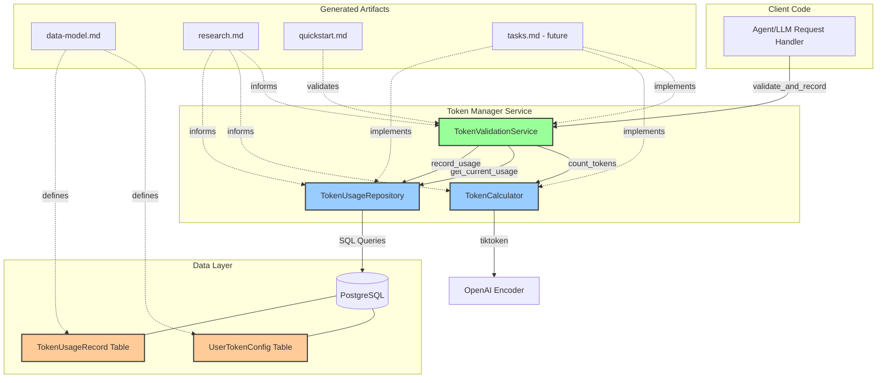

# Implementation Plan: Token Count Validation and Tracking

**Branch**: `implement_token_counting` | **Date**: 2025-11-26 | **Spec**: [spec.md](./spec.md)
**Input**: Feature specification from `/specs/012-token-counting/spec.md`

## Execution Flow (/plan command scope)
```
1. Load feature spec from Input path
   → ✅ Loaded successfully
2. Fill Technical Context (scan for NEEDS CLARIFICATION)
   → ✅ Detected Python/FastAPI project with SQLModel
   → ✅ Set Structure Decision: Option 1 (Single project)
3. Fill the Constitution Check section based on the content of the constitution document.
   → ✅ Constitution checks populated
4. Evaluate Constitution Check section below
   → ✅ No violations - all constitutional principles followed
   → ✅ Update Progress Tracking: Initial Constitution Check
5. Execute Phase 0 → research.md
   → ✅ COMPLETE - All technical decisions documented
6. Execute Phase 1 → data-model.md, quickstart.md, agent-specific template file
   → ✅ COMPLETE - Generated data-model.md, quickstart.md, updated CLAUDE.md
7. Re-evaluate Constitution Check section
   → ✅ PASS - Design maintains constitutional compliance
8. Plan Phase 2 → Describe task generation approach
   → ✅ COMPLETE - Task planning approach documented
9. STOP - Ready for /tasks command
   → ✅ Plan execution complete
```

## Summary

This feature implements a token counting and validation system that tracks LLM token usage per user with rolling time windows. The system calculates tokens using OpenAI's tiktoken library, maintains cumulative counts within configurable time windows (specified in seconds), and raises exceptions when requests would exceed user-specific limits. The implementation ensures thread-safe concurrent request handling, persistent storage of usage data, and per-user configuration of both token limits and rolling window durations.

**Primary Requirements**:
- Calculate token counts using tiktoken (OpenAI standard)
- Track cumulative usage per user within rolling time windows
- Raise exceptions when limits are exceeded (internal service, not HTTP)
- Support per-user configuration of limits and window durations
- Handle concurrent requests safely without race conditions

**Technical Approach**:
- Internal service API (Python library service, not HTTP middleware - see research.md for details)
- SQLModel for user token configuration and usage tracking
- PostgreSQL for persistent storage with timestamps
- tiktoken library for accurate token calculation
- Database transactions for concurrent request safety

## Architecture Diagram



**Key Components**:
- **TokenValidationService**: Orchestrates validation, coordinates calculator and repository
- **TokenCalculator**: Wraps tiktoken for token counting
- **TokenUsageRepository**: Data access layer for config and usage records
- **SQLModel Entities**: UserTokenConfig and TokenUsageRecord
- **Exception Hierarchy**: TokenLimitExceededError for limit violations

## Technical Context
**Language/Version**: Python 3.12
**Primary Dependencies**: FastAPI, SQLModel (for unified data models), tiktoken, PostgreSQL, httpx (for testing)
**Storage**: PostgreSQL with SQLModel ORM for token usage history and user configuration
**Testing**: pytest with pytest-asyncio for async testing; **all tests (unit and integration) use PostgreSQL** via test_db_session fixture (no SQLite) to ensure compatibility with BaseResource JSONB fields and timezone-aware timestamps

**CRITICAL**: SQLite MUST NOT be used for testing. BaseResource uses PostgreSQL-specific features:
- JSONB fields for labels (not supported in SQLite)
- TIMESTAMP WITH TIME ZONE for timezone-aware datetimes (SQLite has limited timezone support)
- Advanced indexing on composite columns (user_id + request_timestamp)
All test fixtures MUST use the `test_db_session` fixture which connects to a test PostgreSQL database.

**Target Platform**: Linux server (containerized with podman-compose)
**Project Type**: single (API backend component)
**Performance Goals**: <50ms token calculation overhead, <100ms database query time for usage lookup (combined budget: <200ms p95 total validation including calculation + DB + overhead)
**Constraints**: <200ms p95 total latency for token validation check, support 100+ concurrent requests per user
**Scale/Scope**: Support 1000+ users, track millions of requests, 90-day retention of usage history

## Constitution Check
*GATE: Must pass before Phase 0 research. Re-check after Phase 1 design.*

### Technology Standards Compliance
- [x] **SQLModel for Data Models**: All data models MUST use SQLModel (not separate Pydantic + SQLAlchemy) per decision-records.md (10/15/2025) - UserTokenConfig and TokenUsageRecord will use SQLModel with `table=True`, no separate Pydantic schemas
- [x] **BaseResource Inheritance**: All database models MUST inherit from `nexus.core.models.base.base_resource.BaseResource` to ensure consistent system-managed metadata (id, created_at, updated_at, labels) across all API resources

### Code Architecture Compliance
- [x] **DRY Principle**: Design avoids code duplication through proper abstraction - single token validation service, reusable middleware
- [x] **SOLID Principles**: Design follows Single Responsibility (separate services for counting, validation, storage), Open/Closed (extensible via dependency injection), Liskov Substitution (interface-based design), Interface Segregation (minimal focused interfaces), Dependency Inversion (depend on abstractions)
- [x] **Separation of Concerns**: Clear boundaries - middleware (presentation), TokenValidationService (business logic), TokenUsageRepository (data access)
- [x] **Dependency Injection**: Dependencies explicitly injected via constructors (repository injected into service, service injected into middleware)
- [x] **Composition vs Inheritance**: Design uses composition - middleware composes service, service composes repository and tiktoken calculator

### API Specification Standards Compliance
- [x] **OpenAPI/AsyncAPI Compliance**: N/A - Internal service library (not HTTP API)
- [x] **Naming Convention**: Python naming conventions (snake_case for functions/variables)
- [x] **Documentation Completeness**: All public functions fully documented with docstrings
- [x] **Error Format**: TokenLimitExceededError contains structured fields (user_id, current_usage, token_limit, request_tokens)
- [x] **Error Message Safety**: Error messages are actionable ("Token limit exceeded: 10500/10000") without exposing internal details
- [x] **API Versioning**: N/A - Internal service (semantic versioning at package level)
- [x] **API Path Structure**: N/A - Internal service (public API: validate_and_record, get_current_usage)
- [x] **Pagination Support**: N/A - Internal service
- [x] **Filtering/Sorting Consistency**: N/A - Internal service
- [x] **Security Documentation**: N/A - Internal service (authentication handled by caller)
- [x] **Schema Compatibility**: SQLModel schema changes follow Alembic migration process

## Project Structure

### Documentation (this feature)
```
specs/012-token-counting/
├── plan.md              # This file (/plan command output)
├── research.md          # Phase 0 output (/plan command)
├── data-model.md        # Phase 1 output (/plan command)
├── quickstart.md        # Phase 1 output (/plan command)
└── tasks.md             # Phase 2 output (/tasks command - NOT created by /plan)
```

### Source Code (repository root)
```
# Option 1: Single project (DEFAULT)
src/nexus/
├── agent_orchestrator/
│   ├── token_manager/          # New component for token counting
│   │   ├── __init__.py        # Public API exports
│   │   ├── models.py          # SQLModel entities (UserTokenConfig, TokenUsageRecord)
│   │   ├── services.py        # TokenValidationService, TokenCalculator
│   │   ├── repository.py      # TokenUsageRepository
│   │   ├── exceptions.py      # TokenLimitExceededError, custom exceptions
│   │   └── cleanup.py         # Background cleanup job
│   ├── llm_tracking/          # Existing LLM tracking component
│   └── ...                    # Other agent orchestrator components
└── core/
    └── models/
        └── user.py           # Existing User model (referenced by token config)

tests/
├── unit/
│   └── agent_orchestrator/
│       └── token_manager/
│           ├── __init__.py
│           ├── test_token_models.py           # SQLModel validation tests
│           ├── test_token_calculator.py       # tiktoken calculation tests
│           ├── test_token_usage_repository.py # Repository unit tests
│           └── test_token_validation_service.py # Service unit tests
└── integration/
    └── agent_orchestrator/
        └── token_manager/
            ├── __init__.py
            ├── test_token_validation_flow.py  # End-to-end user scenarios
            ├── test_concurrent_requests.py    # Concurrent request safety tests
            ├── test_rolling_window.py         # Rolling window behavior tests
            └── test_generic_query_flow.py     # Generic query patterns
```

**Structure Decision**: Option 1 (Single project) - New token_manager component under src/nexus/agent_orchestrator/ following existing structure. The token manager is part of the agent orchestration layer as it tracks LLM token usage for agents, similar to the existing llm_tracking component within agent_orchestrator.

**Test Organization**: All token manager tests follow the agent_orchestrator directory structure pattern, with unit tests under `tests/unit/agent_orchestrator/token_manager/` and integration tests under `tests/integration/agent_orchestrator/token_manager/`. This matches the organization used by other agent_orchestrator components like context_manager.

## Phase 0: Outline & Research

### Unknowns from Technical Context
1. ✅ Resolved: tiktoken library usage patterns and model selection
2. ✅ Resolved: Rolling window query optimization in PostgreSQL
3. ⚠️ Needs Research: Concurrent request handling with database transactions
4. ⚠️ Needs Research: Optimal storage strategy for high-volume usage records
5. ⚠️ Needs Research: Performance optimization for window queries

### Research Tasks
1. **tiktoken integration best practices**
   - How to select appropriate encoding for GPT models
   - Caching strategies for encoder instances
   - Error handling for encoding failures

2. **PostgreSQL rolling window queries**
   - Index strategies for timestamp-based queries
   - Query optimization for COUNT aggregations with time filters
   - Partitioning strategies for usage_records table

3. **Concurrent request safety**
   - Transaction isolation levels for accurate counting
   - Lock-free approaches vs explicit locking
   - Race condition prevention patterns in FastAPI

4. **Storage optimization**
   - Retention policy implementation
   - Archival strategies for old usage records
   - Write amplification mitigation

5. **FastAPI middleware patterns**
   - Request interception best practices
   - Dependency injection in middleware
   - Error response formatting from middleware

**Output**: research.md with all findings consolidated

## Phase 1: Design & Contracts
*Prerequisites: research.md complete*

### Data Model (`data-model.md`)

**Entities to Extract from Spec**:
1. **UserTokenConfig** (inherits from BaseResource)
   - Inherited fields: id (UUID), created_at, updated_at, labels (dict[str, str])
   - Domain fields: user_id (FK to User), token_limit (int), window_duration_seconds (int), model_name (str, default="gpt-4")
   - Relationships: belongs to User
   - Validation: token_limit > 0, window_duration_seconds > 0, model_name not null/empty
   - Note: Inherits from `nexus.core.models.base.base_resource.BaseResource` for consistent metadata
   - Note: model_name allows per-user configuration of tiktoken encoding model (FR-014, FR-015)

2. **TokenUsageRecord** (inherits from BaseResource)
   - Inherited fields: id (UUID), created_at, updated_at, labels (dict[str, str])
   - Domain fields: user_id (FK to User), request_timestamp (datetime), token_count (int), request_text_hash (optional)
   - Relationships: belongs to User
   - Indexes: user_id + request_timestamp for rolling window queries
   - State: immutable once created
   - Note: Inherits from `nexus.core.models.base.base_resource.BaseResource` for consistent metadata

3. **TokenValidationResult** (Pydantic model, not persisted)
   - Fields: allowed (bool), current_usage (int), token_limit (int), request_tokens (int), reason (str | None)

### Public API Surface

**Core Functions** (exported from `nexus.agent_orchestrator.token_manager`):
- `validate_and_record(user_id: UUID, text: str, session: AsyncSession) -> None`
  - Validates token usage and records if within limits
  - Raises TokenLimitExceededError if limit exceeded

- `get_current_usage(user_id: UUID, session: AsyncSession) -> int`
  - Returns current token usage within rolling window

**Configuration** (via SQLModel):
- Create/update UserTokenConfig via standard SQLModel operations
- Query usage history via TokenUsageRecord

### Integration Tests from User Stories (`tests/integration/agent_orchestrator/token_manager/`)

**From Acceptance Scenarios**:
1. `test_request_within_limit_accepted()` - Scenario 1 (test_token_validation_flow.py)
2. `test_request_exceeding_limit_blocked()` - Scenario 2 (test_token_validation_flow.py)
3. `test_single_large_request_blocked()` - Scenario 3 (test_token_validation_flow.py)
4. `test_concurrent_requests_accurate_counting()` - Scenario 4 (test_concurrent_requests.py)
5. `test_multiple_users_independent_tracking()` - Scenario 5 (test_token_validation_flow.py)
6. `test_rolling_window_excludes_old_requests()` - Scenario 6 (test_rolling_window.py)
7. `test_rolling_window_includes_recent_requests()` - Scenario 7 (test_rolling_window.py)
8. `test_per_user_window_configuration()` - Scenario 8 (test_rolling_window.py)
9. `test_tests_located_in_correct_directory()` - Scenario 9 (test organization verification)
10. `test_tests_discoverable_by_make_test_all()` - Scenario 10 (test discovery verification)

### Agent File Update
- Run: `.specify/scripts/bash/update-agent-context.sh claude`
- Add: tiktoken, SQLModel patterns, token validation service
- Update: Recent changes with token counting feature

**Outputs**:
- `data-model.md`
- Failing integration tests (TDD approach)
- `quickstart.md` (validation test scenario)
- Updated `CLAUDE.md` or `AGENTS.md`

## Phase 2: Task Planning Approach
*This section describes what the /tasks command will do - DO NOT execute during /plan*

**Task Generation Strategy**:
1. Load `.specify/templates/tasks-template.md` as base
2. Extract tasks from Phase 1 artifacts:
   - From `openapi.yaml` → contract test tasks [P]
   - From `data-model.md` → SQLModel creation tasks [P]
   - From integration tests → user story validation tasks
   - Implementation tasks to make tests pass

**Task Ordering**:
1. **Test Reorganization Tasks** (priority - align with spec requirements)
   - Create test directory structure: tests/unit/agent_orchestrator/token_manager/ [P]
   - Create test directory structure: tests/integration/agent_orchestrator/token_manager/ [P]
   - Move existing unit tests to new location [P]
   - Move existing integration tests to new location [P]
   - Update test imports after reorganization [depends on move tasks]
   - Verify tests pass after reorganization [depends on import updates]

2. **Setup Tasks** (dependencies)
   - Add tiktoken to pyproject.toml [P]
   - Create database migration for new tables [P]
   - Create component structure [P]

3. **Model Layer** (TDD: tests first)
   - Write unit tests for SQLModel validation [P]
   - Create UserTokenConfig model [depends on tests]
   - Create TokenUsageRecord model [depends on tests]

4. **Service Layer** (TDD)
   - Write TokenCalculator unit tests [P]
   - Implement TokenCalculator with tiktoken [depends on tests]
   - Write TokenUsageRepository unit tests [P]
   - Implement TokenUsageRepository [depends on tests, models]
   - Write TokenValidationService unit tests [P]
   - Implement TokenValidationService [depends on tests, calculator, repository]

5. **Integration & Polish**
   - Run all integration tests (should pass after implementation)
   - Performance validation tests (latency targets)
   - Cleanup job implementation
   - Documentation updates

**Parallelization Markers**:
- [P] = Can run in parallel (independent files/components)
- Sequential: Test reorganization → Models → Repository → Service → Integration

**Estimated Output**: 35-40 numbered, dependency-ordered tasks in tasks.md (including test reorganization tasks)

**IMPORTANT**: This phase is executed by the /tasks command, NOT by /plan

## Phase 3+: Future Implementation
*These phases are beyond the scope of the /plan command*

**Phase 3**: Task execution (/tasks command creates tasks.md)
**Phase 4**: Implementation (execute tasks.md following TDD and constitutional principles)
**Phase 5**: Validation (run all tests, execute quickstart.md, validate performance targets)

## Complexity Tracking
*Fill ONLY if Constitution Check has violations that must be justified*

| Violation | Why Needed | Simpler Alternative Rejected Because |
|-----------|------------|-------------------------------------|
| None | N/A | All constitutional principles followed |

**Notes**:
- No architectural patterns beyond standard layered architecture (repository, service)
- No additional projects beyond existing Nexus structure
- SQLModel eliminates need for separate Pydantic/SQLAlchemy models
- Dependency injection follows standard Python patterns (constructor injection)

## Progress Tracking
*This checklist is updated during execution flow*

**Phase Status**:
- [x] Phase 0: Research complete (/plan command) - ✅ research.md generated
- [x] Phase 1: Design complete (/plan command) - ✅ data-model.md, quickstart.md, CLAUDE.md updated
- [x] Phase 2: Task planning complete (/plan command - describe approach only) - ✅ Approach documented
- [x] Phase 3: Tasks generated (/tasks command) - ✅ tasks.md with 30 dependency-ordered tasks
- [ ] Phase 4: Implementation complete
- [ ] Phase 5: Validation passed

**Gate Status**:
- [x] Initial Constitution Check: PASS (no violations)
- [x] Post-Design Constitution Check: PASS (design maintains compliance)
- [x] All NEEDS CLARIFICATION resolved from spec (clarified during /clarify phase)
- [x] Complexity deviations documented (none - simple layered architecture)

---
*Based on Constitution v1.2.0 - See `.specify/memory/constitution.md`*
