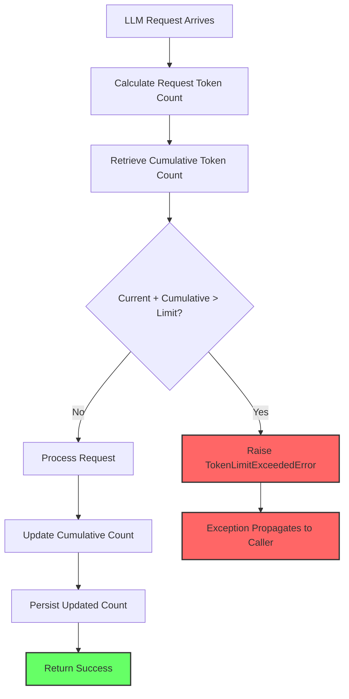

# Feature Specification: Token Count Validation and Tracking

**Feature Branch**: `011-token-counting`
**Created**: 2025-11-21
**Status**: Draft
**Input**: User description: "Create me a spec file that looks at a LLM request string, computes the number of LLM tokens in the string and compares the number of currently used tokens and if the total number of tokens is over a preconfigured value it raises an error. If not save the total count for next request comparison"

## Clarifications

### Session 2025-11-21
- Q: What is the scope for tracking token usage? → A: Per user - Budget tracked per user across all their requests
- Q: When a user exceeds their token limit, what should happen? → A: Raise exception - Internal service raises TokenLimitExceededError with structured error details (not HTTP response)
- Q: How often should user token counts reset? → A: Rolling window - Track tokens within last N hours/days (sliding window)
- Q: What should be the rolling window duration for tracking tokens? → A: a pre-configured window in seconds
- Q: Which tokenization standard should be used for counting tokens? → A: tiktoken (OpenAI) - Use OpenAI's tiktoken library for GPT models

### Clarification Impact Visualization

```mermaid
graph TD
    A[Clarification Session] --> B[Functional Scope]
    A --> C[Domain & Data Model]
    A --> D[Interaction & UX]
    A --> E[Non-Functional Quality]
    A --> F[Integration & Dependencies]

    B -->|Resolved| B1[Tracking Scope: Per User]
    B -->|Resolved| B2[Error Handling: Raise Exception]
    B -->|Resolved| B3[Reset Strategy: Rolling Window]

    C -->|Resolved| C1[User Entity with Budget]
    C -->|Resolved| C2[Request with Timestamp]
    C -->|Resolved| C3[Rolling Window in Seconds]

    D -->|Resolved| D1[Error Response Format]
    D -->|Resolved| D2[Usage Information Display]

    E -->|Resolved| E1[Tokenization: tiktoken]
    E -->|Deferred| E2[Performance Targets]

    F -->|Resolved| F1[OpenAI tiktoken Library]

    style B1 fill:#9f9,stroke:#333,stroke-width:2px
    style B2 fill:#9f9,stroke:#333,stroke-width:2px
    style B3 fill:#9f9,stroke:#333,stroke-width:2px
    style C1 fill:#9f9,stroke:#333,stroke-width:2px
    style C2 fill:#9f9,stroke:#333,stroke-width:2px
    style C3 fill:#9f9,stroke:#333,stroke-width:2px
    style D1 fill:#9f9,stroke:#333,stroke-width:2px
    style D2 fill:#9f9,stroke:#333,stroke-width:2px
    style E1 fill:#9f9,stroke:#333,stroke-width:2px
    style E2 fill:#ff9,stroke:#333,stroke-width:2px
    style F1 fill:#9f9,stroke:#333,stroke-width:2px
```



## Execution Flow (main)
```
1. Parse user description from Input
   → Valid feature description provided
2. Extract key concepts from description
   → Actors: System, LLM request processor
   → Actions: Compute tokens, compare counts, raise errors, track totals
   → Data: Request strings, token counts, configured limits
   → Constraints: Preconfigured threshold values
3. For each unclear aspect:
   → [NEEDS CLARIFICATION: Token counting algorithm/library to use]
   → [NEEDS CLARIFICATION: Scope of "currently used tokens" - per session, per user, per hour?]
   → [NEEDS CLARIFICATION: What happens after error is raised - block request or just warn?]
   → [NEEDS CLARIFICATION: Token count storage - where and how long to persist?]
   → [NEEDS CLARIFICATION: Multiple concurrent requests - how to handle race conditions?]
4. Fill User Scenarios & Testing section
   → User flow identified
5. Generate Functional Requirements
   → Each requirement is testable
   → Ambiguous requirements marked
6. Identify Key Entities
   → Entities identified
7. Run Review Checklist
   → WARN "Spec has uncertainties - see clarification markers"
8. Return: SUCCESS (spec ready for planning after clarifications)
```

---

## ⚡ Quick Guidelines
- ✅ Focus on WHAT users need and WHY
- ❌ Avoid HOW to implement (no tech stack, APIs, code structure)
- 👥 Written for business stakeholders, not developers

### Section Requirements
- **Mandatory sections**: Must be completed for every feature
- **Optional sections**: Include only when relevant to the feature
- When a section doesn't apply, remove it entirely (don't leave as "N/A")

### For AI Generation
When creating this spec from a user prompt:
1. **Mark all ambiguities**: Use [NEEDS CLARIFICATION: specific question] for any assumption you'd need to make
2. **Don't guess**: If the prompt doesn't specify something (e.g., "login system" without auth method), mark it
3. **Think like a tester**: Every vague requirement should fail the "testable and unambiguous" checklist item
4. **Common underspecified areas**:
   - User types and permissions
   - Data retention/deletion policies
   - Performance targets and scale
   - Error handling behaviors
   - Integration requirements
   - Security/compliance needs

---

## User Scenarios & Testing *(mandatory)*

### Primary User Story
As a system administrator managing LLM API costs, I need to monitor and control token usage across requests to prevent unexpected overages. When a request would exceed our configured token budget, the system should raise an exception to prevent the request from being processed.

As a developer working on the Nexus project, I need all token manager tests to be organized in a consistent directory structure that matches other agent_orchestrator module tests, so that tests are easy to find and the codebase follows a uniform organizational pattern.

### Acceptance Scenarios
1. **Given** a user's cumulative token count is at 8,000 and their configured limit is 10,000, **When** that user submits a new request with 1,500 tokens, **Then** the system should accept the request and update the user's cumulative count to 9,500
2. **Given** a user's cumulative token count is at 9,500 and their configured limit is 10,000, **When** that user submits a request with 1,000 tokens, **Then** the system should raise TokenLimitExceededError with details showing current usage (9,500), limit (10,000), and request tokens (1,000)
3. **Given** a user has a configured limit of 10,000 tokens, **When** that user submits a request with 12,000 tokens with no prior usage, **Then** the system should raise TokenLimitExceededError immediately indicating the single request exceeds their limit
4. **Given** multiple requests arrive simultaneously from the same user, **When** processing token counts, **Then** the system should accurately track that user's cumulative totals without double-counting or missing requests
5. **Given** multiple users are making requests, **When** tracking token counts, **Then** each user's cumulative count should be tracked independently
6. **Given** a user made a request 90,000 seconds ago and their rolling window is configured as 86,400 seconds (24 hours), **When** a new request arrives, **Then** the system should calculate cumulative usage excluding the 90,000-second-old request (automatically aged out of the window)
7. **Given** a user's requests are all within their configured rolling window, **When** calculating cumulative usage, **Then** all requests within the window should be counted toward their limit
8. **Given** different users have different rolling window configurations (e.g., User A: 3600 seconds, User B: 86400 seconds), **When** calculating token usage, **Then** each user's cumulative count should be calculated using their own window duration
9. **Given** token manager tests exist in the codebase, **When** developers look for token manager unit tests, **Then** they should find them under `tests/unit/agent_orchestrator/token_manager/` following the same pattern as other agent_orchestrator components
10. **Given** token manager tests have been reorganized, **When** the test suite is executed via `make test-all`, **Then** all token manager tests should be discovered and pass without import errors

### Edge Cases

**Handled in MVP**:
- **Encoding Failures**: When a request string cannot be tokenized (invalid format, encoding issues), the system raises TokenCalculationError (tested in T004)
- **Missing User Configuration**: When a new user has no token limit configured, the system raises UserTokenConfigNotFoundError (tested in T008)

**Deferred to Future Releases**:
- Config changes during request processing (requires distributed locking or versioning)
- Invalid/corrupted token count data recovery mechanisms
- Partial token rounding edge cases (tiktoken handles this internally)
- Storage unavailability and circuit breaker patterns
- Rolling window duration changes with historical data migration
- Clock skew and timestamp inconsistency handling (relies on NTP synchronization)

---

## Requirements *(mandatory)*

### Functional Requirements
- **FR-001**: System MUST calculate the token count for each incoming LLM request string using the OpenAI tiktoken library
- **FR-002**: System MUST maintain a cumulative count of tokens from previous requests
- **FR-003**: System MUST compare the sum of the current request's token count and the cumulative count against a preconfigured limit
- **FR-004**: System MUST raise TokenLimitExceededError when the total token count (current + cumulative) exceeds the configured limit
- **FR-005**: System MUST allow the request to proceed when the total token count is within the configured limit
- **FR-006**: System MUST update and persist the cumulative token count after each successful request
- **FR-007**: System MUST support configuration of the token limit value per user
- **FR-008**: System MUST track cumulative token counts separately for each user
- **FR-009**: TokenLimitExceededError MUST contain user_id, current_usage, token_limit, request_tokens, and a descriptive message explaining why the limit was exceeded
- **FR-010**: System MUST calculate cumulative token counts using a rolling time window with the following behaviors:
  - **FR-010a**: Only count tokens from requests within the configured window period
  - **FR-010b**: Automatically exclude tokens from requests that fall outside the rolling window when calculating current usage
  - **FR-010c**: Support per-user configuration of window duration in seconds (e.g., 3600 for 1 hour, 86400 for 24 hours)
- **FR-011**: System MUST handle concurrent requests without race conditions in token counting
- **FR-012**: System MUST validate that token usage records have non-negative token counts (the token_count field in TokenUsageRecord model must be ≥ 0, enforced via model validation). Note: This validates individual request token counts; overall token_limit validation is covered separately by FR-013.
- **FR-013**: System MUST reject configuration attempts where token_limit ≤ 0 (limits must be positive integers representing a valid budget)
- **FR-014**: System MUST allow configuration of the tokenization model name used for token counting (e.g., "gpt-4", "gpt-3.5-turbo") on a per-user basis
- **FR-015**: System MUST default to "gpt-4" model when no custom model configuration is provided (backward compatibility)
- **FR-016**: System MUST use tiktoken's default fallback encoding behavior when an unknown model name is configured (tiktoken automatically falls back to cl100k_base encoding for unknown models)

### Test Organization Requirements
- **FR-TEST-001**: All unit tests for the token manager MUST be located under `tests/unit/agent_orchestrator/token_manager/` directory
- **FR-TEST-002**: All integration tests for the token manager MUST be located under `tests/integration/agent_orchestrator/token_manager/` directory
- **FR-TEST-003**: Test organization MUST follow the same directory structure pattern used by other agent_orchestrator components (e.g., context_manager)
- **FR-TEST-004**: Test suite MUST remain fully executable after reorganization with no import errors or path issues
- **FR-TEST-005**: Test coverage MUST be preserved after test file reorganization

### Non-Functional Requirements
- **NFR-001**: Token calculation MUST complete within 50ms (p95) to avoid impacting request latency
- **NFR-002**: Token count storage MUST use PostgreSQL with ACID guarantees, survive application process restarts without data loss, and maintain data integrity through database-level durability (fsync enabled, write-ahead logging)
- **NFR-003**: System MUST accurately count tokens using the OpenAI tiktoken library and be compatible with GPT model tokenization standards
- **NFR-004**: Total token validation check MUST complete within 200ms (p95) including database query and token calculation

### Key Entities *(include if feature involves data)*
- **User**: The entity for which token usage is tracked; each user has their own budget and rolling window
- **Request**: Represents an incoming LLM request containing the text string to be tokenized, associated with a specific user and timestamp
- **TokenCount**: The calculated number of tokens for a specific request string
- **RequestTimestamp**: The time when a request was made, used to determine if it falls within the rolling window
- **RequestTextHash**: Optional SHA-256 hash of the request text, stored for debugging and deduplication purposes
- **CumulativeCount**: The sum of tokens from all requests by a user that fall within the rolling time window
- **TokenLimit**: The preconfigured maximum number of tokens allowed per user within the rolling window before raising an error
- **RollingWindow**: The time period (duration in seconds) over which token usage is tracked for each user; configurable per user

### Test Organization Entities
- **Unit Test Files**: Test files validating individual components in isolation
  - Currently at: `tests/unit/test_token_validation_service.py`, `tests/unit/test_token_usage_repository.py`, `tests/unit/test_token_models.py`
  - Target location: `tests/unit/agent_orchestrator/token_manager/`
- **Integration Test Files**: Test files validating end-to-end workflows and component interactions
  - Currently at: `tests/integration/test_token_validation_flow.py`, `tests/integration/test_concurrent_requests.py`, `tests/integration/test_rolling_window.py`, `tests/integration/test_generic_query_flow.py`
  - Target location: `tests/integration/agent_orchestrator/token_manager/`

---

## Visual Flow



---

## Review & Acceptance Checklist
*GATE: Automated checks run during main() execution*

### Content Quality
- [x] No implementation details (languages, frameworks, APIs)
- [x] Focused on user value and business needs
- [x] Written for non-technical stakeholders
- [x] All mandatory sections completed

### Requirement Completeness
- [x] No [NEEDS CLARIFICATION] markers remain
- [x] Requirements are testable and unambiguous
- [x] Success criteria are measurable
- [x] Scope is clearly bounded
- [x] Dependencies and assumptions identified

**All Clarifications Resolved**:
1. ✅ Token counting algorithm: tiktoken (OpenAI)
2. ✅ Scope: Per user tracking
3. ✅ Error handling: Raise TokenLimitExceededError (internal service)
4. ✅ Storage: PostgreSQL with 90-day retention
5. ✅ Concurrency: Database transactions with row-level locking
6. ✅ Configuration scope: Per user limits and windows
7. ✅ Error format: Exception with structured fields
8. ✅ Reset: Rolling window in configurable seconds
9. ✅ Performance: <50ms token calculation, <200ms total validation
10. ✅ Zero/negative limits: Rejected (must be positive)

---

## Execution Status
*Updated by main() during processing*

- [x] User description parsed
- [x] Key concepts extracted
- [x] Ambiguities marked
- [x] User scenarios defined
- [x] Requirements generated
- [x] Entities identified
- [x] Review checklist passed (with warnings)

---

## Next Steps

Before proceeding to planning phase:
1. Obtain clarification on all marked items
2. Define token tracking scope and boundaries
3. Specify performance and reliability targets
4. Determine error handling and user notification approach
5. Define configuration and management capabilities needed
