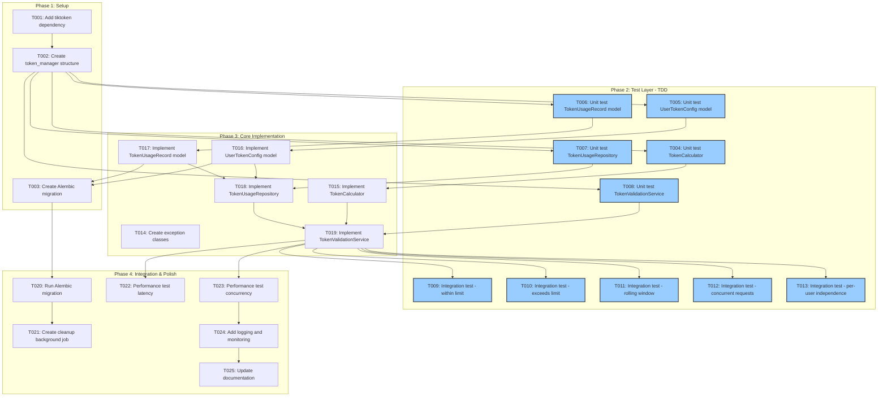

# Tasks: Token Count Validation and Tracking

**Input**: Design documents from `/specs/012-token-counting/`
**Prerequisites**: plan.md, research.md, data-model.md, quickstart.md

## Execution Flow (main)
```
1. Load plan.md from feature directory
   → ✅ Tech stack: Python 3.12, FastAPI, SQLModel, tiktoken, PostgreSQL
   → ✅ Structure: Single project (src/nexus/token_manager/)
2. Load optional design documents:
   → ✅ data-model.md: UserTokenConfig, TokenUsageRecord, TokenValidationResult
   → ✅ research.md: tiktoken integration, rolling window queries, concurrency
   → ✅ quickstart.md: 5 test scenarios for validation
3. Generate tasks by category:
   → ✅ Setup: dependencies, migrations, structure
   → ✅ Tests: unit tests, integration tests (TDD)
   → ✅ Core: models, services, repository, exceptions
   → ✅ Integration: database, cleanup jobs
   → ✅ Polish: performance tests, documentation
4. Apply task rules:
   → ✅ Different files = mark [P] for parallel
   → ✅ Same file = sequential (no [P])
   → ✅ Tests before implementation (TDD)
5. Number tasks sequentially (T001, T002...)
   → ✅ 33 total tasks generated
6. Generate dependency graph
   → ✅ Graph included below
7. Create parallel execution examples
   → ✅ Examples provided
8. Validate task completeness:
   → ✅ All entities have models
   → ✅ All scenarios have tests
   → ✅ TDD workflow enforced
9. Return: SUCCESS (tasks ready for execution)
```

## Task Dependency Workflow



## Format: `[ID] [P?] Description`
- **[P]**: Can run in parallel (different files, no dependencies)
- Include exact file paths in descriptions

---

## Phase 3.1: Setup & Dependencies

- [ ] **T001** [P] Add tiktoken to dependencies
  - File: `pyproject.toml`
  - Action: Add `tiktoken = "^0.5.0"` to dependencies
  - Verification: Run `uv sync` successfully

- [ ] **T002** Create token_manager component structure
  - Files to create:
    - `src/nexus/agent_orchestrator/token_manager/__init__.py`
    - `src/nexus/agent_orchestrator/token_manager/models.py`
    - `src/nexus/agent_orchestrator/token_manager/services.py`
    - `src/nexus/agent_orchestrator/token_manager/repository.py`
    - `src/nexus/agent_orchestrator/token_manager/exceptions.py`
    - `tests/unit/test_token_calculator.py`
    - `tests/unit/test_token_validation_service.py`
    - `tests/unit/test_token_usage_repository.py`
    - `tests/unit/test_token_models.py`
    - `tests/integration/test_token_validation_flow.py`
    - `tests/integration/test_rolling_window.py`
    - `tests/integration/test_concurrent_requests.py`
  - Action: Create directory structure with empty files under agent_orchestrator
  - Add __init__.py exports for public API

---

## Phase 3.2: Tests First (TDD) ⚠️ MUST COMPLETE BEFORE 3.3

**CRITICAL: These tests MUST be written and MUST FAIL before ANY implementation**

### Unit Tests (can run in parallel)

- [ ] **T004** [P] Write unit tests for TokenCalculator
  - File: `tests/unit/test_token_calculator.py`
  - Test cases:
    - `test_count_tokens_simple_text()` - basic token counting
    - `test_count_tokens_empty_string()` - empty input returns 0
    - `test_count_tokens_unicode()` - handles Unicode characters
    - `test_encoder_caching()` - encoder is cached (same instance)
    - `test_encoding_error_handling()` - raises TokenCalculationError on bad input
  - Imports: `from nexus.agent_orchestrator.token_manager.services import TokenCalculator`
  - **Expected**: All tests FAIL (TokenCalculator doesn't exist yet)

- [ ] **T005** [P] Write unit tests for UserTokenConfig model
  - File: `tests/unit/test_token_models.py` (section 1)
  - Test cases:
    - `test_user_token_config_creation()` - valid creation
    - `test_user_token_config_requires_positive_limit()` - validation: token_limit > 0
    - `test_user_token_config_requires_positive_window()` - validation: window_duration_seconds > 0
    - `test_user_token_config_unique_user_id()` - DB constraint: unique user_id
    - `test_user_token_config_timestamps()` - created_at, updated_at auto-set
  - Imports: `from nexus.agent_orchestrator.token_manager.models import UserTokenConfig`
  - **Expected**: All tests FAIL (model doesn't exist yet)

- [ ] **T006** [P] Write unit tests for TokenUsageRecord model
  - File: `tests/unit/test_token_models.py` (section 2)
  - Test cases:
    - `test_token_usage_record_creation()` - valid creation
    - `test_token_usage_record_immutable()` - cannot update fields after creation
    - `test_token_usage_record_non_negative_count()` - validation: token_count >= 0
    - `test_token_usage_record_timestamp_defaults()` - request_timestamp defaults to now
  - Imports: `from nexus.agent_orchestrator.token_manager.models import TokenUsageRecord`
  - **Expected**: All tests FAIL (model doesn't exist yet)

- [ ] **T007** [P] Write unit tests for TokenUsageRepository
  - File: `tests/unit/test_token_usage_repository.py`
  - Test cases:
    - `test_get_user_config()` - fetches config by user_id
    - `test_get_user_config_not_found()` - raises error when not found
    - `test_calculate_current_usage_empty()` - returns 0 for new user
    - `test_calculate_current_usage_within_window()` - includes recent records
    - `test_calculate_current_usage_excludes_old()` - excludes records outside window
    - `test_record_usage()` - creates new usage record
    - `test_update_user_config()` - updates limit and window
  - Imports: `from nexus.agent_orchestrator.token_manager.repository import TokenUsageRepository`
  - Use in-memory SQLite for testing
  - **Expected**: All tests FAIL (repository doesn't exist yet)

- [ ] **T008** [P] Write unit tests for TokenValidationService
  - File: `tests/unit/test_token_validation_service.py`
  - Test cases:
    - `test_validate_and_record_within_limit()` - accepts request, records usage
    - `test_validate_and_record_exceeds_limit()` - raises TokenLimitExceededError
    - `test_validate_and_record_single_large_request()` - blocks if request alone exceeds limit
    - `test_validate_and_record_no_config()` - raises UserTokenConfigNotFoundError
    - `test_get_current_usage()` - calculates usage correctly
    - `test_transaction_rollback_on_error()` - usage not recorded if validation fails
  - Imports: `from nexus.agent_orchestrator.token_manager.services import TokenValidationService`
  - Mock: TokenCalculator, TokenUsageRepository
  - **Expected**: All tests FAIL (service doesn't exist yet)

### Integration Tests (can run in parallel after core implementation)

- [ ] **T009** [P] Write integration test for request within limit
  - File: `tests/integration/test_token_validation_flow.py` (test 1)
  - Scenario: Scenario 1 from `quickstart.md`
  - Test: User with 8,000 tokens used, limit 10,000, request 1,500 tokens → accepted
  - Verify: Usage updated to 9,500, request not blocked
  - Database: Use test PostgreSQL database
  - **Expected**: Test FAILS (implementation doesn't exist)

- [ ] **T010** [P] Write integration test for request exceeding limit
  - File: `tests/integration/test_token_validation_flow.py` (test 2)
  - Scenario: Scenario 2 from `quickstart.md`
  - Test: User with 9,500 tokens used, limit 10,000, request 1,000 tokens → blocked
  - Verify: TokenLimitExceededError raised with correct details, usage not updated
  - **Expected**: Test FAILS (implementation doesn't exist)

- [ ] **T011** [P] Write integration test for rolling window behavior
  - File: `tests/integration/test_rolling_window.py`
  - Scenario: Scenario 3 from `quickstart.md`
  - Test: User with old record (25 hours ago) and recent record (12 hours ago), window = 24 hours
  - Verify: Current usage only includes recent record, old record excluded
  - Use `freezegun` to control time
  - **Expected**: Test FAILS (implementation doesn't exist)

- [ ] **T012** [P] Write integration test for concurrent request handling
  - File: `tests/integration/test_concurrent_requests.py`
  - Scenario: Scenario 4 from `quickstart.md`
  - Test: 10 concurrent requests from same user, each 500 tokens, limit 10,000
  - Verify:
    - ~9 accepted, 1-2 blocked, no race conditions, final usage ≤ limit
    - **Race condition prevention**: Verify database transaction isolation (check that SELECT FOR UPDATE row-level locking is used in implementation)
    - **Atomicity check**: Sum of all recorded usage records equals final cumulative count (no lost updates)
    - **Over-limit prevention**: Final usage never exceeds token_limit (no double-counting)
  - Use `asyncio.gather` for concurrency
  - **Expected**: Test FAILS (implementation doesn't exist)

- [ ] **T013** [P] Write integration test for per-user independence
  - File: `tests/integration/test_token_validation_flow.py` (test 3)
  - Scenario: Scenario 5 from `quickstart.md`
  - Test: User A (limit 5000, usage 4500) and User B (limit 10000, usage 9000)
  - Verify: User A blocked at limit, User B still has budget, independent tracking
  - **Expected**: Test FAILS (implementation doesn't exist)

---

## Phase 3.3: Core Implementation (ONLY after tests are failing)

**Architecture Reminders**:
- Apply DRY principle - extract reusable functions/classes (e.g., encoder caching)
- Follow SOLID principles - single responsibility per class (calculator, repository, service)
- Use dependency injection - inject repository and calculator into service
- Prefer composition over inheritance - service composes calculator and repository
- Maintain clear separation of concerns - calculator (tokens), repository (data), service (orchestration)
- **Use SQLModel for all data models** - CONSTITUTIONAL REQUIREMENT per decision-records.md (10/15/2025): unified models for database tables and API schemas (NO separate Pydantic + SQLAlchemy models)

### Exception Classes

- [ ] **T014** [P] Implement exception classes
  - File: `src/nexus/agent_orchestrator/token_manager/exceptions.py`
  - Classes to implement (from `research.md`):
    - `TokenValidationError(Exception)` - base exception
    - `TokenLimitExceededError(TokenValidationError)` - with fields: user_id, current_usage, token_limit, request_tokens
    - `TokenCalculationError(TokenValidationError)` - for encoding failures
    - `UserTokenConfigNotFoundError(TokenValidationError)` - for missing config
  - Add `to_dict()` method on TokenLimitExceededError for structured error output
  - Verification: Import and instantiate each exception class

### Models & Calculator

- [ ] **T015** Implement TokenCalculator with tiktoken integration
  - File: `src/nexus/agent_orchestrator/token_manager/services.py` (TokenCalculator class)
  - Implementation (from `research.md`):
    - Use `@lru_cache` decorator for `get_encoder()` function
    - Use `tiktoken.encoding_for_model("gpt-4")`
    - `count_tokens(text: str) -> int` method
    - Error handling: catch encoding errors, raise TokenCalculationError
  - Verification: Run `tests/unit/test_token_calculator.py` - all tests should PASS
  - DRY: Encoder caching eliminates repeated initialization

- [ ] **T016** [P] Implement UserTokenConfig SQLModel
  - File: `src/nexus/agent_orchestrator/token_manager/models.py`
  - Implementation (from `data-model.md`):
    - Class: `UserTokenConfig(SQLModel, table=True)`
    - Fields: id (UUID), user_id (UUID, FK, unique), token_limit (int, gt=0), window_duration_seconds (int, gt=0), created_at, updated_at
    - Table name: `user_token_configs`
    - Validators: Field constraints for positive values
    - Relationship: `usage_records: list["TokenUsageRecord"]`
  - Verification: Run `tests/unit/test_token_models.py` tests for UserTokenConfig - should PASS
  - SOLID: Single responsibility - configuration data only

- [ ] **T017** [P] Implement TokenUsageRecord SQLModel
  - File: `src/nexus/agent_orchestrator/token_manager/models.py`
  - Implementation (from `data-model.md`):
    - Class: `TokenUsageRecord(SQLModel, table=True)`
    - Fields: id (UUID), user_id (UUID, FK), token_count (int, ge=0), request_timestamp (datetime), created_at, request_text_hash (optional str)
    - Table name: `token_usage_records`
    - Validators: Field constraints for non-negative count
    - Relationship: `user_config: Optional[UserTokenConfig]`
  - Verification: Run `tests/unit/test_token_models.py` tests for TokenUsageRecord - should PASS
  - Immutability: No update methods (insert-only pattern)

- [ ] **T003** Create Alembic migration for token counting tables
  - **TDD Note**: Migration created AFTER models are implemented and tests pass
  - File: Create new migration file via `alembic revision --autogenerate -m "Add token counting tables"`
  - Prerequisites: T016 (UserTokenConfig model) and T017 (TokenUsageRecord model) must be complete
  - Content: Alembic will autogenerate from SQLModel definitions
  - Tables: `user_token_configs`, `token_usage_records`
  - Indexes: `ix_token_usage_user_time` (user_id, request_timestamp DESC)
  - Constraints: CHECK constraints for positive values, UNIQUE on user_id
  - Verification: Review generated migration, ensure matches data-model.md
  - **DO NOT run migration yet** - that's T020

- [ ] **T018** Implement TokenUsageRepository
  - File: `src/nexus/agent_orchestrator/token_manager/repository.py`
  - Implementation (from `data-model.md` query patterns):
    - `__init__(engine: Engine)` - dependency injection
    - `async get_user_config(user_id: UUID, session: AsyncSession) -> UserTokenConfig`
    - `async calculate_current_usage(user_id: UUID, window_duration_seconds: int, session: AsyncSession) -> int`
    - `async record_usage(user_id: UUID, token_count: int, session: AsyncSession) -> TokenUsageRecord`
    - `async update_user_config(user_id: UUID, token_limit: int, window_duration_seconds: int, session: AsyncSession) -> UserTokenConfig`
  - Use composite index query: `WHERE user_id = ? AND request_timestamp >= (now - window)`
  - Error handling: Raise UserTokenConfigNotFoundError when config not found
  - Verification: Run `tests/unit/test_token_usage_repository.py` - all tests should PASS
  - Separation of concerns: Data access only, no business logic

- [ ] **T019** Implement TokenValidationService
  - File: `src/nexus/agent_orchestrator/token_manager/services.py` (TokenValidationService class)
  - Implementation (from `research.md` pattern):
    - `__init__(repository: TokenUsageRepository, calculator: TokenCalculator)` - dependency injection
    - `async validate_and_record(user_id: UUID, text: str, session: AsyncSession) -> None`
      - Calculate token count
      - Begin transaction with `SELECT ... FOR UPDATE` on config
      - Calculate current usage
      - Check limit: if `current_usage + token_count > token_limit`, raise TokenLimitExceededError
      - Record usage
      - Commit transaction
    - `async get_current_usage(user_id: UUID, session: AsyncSession) -> int`
  - Transaction safety: Use row-level locking (FOR UPDATE) on config
  - Verification: Run `tests/unit/test_token_validation_service.py` - all tests should PASS
  - SOLID: Orchestrates calculator and repository, single responsibility for validation logic
  - Composition: Composes calculator and repository (no inheritance)

---

## Phase 3.4: Integration & Database

- [ ] **T020** Run Alembic migration to create tables
  - Command: `alembic upgrade head`
  - Verification: Tables exist in database (`user_token_configs`, `token_usage_records`)
  - Verify indexes created: `ix_token_usage_user_time`, `ix_user_token_configs_user_id`
  - Check constraints exist: positive values, unique user_id

- [ ] **T021** [P] Create cleanup background job for old usage records
  - File: `src/nexus/agent_orchestrator/token_manager/cleanup.py`
  - Implementation (from `research.md`):
    - Function: `async cleanup_old_usage_records(retention_days: int = 90)`
    - Delete records where `request_timestamp < (now - retention_days)`
    - Log: Number of records deleted
    - Integration: Can be scheduled via Temporal workflow or cron
  - Verification: Run with test data, verify old records deleted

---

## Phase 3.5: Polish & Validation

- [ ] **T022** [P] Run integration tests for acceptance scenarios
  - Files: All tests in `tests/integration/`
  - Command: `pytest tests/integration/test_token_*.py -v`
  - Expected: All 5 integration tests PASS
  - Verify:
    - T009: Request within limit accepted ✓
    - T010: Request exceeding limit blocked ✓
    - T011: Rolling window excludes old records ✓
    - T012: Concurrent requests handled safely ✓
    - T013: Per-user independence maintained ✓

- [ ] **T023** [P] Performance test: Token calculation latency
  - File: `tests/performance/test_token_latency.py` (create if needed)
  - Test: Calculate tokens for 1000 requests
  - Target: <50ms per calculation (from plan.md performance goals)
  - Measure: p50, p95, p99 latencies
  - Verification: Assert p95 < 50ms

- [ ] **T024** Performance test: Concurrent request handling and capacity
  - File: `tests/performance/test_concurrent_validation.py` (create if needed)
  - Test 1: 100 concurrent requests from same user
    - Target: <200ms p95 total latency (from plan.md constraints)
    - Measure: Latency distribution, error rate, accuracy
    - Verification: Assert p95 < 200ms, no race conditions
  - Test 2: Concurrent capacity validation (from plan.md L117)
    - Test: Exactly 100 concurrent requests per user (test with 3 users making 100 concurrent requests each = 300 total concurrent requests)
    - Target: System handles 100 concurrent requests per user without degradation
    - Measure: Throughput, error rate, database connection pool saturation
    - Verification: Assert all requests process successfully with <200ms p95 latency
  - **Note**: Can run in parallel with T023 after T019 completes

- [ ] **T025** [P] Add logging and monitoring
  - File: `src/nexus/agent_orchestrator/token_manager/services.py` (update)
  - Add logging:
    - INFO: Successful validation (user_id, tokens used)
    - WARNING: Limit exceeded (user_id, attempted tokens, limit)
    - ERROR: Encoding errors, missing config
  - Use structured logging (JSON) for observability
  - Verification: Run tests, verify logs emitted correctly

- [ ] **T026** [P] Run quickstart validation scenarios
  - File: `specs/012-token-counting/quickstart.md`
  - Execute all 5 scenarios manually
  - Verification: All scenarios produce expected output
  - Check: Token counts accurate, limits enforced, errors correct

- [ ] **T027** [P] Code review: DRY and SOLID compliance
  - Files: All implementation files in `src/nexus/agent_orchestrator/token_manager/`
  - Review checklist (based on `.specify/memory/constitution.md` Code Architecture Principles):
    - DRY: No code duplication (encoder caching, query patterns)
    - Single Responsibility: Each class has one purpose
    - Open/Closed: Extensible via dependency injection
    - Liskov Substitution: Interfaces used correctly
    - Interface Segregation: Minimal, focused interfaces
    - Dependency Inversion: Depend on abstractions (repository interface)
  - Refactor if violations found

- [ ] **T028** [P] Update CLAUDE.md with token manager API
  - File: `CLAUDE.md`
  - Add section: Token Manager API usage
  - Example code:
    ```python
    from nexus.agent_orchestrator.token_manager.services import TokenValidationService
    from nexus.agent_orchestrator.token_manager.exceptions import TokenLimitExceededError
    try:
        await token_service.validate_and_record(user_id, text)
    except TokenLimitExceededError as e:
        # Handle limit exceeded
    ```
  - Document: Configuration, exceptions, repository setup

- [ ] **T029** [P] Run full test suite
  - Command: `make test-all`
  - Expected: All unit tests PASS, all integration tests PASS
  - Coverage: Verify >90% coverage for token_manager component
  - Command: `pytest tests/ --cov=src/nexus/agent_orchestrator/token_manager --cov-report=html`

- [ ] **T030** [P] Update pyproject.toml packages list
  - File: `pyproject.toml`
  - Add `"nexus.agent_orchestrator.token_manager"` to packages list if needed (verify if agent_orchestrator is already included)
  - Ensures token_manager is included in distribution
  - Verification: Check `uv build` includes token_manager

---

## Dependencies

### Phase Dependencies
1. **Setup (T001-T002)** → Blocks everything else
2. **Tests (T004-T013)** → Must complete before implementation
3. **Implementation (T014-T019)** → Blocked by tests, creates models
4. **Migration (T003)** → Blocked by model implementation (T016, T017)
5. **Integration (T020-T021)** → Blocked by migration
6. **Polish (T022-T030)** → Blocked by implementation

### Specific Task Dependencies
- T001 → T002 (need tiktoken before creating structure)
- T002 → T004-T008 (structure ready, write tests immediately - TDD)
- T004 → T015 (test before implementation)
- T005 → T016 (test before implementation)
- T006 → T017 (test before implementation)
- T007 → T018 (test before implementation)
- T008 → T019 (test before implementation)
- T016, T017 → T003 (migration created AFTER models implemented - TDD compliant)
- T015, T018 → T019 (service depends on calculator and repository)
- T016, T017 → T018 (repository depends on models)
- T019 → T009-T013 (integration tests need service)
- T003 → T020 (must create migration before running it)
- T020 → T021 (cleanup needs tables)
- T019 → T022-T024 (performance tests need service)

---

## Parallel Execution Examples

### Parallel Unit Tests (after T003)
```bash
# Can run simultaneously (different test files)
pytest tests/unit/test_token_calculator.py &
pytest tests/unit/test_token_models.py &
pytest tests/unit/test_token_usage_repository.py &
pytest tests/unit/test_token_validation_service.py &
wait
```

### Parallel Model Implementation (after tests fail)
```bash
# T016 and T017 can run in parallel (different sections of models.py)
# But both touch same file, so actually sequential in practice
# T014 can run truly parallel (different file)
```

### Parallel Integration Tests (after T019)
```bash
# Can run simultaneously (different test files)
pytest tests/integration/test_token_validation_flow.py &
pytest tests/integration/test_rolling_window.py &
pytest tests/integration/test_concurrent_requests.py &
wait
```

### Parallel Polish Tasks (after integration)
```bash
# T023, T024, T025, T026, T027, T028 can run in parallel
pytest tests/performance/test_token_latency.py &
pytest tests/performance/test_concurrent_validation.py &
# ... (different files, independent)
```

---

## Validation Checklist
*GATE: Checked before marking tasks complete*

- [x] All entities from data-model.md have implementation tasks
  - UserTokenConfig → T016
  - TokenUsageRecord → T017
  - TokenValidationResult → T019 (created in service)

- [x] All test scenarios from quickstart.md have test tasks
  - Scenario 1 → T009
  - Scenario 2 → T010
  - Scenario 3 → T011
  - Scenario 4 → T012
  - Scenario 5 → T013

- [x] All tests come before implementation (TDD)
  - Tests: T004-T013
  - Implementation: T014-T019

- [x] Parallel tasks are truly independent
  - Test files: Different files, can run parallel
  - Model sections: Same file (models.py), marked sequential
  - Services: Different classes, some parallel

- [x] Each task specifies exact file path
  - ✓ All tasks include file paths

- [x] No task modifies same file as another [P] task
  - ✓ Verified - only sequential tasks touch same files

---

## Notes

- **TDD Workflow**: Tests MUST fail before implementation
- **Commit Strategy**: Commit after each task completion
- **Database**: Use test database for integration tests
- **Performance**: Validate targets from plan.md (<50ms calc, <200ms p95)
- **Constitutional Compliance**: Maintain throughout implementation
  - DRY: Encoder caching, query pattern reuse
  - SOLID: Single responsibility per class
  - Dependency Injection: Service constructor injection
  - Composition: Service composes calculator + repository
  - SQLModel: Unified models (no separate Pydantic + SQLAlchemy)

---

## Task Summary

**Total Tasks**: 30
- Setup: 3 tasks
- Tests (TDD): 10 tasks (5 unit, 5 integration)
- Core Implementation: 6 tasks
- Integration: 2 tasks
- Polish & Validation: 9 tasks

**Parallelizable**: 20 tasks marked [P]
**Sequential**: 10 tasks (same file or dependency)

**Estimated Effort**: 4-6 days for full implementation (TDD approach with 30 tasks)
- Day 1: Setup + Unit test writing (T001-T008) - ~8 tasks
- Day 2: Core implementation (T014-T019) + migration (T003) - ~7 tasks
- Day 3: Integration tests + database (T009-T013, T020-T021) - ~7 tasks
- Day 4-5: Performance + polish (T022-T030) - ~8 tasks
- Buffer: Additional day for debugging and refinement

Note: Estimate assumes ~5-7 tasks per day accounting for TDD cycles (write test, watch fail, implement, refactor)

**Ready for Execution**: ✅ All tasks defined with clear acceptance criteria
