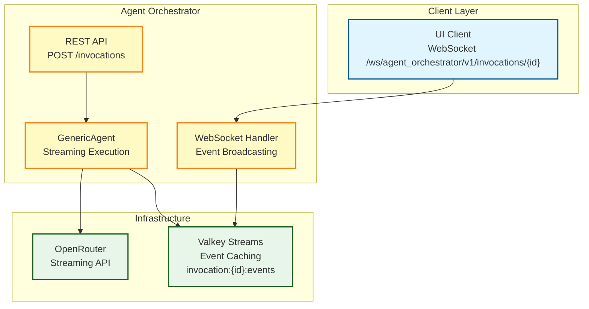

# Implementation Plan: Adaptor Streaming

**Branch**: `013-adaptor-streaming` | **Date**: 2025-11-13 | **Spec**: [jira-AAP-58160.txt](./jira-AAP-58160.txt)
**Input**: User story from `/specs/013-adaptor-streaming/jira-AAP-58160.txt` + Agent Orchestrator API + WebSocket Router specs

## Execution Flow (/plan command scope)

```
1. Load feature spec from Input path
   → If not found: ERROR "No feature spec at {path}"
2. Fill Technical Context (scan for NEEDS CLARIFICATION)
   → Detect Project Type from context (web=frontend+backend, mobile=app+api)
   → Set Structure Decision based on project type
3. Fill the Constitution Check section based on the content of the constitution document.
4. Evaluate Constitution Check section below
   → If violations exist: Document in Complexity Tracking
   → If no justification possible: ERROR "Simplify approach first"
   → Update Progress Tracking: Initial Constitution Check
5. Execute Phase 0 → research.md
   → If NEEDS CLARIFICATION remain: ERROR "Resolve unknowns"
6. Execute Phase 1 → contracts, data-model.md, quickstart.md, agent-specific template file (e.g., `CLAUDE.md` for Claude Code, `.github/copilot-instructions.md` for GitHub Copilot, `GEMINI.md` for Gemini CLI, `QWEN.md` for Qwen Code or `AGENTS.md` for opencode).
7. Re-evaluate Constitution Check section
   → If new violations: Refactor design, return to Phase 1
   → Update Progress Tracking: Post-Design Constitution Check
8. Plan Phase 2 → Describe task generation approach (DO NOT create tasks.md)
9. STOP - Ready for /tasks command
```

**IMPORTANT**: The /plan command STOPS at step 8. Phases 2-4 are executed by other commands:

- Phase 2: /tasks command creates tasks.md
- Phase 3-4: Implementation execution (manual or via tools)

## Summary

The Adaptor Streaming feature implements progressive LLM response streaming for the Agent Orchestrator. Users can see partial results in real-time as deltas are generated, providing better user experience for long-running queries. The implementation integrates with OpenRouter's streaming API, forwards deltas via WebSocket events stored in Valkey Streams, and ensures stable connections during long outputs.

**Key Components:**
- GenericAgent streaming integration with LangChain or LangGraph backends
- WebSocket event emission for delta delivery
- Valkey Streams for event caching and multi-client replay
- Connection stability and graceful cancellation handling

## Architecture Overview



## Technical Context

**Language/Version**: Python 3.12+
**Primary Dependencies**: LangGraph or LangChain, OpenRouter API, Valkey, FastAPI WebSockets
**Storage**: Valkey Streams for event caching (with TTL)
**Testing**: pytest with async WebSocket testing
**Target Platform**: Linux server (containerized deployment)
**Project Type**: backend API service (streaming enhancement)
**Performance Goals**:

- Delta streaming latency: <100ms p95 from LLM to client
- Connection stability: 99.9% uptime during long outputs
- Valkey event delivery: <10ms p95
- Memory usage: <50MB per concurrent streaming invocation

**Constraints**:
- Must integrate with existing GenericAgent architecture
- WebSocket events must support multi-client replay
- Backward compatibility with existing REST API responses
- Graceful handling of LLM API timeouts and cancellations

**Scale/Scope**:
- Support 100+ concurrent streaming invocations
- Immediate delta delivery (no batching or buffering)
- Full event history replay for late-joining clients
- Integration with existing Valkey infrastructure

## Constitution Check

_GATE: Must pass before Phase 0 research. Re-check after Phase 1 design._

### I. Modular Architecture

✅ **PASS** - Adaptor Streaming designed as enhancement to existing modules:

- Extends GenericAgent with streaming capabilities
- Integrates with existing WebSocket infrastructure
- Uses existing Valkey Streams for event storage
- No breaking changes to existing API contracts

### II. Test-Driven Development

✅ **PASS** - TDD approach planned:

- Contract tests for WebSocket streaming events
- Unit tests for delta streaming logic
- Integration tests for end-to-end streaming flow
- Performance tests for streaming latency and stability
- Tests written before implementation

### III. Explicit Configuration

✅ **PASS** - Configuration externalized:

- Valkey connection settings (existing)
- Streaming timeout configurations
- Event TTL settings (24h default)
- OpenRouter streaming parameters
- No hardcoded streaming behavior

### IV. Observability First

✅ **PASS** - Observability integrated:

- Structured logging for streaming events
- Metrics for streaming performance and errors
- WebSocket connection health monitoring
- Delta delivery success/failure tracking
- Integration with existing monitoring infrastructure

### V. API Stability

✅ **PASS** - API versioning and stability:

- WebSocket endpoint follows router pattern `/ws/agent_orchestrator/v1/invocations/{id}`
- Event message formats documented and versioned
- REST API enhanced (POST returns immediately)
- Error handling: No automatic server retry; clients handle retry logic for failed streams

### Code Quality Requirements

✅ **PASS** - Quality standards planned:

- Linting: ruff for Python
- Type checking: mypy with strict mode
- Code coverage: 80% minimum (unit tests)
- Async code follows established patterns

### Code Style Standards

✅ **PASS** - Style standards defined:

- snake_case for Python (PEP 8)
- Async function naming follows project conventions
- Error handling consistent with existing codebase
- WebSocket event naming follows established patterns

### Documentation Standards

✅ **PASS** - Documentation planned:

- Docstrings for all new streaming functions
- WebSocket event schema documentation
- Integration guide for streaming clients
- Performance characteristics documented

## Project Structure

### Documentation (this feature)

```
specs/013-adaptor-streaming/
├── plan.md                    # This file (/plan command output)
├── research.md                 # Phase 0 output (/plan command)
├── data-model.md              # Phase 1 output (/plan command)
├── contracts/                 # Phase 1 output (/plan command)
│   └── [moved to schemas/]     # Event schema definitions moved
├── quickstart.md              # Phase 1 output (/plan command)
└── tasks.md                   # Phase 2 output (/tasks command - NOT created by /plan)
```

### Source Code (repository root)

```
src/
├── nexus/
│   ├── agent_orchestrator/
│   │   ├── agents/
│   │   │   └── generic_agent.py                    # MODIFIED: Add streaming support
│   │   └── services/
│   │       ├── streaming_service.py                # NEW: WebSocket streaming service
│   │       └── error_handler.py                    # NEW: Streaming error handling
│   ├── ws/
│   │   └── agent_orchestrator.py                   # NEW: WebSocket handler for streaming
│   └── core/
│       ├── valkey/
│       │   └── stream.py                           # NEW: Valkey stream client
│       └── websocket/
│           └── close_codes.py                      # NEW: WebSocket close codes
└── tests/
    ├── unit/
    │   └── agent_orchestrator/
    │       └── test_streaming.py                   # Streaming unit tests
    ├── integration/
    │   └── websocket/
    │       └── test_websocket_streaming.py         # End-to-end streaming tests
    └── contract/
        └── test_streaming_events.py                # WebSocket event schema tests
```

**Structure Decision**: backend API service (streaming enhancement) - Extends existing agent orchestrator with streaming capabilities.

## Phase 0: Outline & Research

1. **Extract unknowns from Technical Context** above:

   - ✅ OpenRouter streaming API capabilities confirmed (supports delta-by-delta streaming)
   - ✅ LangChain and LangGraph ChatOpenAI streaming integration verified
   - ✅ Valkey Streams for event caching confirmed (with TTL)
   - ✅ WebSocket infrastructure exists (needs endpoint implementation)
   - ✅ GenericAgent modification scope defined

2. **Research areas completed**:

   - ✅ LangChain/LangGraph streaming patterns with ChatOpenAI
   - ✅ OpenRouter streaming API integration
   - ✅ Valkey Streams event caching strategy
   - ✅ WebSocket event emission patterns
   - ✅ Connection stability for long-running streams
   - ✅ Multi-client event replay scenarios

3. **Consolidated findings** in `research.md`:
   - All technical decisions documented with rationale
   - Alternatives considered and rejected
   - Performance characteristics analyzed
   - Integration points with existing systems identified

**Output**: ✅ research.md complete (all NEEDS CLARIFICATION resolved)

## Phase 1: Design & Contracts

_Prerequisites: research.md complete_

1. **Extract entities from feature spec** → `data-model.md`:

   - ✅ Streaming event types (delta, completion, error, cancelled)
   - ✅ WebSocket connection lifecycle
   - ✅ Valkey stream data structures
   - ✅ Event replay strategies
   - ✅ Delta streaming state management
   - ✅ No database schema changes required

2. **Generate API contracts** from functional requirements:

   - ✅ WebSocket event schemas (delta streaming events)
   - ✅ Event message formats with validation
   - ✅ Connection protocol specifications
   - ✅ Error handling schemas

3. **Generate contract tests** from contracts:

   - [x] Contract tests to be created in /tasks phase
   - Tests will validate WebSocket event schemas
   - Tests will fail initially (no implementation yet)

4. **Extract test scenarios** from user stories:

   - [x] Integration test scenarios to be created in /tasks phase
   - Each acceptance scenario → integration test
   - End-to-end streaming validation
   - Multi-client synchronization testing

5. **Update agent file incrementally** (O(1) operation):
   - [ ] Run `.specify/scripts/bash/update-agent-context.sh claude`
   - Add new tech from current plan
   - Keep under 150 lines for content efficiency

**Output**: ✅ data-model.md, ✅ src/nexus/schemas/agent_orchestrator/websocket-adaptor_streaming.yaml, [ ] failing tests (Phase 2), [ ] quickstart.md (Phase 2), [ ] CLAUDE.md (Phase 2)

## Phase 2: Task Planning Approach

_This section describes what the /tasks command will do - DO NOT execute during /plan_

**Task Generation Strategy**:

- Load `.specify/templates/tasks-template.md` as base
- Generate tasks from Phase 1 design docs (contracts, data model, quickstart)
- Each WebSocket event type → contract test task [P]
- Each streaming component → unit test task [P]
- Integration tasks for end-to-end streaming flows

**Ordering Strategy**:

- TDD order: Tests before implementation
- Dependency order: Core streaming logic → WebSocket integration → Event caching
- Mark [P] for parallel execution (independent files)

**Key Task Categories**:

1. **Contract Tests** (Phase 1 - tests that fail initially):
   - Test WebSocket delta event schema
   - Test event replay from Valkey Streams
   - Test connection stability during streaming
   - Test graceful cancellation handling

2. **Core Streaming Components**:
   - GenericAgent streaming integration
   - LangChain/LangGraph streaming configuration
   - OpenRouter streaming API setup
   - Delta emission logic
   - Invocation status management (created → running → completed/failed/cancelled)

3. **WebSocket Infrastructure**:
   - Invocation WebSocket handler creation
   - Event broadcasting to connected clients
   - Connection lifecycle management
   - Multi-client synchronization

4. **Valkey Integration**:
   - Event stream publishing
   - Event replay for late-joining clients
   - Stream TTL management
   - Performance optimization

5. **Integration Tests**:
   - End-to-end streaming flow (LLM → WebSocket → Client)
   - Multi-client event synchronization
   - Long-running stream stability
   - Cancellation and error handling
   - Status transitions during streaming lifecycle

**Estimated Output**: 25-30 numbered, ordered tasks in tasks.md

**IMPORTANT**: This phase is executed by the /tasks command, NOT by /plan

## Phase 3+: Future Implementation

_These phases are beyond the scope of the /plan command_

**Phase 3**: Task execution (/tasks command creates tasks.md)
**Phase 4**: Implementation (execute tasks.md following constitutional principles)
**Phase 5**: Validation (run tests, execute quickstart.md, performance validation)

## Complexity Tracking

_Fill ONLY if Constitution Check has violations that must be justified_

No violations - all constitutional principles satisfied.

## Progress Tracking

_This checklist is updated during execution flow_

**Phase Status**:

- [x] Phase 0: Research complete (/plan command)
- [x] Phase 1: Design complete (/plan command)
- [x] Phase 2: Task planning complete (/plan command - describe approach only)
- [ ] Phase 3: Tasks generated (/tasks command)
- [ ] Phase 4: Implementation complete
- [ ] Phase 5: Validation passed

**Gate Status**:

- [x] Initial Constitution Check: PASS
- [x] Post-Design Constitution Check: PASS
- [x] All NEEDS CLARIFICATION resolved
- [x] Complexity deviations documented (N/A - no deviations)

---

_Based on Constitution v1.0.0 - See `.specify/memory/constitution.md`_
