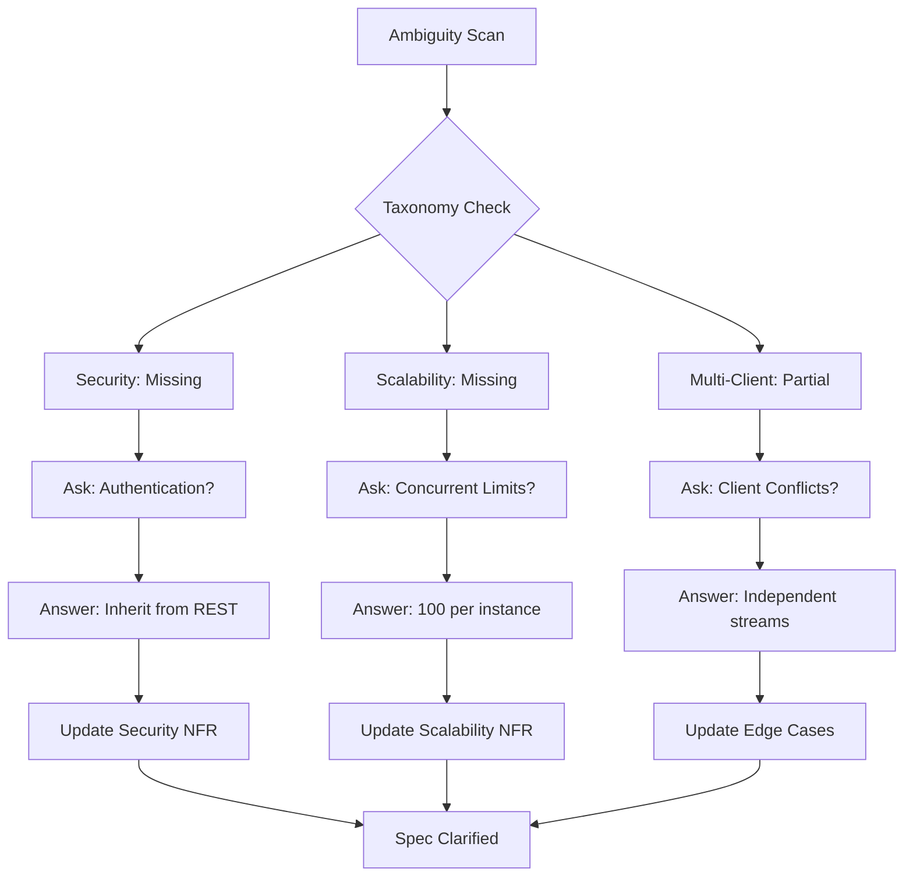

# Feature Specification: Adaptor Streaming

**Feature Branch**: `013-adaptor-streaming`
**Created**: 2025-11-13
**Status**: Draft
**Input**: User story from `jira-AAP-58160.txt`

## Overview

The Adaptor Streaming feature enables progressive LLM response delivery for the Agent Orchestrator. Users receive partial results in real-time as content is generated, providing immediate feedback and better user experience for long-running queries. The system supports real-time streaming, connection resilience, and historical replay for clients that join late or reconnect after interruptions.

## Architectural Position & Core Responsibilities

**Real-Time Delta Streaming**: The system provides delta-by-delta delivery of LLM responses, allowing clients to display partial results as they are generated rather than waiting for complete responses.

**Event-Driven Communication**: Streaming events are persisted for multi-client synchronization, enabling late-joining clients to receive historical events and all clients to stay synchronized.

**Connection Management**: The system supports reconnection with configurable history replay, ensuring clients can resume streaming even after temporary network interruptions.

**State Management**: The system maintains ephemeral streaming state during active LLM generation while persisting event history for replay and debugging.

## Execution Flow (main)

```
1. Parse user description from Input
   • If empty: ERROR "No feature description provided"
2. Extract key concepts from description
   • Identify: actors, actions, data, constraints
3. For each unclear aspect:
   • Mark with [NEEDS CLARIFICATION: specific question]
4. Fill User Scenarios & Testing section
   • If no clear user flow: ERROR "Cannot determine user scenarios"
5. Generate Functional Requirements
   • Each requirement must be testable
   • Mark ambiguous requirements
6. Identify Key Entities (if data involved)
7. Run Review Checklist
   • If any [NEEDS CLARIFICATION]: WARN "Spec has uncertainties"
   • If implementation details found: ERROR "Remove tech details"
8. Return: SUCCESS (spec ready for planning)
```

---

## User Scenarios & Testing

### Primary User Story

As a user, I want LLM responses to stream back progressively so that I can see partial results in real time. When I submit a complex query that takes time to process, I want to see content appearing as it is generated rather than waiting for the complete response. This provides immediate feedback that the system is working and allows me to start reading/understanding the response sooner. The API returns immediately for optimal performance.

### Acceptance Scenarios

1. **Given** I submit a long query to the agent orchestrator, **When** the LLM begins generating a response, **Then** I receive delta-by-delta updates in real-time until the response is complete.

2. **Given** I'm connected to a streaming invocation, **When** another client connects to the same invocation, **Then** the new client receives historical events and continues with live streaming.

3. **Given** my connection is interrupted during streaming, **When** I reconnect, **Then** I can choose to receive recent events for context and continue with live streaming.

4. **Given** an invocation has completed, **When** I connect to view the results, **Then** I receive all historical events and the connection closes cleanly.

5. **Given** streaming encounters an error, **When** the error occurs, **Then** all connected clients receive an error event with error classification (retryable or non-retryable) and the stream terminates gracefully.

6. **Given** I receive an error event marked as retryable (e.g., rate limit, temporary network issue), **When** I want to retry the request, **Then** I must submit a new invocation request rather than reconnecting to the failed invocation.

### Edge Cases

- What happens when multiple clients connect simultaneously? → All clients receive identical event streams and can reconnect independently
- How does the system handle very high delta generation rates? → Events are buffered and delivered at client-consumable rates
- What occurs when a client cannot keep up with the streaming rate? → Events are buffered; slow clients receive historical events on reconnection
- How are streaming events persisted and for how long? → Events stored with configurable TTL for debugging and late-joining clients
- What happens when the LLM service becomes temporarily unavailable during streaming? → Error event sent to all clients with retryable classification
- How does the system distinguish between different types of streaming termination? → Completion events for successful finishes, error events for failures, cancelled events for user-initiated termination

## Requirements

### Functional Requirements

- **FR-001**: System MUST support delta-by-delta streaming of LLM responses in real-time
- **FR-002**: System MUST stream LLM responses as deltas are generated
- **FR-003**: System MUST persist streaming events for replay and debugging
- **FR-004**: System MUST support multiple concurrent clients per invocation
- **FR-005**: System MUST provide configurable history replay for client reconnection
- **FR-006**: System MUST handle connection lifecycle (connect, disconnect, errors)
- **FR-007**: System MUST ensure stable connections during long-running LLM generations
- **FR-008**: System MUST provide graceful error handling and stream termination
- **FR-009**: System MUST maintain event ordering and prevent duplicate delivery
- **FR-010**: System MUST support both live streaming and historical event replay
- **FR-011**: System MUST return invocation ID immediately (no waiting for LLM completion)
- **FR-012**: System MUST authenticate connections by validating the invocation belongs to the authenticated user
- **FR-013**: System MUST classify errors as retryable or non-retryable; clients receiving retryable errors MUST create new invocation requests to retry (system does not automatically retry)

### Key Entities

- **StreamingEvent**: Individual event published during streaming (delta, error, cancelled, completion)
- **ClientConnection**: Active client connection with session state and reconnection tracking
- **StreamingSession**: Runtime state for active LLM streaming sessions
- **EventStream**: Persistent event storage with TTL for replay capability
- **Delta**: Individual content chunk delivered in streaming events

---

## Review & Acceptance Checklist

_GATE: Automated checks run during main() execution_

### Content Quality

- [x] No implementation details (languages, frameworks, APIs)
- [x] Focused on user value and business needs
- [x] Written for business stakeholders, not developers
- [x] All mandatory sections completed

### Requirement Completeness

- [x] No [NEEDS CLARIFICATION] markers remain
- [x] Requirements are testable and unambiguous
- [x] Success criteria are measurable
- [x] Scope is clearly bounded
- [x] Dependencies and assumptions identified

---

## Execution Status

_Updated by main() during processing_

- [x] User description parsed
- [x] Key concepts extracted
- [x] Ambiguities marked
- [x] User scenarios defined
- [x] Requirements generated
- [x] Entities identified
- [x] Review checklist passed

---

## Clarifications

### Session 2025-11-13

- Q: How are streaming connections authenticated and authorized? → A: Streaming connections inherit authentication from the initial API call that creates the invocation

- Q: What is the maximum number of concurrent streaming sessions supported? → A: 100 concurrent streams per instance, horizontally scalable

- Q: What happens when multiple clients connect to the same invocation simultaneously? → A: All clients receive identical event streams and can reconnect independently



## References

- **Jira Ticket**: `jira-AAP-58160.txt` - Original user story and requirements
- **Implementation Plan**: `plan.md` - Technical implementation approach
- **WebSocket Router**: `specs/007-websocket-router-and-patterns/` - Existing WebSocket infrastructure
- **Agent Orchestrator**: `specs/002-agent-orchestrator/` - Base system for integration
