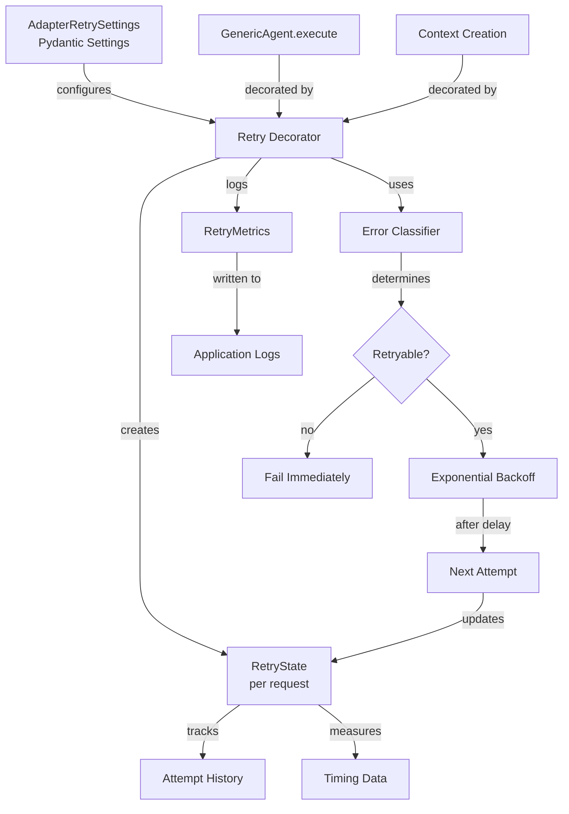

# Data Model: LLM Adapter Retry and Recovery

**Feature**: LLM Adapter Retry and Recovery Mechanisms
**Date**: 2025-11-24

## Overview

This feature introduces retry and recovery mechanisms for LLM adapter operations. The data model focuses on configuration, retry state tracking, and error metadata. No database entities are required - all state is ephemeral (per-request) or configured via environment variables.

## Entities

### 1. AdapterRetrySettings (Configuration)

**Purpose**: Application-scoped configuration for retry behavior loaded from environment variables

**Type**: Pydantic BaseSettings (not a database model)

**Location**: `src/nexus/core/config.py`

**Fields**:
| Field | Type | Default | Validation | Description |
|-------|------|---------|------------|-------------|
| `adapter_max_retries` | int | 3 | >= 0 | Maximum number of retry attempts (0 disables retries) |
| `adapter_initial_backoff_seconds` | float | 1.0 | > 0 | Initial delay before first retry in seconds |
| `adapter_backoff_growth_factor` | float | 2.0 | >= 1.0 | Exponential growth factor for backoff delays |
| `adapter_max_backoff_seconds` | float | 10.0 | > 0 | Maximum cap for backoff delay in seconds |
| `adapter_request_timeout_seconds` | float | 30.0 | > 0 | Per-attempt timeout to prevent unbounded wait times (applies to initial attempt + all retries) |

**Environment Variables**:
- `NEXUS_ADAPTER_MAX_RETRIES`
- `NEXUS_ADAPTER_INITIAL_BACKOFF_SECONDS`
- `NEXUS_ADAPTER_BACKOFF_GROWTH_FACTOR`
- `NEXUS_ADAPTER_MAX_BACKOFF_SECONDS`
- `NEXUS_ADAPTER_REQUEST_TIMEOUT_SECONDS`

**Validation Rules**:
- `adapter_max_retries` must be >= 0 (0 means no retries)
- `adapter_initial_backoff_seconds` must be > 0
- `adapter_backoff_growth_factor` must be >= 1.0 (1.0 = fixed delay, >1.0 = exponential)
- `adapter_max_backoff_seconds` must be > 0 and >= `adapter_initial_backoff_seconds`
- `adapter_request_timeout_seconds` must be > 0

**Performance Bounds**:
- Worst-case duration with defaults: 4 attempts × 30s per-attempt timeout + 3 backoff periods × 10s max backoff = 150 seconds
- Per-attempt timeout prevents each request attempt from hanging indefinitely

**Access Pattern**:
```python
from nexus.core.config import get_settings

settings = get_settings()
max_retries = settings.adapter_max_retries
```

### 2. RetryState (Ephemeral Request State)

**Purpose**: Track retry attempts and timing for a single request (not persisted)

**Type**: Runtime state within decorator/retry utility

**Lifecycle**: Created at request start, destroyed at request completion

**Fields**:
| Field | Type | Description |
|-------|------|-------------|
| `attempt_number` | int | Current attempt (0 = initial, 1+ = retries) |
| `start_time` | datetime | When the first attempt started |
| `last_error` | Exception \| None | Most recent error encountered |
| `error_history` | list[tuple[int, str, datetime]] | History of (attempt, error_type, timestamp) |
| `total_delay` | float | Cumulative delay time spent in backoff |

**State Transitions**:
```
INITIAL (attempt=0)
  → ERROR → RETRYING (attempt=1, after backoff)
  → ERROR → RETRYING (attempt=2, after backoff)
  → ERROR → RETRYING (attempt=3, after backoff)
  → EXHAUSTED (return error)

INITIAL (attempt=0)
  → ERROR → RETRYING (attempt=1, after backoff)
  → SUCCESS (return result)
```

### 3. RetryMetrics (Logged Metadata)

**Purpose**: Information logged for observability and debugging

**Type**: Formatted log data (plain text with formatted strings, not a stored entity)

**Fields**:
| Field | Type | Description |
|-------|------|-------------|
| `invocation_id` | UUID | Unique identifier for the request (single run of Agentic Orchestrator). Mandatory - required parameter in GenericAgent.execute() |
| `turn_id` | UUID \| None | Unique identifier for the LLM call within the invocation. Will be mandatory once implemented - not yet added to function signature, decorator handles transition by logging if present |
| `attempt_number` | int | Current retry attempt |
| `error_type` | str | Type/name of exception encountered |
| `delay_seconds` | float | Delay applied before next retry |
| `total_attempts` | int | Final total number of attempts |
| `total_time_seconds` | float | Total elapsed time including all retries |
| `outcome` | str | "success" or "failure" |
| `final_error` | str \| None | Final error message if failed |

**Log Format**:
```
# Expected format (once turn_id is added to function signature - both IDs mandatory):
INFO: Retry attempt {attempt_number}/{max_retries} for invocation_id={invocation_id} turn_id={turn_id} after error: {error_type}, delay={delay_seconds}s
WARNING: All retries exhausted for invocation_id={invocation_id} turn_id={turn_id}, attempts={total_attempts}, total_time={total_time_seconds}s, final_error={final_error}
INFO: Retry succeeded on attempt {attempt_number}/{max_retries} for invocation_id={invocation_id} turn_id={turn_id}, total_time={total_time_seconds}s

# Transition format (current state - turn_id not yet in signature):
INFO: Retry attempt {attempt_number}/{max_retries} for invocation_id={invocation_id} after error: {error_type}, delay={delay_seconds}s
WARNING: All retries exhausted for invocation_id={invocation_id}, attempts={total_attempts}, total_time={total_time_seconds}s, final_error={final_error}
INFO: Retry succeeded on attempt {attempt_number}/{max_retries} for invocation_id={invocation_id}, total_time={total_time_seconds}s
```

### 4. RetryErrorClassification (Logic Component)

**Purpose**: Classify exceptions as retryable vs non-retryable

**Type**: Utility function/class (not a data entity)

**Dependency Note**: GenericAgent receives exceptions from OpenAI SDK (transitive dependency via langchain-openai), which wraps httpx errors. Error classifier must handle both exception hierarchies.

**Classification Rules**:

**Retryable Errors - OpenAI SDK (Primary)**:
- `openai.APIConnectionError` - wraps httpx.ConnectError (network failures)
- `openai.APITimeoutError` - wraps httpx.TimeoutException (timeouts)
- `openai.RateLimitError` - HTTP 429 rate limiting (transient throttling)
- `openai.APIStatusError` with status in [500, 502, 503, 504] - server errors

**Retryable Errors - httpx (Defensive Fallback)**:
- `httpx.HTTPStatusError` with status in [500, 502, 503, 504, 429]
- `httpx.TimeoutException`
- `httpx.ConnectTimeout`
- `httpx.ReadTimeout`
- `httpx.ConnectError`

**Retryable Errors - asyncio**:
- `asyncio.TimeoutError` (if wrapped with asyncio.wait_for)

**Non-Retryable Errors - OpenAI SDK**:
- `openai.AuthenticationError` - HTTP 401 (invalid credentials)
- `openai.BadRequestError` - HTTP 400 (invalid request)
- `openai.APIStatusError` with status in [400-499] (other client errors)

**Non-Retryable Errors - General**:
- `httpx.HTTPStatusError` with status in [400-499] (client errors)
- `ValueError` (configuration/validation errors)
- `KeyError`, `AttributeError` (programming errors)
- Any other unexpected exceptions

**Logic**:
```python
def is_retryable_error(error: Exception) -> bool:
    """Determine if error should trigger retry."""
    # Check OpenAI SDK exceptions first (primary path)
    if isinstance(error, (openai.APIConnectionError, openai.APITimeoutError, openai.RateLimitError)):
        return True
    if isinstance(error, openai.APIStatusError):
        return 500 <= error.status_code < 600

    # Check httpx exceptions (defensive fallback)
    if isinstance(error, httpx.HTTPStatusError):
        return error.response.status_code in {500, 502, 503, 504, 429}
    if isinstance(error, (httpx.TimeoutException, httpx.ConnectError, asyncio.TimeoutError)):
        return True

    return False
```

### 5. ContextCreationError (Not Applicable)

**Investigation Result**: Context creation (ContextManagerPlanner) does NOT use LLM calls.

**Finding**:
- Examined `src/nexus/agent_orchestrator/context_manager/planner.py`
- ContextManagerPlanner is pure orchestration:
  - Retrieval: document retrieval (no LLM)
  - Compression: content compression (no LLM)
  - Assembly: package assembly (no LLM)
- No retry logic needed for context creation

**Spec Note**: Original requirements mentioned context creation retry based on incorrect assumption that it uses LLM. This entity is not needed for this feature.

## Relationships



## Data Flow

### Successful Retry Flow
```
1. Request starts → RetryState initialized (attempt=0)
2. Execute LLM call → HTTP 503 error
3. Classify error → Retryable (503)
4. Check attempts → 0 < max_retries (3) → Continue
5. Calculate backoff → 1s delay
6. Log retry attempt → INFO level
7. Sleep 1s → Update RetryState (attempt=1)
8. Execute LLM call → SUCCESS
9. Log success → INFO level
10. Return result
```

### Exhausted Retries Flow
```
1. Request starts → RetryState initialized (attempt=0)
2. Execute LLM call → HTTP 500 error
3. Classify → Retryable → Backoff 1s → Retry (attempt=1)
4. Execute LLM call → HTTP 503 error
5. Classify → Retryable → Backoff 2s → Retry (attempt=2)
6. Execute LLM call → HTTP 502 error
7. Classify → Retryable → Backoff 4s → Retry (attempt=3)
8. Execute LLM call → HTTP 504 error
9. Check attempts → 3 >= max_retries (3) → STOP
10. Log exhaustion → WARNING level
11. Return error with metadata (total_attempts=4, total_time=~12s)
```

### Non-Retryable Error Flow
```
1. Request starts → RetryState initialized (attempt=0)
2. Execute LLM call → HTTP 401 error
3. Classify error → Non-Retryable (auth failure)
4. Log immediate failure → WARNING level
5. Return error immediately (no retries)
```

## Validation Rules

### Configuration Validation (at application startup)
- If `max_retries = 0` → Retry behavior disabled (immediate failure on error)
- Backoff parameters must form valid exponential sequence
- Max backoff must be achievable with given parameters

### Runtime Validation (per request)
- Each retry attempt increments counter
- Total attempts never exceeds `max_retries + 1` (initial + retries)
- Backoff delay never exceeds `max_backoff_seconds`
- Concurrent requests maintain isolated retry state

## Edge Cases

1. **Retry disabled** (`max_retries=0`):
   - System fails immediately on first error
   - No backoff applied
   - Only initial attempt counted
   - Effectively disables retry behavior

2. **Backoff interruption**:
   - If error/interruption during sleep → Cancel wait, fail immediately
   - Don't continue retry sequence

3. **Error type changes**:
   - Track each error type in history
   - Continue retry count regardless of error type
   - Log every attempt with specific error

4. **Timeout during retry**:
   - Treat same as any retryable error
   - Increment counter, continue normal flow

## No Database Migrations Required

This feature does not introduce any database schema changes. All configuration is environment-based, and all retry state is ephemeral (in-memory, per-request).
