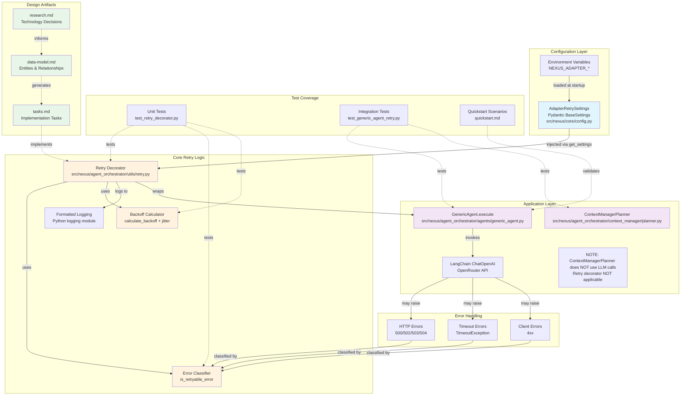

# Implementation Plan: LLM Adapter Retry and Recovery Mechanisms

**Branch**: `014-adaptor-retry` | **Date**: 2025-11-24 | **Spec**: [spec.md](./spec.md)
**Input**: Feature specification from ``

## Execution Flow (/plan command scope)
```
1. Load feature spec from Input path
   → If not found: ERROR "No feature spec at {path}"
2. Fill Technical Context (scan for NEEDS CLARIFICATION)
   → Detect Project Type from context (web=frontend+backend, mobile=app+api)
   → Set Structure Decision based on project type
3. Fill the Constitution Check section based on the content of the constitution document.
4. Evaluate Constitution Check section below
   → If violations exist: Document in Complexity Tracking
   → If no justification possible: ERROR "Simplify approach first"
   → Update Progress Tracking: Initial Constitution Check
5. Execute Phase 0 → research.md
   → If NEEDS CLARIFICATION remain: ERROR "Resolve unknowns"
6. Execute Phase 1 → schemas, data-model.md, quickstart.md, agent-specific template file (e.g., `CLAUDE.md` for Claude Code, `.github/copilot-instructions.md` for GitHub Copilot, `GEMINI.md` for Gemini CLI, `QWEN.md` for Qwen Code or `AGENTS.md` for opencode).
7. Re-evaluate Constitution Check section
   → If new violations: Refactor design, return to Phase 1
   → Update Progress Tracking: Post-Design Constitution Check
8. Plan Phase 2 → Describe task generation approach (DO NOT create tasks.md)
9. STOP - Ready for /tasks command
```

**IMPORTANT**: The /plan command STOPS at step 7. Phases 2-4 are executed by other commands:
- Phase 2: /tasks command creates tasks.md
- Phase 3-4: Implementation execution (manual or via tools)

## Summary

This feature adds retry and recovery mechanisms to the LLM adapter (GenericAgent) to handle transient provider errors. The system will automatically retry requests on HTTP 5xx errors (500, 502, 503, 504) and timeouts with exponential backoff (1s initial, 2x growth, 10s max cap). Configuration is application-scoped via environment variables (3 retries default, configurable). Retry logic applies to GenericAgent.execute() operations that invoke LLM providers. Note: ContextManagerPlanner does NOT use LLM calls and does not require retry logic (verified via code investigation).

## Implementation Architecture



### Architecture Diagram Legend

**Configuration Layer** (Blue):
- Environment variables define retry behavior
- Pydantic Settings loads and validates configuration at startup
- Configuration is read-only and application-scoped

**Core Retry Logic** (Orange):
- Decorator pattern adds retry behavior without modifying GenericAgent
- Error Classifier determines retryable vs non-retryable errors
- Backoff Calculator implements exponential backoff with jitter
- Formatted logging tracks retry attempts and outcomes

**Application Layer** (Purple):
- GenericAgent handles LLM queries via LangChain/OpenRouter and is decorated with retry logic
- ContextManagerPlanner is pure orchestration (NO LLM calls) and does NOT need retry logic

**Error Handling** (Red):
- HTTP 5xx errors trigger retries
- Timeouts trigger retries
- Client 4xx errors fail immediately (non-retryable)

**Test Coverage** (Gray):
- Unit tests validate retry logic in isolation
- Integration tests validate end-to-end behavior
- Quickstart scenarios provide manual validation steps

**Design Artifacts** (Green):
- Research documents technology decisions
- Data Model defines entities and relationships
- Tasks.md generated from design artifacts (by /tasks command)

## Technical Context
**Language/Version**: Python 3.12
**Primary Dependencies**: LangChain (LLM interaction), langchain-openai (ChatOpenAI client - direct dependency), openai (OpenAI SDK v2.7.1 - transitive dependency via langchain-openai), httpx (HTTP client used by OpenAI SDK - transitive), pydantic-settings (configuration), respx (HTTP mocking for tests)
**Exception Hierarchy**: GenericAgent receives OpenAI SDK exceptions (APIConnectionError, APITimeoutError, RateLimitError, APIStatusError) which wrap underlying httpx errors. Error classifier must handle both OpenAI SDK exceptions (primary) and httpx exceptions (defensive fallback)
**Storage**: N/A (retry state is ephemeral per-request, configuration from environment variables)
**Testing**: pytest, pytest-asyncio, respx (for mocking HTTP responses), must mock OpenAI SDK exceptions for realistic tests
**Target Platform**: Linux server (containerized with podman-compose)
**Project Type**: single (backend API service)
**Performance Goals**: Graceful degradation during transient failures, eventual success within 3 retries (default), minimal added latency for successful requests
**Constraints**: Max total delay per request: ~150s worst-case (4 attempts × 30s timeout + 3 backoffs × 10s max), must not block concurrent requests, retry state isolated per request
**Scale/Scope**: Applies to all LLM adapter calls (GenericAgent.execute), potentially hundreds of concurrent invocations. ContextManagerPlanner does NOT use LLM calls and is excluded from retry scope.

## Constitution Check
*GATE: Must pass before Phase 0 research. Re-check after Phase 1 design.*

### Technology Standards Compliance
- [x] **SQLModel for Data Models**: N/A - No database models needed (configuration via Pydantic Settings only). NOTE: Pydantic BaseSettings is the constitutionally correct pattern for application configuration (distinct from database models which require SQLModel per constitution)

### Code Architecture Compliance
- [x] **DRY Principle**: Retry logic will be abstracted into a reusable decorator/utility to avoid duplication across adapter methods
- [x] **SOLID Principles**:
  - Single Responsibility: Retry logic separated from business logic (decorator pattern)
  - Open/Closed: Decorator allows extending retry behavior without modifying GenericAgent
  - Liskov Substitution: Not applicable (no inheritance hierarchy being modified)
  - Interface Segregation: Retry configuration is separate from adapter interface
  - Dependency Injection: Configuration injected via get_settings()
- [x] **Separation of Concerns**: Retry logic (infrastructure concern) separated from agent execution logic (business concern)
- [x] **Dependency Injection**: RetrySettings will be injected via get_settings(), not instantiated directly
- [x] **Composition vs Inheritance**: Using decorator pattern (composition) rather than inheritance to add retry behavior

### API Specification Standards Compliance
- [x] **OpenAPI/AsyncAPI Compliance**: N/A - No new API endpoints (internal retry logic only)
- [x] **Naming Convention**: N/A - No API contracts being created
- [x] **Documentation Completeness**: N/A - No API endpoints
- [x] **RFC 9457 Error Format**: Existing error handling already in place in GenericAgent.execute
- [x] **Error Message Safety**: Retry errors will follow existing pattern (no internal details exposed)
- [x] **API Versioning**: N/A - No API changes
- [x] **API Path Structure**: N/A - No new endpoints
- [x] **Pagination Support**: N/A - No collection endpoints
- [x] **Filtering/Sorting Consistency**: N/A - No filtering endpoints
- [x] **Security Documentation**: N/A - No authentication changes
- [x] **Schema Compatibility**: N/A - No schema changes

## Project Structure

### Documentation (this feature)
```
specs/[###-feature]/
├── plan.md              # This file (/plan command output)
├── research.md          # Phase 0 output (/plan command)
├── data-model.md        # Phase 1 output (/plan command)
├── quickstart.md        # Phase 1 output (/plan command)
└── tasks.md             # Phase 2 output (/tasks command - NOT created by /plan)
```

### Source Code (repository root)
```
# Option 1: Single project (DEFAULT)
src/
├── models/
├── services/
├── cli/
└── lib/

tests/
├── contract/
├── integration/
└── unit/

# Option 2: Web application (when "frontend" + "backend" detected)
backend/
├── src/
│   ├── models/
│   ├── services/
│   └── api/
└── tests/

frontend/
├── src/
│   ├── components/
│   ├── pages/
│   └── services/
└── tests/

# Option 3: Mobile + API (when "iOS/Android" detected)
api/
└── [same as backend above]

ios/ or android/
└── [platform-specific structure]
```

**Structure Decision**: Option 1 (Single project) - Backend API service with modular structure under src/nexus/

## Phase 0: Outline & Research
1. **Extract unknowns from Technical Context** above:
   - For each NEEDS CLARIFICATION → research task
   - For each dependency → best practices task
   - For each integration → patterns task

2. **Generate and dispatch research agents**:
   ```
   For each unknown in Technical Context:
     Task: "Research {unknown} for {feature context}"
   For each technology choice:
     Task: "Find best practices for {tech} in {domain}"
   ```

3. **Consolidate findings** in `research.md` using format:
   - Decision: [what was chosen]
   - Rationale: [why chosen]
   - Alternatives considered: [what else evaluated]

**Output**: research.md with all NEEDS CLARIFICATION resolved

## Phase 1: Design & Contracts
*Prerequisites: research.md complete*

1. **Extract entities from feature spec** → `data-model.md`:
   - Entity name, fields, relationships
   - Validation rules from requirements
   - State transitions if applicable

2. **Generate API contracts** from functional requirements:
   - For each user action → endpoint
   - Use standard REST/GraphQL patterns
   - Output OpenAPI/AsyncAPI schema to `[project root]/schemas/[component]/`
   - Note: Schemas are stored at project root level, NOT within the specs folder

3. **Generate contract tests** from contracts:
   - One test file per endpoint
   - Assert request/response schemas
   - Tests must fail (no implementation yet)

4. **Extract test scenarios** from user stories:
   - Each story → integration test scenario
   - Quickstart test = story validation steps

5. **Update agent file incrementally** (O(1) operation):
   - Run `.specify/scripts/bash/update-agent-context.sh claude`
     **IMPORTANT**: Execute it exactly as specified above. Do not add or remove any arguments.
   - If exists: Add only NEW tech from current plan
   - Preserve manual additions between markers
   - Update recent changes (keep last 3)
   - Keep under 150 lines for token efficiency
   - Output to repository root

**Output**: data-model.md, [project root]/schemas/[component]/*, failing tests, quickstart.md, agent-specific file

## Phase 2: Task Planning Approach
*This section describes what the /tasks command will do - DO NOT execute during /plan*

**Task Generation Strategy**:
- Load `.specify/templates/tasks-template.md` as base
- Generate tasks from Phase 1 design docs (data-model.md, quickstart.md)
- No API contract tests needed (no new endpoints)
- Configuration entity → settings class task [P]
- Retry decorator → utility implementation task
- Error classifier → utility implementation task [P]
- Each quickstart scenario → integration test task
- Implementation tasks to apply decorator to GenericAgent and context creation

**Specific Task Categories**:
1. **Configuration** (1 task):
   - Add AdapterRetrySettings to src/nexus/core/config.py

2. **Core Retry Logic** (3-4 tasks):
   - Implement retry decorator with exponential backoff
   - Implement error classification utility
   - Implement backoff calculation with jitter
   - Add logging for retry attempts and outcomes

3. **Integration** (2 tasks):
   - Apply retry decorator to GenericAgent.execute()
   - Apply retry decorator to context creation (if applicable)

4. **Unit Tests** (5-7 tasks):
   - Test retry decorator with transient errors
   - Test exponential backoff calculation
   - Test error classification logic
   - Test max retries enforcement
   - Test zero retries configuration
   - Test concurrent request isolation
   - Test configuration loading

5. **Integration Tests** (6 tasks):
   - Test successful retry after transient error (scenario 1)
   - Test exhausted retries (scenario 2)
   - Test non-retryable error (scenario 3)
   - Test disabled retry configuration (scenario 4)
   - Test concurrent requests (scenario 5)
   - Test context creation retry (scenario 6)

6. **Quality Checks** (1 task):
   - Run format, lint, typecheck, test-all

**Ordering Strategy**:
- TDD order: Tests before implementation (write failing tests first)
- Dependency order:
  1. Configuration (needed by all)
  2. Error classifier (no dependencies) [P]
  3. Backoff calculator (no dependencies) [P]
  4. Retry decorator (depends on classifier + backoff + config)
  5. Integration (depends on decorator)
  6. Tests can be written in parallel with implementation
- Mark [P] for parallel execution where tasks are independent

**Estimated Output**: 12 actionable tasks + 2 tasks marked N/A after investigation (14 total task entries in tasks.md)

**IMPORTANT**: This phase is executed by the /tasks command, NOT by /plan

## Phase 3+: Future Implementation
*These phases are beyond the scope of the /plan command*

**Phase 3**: Task execution (/tasks command creates tasks.md)
**Phase 4**: Implementation (execute tasks.md following constitutional principles)
**Phase 5**: Validation (run tests, execute quickstart.md, performance validation)

## Complexity Tracking
*Fill ONLY if Constitution Check has violations that must be justified*

| Violation | Why Needed | Simpler Alternative Rejected Because |
|-----------|------------|-------------------------------------|
| [e.g., 4th project] | [current need] | [why 3 projects insufficient] |
| [e.g., Repository pattern] | [specific problem] | [why direct DB access insufficient] |


## Progress Tracking
*This checklist is updated during execution flow*

**Phase Status**:
- [x] Phase 0: Research complete (/plan command) - research.md created
- [x] Phase 1: Design complete (/plan command) - data-model.md, quickstart.md, CLAUDE.md updated
- [x] Phase 2: Task planning complete (/plan command - describe approach only)
- [ ] Phase 3: Tasks generated (/tasks command)
- [ ] Phase 4: Implementation complete
- [ ] Phase 5: Validation passed

**Gate Status**:
- [x] Initial Constitution Check: PASS - No violations (decorator pattern, Pydantic Settings, no DB/API changes)
- [x] Post-Design Constitution Check: PASS - Design maintains all constitutional principles
- [x] All NEEDS CLARIFICATION resolved - 15 clarifications answered in spec.md
- [x] Complexity deviations documented - None (no violations)

---
*Based on Constitution v1.2.0 - See `.specify/memory/constitution.md`*
