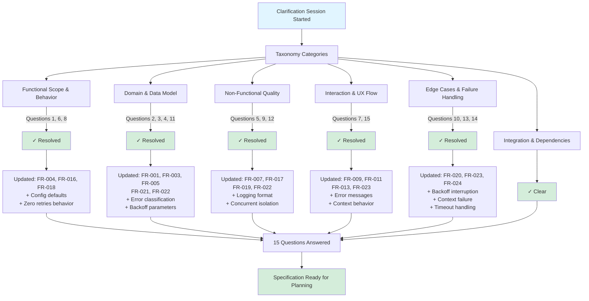
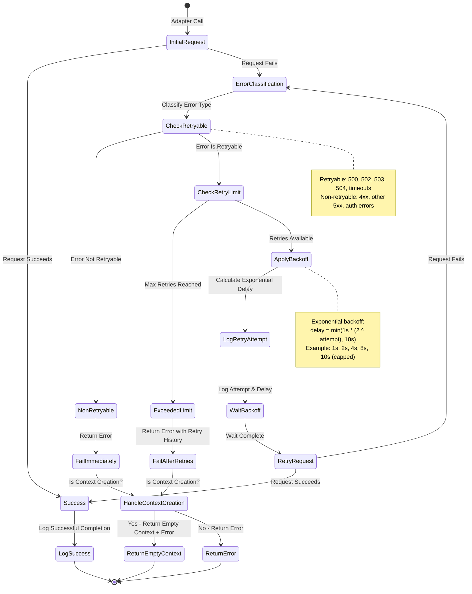

# Feature Specification: LLM Adapter Retry and Recovery Mechanisms

**Feature Branch**: `014-adaptor-retry`
**Created**: 2025-11-24
**Status**: Draft
**Input**: User description: "adaptor: retry and recovery mechanisms

As a developer, I want retry and recovery logic in the LLM adapter so that transient provider errors do not break executions.


Definition of Done:

Retry logic handles HTTP 5xx and timeouts.
Exponential backoff applied.
Max retries configurable.

Acceptance Criteria:

Adapter retries transient failures up to N times.
Logs retry attempts with delay.
Returns error only after max retries exceeded.

If configured, should an error occurred with creating the context then retry (if appropriate)

If not appropriate to retry then fail context building, but still return the context manager object, but blank along with a seperate error


Requirements:

Implement retry decorator.
Configure backoff intervals and max retries.
Capture and log retry metrics.

End-to-End Test:

Simulate transient 500 error.
Verify adapter retries automatically.
Confirm eventual success or clean failure after max retries."

## Execution Flow (main)
```
1. Parse user description from Input
   → Feature description provided
2. Extract key concepts from description
   → Actors: Developers, LLM Adapter, Context Manager
   → Actions: Retry on transient errors, log attempts, configure behavior
   → Data: Retry metrics, error types, backoff intervals
   → Constraints: Max retries, exponential backoff, error classification
3. For each unclear aspect:
   → RESOLVED: Default max retries = 3, configurable at application scope
   → RESOLVED: HTTP errors to retry = 500, 502, 503, 504
   → RESOLVED: Default backoff = 1s initial, 2x growth, 10s max cap
   → RESOLVED: Logging format = application logging setup (default: plain text with details)
   → RESOLVED: Retry behavior same for all operations (context creation & general calls)
   → RESOLVED: Context creation uses same error classification (500/502/503/504/timeouts retryable)
4. Fill User Scenarios & Testing section
   → User flow identified for transient failures
5. Generate Functional Requirements
   → Each requirement is testable
6. Identify Key Entities
   → Retry configuration, error classification, metrics
7. Run Review Checklist
   → All clarifications resolved
8. Return: SUCCESS (spec ready for planning)
```

---

## ⚡ Quick Guidelines
- ✅ Focus on WHAT users need and WHY
- ❌ Avoid HOW to implement (no tech stack, APIs, code structure)
- 👥 Written for business stakeholders, not developers

---

## Terminology

- **ContextManagerPlanner**: The Context Manager orchestration system documented in spec 009. This system coordinates retrieval, compression, and assembly of context data **without using LLM calls** (see Investigation Results section for details). Retry logic does NOT apply to ContextManagerPlanner.
- **GenericAgent**: The agent implementation that invokes LLM providers (OpenRouter via LangChain) to generate AI responses. This is where retry logic IS applicable. Located at `src/nexus/agent_orchestrator/agents/generic_agent.py`.

---

## Clarifications

### Session 2025-11-24

- Q: What should be the default maximum number of retry attempts? → A: 3 retries (default), configurable at application scope
- Q: Which HTTP 5xx status codes should trigger automatic retry? → A: Common transient errors only: 500, 502, 503, 504
- Q: What should be the default initial backoff interval? → A: 1 second
- Q: What should be the exponential backoff growth factor and maximum backoff cap? → A: Factor: 2x, Max: 10 seconds
- Q: What format should retry metrics be logged in? → A: Configurable format based on application logging setup, default: plain text with details
- Q: Should retry behavior differ for context creation vs. general adapter calls? → A: Same retry behavior for all operations (consistent)
- Q: For context creation, what defines "appropriate" to retry? → A: Use same error classification (500/502/503/504/timeouts retryable, all else non-retryable)
- Q: What should happen when retry configuration is set to zero (max_retries = 0)? → A: No retries, fail immediately on first error (disabled retry)
- Q: How should concurrent retry operations be isolated from each other? → A: Each request maintains independent retry state (no shared state)
- Q: How should the system handle errors that occur during the backoff wait period? → A: Cancel wait and fail immediately (abort on interruption)
- Q: What happens if the error type changes between retry attempts? → A: Continue retrying with same retry count, log every attempt including error type changes
- Q: How should the system handle very large backoff intervals? → A: Maximum cap (default 10s) enforced and configurable at application startup via environment variables
- Q: What happens when max retries is reached during context creation? → A: Return empty context with error (as specified in original requirements)
- Q: What happens when a timeout occurs during a retry attempt recovering from a previous timeout? → A: Treat as any other retryable error, increment counter and continue normal retry flow
- Q: What specific information should error messages include when all retries are exhausted? → A: Error type, attempt count, total time only (full history available in logs)

## Clarification Process Visualization



---

## User Scenarios & Testing

### Primary User Story
As a developer using the LLM adapter, when a transient error occurs (such as a temporary network issue or provider service disruption), the system automatically retries the request without requiring manual intervention. The system provides clear feedback about retry attempts and eventually either succeeds or fails gracefully after exhausting all retry attempts.

### Acceptance Scenarios

1. **Given** the LLM adapter encounters a transient HTTP 5xx error, **When** the initial request fails, **Then** the system automatically retries with exponential backoff up to the configured maximum attempts, logging each retry attempt with timing information

2. **Given** the LLM adapter encounters a timeout error, **When** the request times out, **Then** the system automatically retries with exponential backoff up to the configured maximum attempts

3. **Given** the LLM adapter has exhausted all retry attempts, **When** the final retry fails, **Then** the system returns a clear error message including the final error type, total number of attempts, and total time spent retrying (complete retry history is logged to application logs)

4. **Given** the LLM adapter encounters an error in GenericAgent.execute(), **When** the error is classified as retryable, **Then** the system retries according to the configured policy

5. **[REMOVED - NOT APPLICABLE]** - ContextManagerPlanner does not use LLM calls, so context creation retry scenarios are not applicable (see Investigation Results)

6. **Given** a developer needs to adjust retry behavior, **When** they configure max retries and backoff intervals, **Then** the system respects these settings for all subsequent adapter operations

7. **Given** a transient error resolves on a retry attempt, **When** a retry succeeds, **Then** the system completes the operation successfully and logs the successful recovery

8. **Given** maximum retry attempts is configured to zero, **When** a retryable error occurs, **Then** the system immediately fails without any retry attempts

9. **Given** multiple concurrent adapter requests are in progress, **When** one request experiences retries, **Then** other concurrent requests maintain their own independent retry state without interference

10. **Given** the system is waiting during a backoff period, **When** an error or interruption occurs during the wait, **Then** the system cancels the wait and fails immediately without continuing the retry sequence

11. **Given** a retry sequence is in progress, **When** the error type changes between retry attempts (e.g., 503 becomes 500), **Then** the system continues retrying with the same retry count and logs each attempt with the specific error type

12. **Given** exponential backoff is calculating delay intervals, **When** the calculated delay would exceed the configured maximum backoff cap, **Then** the system applies the maximum cap value instead to prevent excessively long delays

~~13. Given context creation has exhausted all retry attempts, When the final retry fails, Then the system returns an empty context manager object along with a separate error indication including the final error type, total attempts, and total time (complete retry history is logged to application logs)~~ **[REMOVED - NOT APPLICABLE]** - ContextManagerPlanner does not use LLM calls (see Investigation Results)

14. **Given** a retry attempt is recovering from a timeout error, **When** another timeout occurs on the retry attempt, **Then** the system treats it as a standard retryable error, increments the retry counter, and continues the normal retry flow

### Edge Cases

- When retry configuration is set to zero attempts, system fails immediately on first error without retrying
- If an error or interruption occurs during the backoff wait period, the system cancels the wait and fails immediately
- If the error type changes between retry attempts (e.g., 503 becomes 500), the system continues retrying with the same retry count and logs every attempt including the error type change
- System enforces maximum backoff cap (default 10s, configurable at application startup via environment variables) to prevent excessively long delays
- Concurrent retry operations are isolated with independent retry state per request (no shared state between concurrent operations)
- Timeouts during retry attempts are treated as standard retryable errors with no special handling (retry counter increments, normal retry flow continues)
- **[REMOVED - NOT APPLICABLE]** Context creation retry edge cases are not applicable since ContextManagerPlanner does not use LLM calls (see Investigation Results)

## Investigation Results: Context Creation

**Investigation Date**: 2025-11-24
**Finding**: ContextManagerPlanner does NOT use LLM calls

### Evidence

1. **Code Inspection**: Examined `src/nexus/agent_orchestrator/context_manager/planner.py`
   - ContextManagerPlanner.plan_request() orchestrates: Retrieval → Compression → Assembly
   - No LLM invocation in any phase (retrieval, compression, assembly)
   - Current MVP uses stub implementations returning None

2. **Cross-Spec Validation**:
   - **Spec 009 (Context Manager MVP)**: Documents ContextManagerPlanner as "orchestration framework that coordinates retrieve → compress → assemble workflow" with "stub service implementations" (lines 1-7, 36-46)
   - **Spec 011 (Invocation Context Integration)**: Shows ContextManager retrieves from database storage (sequence diagram line 56: "CM->>DB: Retrieve relevant context")
   - **Conclusion**: ContextManagerPlanner is pure orchestration without LLM calls

### Impact on Requirements

The following requirements assume LLM usage in context creation and are **NOT APPLICABLE** in current implementation:

- **FR-010**: "When context creation fails with a retryable error, system MUST retry" - N/A (no LLM calls)
- **FR-011**: "When context creation fails with a non-retryable error" - N/A (no LLM calls)
- **FR-013**: "Retry behavior MUST be consistent across all adapter operations" - Partially applicable (applies to GenericAgent only)
- **FR-023**: "When context creation exhausts all retry attempts" - N/A (no LLM calls)

### Implementation Status

- **GenericAgent Retry**: APPLICABLE - Fully implemented via T001-T006, T008-T012, T014
- **ContextManagerPlanner Retry**: NOT APPLICABLE - Marked N/A in tasks.md (T007, T013)
- **Future Consideration**: If ContextManagerPlanner later adds LLM calls (e.g., for semantic compression or intelligent retrieval), retry logic can be applied using the same decorator pattern established in this feature

### References

- Context Manager Implementation: `src/nexus/agent_orchestrator/context_manager/planner.py`
- Related Specs: `specs/009-context-manager-mvp/spec.md`, `specs/011-adaptor-initiate-context/spec.md`
- Investigation Documentation: `specs/014-adaptor-retry/research.md` (Section 6)

## Configuration Approach

### Pattern Decision

Retry configuration MUST be implemented using **Pydantic Settings with environment variables**, following the established pattern in the codebase (`src/nexus/core/config.py`). Configuration is read-only at application startup and changes require application restart.

### Rationale

Investigation of the codebase configuration patterns revealed:

1. **No API endpoints exist for configuration** - All configuration in the Nexus codebase is handled via environment variables, not through REST APIs
2. **Pydantic Settings is the standard pattern** - The `Settings` class in `src/nexus/core/config.py` uses `BaseSettings` with composition for modular configuration (e.g., `OpenRouterSettings`, `FileUploadSettings`)
3. **Environment variable naming convention** - All application settings use the `NEXUS_` prefix (e.g., `NEXUS_DB_HOST`, `NEXUS_API_PORT`)
4. **Read-only configuration** - Configuration is loaded once at application startup using `@lru_cache` on `get_settings()`

### Implementation Requirements

- **DO NOT** create API endpoints (GET/POST/PATCH) for retry configuration
- **DO NOT** create database tables for retry configuration
- **DO** add an `AdapterRetrySettings` class inheriting from `BaseSettings` in `src/nexus/core/config.py`
- **DO** compose `AdapterRetrySettings` into the main `Settings` class
- **DO** use environment variables with the `NEXUS_ADAPTER_` prefix:
  - `NEXUS_ADAPTER_MAX_RETRIES` (default: 3)
  - `NEXUS_ADAPTER_INITIAL_BACKOFF_SECONDS` (default: 1.0)
  - `NEXUS_ADAPTER_BACKOFF_GROWTH_FACTOR` (default: 2.0)
  - `NEXUS_ADAPTER_MAX_BACKOFF_SECONDS` (default: 10.0)
  - `NEXUS_ADAPTER_REQUEST_TIMEOUT_SECONDS` (default: 30.0)

### Configuration Access Pattern

Retry logic should access configuration through dependency injection:

```python
from nexus.core.config import get_settings

settings = get_settings()
# Note: Field names include 'adapter_' prefix following existing pattern
# (e.g., openrouter_api_key, file_upload_max_size_mb)
max_retries = settings.adapter_max_retries
initial_backoff = settings.adapter_initial_backoff_seconds
```

The configuration is application-scoped and applies to all adapter operations consistently.

**Note on Scope**: Retry configuration applies to LLM adapter operations (GenericAgent.execute()). ContextManagerPlanner is pure orchestration without LLM calls and does not require retry logic (verified 2025-11-24, see Investigation Results section).

## Requirements

### Functional Requirements

- **FR-001**: System MUST automatically retry requests when encountering HTTP server errors with status codes 500 (Internal Server Error), 502 (Bad Gateway), 503 (Service Unavailable), 504 (Gateway Timeout), or 429 (Rate Limited - transient throttling)

- **FR-002**: System MUST automatically retry requests when encountering timeout errors

- **FR-003**: System MUST apply exponential backoff between retry attempts using a 2x growth factor with a maximum backoff cap of 10 seconds

- **FR-004**: System MUST allow configuration of maximum retry attempts with a default value of 3 retries

- **FR-005**: System MUST allow configuration of backoff parameters including initial backoff (default: 1 second), growth factor (default: 2x), and maximum backoff cap (default: 10 seconds)

- **FR-006**: System MUST log each retry attempt with the delay duration before the next attempt

- **FR-007**: System MUST log retry metrics including total attempts, success/failure status, and total time spent retrying using the application's configured logging format (default: plain text with details)

- **FR-008**: System MUST distinguish between retryable and non-retryable errors

- **FR-009**: System MUST return a clear error message when all retry attempts are exhausted, including the final error type, total number of attempts, and total time spent retrying (full retry history is available in application logs)

- **FR-010**: **[NOT APPLICABLE - See Investigation Results]** - Context creation retry requirement is not applicable because ContextManagerPlanner does not use LLM calls. Future Consideration: If LLM invocation is added to context creation, system should retry according to configured policy.

- **FR-011**: **[NOT APPLICABLE - See Investigation Results]** - Context creation non-retryable error requirement is not applicable because ContextManagerPlanner does not use LLM calls. Future Consideration: If LLM invocation is added, system should immediately fail non-retryable errors and return empty context manager object with error indication.

- **FR-012**: System MUST provide visibility into retry behavior through logged metrics for monitoring and debugging purposes

- **FR-013**: Retry behavior MUST be consistent across all adapter operations that invoke LLM providers. **[UPDATED]** - Currently applies to GenericAgent.execute() only since ContextManagerPlanner does not use LLM (see Investigation Results). If future operations add LLM invocation, they must use the same retry count, backoff parameters, and error classification.

- **FR-014**: System MUST prevent infinite retry loops by enforcing a maximum retry limit

- **FR-015**: System MUST handle successful retries by completing the operation normally and logging the recovery

- **FR-016**: Retry configuration MUST be configurable at application scope, applying to all adapter operations within the application

- **FR-017**: Retry logging MUST use the application's configured logging format, defaulting to plain text with detailed information when no format is specified

- **FR-018**: System MUST support zero as a valid maximum retry attempts value, which disables retry behavior and causes immediate failure on first error

- **FR-019**: System MUST isolate retry state for concurrent operations, with each request maintaining independent retry counters, backoff timers, and error tracking

- **FR-020**: System MUST cancel the backoff wait period and fail immediately if an error or interruption occurs during the wait

- **FR-021**: System MUST continue retrying with the same retry count when error types change between attempts, logging every attempt with the specific error type encountered

- **FR-022**: System MUST enforce the configured maximum backoff cap to prevent excessively long delays, with the cap configurable at application level (default: 10 seconds)

- **FR-023**: **[NOT APPLICABLE - See Investigation Results]** - Context creation exhaustion requirement is not applicable because ContextManagerPlanner does not use LLM calls. Future Consideration: If LLM invocation is added, system should return empty context manager object with error indication (final error type, total attempts, total time) when retries are exhausted.

- **FR-024**: System MUST treat consecutive timeout errors during retry attempts as standard retryable errors with no special handling, incrementing the retry counter and continuing the normal retry flow

- **FR-025**: System MUST enforce a configurable timeout that applies independently to EACH retry attempt (initial attempt + all retries) to prevent unbounded wait times (default: 30 seconds per attempt). Example: With 3 retries, the timeout applies 4 times total (initial + retry 1 + retry 2 + retry 3)

### Key Entities

- **Retry Configuration**: Represents the configured retry behavior including maximum retry attempts (default: 3, valid range: 0 to N where 0 disables retries), backoff intervals (default initial: 1 second, growth factor: 2x, maximum cap: 10 seconds - all configurable), per-attempt timeout (default: 30 seconds, applies independently to each attempt including initial and all retries), and which error types trigger retries (500, 502, 503, 504, timeouts). Configuration is loaded from environment variables via Pydantic Settings at application startup and applies to all adapter operations. Worst-case duration with defaults: 4 attempts × 30s per-attempt timeout + 3 backoff periods × 10s max backoff = 150 seconds. See "Configuration Approach" section for implementation details.

- **Error Classification**: Categorizes errors as retryable (transient failures: HTTP 500, 502, 503, 504, 429, and timeouts) or non-retryable (permanent failures like authentication errors, invalid requests, other HTTP 4xx codes). Note: GenericAgent receives exceptions from the OpenAI SDK (transitive dependency via langchain-openai), which wraps underlying httpx errors. Error classifier must handle both OpenAI SDK exceptions (primary) and raw httpx exceptions (defensive fallback)

- **Retry Metrics**: Captures data about retry attempts including attempt count, delay durations, error types encountered, success/failure outcome, and total elapsed time. Each request maintains independent metrics. Logged using application's configured format (default: plain text with detailed information)

---

## Retry Flow Diagram



---

## Review & Acceptance Checklist

### Content Quality
- [x] No implementation details (languages, frameworks, APIs)
- [x] Focused on user value and business needs
- [x] Written for non-technical stakeholders
- [x] All mandatory sections completed

### Requirement Completeness
- [x] No [NEEDS CLARIFICATION] markers remain - **15 clarifications resolved**
- [x] Requirements are testable and unambiguous
- [x] Success criteria are measurable
- [x] Scope is clearly bounded
- [x] Dependencies and assumptions identified

---

## Execution Status

- [x] User description parsed
- [x] Key concepts extracted
- [x] Ambiguities marked and resolved
- [x] User scenarios defined
- [x] Requirements generated
- [x] Entities identified
- [x] Review checklist passed
