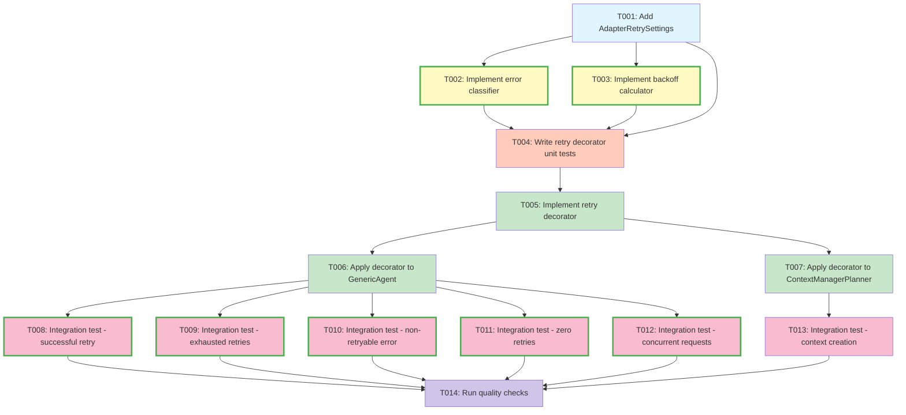

# Tasks: LLM Adapter Retry and Recovery Mechanisms

**Input**: Design documents from `/specs/014-adaptor-retry/`
**Prerequisites**: plan.md, research.md, data-model.md, quickstart.md

## Task Dependency Visualization



**Legend**:
- 🔵 Blue: Configuration
- 🟡 Yellow: Utilities (can be parallel)
- 🟠 Orange: Unit Tests
- 🟢 Green: Core Implementation
- 🔴 Pink: Integration Tests (can be parallel)
- 🟣 Purple: Quality Checks

## Execution Flow (main)
```
1. Load plan.md from feature directory
   → Tech stack: Python 3.12, LangChain, httpx, Pydantic Settings
   → Structure: Single project (src/nexus/)
2. Load design documents:
   → data-model.md: AdapterRetrySettings, error classification, backoff logic
   → quickstart.md: 6 test scenarios
3. Generate tasks by category:
   → Setup: Configuration (1 task)
   → Tests: Unit tests (1 task)
   → Core: Utilities + decorator (3 tasks)
   → Integration: Apply to agents (2 tasks)
   → Tests: Integration scenarios (6 tasks)
   → Polish: Quality checks (1 task)
4. Apply task rules:
   → Utilities can be parallel [P]
   → Integration tests can be parallel [P]
   → Tests before implementation (TDD)
5. Total tasks: 14
6. Return: SUCCESS (tasks ready for execution)
```

## Format: `[ID] [P?] Description`
- **[P]**: Can run in parallel (different files, no dependencies)
- Include exact file paths in descriptions

## Phase 3.1: Configuration

- [ ] **T001** Add AdapterRetrySettings to `src/nexus/core/config/base.py`
  - Add new class `AdapterRetrySettings(BaseSettings)` with fields:
    - `adapter_max_retries: int = Field(default=3, ge=0)` - 0 disables retries
    - `adapter_initial_backoff_seconds: float = Field(default=1.0, gt=0)`
    - `adapter_backoff_growth_factor: float = Field(default=2.0, ge=1.0)`
    - `adapter_max_backoff_seconds: float = Field(default=10.0, gt=0)`
    - `adapter_request_timeout_seconds: float = Field(default=30.0, gt=0)` - Per-attempt timeout to prevent unbounded wait times (applies to initial attempt + all retries)
  - Add `AdapterRetrySettings` to the inheritance list of `Settings` class: `class Settings(OpenRouterSettings, FileUploadSettings, AdapterRetrySettings)`
  - Environment variables: `NEXUS_ADAPTER_MAX_RETRIES`, `NEXUS_ADAPTER_INITIAL_BACKOFF_SECONDS`, `NEXUS_ADAPTER_BACKOFF_GROWTH_FACTOR`, `NEXUS_ADAPTER_MAX_BACKOFF_SECONDS`, `NEXUS_ADAPTER_REQUEST_TIMEOUT_SECONDS`
  - Validation: ensure `adapter_max_backoff_seconds >= adapter_initial_backoff_seconds` and `adapter_request_timeout_seconds > 0`
  - Access pattern: `settings.adapter_max_retries`, `settings.adapter_initial_backoff_seconds`, `settings.adapter_request_timeout_seconds`, etc.
  - Performance note: Worst-case duration with defaults: 4 attempts × 30s per-attempt timeout + 3 backoff periods × 10s max backoff = 150s
  - **Dependencies**: None
  - **Blocks**: T002, T003, T004

## Phase 3.2: Core Utilities (Can Execute in Parallel)

- [ ] **T002 [P]** Implement error classifier in `src/nexus/agent_orchestrator/utils/retry.py`
  - Create function `is_retryable_error(error: Exception) -> bool`
  - **Note**: GenericAgent receives OpenAI SDK exceptions (transitive dependency via langchain-openai), must handle both OpenAI SDK and httpx exceptions
  - Retryable errors (OpenAI SDK - primary): `openai.APIConnectionError`, `openai.APITimeoutError`, `openai.RateLimitError`, `openai.APIStatusError` with status in [500, 502, 503, 504]
  - Retryable errors (httpx - defensive fallback): `httpx.HTTPStatusError` with status in [500, 502, 503, 504, 429], `httpx.TimeoutException`, `httpx.ConnectTimeout`, `httpx.ReadTimeout`, `httpx.ConnectError`, `asyncio.TimeoutError`
  - Non-retryable (OpenAI SDK): `openai.AuthenticationError`, `openai.BadRequestError`, `openai.APIStatusError` with 4xx status
  - Non-retryable (general): all other errors (4xx, auth failures, ValueError, etc.)
  - Add docstring with error classification logic including dependency note
  - Import required exception types from openai, httpx, and asyncio
  - **Dependencies**: T001 (for typing)
  - **Parallel with**: T003

- [ ] **T003 [P]** Implement backoff calculator in `src/nexus/agent_orchestrator/utils/retry.py`
  - Create async function `calculate_backoff(attempt: int, settings: AdapterRetrySettings) -> float`
  - Formula: `base_delay = initial_backoff_seconds * (backoff_growth_factor ** attempt)`
  - Apply cap: `capped_delay = min(base_delay, max_backoff_seconds)`
  - Add jitter: `jitter = capped_delay * random.uniform(-0.1, 0.1)`
  - Return: `capped_delay + jitter`
  - Import: `random`, `asyncio` from standard library
  - **Dependencies**: T001 (for AdapterRetrySettings type)
  - **Parallel with**: T002

## Phase 3.3: Unit Tests First (TDD) ⚠️ MUST COMPLETE BEFORE T005

**CRITICAL: These tests MUST be written and MUST FAIL before implementing retry decorator**

- [ ] **T004** Write retry decorator unit tests in `tests/unit/agent_orchestrator/test_retry_decorator.py`
  - Test: `test_successful_retry_after_transient_error` - Mock openai.APIConnectionError (primary) and httpx.HTTPStatusError(503) (fallback), verify retry succeeds on second attempt
  - Test: `test_failure_after_max_retries_exhausted` - Mock persistent openai.APIStatusError(500) errors, verify 3 retries then failure
  - Test: `test_non_retryable_error_fails_immediately` - Mock openai.AuthenticationError (401), verify no retries
  - Test: `test_rate_limit_error_retryable` - Mock openai.RateLimitError (429), verify retry succeeds after backoff
  - Test: `test_exponential_backoff_delays` - Verify delays follow pattern (1s±10%, 2s±10%, 4s±10% accounting for jitter)
  - Test: `test_max_retries_zero_disables_retry` - Set max_retries=0, verify immediate failure
  - Test: `test_concurrent_requests_isolated_state` - Run 3 concurrent decorated functions, verify independent retry counters
  - Test: `test_backoff_calculation_with_jitter` - Verify jitter is within ±10% of base delay
  - Test: `test_backoff_cap_enforced` - Verify delay never exceeds max_backoff_seconds
  - Test: `test_backoff_interruption_handling` - Mock asyncio.CancelledError during backoff sleep, verify immediate failure without continuing retry, assert CancelledError propagated, no retry counter increment (FR-020)
  - Test: `test_error_type_changes_between_attempts` - Mock sequence openai.APIStatusError(503)→openai.APIStatusError(500)→openai.APIStatusError(502), verify retry count continues and each error logged (FR-021)
  - Test: `test_settings_validation_rules` - Verify validation: max_backoff >= initial_backoff, timeout > 0, max_retries >= 0
  - Test: `test_per_attempt_timeout_enforcement` - Verify timeout applies independently to each attempt: Mock slow responses (40s each), verify timeout (30s) triggers on EACH of 3 attempts independently, not cumulative (FR-025)
  - Test: `test_httpx_fallback_exceptions` - Mock raw httpx.ConnectError and httpx.TimeoutException to verify defensive fallback handling
  - Use pytest fixtures for mock settings
  - Use respx library for HTTP mocking (per plan.md:L151)
  - Mock OpenAI SDK exceptions (primary test cases) and httpx exceptions (fallback test cases)
  - Use pytest-asyncio for async tests
  - **Dependencies**: T001, T002, T003 (imports from retry.py)
  - **Blocks**: T005

## Phase 3.4: Core Implementation (ONLY after tests are failing)

**Architecture Reminders**:
- Apply DRY principle - extract reusable retry logic into decorator
- Follow SOLID principles - Single Responsibility (decorator only handles retry), Open/Closed (extend via decorator, don't modify GenericAgent)
- Use dependency injection - inject settings via `get_settings()`
- Use composition over inheritance - decorator pattern, not subclassing
- Maintain clear separation of concerns - retry logic separate from business logic

- [ ] **T005** Implement retry decorator in `src/nexus/agent_orchestrator/utils/retry.py`
  - Create decorator `@retry_with_backoff` that wraps async functions
  - Use functools.wraps to preserve function metadata
  - Retry loop:
    1. Get settings via `get_settings()`
    2. Try executing wrapped function with timeout (use asyncio.wait_for with settings.adapter_request_timeout_seconds)
    3. On exception: classify with `is_retryable_error()`
    4. If retryable and attempts < max_retries: calculate backoff, sleep, retry
    5. If non-retryable or max retries exceeded: re-raise exception
  - Logging:
    - INFO: Log each retry attempt with attempt number, error type, delay, invocation_id (and turn_id once implemented)
    - INFO: Log successful retry with attempt count, total time, invocation_id (and turn_id once implemented)
    - WARNING: Log exhausted retries with total attempts, total time, final error, invocation_id (and turn_id once implemented)
  - Track retry state: attempt_number, start_time, total_delay
  - Handle interruption during backoff (catch asyncio.CancelledError)
  - Handle timeout during wrapped function execution (asyncio.TimeoutError from wait_for)
  - Pass invocation_id and turn_id to logs: Extract 'invocation_id' from the wrapped function's kwargs dict (required parameter in GenericAgent.execute). Check for 'turn_id' key in kwargs - if present, include it in logs; if not present, omit it. Note: turn_id is expected to become a required parameter in the future but is not yet implemented.
  - **Dependencies**: T001, T002, T003, T004 (tests must be failing)
  - **Blocks**: T006, T007

## Phase 3.5: Integration

- [ ] **T006** Apply retry decorator to GenericAgent.execute in `src/nexus/agent_orchestrator/agents/generic_agent.py`
  - Import `retry_with_backoff` from `nexus.agent_orchestrator.utils.retry`
  - Decorate `async def execute(...)` method with `@retry_with_backoff`
  - Ensure invocation_id is available in method signature (already present)
  - No other changes to GenericAgent class required (decorator handles retry)
  - Verify existing error handling in execute() remains unchanged
  - **Dependencies**: T005
  - **Blocks**: T008, T009, T010, T011, T012

- [ ] **T007 [N/A]** Apply retry decorator to ContextManagerPlanner - NOT APPLICABLE
  - **Investigation Result**: ContextManagerPlanner does NOT use LLM calls
  - Examined `src/nexus/agent_orchestrator/context_manager/planner.py`
  - ContextManagerPlanner is pure orchestration (retrieval, compression, assembly) with no LLM invocation
  - Current MVP implementation uses stubs with no external service calls
  - **Conclusion**: No retry decorator needed for context creation
  - **Note**: Mark this task as COMPLETE/N/A - no implementation required
  - **Impact**: T013 also becomes N/A (integration test for context creation retry)

## Phase 3.6: Integration Tests (Can Execute in Parallel)

**IMPORTANT**: These tests validate the complete retry behavior end-to-end

- [ ] **T008 [P]** Integration test - successful retry after transient error in `tests/integration/agent_orchestrator/test_generic_agent_retry.py`
  - Scenario 1 from quickstart.md
  - Mock LangChain to raise openai.APIConnectionError on first call, success on second (realistic exception from OpenAI SDK)
  - Create invocation with GenericAgent
  - Assert: successful response, logs show 1 retry attempt
  - Verify response contains LLM answer
  - **Dependencies**: T006
  - **Parallel with**: T009, T010, T011, T012

- [ ] **T009 [P]** Integration test - exhausted retries after multiple failures in `tests/integration/agent_orchestrator/test_generic_agent_retry.py`
  - Scenario 2 from quickstart.md
  - Mock persistent openai.APIStatusError(500) errors (4 attempts total: initial + 3 retries, realistic OpenAI SDK exception)
  - Create invocation with GenericAgent
  - Assert: error response, logs show 3 retry attempts with delays (1s±10%, 2s±10%, 4s±10% accounting for jitter)
  - Verify total time is approximately 7-8 seconds
  - Verify final error message includes attempt count and total time
  - **Dependencies**: T006
  - **Parallel with**: T008, T010, T011, T012

- [ ] **T010 [P]** Integration test - non-retryable error fails immediately in `tests/integration/agent_orchestrator/test_generic_agent_retry.py`
  - Scenario 3 from quickstart.md
  - Mock openai.AuthenticationError (401 authentication error, realistic OpenAI SDK exception)
  - Create invocation with GenericAgent
  - Assert: immediate failure, NO retry attempts logged
  - Verify error message is user-friendly (no stack trace)
  - **Dependencies**: T006
  - **Parallel with**: T008, T009, T011, T012

- [ ] **T011 [P]** Integration test - zero retries configuration disables retry in `tests/integration/agent_orchestrator/test_generic_agent_retry.py`
  - Scenario 4 from quickstart.md
  - Override settings with `max_retries=0` using pytest fixture
  - Mock openai.APIStatusError(503) error (retryable error, realistic OpenAI SDK exception)
  - Create invocation with GenericAgent
  - Assert: immediate failure, NO retry attempts despite retryable error
  - **Dependencies**: T006
  - **Parallel with**: T008, T009, T010, T012

- [ ] **T012 [P]** Integration test - concurrent requests with independent state in `tests/integration/agent_orchestrator/test_generic_agent_retry.py`
  - Scenario 5 from quickstart.md
  - Create 3 concurrent invocations with GenericAgent
  - Mock different error patterns for each (success, 1 retry, 3 retries)
  - Assert: each request completes independently
  - Verify logs show 3 different invocation_ids with independent retry counters
  - Use asyncio.gather() to run concurrently
  - **Dependencies**: T006
  - **Parallel with**: T008, T009, T010, T011

- [ ] **T013 [N/A]** Integration test - context creation retry behavior - NOT APPLICABLE
  - **Investigation Result**: ContextManagerPlanner does NOT use LLM calls (see T007)
  - Context creation is pure orchestration with no LLM invocation
  - No retry logic to test for context creation
  - **Conclusion**: This test is not needed
  - **Note**: Mark this task as COMPLETE/N/A - no implementation required
  - **Impact**: Quickstart Scenario 6 should also be removed or marked N/A

## Phase 3.7: Polish

- [ ] **T014** Run quality checks and verify all tests pass
  - Run `make format` - code formatting
  - Run `make lint` - linting checks (includes pre-commit hooks)
  - Run `make typecheck` - type checking (mypy strict mode)
  - Run `make test-all` - all tests must pass
  - Verify retry decorator doesn't break existing GenericAgent tests
  - Check test coverage for new retry module (should be >90%)
  - Review logs for proper formatted logging output
  - **Dependencies**: All integration tests (T008-T013)

## Dependencies Summary

```
Setup:
  T001 (config) → blocks T002, T003, T004

Utilities (parallel):
  T002 (classifier) [P] → blocks T004
  T003 (backoff) [P] → blocks T004

Unit Tests:
  T004 (unit tests) → blocks T005

Core Implementation:
  T005 (decorator) → blocks T006

Integration:
  T006 (GenericAgent) → blocks T008, T009, T010, T011, T012
  T007 [N/A] - Context creation does not use LLM
  T013 [N/A] - No test needed (T007 is N/A)

Integration Tests (parallel):
  T008 [P] → blocks T014
  T009 [P] → blocks T014
  T010 [P] → blocks T014
  T011 [P] → blocks T014
  T012 [P] → blocks T014

Quality:
  T014 (quality checks) - final task
```

## Parallel Execution Examples

### Stage 1: Utilities (after T001 completes)
```bash
# Run T002 and T003 in parallel (different functions, no dependencies)
# Both can be implemented independently
```

### Stage 2: Integration Tests (after T006, T007 complete)
```bash
# Run T008-T012 in parallel (different test functions, independent scenarios)
# Each test validates a specific scenario from quickstart.md
```

## Notes

- **TDD Approach**: T004 must be written first and fail before implementing T005
- **Configuration**: Settings loaded via `get_settings()` - no hardcoded values
- **Exception Hierarchy**: GenericAgent receives OpenAI SDK exceptions (transitive dependency: nexus → langchain-openai → openai==2.7.1 → httpx). Error classifier must handle both OpenAI SDK exceptions (primary) and httpx exceptions (defensive fallback)
- **Error Classification**: Retryable errors include HTTP 500/502/503/504/429 and timeouts. OpenAI SDK wraps httpx exceptions (APIConnectionError, APITimeoutError, RateLimitError, APIStatusError)
- **Backoff**: Exponential with jitter (1s±10%, 2s±10%, 4s±10%...) capped at 10s
- **Logging**: Use existing Python logging module with invocation_id context
- **Context Creation**: ContextManagerPlanner does NOT use LLM calls (verified), T007 and T013 marked N/A
- **No Database Changes**: All configuration via environment variables
- **No API Changes**: Internal retry logic only, no new endpoints
- **Test Realism**: Unit and integration tests should mock OpenAI SDK exceptions (not just httpx) for realistic testing

## Validation Checklist

- [x] All entities from data-model.md have tasks (AdapterRetrySettings → T001)
- [x] All applicable quickstart scenarios have integration tests (5 scenarios → T008-T012, Scenario 6 N/A)
- [x] All tests come before implementation (T004 before T005)
- [x] Parallel tasks truly independent (T002/T003, T008-T012)
- [x] Each task specifies exact file path
- [x] No task modifies same file as another [P] task
- [x] TDD workflow enforced (tests written first, must fail)

## Total Tasks: 12 (T007 and T013 marked N/A after investigation)

**Estimated Time**: 1.5-2 days
- Configuration + Utilities: 0.5 day (T001-T003)
- Unit Tests: 0.5 day (T004)
- Core Implementation: 0.5 day (T005)
- Integration: 0.5 day (T006-T007)
- Integration Tests: 0.5-1 day (T008-T013)
- Quality Checks: 0.5 day (T014)
