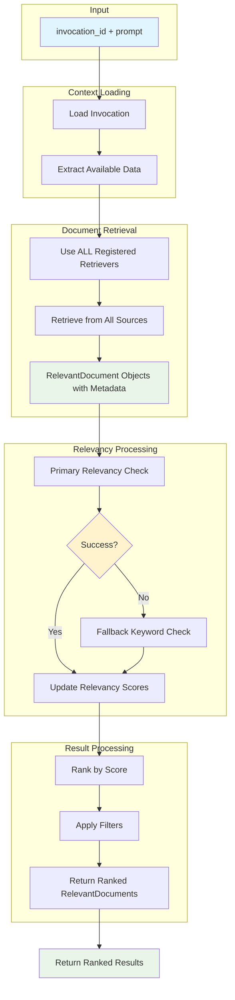

# Data Model: RetrieverService Framework

**Phase 1 Data Model** | **Date**: 2025-11-27 | **Branch**: 015-retriever-framework

## Core Entities

### 1. RelevantDocument
**Purpose**: Represents a document with relevancy score and metadata for retrieval results

**Model Type**: **Transient model** - Created on-demand during retrieval, not stored in database

**Fields**:
- `content: str` - Full document content (no chunking at service level)
- `relevancy_score: float` - Numeric score indicating relevance to query (0.0 to 1.0)
- `file_metadata: FileMetadata` - Reference to original file metadata from invocation context
- `source_type: str` - Type of storage backend used ("uploaded_file", "database", etc.)
- `retrieval_metadata: dict` - Additional metadata from retrieval process

**Validation Rules**:
- `relevancy_score` must be between 0.0 and 1.0
- `content` must not be empty
- `source_type` must be valid registered retriever type

**Implementation Notes**:
- Uses Pydantic BaseModel (not SQLModel - not a database table)
- Created during document retrieval process and returned to caller
- **No database persistence** - purely in-memory processing model
- References existing `FileMetadata` from `Invocation.context_data`

### 2. RelevancyConfiguration  
**Purpose**: Configuration container for relevancy checker tuning parameters (from `src/nexus/core/config.py`)

**Fields**:
- `checker_type: str` - Type of relevancy checker ("llm", "keyword", "semantic")
- `similarity_threshold: float` - Minimum relevancy score threshold
- `max_results: int` - Maximum number of documents to return
- `ranking_weights: dict` - Weights for different ranking factors
- `algorithm_parameters: dict` - Algorithm-specific parameters (Top-k, Top-p, etc.)
- `grounding_parameters: dict` - Reference relevance parameters
- `recency_weight: float` - Weight given to document recency
- `mmr_settings: dict` - Maximal marginal relevance configuration

**Validation Rules**:
- `similarity_threshold` must be between 0.0 and 1.0
- `max_results` must be positive integer
- `checker_type` must match registered checker types
- `recency_weight` must be between 0.0 and 1.0

**Default Values**:
- `similarity_threshold`: TBD
- `max_results`: TBD
- `recency_weight`: TBD

**Storage**: Defined in `src/nexus/core/config.py` as Pydantic settings model, not database table

### 3. DocumentRetriever (Abstract Base)
**Purpose**: Interface for retrieving documents from different storage backends

**Required Methods**:
- `async retrieve_documents(invocation_context: dict) -> List[RelevantDocument]`

**Implementation Notes**:
- Returns RelevantDocument objects with content, metadata, and source type
- Initial relevancy_score should be set to 1.0 (neutral score before relevancy checking)
- Must populate file_metadata, source_type, and retrieval_metadata fields

**Implementation Types**:
- `UploadedFileRetriever` - Retrieves from uploaded files via FileManager
- `DatabaseRetriever` - Future: retrieves from database storage
- `CloudStorageRetriever` - Future: retrieves from cloud storage

### 4. RelevancyChecker (Abstract Base)  
**Purpose**: Interface for algorithms that determine document relevance

**Required Methods**:
- `async check_relevancy(document: RelevantDocument, query: str, config: RelevancyConfiguration) -> float`

**Implementation Notes**:
- Receives RelevantDocument with full context (content, metadata, source info)
- Can leverage file_metadata (size, type, creation date) for enhanced relevancy scoring
- Returns single relevancy score (0.0 to 1.0) that updates document.relevancy_score
- Should consider source_type and retrieval_metadata in scoring algorithms

**Implementation Types**:
- `LLMRelevancyChecker` - Uses LangChain + OpenRouter for LLM-based checking with metadata context
- `KeywordRelevancyChecker` - Keyword-based relevancy with file name and path consideration  
- `SemanticRelevancyChecker` - Future: semantic embedding-based checking with metadata weighting

### 5. RetrieverRegistry
**Purpose**: Registry for managing document retriever implementations

**Fields**:
- `_retrievers: Dict[str, Type[DocumentRetriever]]` - Registered retriever classes

**Methods**:
- `register_retriever(name: str, retriever_class: Type[DocumentRetriever])`
- `get_retriever(name: str) -> DocumentRetriever`
- `list_retrievers() -> List[str]`

### 6. RelevancyRegistry
**Purpose**: Registry for managing relevancy checker implementations

**Fields**:
- `_checkers: Dict[str, Type[RelevancyChecker]]` - Registered checker classes
- `_configurations: Dict[str, RelevancyConfiguration]` - Global configurations per type

**Methods**:
- `register_checker(name: str, checker_class: Type[RelevancyChecker], config: RelevancyConfiguration)`
- `get_checker(name: str) -> RelevancyChecker`
- `get_configuration(name: str) -> RelevancyConfiguration`
- `list_checkers() -> List[str]`

### 7. RetrieverService
**Purpose**: Main orchestration service for document retrieval operations

**Dependencies** (via Dependency Injection):
- `session: AsyncSession` - Database session for loading invocation context
- `retriever_registry: RetrieverRegistry` - Document retriever registry
- `relevancy_registry: RelevancyRegistry` - Relevancy checker registry

**Key Methods**:
- `async retrieve_relevant_documents(invocation_id: UUID, prompt: str) -> List[RelevantDocument]`

**Business Logic**:
1. Load invocation context and extract available data (including `file_metadata` for uploaded files)
2. Use ALL registered `DocumentRetriever`'s to collate RelevantDocument objects from all available sources
3. Apply relevancy checking with fallback logic to update relevancy scores
4. Rank documents by updated relevancy scores
5. Apply filters based on configuration (thresholds, max_results)
6. Return ranked relevant documents from all sources

## Data Flow

## Validation Rules

### Business Rules
1. **No Empty Results**: Service must always return a list, even if empty
2. **Score Ordering**: Results must be ordered by relevancy_score (highest first)
3. **Configuration Consistency**: All relevancy checkers must use valid configurations
4. **Graceful Degradation**: LLM failure must trigger keyword fallback automatically
5. **File Access Security**: Only files from the specified invocation context may be accessed

### Data Integrity
1. **Relevancy Scores**: Must be normalized between 0.0 and 1.0
2. **File References**: All file_metadata must reference valid files in the invocation
3. **Configuration Values**: All numeric configuration values must be within valid ranges
4. **Registry Consistency**: Retriever and checker types must be properly registered

## State Transitions

### Retrieval Process States
1. **Initialize** → Load invocation and validate context
2. **Retrieve** → Get documents from storage backends  
3. **Check** → Apply relevancy checking (with fallback)
4. **Rank** → Sort results by relevancy score
5. **Filter** → Apply configuration limits and thresholds
6. **Complete** → Return ranked relevant documents

### Error States
- **Invalid Invocation** → Return empty results
- **Storage Unavailable** → Try alternative retrievers or fail gracefully
- **LLM Failure** → Fallback to keyword-based checking
- **Configuration Error** → Use default configuration values

## Storage Considerations

### Configuration Management
- `RelevancyConfiguration`: Managed through `src/nexus/core/config.py` as Pydantic settings model
- Configuration loaded from environment variables and config files
- No database persistence required for configuration at this stage

### Data Models
- `RelevantDocument`: **Transient model** - Created during retrieval process, never persisted to database
- `RelevancyConfiguration`: **Configuration model** - Loaded from environment variables via Pydantic settings
- Registries: In-memory with initialization from configuration

### Document Storage
- `UploadedFileRetriever` retrieves documents through existing `FileManager` patterns
- Other retrievers access their respective storage backends (database, cloud storage, etc.)
- No additional storage required for this service - uses existing infrastructure
- Metadata references existing `Invocation.context_data` structure and other context sources

## Performance Characteristics

### Expected Load
- Multiple concurrent document retrieval operations
- Document sizes up to 10MB (per existing file manager limits)
- Relevancy checking latency target: TBD
- Configuration updates: Infrequent, cache-friendly

### Optimization Opportunities
- Document content caching for repeated retrievals
- Relevancy score caching for identical query/document pairs
- Async batching of relevancy checks for multiple documents
- Connection pooling for LLM API calls

**Ready for Phase 1 Contract Generation**
